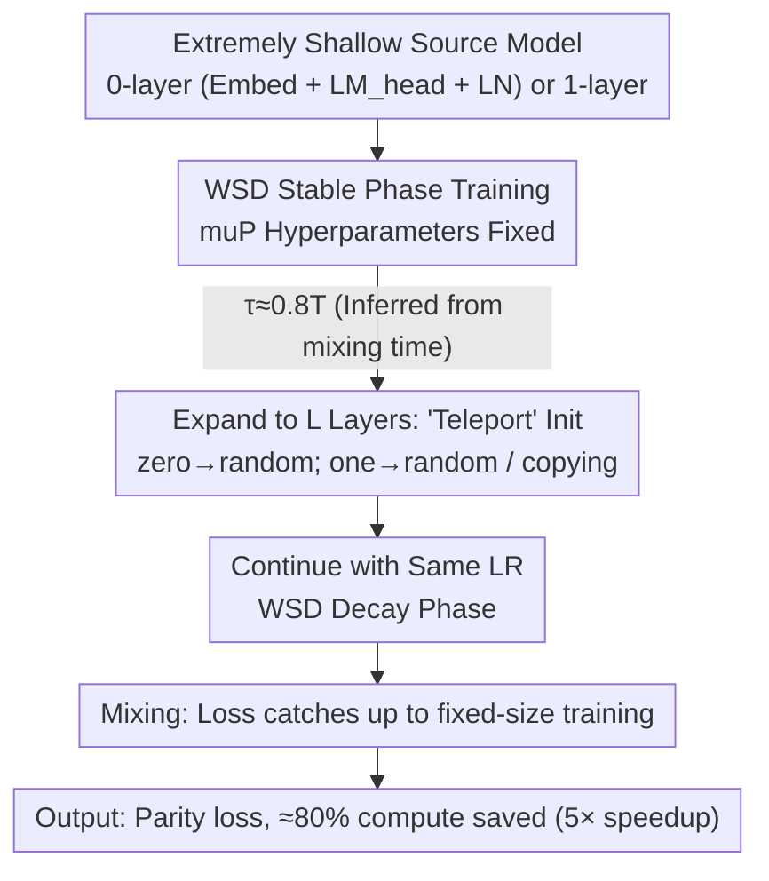

# Scaling Depth Capacity via Zero/One-Layer Model Expansion

**Conference**: ICML 2026  
**arXiv**: [2511.04981](https://arxiv.org/abs/2511.04981)  
**Code**: None  
**Area**: LLM Pre-training / Efficient Training / Model Expansion  
**Keywords**: progressive training, depth expansion, zero/one-layer, WSD schedule, muP

## TL;DR
This paper proposes "Zero/One-Layer Progressive Training"—first training an extremely shallow model with almost no Transformer layers, then expanding the depth to the target number of layers at a late stage of training ($\approx 80\%$ iterations). Combined with a Warmup-Stable-Decay (WSD) learning rate schedule and muP hyperparameter transfer, this approach saves approximately $80\%$ of computation ($\approx 5\times$ speedup) across GPT-2, Llama-3, and DeepSeek-V3 while maintaining terminal loss parity.

## Background & Motivation
**Background**: The cost of training large models is staggering (Llama-4 training requires $>7$M GPU-hours). A leading acceleration strategy is **progressive training / model expansion**: training a smaller "teacher/source model" first, then expanding to a larger size at some time $t=\tau$. The compute is approximated by $6B(\tau N_{\text{small}} + (T-\tau) N_{\text{large}})$, which is significantly lower than the $6BTN_{\text{large}}$ of fixed-size training if $\tau$ is close to $T$ and $N_{\text{small}} \ll N_{\text{large}}$.

**Limitations of Prior Work**: Existing methods restrict depth expansion to $2\text{--}4\times$, and the source model still requires over a dozen layers, saving only $\approx 30\text{--}45\%$ compute (compared grown vs. target). Furthermore, most studies validate on classification models like BERT/ViT; for generative LLMs, they only achieve $1.4\text{--}2\times$ acceleration. More critically, multi-stage expansion (e.g., $0 \to 2 \to 12$) has not demonstrated "mixing" (loss catch-up) behavior across expansion points.

**Key Challenge**: Current methods haven't pushed the limits in two dimensions: (1) no one uses extremely shallow source models like 0/1 layers (perceived as too extreme to transfer knowledge); (2) *function-preserving* initialization (e.g., zero-init sublayers) conflicts with *feature learning*: while zero-init prevents loss spikes, it results in dead gradients for new layers. Additionally, standard learning rate schedules (like cosine) decay to nearly zero in late stages, leaving insufficient time for expansion models to converge.

**Goal**: (1) Push the source model to an extreme 0 or 1 layer; (2) push the expansion time $\tau$ to $0.8T$; (3) ensure hyperparameters do not need retuning before/after expansion; (4) provide a unified recipe covering dense/MoE, MHA/GQA/MLA, and cosine/WSD, supported by a convergence proof.

**Key Insight**: Depth expansion is reformulated as an **initialization problem** for large models. By splitting the large model $\mathbf{W}_t = [\mathbf{w}_t, \mathbf{x}_t]$ into a "small model part + expansion layers," progressive training is equivalent to projected gradient descent on $\mathbf{x}$ (masked to 0), a "teleportation" to a good initialization, and subsequent standard SGD. Under this unified perspective, both initialization strategies and learning rate schedules can be derived from convergence bounds for convex+Lipschitz loss.

**Core Idea**: Zero/One-layer progressive training + WSD schedule + muP hyperparameter transfer shifts the "loss-compute Pareto frontier" significantly towards the origin.

## Method

### Overall Architecture
The pipeline is simple: train a 0-layer model (containing only Embedding + LM_head + final LayerNorm, *zero* Transformer layers) or 1-layer model. During the *stable phase* of a WSD schedule, at $\tau \approx 0.8T$, expand the model to target depth $L$. Zero-layer expansion uses random initialization for new layers; one-layer uses either random or copying (e.g., $\mathbf{w} \to [\mathbf{w}, \dots, \mathbf{w}]$). Continue training using the **same learning rate**. The innovation lies in three interdependent designs that ensure loss parity, hyperparameter consistency, and late expansion viability.

### Key Designs

**1. Reformulating Depth Expansion as Large Model Initialization with Convergence Bounds**

Expansion strategies and LR schedules are typically treated as separate engineering knobs. This work adopts an algebraic perspective by splitting expansion model parameters $\mathbf{W}_t=[\mathbf{w}_t,\mathbf{x}_t]$ into "reused part $\mathbf{w}$" and "added layers $\mathbf{x}$," where optimality is $\mathbf{W}^*=[\mathbf{w}^*,\mathbf{x}^*]$. Progressive training is equivalent to masking $\mathbf{x}$ to zero, then jumping to an initialization. Using the convex + $G$-Lipschitz loss assumption, the gap between progressive and fixed-size training is:

$$\text{gap} = \frac{\sum_{t=1}^{\tau}\eta_t}{\sum_{t=1}^{T}\eta_t}\big(L(\mathbf{w}^*)-L(\mathbf{W}^*)\big) + \frac{\|\mathbf{x}_\tau-\mathbf{x}^*\|^2-\|\mathbf{x}_0-\mathbf{x}^*\|^2}{2\sum_{t=1}^{T}\eta_t}.$$

The second term determines initialization: it requires $\mathbf{x}_\tau$ (teleportation point) to be closer to $\mathbf{x}^*$ than $\mathbf{x}_0$. Random init makes this term $\approx 0$, while copying makes it $< 0$, showing that "layer copying" is inherently beneficial. The first term determines the LR schedule: $\frac{\sum_{t\le\tau}\eta_t}{\sum_t\eta_t}$ must be small (since small model $L(\mathbf{w}^*)$ is usually worse than $L(\mathbf{W}^*)$), implying the LR shouldn't be too high before expansion but shouldn't decay too early—exactly the shape of a WSD schedule.

**2. muP-scaled Initialization for Zero-Retuning Hyperparameter Transfer**

To avoid the engineering overhead of retuning LRs and weight decay after expansion, the paper uses muP to keep optimal hyperparameters constant across model sizes. It ensures element-wise activation scales are aligned: $\|\mathbf{A}_l\|_2/\sqrt{n_l} \sim \|\mathbf{A}_{l+1}\|_2/\sqrt{n_{l+1}}$, leading to the spectral scaling condition $\|\mathbf{W}_l\|_* \sim \sqrt{n_{l+1}/n_l}$. With the Muon-NSGD optimizer (Muon for 2D tensors, normalized SGD for others, weight decay=0.01), both random and copying satisfy muP. The paper chooses "Trainability + Feature Learning" over "Function-Preserving": although zero-init avoids loss spikes, it kills learning in new layers. Parity is achieved by allowing a temporary loss spike to ensure feature learning.

**3. WSD + Single-Stage Late Expansion and the "Mixing Time" Heuristic**

The crucial concept is **mixing time** $t_{\text{mix}}$: the duration after expansion required for the progressive model to catch up to the fixed-size model loss, i.e., $L(\mathbf{W}_{\tau+t_{\text{mix}}}^{\text{progressive}}) \approx L(\mathbf{W}_{\tau+t_{\text{mix}}}^{\text{fixed-size}})$. Experiments show that for cosine schedules, $t_{\text{mix}}(\tau)$ is highly sensitive to $\tau$ (fails at $\tau \ge 0.5T$), whereas for WSD, it remains stable until $\tau \approx 0.8T$. This allows expansion at $0.8T$, leaving $20\%$ of training for mixing and decay. This observation also disproves the necessity of multi-stage expansion; based on mixing behavior, $0 \to 2 \to 12$ is less efficient than $0 \to 12$ because the "mix" occurs naturally in a single jump.

### Loss & Training
- **Data**: OpenWebText, sequence length 1024, nanoGPT codebase.
- **Optimizer**: Muon-NSGD (Primary), AdamW/SGD (Supplementary), weight decay=0.01, no gradient clipping.
- **Scheduler**: WSD (2% warmup, long stable, 10% decay to zero).
- **Token-per-param**: 50 for Llama-3, 100 for DeepSeek-V3 (MoE).
- **Expansion Time**: $\tau \approx 0.8T$ (e.g., 480k/528k iterations for GPT-2 124M).

## Key Experimental Results

### Main Results
(Example: GPT-2 on OpenWebText with WSD; "FLOPs ratio" relative to fixed-size training.)

| Setup | Source Model | Target Model | FLOPs ratio | Val Loss Gap |
| :--- | :--- | :--- | :--- | :--- |
| Fixed-size | — | 12-layer 124M | 100% | Baseline |
| Zero-layer progressive | 0-layer 39M | 12-layer 124M | ≈20% | <0.5% |
| One-layer progressive | 1-layer 46M | 12-layer 124M | ≈20% | <0.5% |
| Fixed-size | — | 60-layer 7B | 100% | Baseline |
| Zero-layer progressive | 0-layer 0.15B | 60-layer 7B | ≈20% | <0.2% |
| One-layer progressive | 1-layer 0.27B | 60-layer 7B | ≈20% | <0.2% |

Scaling Law perspective: On Llama-3 (0.25B–2B) and DeepSeek-V3 (0.2B–0.5B active), the progressive scaling exponent consistently outperforms fixed-size, with efficiency gains increasing with model size.

### Ablation Study

| Dimension | Key Finding |
| :--- | :--- |
| **Initialization** | Random and Copying both work, with Copying slightly superior; Zero-init hinders feature learning. |
| **Expansion Order** | `copying_last` is inferior; `stack` and `inter` (interleaving) are indistinguishable—"copying all" is key. |
| **Schedule** | WSD permits $\tau$ up to 0.8T; Cosine fails to mix at $\tau \ge 0.5T$ (GPT) or $0.7T$ (ResNet). |
| **Multi-stage** | No additional benefit; FLOPs are dominated by the largest stage, so single-stage is optimal. |
| **Source Layers** | 0/1-layer models reside on the Pareto frontier; $\ge 2$ layers shift towards higher compute. |

### Key Findings
- **Mixing is the soul of the method**: The loss spike at expansion looks severe, but as long as $\tau + t_{\text{mix}} \le T$, the terminal loss catches up. This behavior was obscured in previous "grown-vs-target" studies.
- **Mixing time is independent of source size**: Expanding from 1-layer vs. 6-layer yields similar mixing times, thus "shallower source is better" as it minimizes pre-expansion compute.
- **WSD vs. Cosine gap**: The theoretical bound explains why WSD is superior; $\eta_t$ remains constant in the stable phase, keeping the gap term small and robust to $\tau$.
- **Consistency across MoE**: DeepSeek-V3 and Mixtral exhibit identical mixing behavior; this approach is orthogonal to MoE upcycling.

## Highlights & Insights
- **Perspective Shift**: Viewing progressive training as a "teleportation" initialization problem allows for derivation from a single convergence bound, rather than heuristic tuning.
- **Courage of 0-layer Source**: Proving that a 0-layer model (essentially just embeddings) provides a sufficient starting point for an 80% late-expansion run is a significant breakthrough.
- **Demystifying Multi-stage**: By analyzing mixing behavior, the paper shows multi-stage stacking is essentially a redundant cascade of single-stage jumps.
- **Practical Engineering Heuristic**: Calculating $\tau$ using a small-scale calibration run to find $t_{\text{mix}}$ ($T - t_{\text{mix}}$) provides a reliable recipe for large-scale training.

## Limitations & Future Work
- **Theoretical Assumptions**: The convergence proof relies on convex/Lipschitz assumptions, while deep learning is non-convex.
- **Scale Limits**: Validation reached 7B but not 100B+ models; whether the "better at scale" trend holds for frontier models is unconfirmed.
- **Single Dimension**: This work focuses solely on depth. Combining this with width or expert expansion (e.g., in MoE) is left for future work.
- **Upcycling Integration**: While orthogonal to upcycling (Dense to MoE), the combination of both has not been tested.
- **Downstream Benchmarks**: The paper focuses on validation loss/scaling laws and lacks evaluation on downstream benchmarks or RLHF.

## Related Work & Insights
- **vs. Function-preserving (Net2Net, bert2BERT, MSG)**: These emphasize zero loss spikes at expansion, often sacrificing trainability. This work prioritizes feature learning over being function-preserving.
- **vs. Multi-stage (Staged, Stacking)**: These use 3–4 stages with $2\text{--}4\times$ expansion. This work uses single-stage $60\times$ expansion with higher efficiency.
- **vs. muP / WSD**: This work does not "invent" muP or WSD but integrates them into model expansion with theoretical grounding.
- **vs. Upcycling (MoE)**: Upcycling scales the number of experts, whereas this scales depth; the two approaches are complementary.

## Rating
- **Novelty**: ⭐⭐⭐⭐⭐ (Pushing to 0/1-layer at 0.8T is groundbreaking).
- **Experimental Thoroughness**: ⭐⭐⭐⭐⭐ (Extensive sweep across architectures, schedules, and sizes).
- **Writing Quality**: ⭐⭐⭐⭐ (Logical flow is strong, though some sections are data-heavy).
- **Value**: ⭐⭐⭐⭐⭐ (Direct economic value for pre-training large-scale models).

<!-- RELATED:START -->

## Related Papers

- [\[ICML 2026\] Inverse Depth Scaling From Most Layers Being Similar](inverse_depth_scaling_from_most_layers_being_similar.md)
- [\[ACL 2025\] Training Dynamics Underlying Language Model Scaling Laws: Loss Deceleration and Zero-Sum Learning](../../ACL2025/llm_pretraining/training_dynamics_underlying_language_model_scaling_laws_loss_deceleration_and_z.md)
- [\[ICML 2026\] Dropout Universality: Scaling Laws and Optimal Scheduling at the Edge-of-Chaos](dropout_universality_scaling_laws_and_optimal_scheduling_at_the_edge-of-chaos.md)
- [\[ICML 2026\] Predicting Large Model Test Losses with a Noisy Quadratic System](predicting_large_model_test_losses_with_a_noisy_quadratic_system.md)
- [\[NeurIPS 2025\] Gemstones: A Model Suite for Multi-Faceted Scaling Laws](../../NeurIPS2025/llm_pretraining/gemstones_a_model_suite_for_multi-faceted_scaling_laws.md)

<!-- RELATED:END -->
