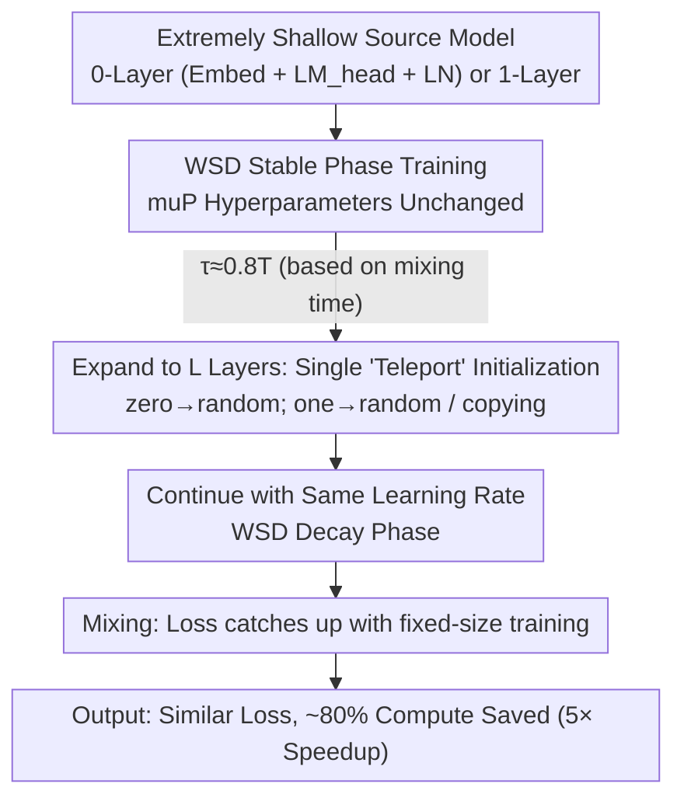

# Scaling Depth Capacity via Zero/One-Layer Model Expansion

**Conference**: ICML 2026  
**arXiv**: [2511.04981](https://arxiv.org/abs/2511.04981)  
**Code**: None  
**Area**: LLM Pre-training / Efficient Training / Model Expansion  
**Keywords**: progressive training, depth expansion, zero/one-layer, WSD schedule, muP

## TL;DR
This paper proposes "zero/one-layer progressive training"—initially training a shallow model with almost no Transformer layers, then expanding the depth to the target number of layers at a late stage ($\approx 80\%$ iterations). Combined with a WSD learning rate schedule and muP hyperparameter transfer, this approach saves approximately 80% computation ($\approx 5\times$ speedup) on GPT2/LLAMA3/DeepSeekV3 with negligible final loss degradation.

## Background & Motivation
**Background**: The cost of training large models is staggering (LLAMA-4 requires $>7\text{M}$ GPU hours). A primary acceleration strategy is **progressive training / model expansion**: training a small "teacher/source model" first, then expanding to a large size at time $t=\tau$. The computational cost is approximately $6B(\tau N_{\text{small}} + (T-\tau) N_{\text{large}})$, which is significantly lower than the $6BTN_{\text{large}}$ required for fixed-size training, provided that $\tau$ is close to $T$ and $N_{\text{small}} \ll N_{\text{large}}$.

**Limitations of Prior Work**: Existing methods restrict depth expansion to 2-4$\times$, and the source model still requires over a dozen layers. Consequently, computation savings are only about 30-45% (compared to the target model). Furthermore, most studies only validate on classification models like BERT/ViT, yielding only 1.4-2$\times$ speedups on generative LLMs. Worse, multi-stage expansion (e.g., $0\to 2\to 12$), while seemingly more "progressive," fails to demonstrate *mixing* behavior (where loss catches up) across expansion points.

**Key Challenge**: Prior methods have not reached the limits in two dimensions. First, none use extremely shallow 0/1-layer source models (deemed too extreme for meaningful knowledge transfer). Second, *function-preserving* initialization (e.g., zero-init sub-layers) conflicts with *feature learning*: zero-init prevents loss spikes but results in dead gradients, hindering the learning of new layers. Simultaneously, standard cosine learning rate schedules decay to nearly zero in late stages, leaving insufficient time for "late expansion" to converge.

**Goal**: (1) Push the source model to the extreme of 0 or 1 layer; (2) push the expansion time $\tau$ to $0.8T$; (3) ensure hyperparameters remain unchanged before and after expansion; (4) provide a unified recipe covering dense/MoE, MHA/GQA/MLA, and cosine/WSD, supported by a convex optimization convergence proof explaining why it works.

**Key Insight**: This work reformulates "depth expansion" as an **initialization problem** for large models. By decomposing the large model $\mathbf{W}_t = [\mathbf{w}_t, \mathbf{x}_t]$ into a "small model part + newly added layers," progressive training is equivalent to performing projected gradient descent on $\mathbf{x}$ (masked to 0), a "teleportation" to a good initialization, followed by standard SGD. From this unified perspective, both initialization strategy and learning rate scheduling can be derived using convergence bounds of convex + Lipschitz losses.

**Core Idea**: Zero/one-layer progressive training + WSD schedule + muP hyperparameter transfer shifts the "loss-compute Pareto front" significantly toward the lower-left compared to prior work.

## Method

### Overall Architecture
The pipeline is simple: train a 0-layer model (comprising only Embedding + LM_head + final LayerNorm, *entirely without* Transformer layers) or a 1-layer shallow model. During the *stable phase* of a WSD schedule, at $\tau \approx 0.8T$, expand the model to target depth $L$ (0-layer uses random init; 1-layer can use random or copying, e.g., $\mathbf{w}\to[\mathbf{w},\mathbf{w},\mathbf{w}]$). After expansion, **continue training with the same learning rate** to completion. The challenges lie in three interdependent factors: ensuring no loss degradation, maintaining hyperparameters across expansion, and enabling expansion as late as 80%. These are addressed by the following designs. The recipe is validated across GPT2 / LLAMA3 / Qwen3 / Mixtral / DeepSeekV3 / ResNet, covering weight-tying, dense/MoE, MHA/GQA/MLA, absolute/rotary embeddings, LayerNorm/RMSNorm, and GeLU/SwiGLU.

### Key Designs

**1. Reformulating "Depth Expansion" as an Initialization Problem with a Convergence Bound**

Prior core contradictions involve engineering knobs like initialization and scheduling. This work adopts an algebraic perspective—decomposing large model parameters $\mathbf{W}_t=[\mathbf{w}_t,\mathbf{x}_t]$ into "reused small model part $\mathbf{w}$ + added layers $\mathbf{x}$," with the optimal solution $\mathbf{W}^*=[\mathbf{w}^*,\mathbf{x}^*]$. Progressive training is equivalent to: masking $\mathbf{x}$ to zero before expansion, "teleporting" $\mathbf{x}$ to an initialization, and then normal SGD. Under convex + $G$-Lipschitz loss assumptions, the gap between progressive and fixed-size training is:

$$\text{gap} = \frac{\sum_{t=1}^{\tau}\eta_t}{\sum_{t=1}^{T}\eta_t}\big(L(\mathbf{w}^*)-L(\mathbf{W}^*)\big) + \frac{\|\mathbf{x}_\tau-\mathbf{x}^*\|^2-\|\mathbf{x}_0-\mathbf{x}^*\|^2}{2\sum_{t=1}^{T}\eta_t}.$$

The second term governs initialization: it requires $\mathbf{x}_\tau$ (teleportation point) to be closer to optimal $\mathbf{x}^*$ than $\mathbf{x}_0$. Random initialization makes this term $\approx 0$, while copying makes it $<0$. The first term governs scheduling: $\frac{\sum_{t\le\tau}\eta_t}{\sum_t\eta_t}$ must be small (since small model optimal $L(\mathbf{w}^*)$ is usually worse than large model $L(\mathbf{W}^*)$), meaning the pre-expansion learning rate shouldn't be too high, and the post-expansion decay shouldn't be too aggressive—matching the WSD (warmup-stable-decay) profile.

**2. muP-scaled Initialization for Cross-Size Hyperparameter Consistency**

The work uses muP to keep optimal hyperparameters constant across model sizes. It requires element-wise scale alignment of activations: $\|\mathbf{A}_l\|_2/\sqrt{n_l} \sim \|\mathbf{A}_{l+1}\|_2/\sqrt{n_{l+1}}$, leading to the spectral scaling condition $\|\mathbf{W}_l\|_* \sim \sqrt{n_{l+1}/n_l}$. The optimizer uses Muon-NSGD (Muon for 2D tensors, normalized SGD for others, weight decay=0.01), where new layers under random Gaussian or copying satisfy muP. However, there is a tension: while zero-init is function-preserving, it kills gradients and hinders feature learning. Ours prioritizes trainability and feature learning over function-preservation, accepting a temporary loss spike to ensure the new layers actually learn.

**3. WSD + Single-Stage Late Expansion based on "Mixing Time"**

The bound explains why WSD is effective. The key concept is mixing time $t_{\text{mix}}$: the duration after expansion required for the progressive loss to catch up to the fixed-size loss, i.e., $L(\mathbf{W}_{\tau+t_{\text{mix}}}^{\text{progressive}}) \approx L(\mathbf{W}_{\tau+t_{\text{mix}}}^{\text{fixed-size}})$. Experiments show that under cosine schedules, $t_{\text{mix}}(\tau)$ is highly sensitive to $\tau$, whereas under WSD, it remains stable even for $\tau \ge 0.8T$. This allows for a recipe of 2% warmup + long stable phase + 10% decay. This perspective also invalidates the need for multi-stage expansion: $0\to 2\to 12$ can be viewed as two single stages, where the FLOPs are similar to $2\to 12$ and strictly worse than $0\to 12$. **Single-stage expansion is optimal.**

### Loss & Training
- **Data**: OpenWebText, sequence length 1024, based on nanoGPT codebase.
- **Optimizer**: Muon-NSGD (primary), AdamW and SGD (supplementary), weight decay=0.01, no gradient clipping.
- **Learning Rate Schedule**: Cosine and WSD (warmup-stable-decay) decaying to 0; 2% warmup.
- **Token-per-param**: 50 for LLAMA3, 100 for DeepSeekV3 (MoE).
- **Expansion Time**: $\tau \approx 0.8T$ (e.g., 480k/528k iterations for GPT2 124M).

## Key Experimental Results

### Main Results
(Example: GPT2 on OpenWebText with WSD schedule. "FLOPs ratio" relative to fixed-size training; lower is faster.)

| Setting | Source Model | Target Model | FLOPs ratio | Val Loss Gap |
|------|--------|---------|-------------|---------------|
| Fixed-size | — | 12-layer 124M | 100% | Baseline |
| Zero-layer progressive | 0-layer 39M | 12-layer 124M | ≈20% | <0.5% |
| One-layer progressive | 1-layer 46M | 12-layer 124M | ≈20% | <0.5% |
| Fixed-size | — | 60-layer 7B | 100% | Baseline |
| Zero-layer progressive | 0-layer 0.15B | 60-layer 7B | ≈20% | <0.2% |
| One-layer progressive | 1-layer 0.27B | 60-layer 7B | ≈20% | <0.2% |

Scaling law perspective: For LLAMA3 (0.25B–2B) and DeepSeekV3 (MoE, 0.2B–0.5B active), the progressive training scaling exponent is consistently superior to fixed-size, with 3–5$\times$ efficiency gains that **increase with model size**.

### Ablation Study

| Dimension | Key Findings |
|----------|---------|
| Initialization | Copying and random both work; copying is slightly better. Zero-init destroys feature learning. |
| Expansion Order | `copying_last` is significantly worse; `_stack` and `_inter` are indistinguishable—copying all layers is key. |
| Schedule | In WSD, $\tau$ can reach 0.8T. In cosine, GPT fails to mix if $\tau \ge 0.5T$. |
| Multi-stage | No extra benefit; FLOPs similar to $2\to 12$, worse than $0\to 12$. |
| Source Layers | 0/1 layers exclusively occupy the Pareto front; $\ge 2$ layers are suboptimal. |

### Key Findings
- **"Mixing" is central**: despite loss spikes at expansion, final loss converges to fixed-size training if $\tau + t_{\text{mix}} \le T$. This was obscured by the "grown-vs-target" comparison in prior work.
- **Mixing time is independent of source model size**: The latest expansion time $\tau/T$ is roughly 0.6-0.8 regardless of whether starting from 1 or 6 layers; thus, shallower sources are more efficient.
- **WSD vs. Cosine**: Theoretical gap analysis shows WSD keeps the LR ratio small and robust to $\tau$.
- **MoE Consistency**: DeepSeekV3 and Mixtral exhibit identical mixing behavior; this approach is orthogonal to upcycling.

## Highlights & Insights
- **Initialization Perspective**: Reformulating progressive training as an initialization problem allows deriving both strategy and schedule from a single convergence bound.
- **Empowerment of the 0-Layer**: Demonstrating that a 0-layer model (mostly embeddings) can provide a sufficient "teleportation start" to reach 80% iterations is a bold and significant finding.
- **Multi-stage is redundant**: Proves single-stage is optimal by decomposing multi-stage actions into successive mixing behaviors.
- **Practical Engineering**: The strategy of using small-scale runs to calculate $t_{\text{mix}}$ and then setting $\tau = T - t_{\text{mix}}$ for target runs is highly practical.

## Limitations & Future Work
- The convergence theory assumes convex + Lipschitz conditions; deep learning is non-convex.
- Max dense LLM tested is 7B; MoE active params 0.5B. Validation at 100B+ scale is pending.
- Focuses only on **depth**. Scale-up of width or experts (0-width extremes) is future work.
- Lacks downstream benchmark evaluations (SFT, RLHF); relies on validation loss / scaling laws.
- Expansion time $\tau$ requires calibration runs; no closed-form formula provided.

## Related Work & Insights
- **vs. Function-preserving (Net2Net, etc.)**: Ours sacrifices loss stability for trainability and feature learning, resulting in lower final loss.
- **vs. Gradual Stacking**: Existing methods use multi-stage expansion for 30-45% gains; Ours uses single-stage 60$\times$ expansion for ~80% gains.
- **vs. muP / WSD**: It combines these known technologies into the progressive training paradigm with theoretical backing.
- **vs. Upcycling MoE**: Upcycling scales expert count; Ours scales depth. The two are orthogonal and potentially combinable.

## Rating
- Novelty: ⭐⭐⭐⭐⭐ Pushing source models to 0/1 layer and $\tau$ to 0.8T using a unified bound is highly novel.
- Experimental Thoroughness: ⭐⭐⭐⭐⭐ Covers multiple architectures (dense/MoE), 150+ scanning points, and 7B scale validation.
- Writing Quality: ⭐⭐⭐⭐ Clear interplay between theory and experiment; addresses literature misconceptions effectively.
- Value: ⭐⭐⭐⭐⭐ Provides a production-ready recipe for 5$\times$ training acceleration with minimal loss impact.

<!-- RELATED:START -->

## Related Papers

- [\[ICML 2026\] Inverse Depth Scaling From Most Layers Being Similar](inverse_depth_scaling_from_most_layers_being_similar.md)
- [\[ACL 2025\] Training Dynamics Underlying Language Model Scaling Laws: Loss Deceleration and Zero-Sum Learning](../../ACL2025/llm_pretraining/training_dynamics_underlying_language_model_scaling_laws_loss_deceleration_and_z.md)
- [\[ICML 2026\] Dropout Universality: Scaling Laws and Optimal Scheduling at the Edge-of-Chaos](dropout_universality_scaling_laws_and_optimal_scheduling_at_the_edge-of-chaos.md)
- [\[NeurIPS 2025\] Gemstones: A Model Suite for Multi-Faceted Scaling Laws](../../NeurIPS2025/llm_pretraining/gemstones_a_model_suite_for_multi-faceted_scaling_laws.md)
- [\[ICML 2026\] Predicting Large Model Test Losses with a Noisy Quadratic System](predicting_large_model_test_losses_with_a_noisy_quadratic_system.md)

<!-- RELATED:END -->
