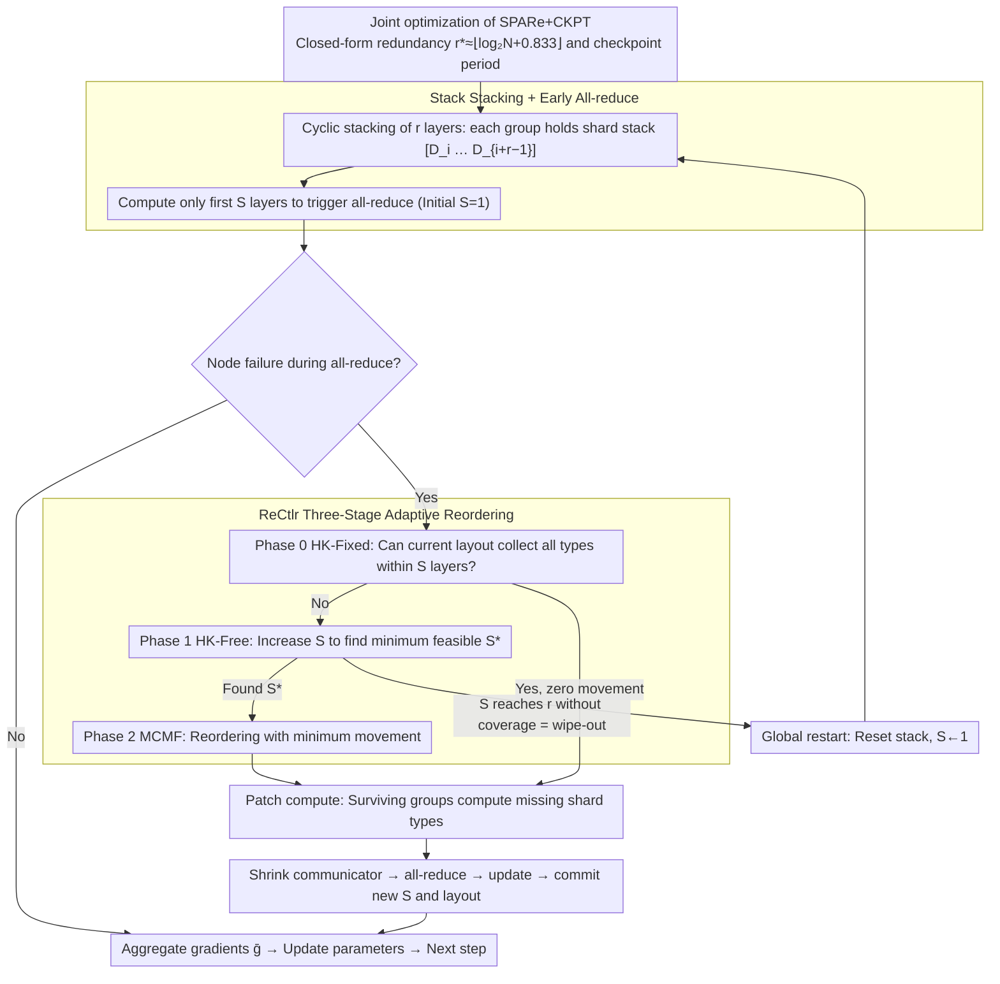

# SPARe: Stacked Parallelism with Adaptive Reordering for Fault-Tolerant LLM Pretraining Systems with 100k+ GPUs

**Conference**: ICML2026  
**arXiv**: [2603.00357](https://arxiv.org/abs/2603.00357)  
**Code**: https://github.com/padsysl/SPARe  
**Area**: LLM Pretraining / Fault-tolerant Systems / Distributed Parallelism  
**Keywords**: Failure Masking, Data Parallelism, Redundant Computation, Adaptive Reordering, Checkpointing

## TL;DR
SPARe cyclically stacks same data shards across groups in $r$ layers within the data parallelism dimension. Following node failures, it utilizes Hopcroft-Karp + min-cost max-flow for adaptive reordering of the "all-reduce stack count." In restart-dominant scenarios with 600k GPUs, this achieves availability equivalent to $r\times$ traditional replication with only $2\sim 3\times$ computational overhead, reducing time-to-train by $40\sim 50\%$ compared to Rep+CKPT.

## Background & Motivation

**Background**: Current frontier LLM pretraining clusters have reached the $10^5$ GPU scale (e.g., Llama-3 16k H100, future 600k H100). Primary fault-tolerance methods include: checkpointing (GEMINI, Just-in-Time, Universal CKPT), partial recovery (communicator shrink), and replication (redundant computation of $r$ copies per group).

**Limitations of Prior Work**: As cluster sizes expand, MTBF decreases as $\mathcal{O}(1/\#\mathrm{GPU})$, while the overhead for each global restart (NCCL_init / collective communication) grows linearly with $\#\mathrm{GPU}$. Llama-3 reported a failure every 3 hours for 16k GPUs; extrapolated to 96k, this is 30 min, and for 600k, it is 5 min. Since a global restart on 600k GPUs takes 60 min, the system enters a **restart-dominant regime** where downtime dominates. Checkpointing only reduces rework waste but cannot decrease restart frequency; traditional replication maintains availability but is unaffordable at $r=20$ due to $20\times$ computational costs.

**Key Challenge**: The hard trade-off between availability gains (requiring a large redundancy $r$) and computational overhead (growing linearly with $r$).

**Goal**: To implement a "redundant but near-constant overhead" failure-masking scheme at the data parallelism layer, independent of model architecture and inner parallelism topologies (TP/PP/EP).

**Key Insight**: The critical insight is that **it is not necessary to complete all computations for every group before performing an all-reduce**—as long as at least one surviving group has computed each of the $N$ shard types, gradients can be aggregated. Consequently, "redundancy" is placed at the shard level rather than the group level, allowing all-reduce to be triggered early with "fewer computed stack layers."

**Core Idea**: $N$ data shards $\{D_0,\dots,D_{N-1}\}$ are stacked in $r$ layers across $N$ model-parallel groups using cyclic rotation (each group holds $r$ different shards). During training, all-reduce is triggered once the minimum stack count $c(k)=\lceil N/(N-k)\rceil$ required to "collect all types" is reached. After node failures, HK + MCMF algorithms are used for **adaptive reordering** of the stack sequence to ensure this minimum stack count remains achievable.

## Method

### Overall Architecture
SPARe is built entirely on synchronous Data Parallelism: $N$ model-parallel groups, each with $M$ GPUs holding a model replica, forming $M$ DP communicators with a world size of $N$ across groups. It does not modify model architecture or inner TP/PP/EP topologies, but instead rearranges **which shards each group handles** and **when to trigger all-reduce**. The layout is static: each group $g_i$ holds a shard stack $[D_i, D_{i+1}, \dots, D_{i+r-1}]$ (indices mod $N$) via cyclic rotation, ensuring any two shard types overlap at most once across all groups (independence condition, see Thm. 4.1). Scheduling is dynamic: each training step maintains an all-reduce stack count $S$ (initial value 1), representing that "each group only computes up to the $S$-th layer in the stack before triggering all-reduce." Upon node failure, the controller (ReCtlr) decides whether to reorder shards, whether to increase $S$, and then instructs surviving groups to compute missing shard types (patch compute), shrinks the communicator, performs all-reduce, and updates parameters. The following diagram illustrates the main pipeline: "configuration (closed-form $r$ and CKPT period) → static stacking + early all-reduce → ReCtlr three-stage reordering during failure → patch compute/update":

### Key Designs

**1. Stack Stacking + Early All-reduce: Decoupling "Redundancy" from "Mandatory Completion"**

Traditional replication incurs a full computational cost for every unit of redundancy because it binds "maintaining $r$ replicas" to "all $r$ replicas must finish before aggregation." The key insight of SPARe is that not every group needs to compute all $r$ shards; as long as each of the $N$ shard types is computed by at least one surviving group, gradients can be aggregated normally. Thus, the $r$ shards in each group are changed from "always compute all" to "queued but only compute the first $S$," reducing overhead from $r\times$ to approximately $S\times$. Specifically, when $k$ failures leave $N-k$ groups to cover $N$ types, the minimum required stack count has a lower bound $c(k)=\lceil N/(N-k)\rceil$. SPARe sets $S$ based on this target, triggered all-reduce immediately after layer $S$. If no new failure hangs the ring all-reduce, parameters are updated; otherwise, ReCtlr is invoked. This process is transparent to the model layer: reordering only changes "who provides type $i$," and aggregated gradients remain $\bar{\mathbf g}=\frac{1}{N}\sum_i \mathbf g_i$, with optimizer states and updates unchanged. This decoupling allows $r$ to be large while keeping extra fault-tolerance overhead near constant ($S\approx 2$ under normal conditions).

**2. ReCtlr: HK-Fixed / HK-Free / MCMF Three-Stage Adaptive Reordering**

The challenge after a failure is determining if the current shard layout can still cover all types within $S$ layers. If not, what is the minimum $S$ required, and how can the layout be reordered with minimal data movement? ReCtlr models the mapping of "$N$ shard types → first $S$ layers of surviving groups" as a bipartite graph. **Phase 0 (HK-Fixed)** uses the Hopcroft-Karp algorithm to check if a perfect matching exists in the fixed current layout; if so, it returns with zero movement, hitting in 90%+ of training steps. If not, **Phase 1 (HK-Free)** iteratively increases $S$ from $S_0$ and runs HK (allowing arbitrary group-internal stack permutations) to find the minimum feasible $S^\star$. If no matching is found even at $S=r$, a wipe-out is declared, triggering a global restart. **Phase 2 (MCMF)** uses min-cost max-flow to determine a reordering scheme for "surviving groups × stack slots" that satisfies $S^\star$ with minimal total movement cost. At scales of $N\sim 10^{2\sim 3}$, these algorithms run in polynomial time (~0.1 s). This selection is natural: bipartite matching describes the "shard type ↔ surviving group" constraint perfectly, while HK-Free ensures feasibility and MCMF minimizes migration.

**3. SPARe+CKPT Joint Optimization: Closed-form Optimal Redundancy $r^\star$ and CKPT Period**

Since SPARe cannot mask failures indefinitely, checkpointing is required. The paper solves the trade-offs (redundancy vs. overhead, CKPT frequency vs. rework) to provide a configuration table. It defines normalized time-to-train as $J(r)=\bar S(N,r)/A^\star(\mu(N,r)\, m)$, where mean compute overhead $\bar S(N,r)\approx \frac{1}{\lfloor\mu\rfloor}\sum_{k=0}^{\lfloor\mu\rfloor-1}(c(k)+\rho_k)$, and the mean number of failures masked before wipe-out is $\mu(N,r)\approx \frac{\Gamma(1/r)}{r}N^{1-1/r}$. Using $A^\star$ from Saxena et al. (2024), and approximations $\mu(N,r^\star)\approx N/2, \bar S\approx 2$, the optimal redundancy is:

$$r^\star\approx \big\lfloor\log_2 N + 0.833\big\rfloor,$$

The checkpoint period follows Young & Daly's closed-form: $T_c^\star=T_s+\sqrt{T_s^2+2T_s(T_f+T_r)}$. This allows engineers to calculate optimal parameters given cluster size $N$ without exhaustive GPU experimentation.

### Training Strategy
The optimizer and model structure remain unchanged; ReCtlr is inserted at each all-reduce step as per Alg. 1 (Main Training Loop) and Alg. 2 (ReCtlr 三 Phases). Failure detection utilizes standard NCCL all-reduce hang/drop mechanisms. Shrink and ReCtlr take ~0.1 s. Checkpoint intervals are set by the derived $T_c^\star$.

## Key Experimental Results

### Main Results
Based on FedDES (SimGrid) discrete event simulation modeling a 600k H100 cluster, 10T parameter model, $T_r=60$ min, MTBF $m=5$ min (Weibull $k=0.78$), $T_s=60$ s, and 10,000 training steps. Baselines: Rep+CKPT, CKPT-only.

| $N$ | Rep+CKPT Opt $\text{TTT}/T_0$ | Rep Availability | SPARe+CKPT Opt $\text{TTT}/T_0$ | SPARe $r^\star$ | SPARe Availability | TTT Relative Gain |
|------|------|------|------|------|------|------|
| 200 | 6.07 | 61.74% | **2.92** | 9 | 87.00% | **51.9%** |
| 600 | 4.27 | 79.89% | **2.49** | 8 | 93.90% | **41.7%** |
| 1000 | 3.88 | 84.41% | **2.34** | 9 | 96.54% | **39.6%** |

In the restart-dominant setting, CKPT-only failed to make significant progress and was excluded.

### Ablation Study / Theory vs. Simulation

| Configuration | Key Metric | Description |
|------|---------|------|
| $\mu(N,r)$ Formula vs. Monte-Carlo | 1.13% Absolute Error | Closed-form $\mu$ matches MC simulations |
| $\bar S(N,r)$ Lower Bound vs. MC | 0.60% Absolute Error | Compute overhead lower bound is tight |
| $\bar S(N,r)$ vs. DES Simulation | ≤4% Absolute Error | Estimates including patch compute are accurate |
| $r=20, N=600$ | $\mu\approx 426, \bar S\approx 2.8\times$ | Rep requires $20\times$ for the same redundancy |
| Rep+CKPT Opt $r$ | $r=3$ | Consistent with Ferreira et al. (2011) |
| SPARe $r^\star$ Theory | $\lfloor\log_2 N+0.833\rfloor=8,10,10$ | Simulation $r^\star=9,8,9$ (difference due to Weibull $k<1$) |

### Key Findings
- **Theoretical closed-forms are accurate**: Formulas for masked failures $\mu$, compute overhead $\bar S$, and optimal redundancy $r^\star$ all match DES simulations within 5%.
- **High $r$ performs better than theory**: Simulation availability exceeded $A^\star(\mu m)$ at large $r$ because masking failures reduces the number of active GPUs, naturally lowering the real-time failure rate—a self-reinforcing favorable effect.
- **Low $r$ ($r=2$) underperforms theory**: Due to Weibull $k=0.78<1$, early failures are burstier, resulting in an earlier wipe-out. This is resolvable via dynamic checkpointing (Benoit 2022).
- **Gain decays slowly with $N$**: Gains dropped from 51.9% to 39.6% as $N$ increased, as Rep+CKPT's $r=3$ became more effective at large $N$. However, absolute TTT remains $\sim 2.3\times T_0$, leaving room for improvement.

## Highlights & Insights
- **Decoupling "redundancy" from "mandatory completion"** is the key insight. SPARe allows redundancy to scale to $r=20$ while compute overhead only increases to $2.8\times$ using cyclic stacking and early all-reduce. This borrows from erasure coding concepts in storage but applies them to gradient computation with online maintenance via HK + MCMF.
- **Closed-form Engineering Metrics**: Formulas like $\mu\approx\Gamma(1/r)N^{1-1/r}/r$ and $r^\star\approx\log_2 N+0.833$ allow systems engineers to evaluate fault-tolerance strategies via lookup tables without running GPU experiments.
- **DP-layer Abstraction**: Alg. 1/2 only manipulate shard placement and all-reduce stacks, remaining independent of TP/PP/EP topologies. SPARe is complementary to inner-layer solutions like Bamboo or FT-HSDP.
- **Clever Algorithm Selection**: Bipartite matching (HK + MCMF) is the natural language for the "shard type ↔ surviving group" constraint and is computationally negligible at $N\sim 10^3$.

## Limitations & Future Work
- **Simulation-only, no real-world deployment**: While FedDES + SimGrid are standard in HPC, real-world NCCL behavior and memory pressure on 600k GPUs may differ.
- **Performance drop at low $r$ under Weibull $k<1$**: Early failure bursts are not fully handled by static SPARe and require coupling with dynamic CKPT.
- **Shard physical isolation assumption**: The closed-form independence assumes shard placement is decoupled from physical failure domains (racks/zones), which was not explicitly modeled.
- **Storage/Bandwidth Overhead**: The cost of holding $r$ shard copies in memory/loading them via IO was not quantified.
- **Future Directions**: (i) Coupling with elastic training or universal checkpointing; (ii) Incorporating IO cost-aware MCMF; (iii) Adaptive $r^\star$ that adjusts during wall-clock time.

## Related Work & Insights
- **vs. Rep+CKPT (Ferreira 2011 / Benoit 2019)**: Both use redundancy to mask failure, but SPARe replaces "full compute redundancy" with "shard redundancy + early stopping," reducing overhead from $r\times$ to $2\sim 3\times$ and allowing $r^\star$ to scale with $\log N$.
- **vs. Bamboo / ReCycle / FT-HSDP**: These methods perform "passive rerouting" in pipeline/hybrid layers, while SPARe performs "active redundancy" in the DP layer; they are mutually compatible.
- **vs. GEMINI / Universal CKPT**: These reduce the cost of a single rollback; SPARe directly reduces the number of rollbacks.
- **vs. TrainMover**: TrainMover migrates state to spare nodes; SPARe allows survivors to compute pre-stacked shards, removing the need for a standby node pool.

## Rating
- Novelty: ⭐⭐⭐⭐ "Early all-reduce + adaptive reorder" is a distinct and impactful design for LLM training fault tolerance.
- Experimental Thoroughness: ⭐⭐⭐ Simulation-only, but the FedDES + SimGrid framework is robust and the theory-experiment loop is tight.
- Writing Quality: ⭐⭐⭐⭐ Excellent use of closed-forms, pseudocode, and diagrams; derivation and motivation are clear.
- Value: ⭐⭐⭐⭐ 600k GPU cluster fault tolerance is a critical real-world problem; the closed-form engineering guidelines and open-source code are highly useful, though real-machine validation is needed.

<!-- RELATED:START -->

## Related Papers

- [\[ACL 2026\] SAGE: Sign-Adaptive Gradient for Memory-Efficient LLM Optimization](../../ACL2026/llm_pretraining/sage_sign-adaptive_gradient_for_memory-efficient_llm_optimization.md)
- [\[ICML 2026\] FlexRank: Nested Low-Rank Knowledge Decomposition for Adaptive Model Deployment](flexrank_nested_low-rank_knowledge_decomposition_for_adaptive_model_deployment.md)
- [\[NeurIPS 2025\] Breaking the Frozen Subspace: Importance Sampling for Low-Rank Optimization in LLM Pretraining](../../NeurIPS2025/llm_pretraining/breaking_the_frozen_subspace_importance_sampling_for_low-rank_optimization_in_ll.md)
- [\[NeurIPS 2025\] An Empirical Investigation of Neural ODEs and Symbolic Regression for Dynamical Systems](../../NeurIPS2025/llm_pretraining/an_empirical_investigation_of_neural_odes_and_symbolic_regression_for_dynamical_.md)
- [\[ICML 2026\] Data Difficulty and the Generalization--Extrapolation Tradeoff in LLM Fine-Tuning](data_difficulty_and_the_generalization--extrapolation_tradeoff_in_llm_fine-tunin.md)

<!-- RELATED:END -->
