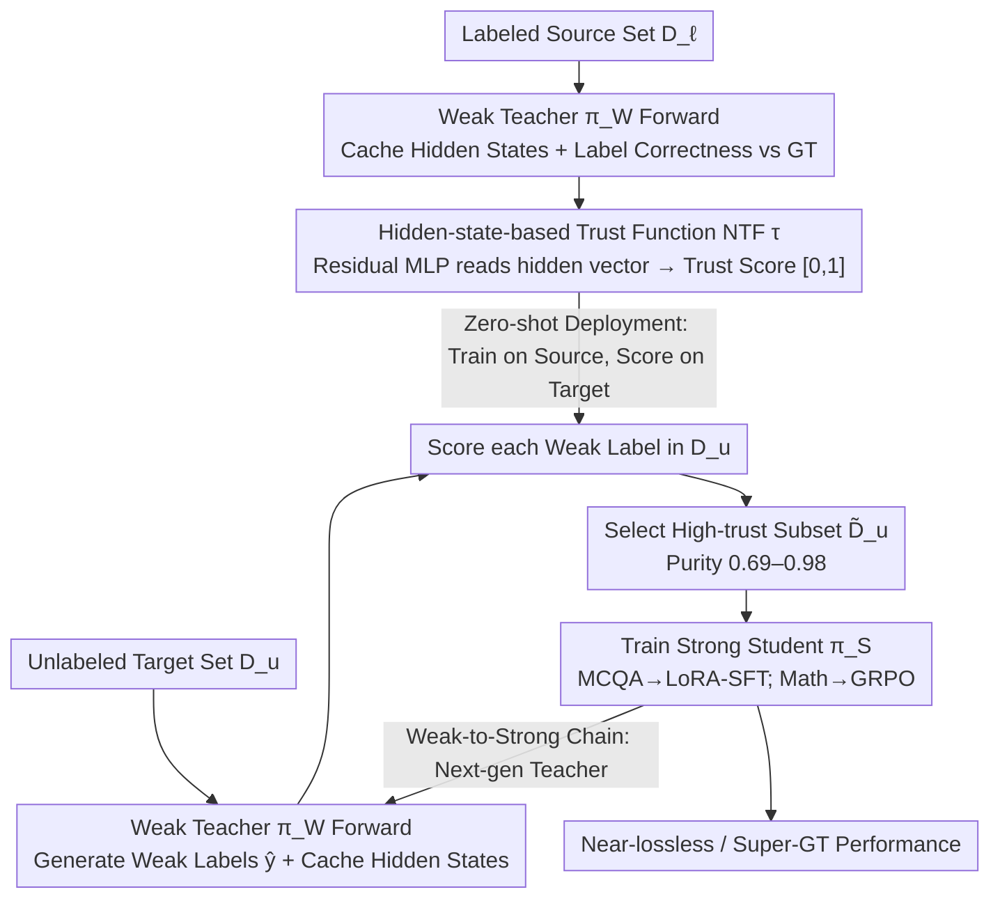

# Trust Functions: Near-Lossless Weak-to-Strong Generalization by Learning When to Trust the Weak Teacher

**Conference**: ICML 2026  
**arXiv**: [2606.01000](https://arxiv.org/abs/2606.01000)  
**Code**: Mentioned in the paper (Link to Code / Website)  
**Area**: Alignment RLHF / Weak Supervision / Data Selection  
**Keywords**: Weak-to-Strong Generalization, Trust Function, Data Filtering, Teacher Hidden States, Superalignment

## TL;DR
This paper reframes "Weak-to-Strong Generalization" as a **data selection** problem and proposes the "Trust Function." By using a lightweight MLP to read the hidden states of the weak teacher's final layer and predicting the reliability of weak labels, the method selects only high-trust samples to train the strong student. This achieves near-lossless or even super-ground-truth performance across multiple tasks and can be iterated into a "Weak-to-Strong Chain" to amplify gains.

## Background & Motivation
**Background**: As LLMs approach or exceed human levels in complex tasks, the traditional assumption that "humans provide reliable supervision" collapses. Superalignment shifts toward using a weak teacher $\pi_{\mathcal{W}}$ to train a stronger student $\pi_{\mathcal{S}}$. Pioneering work by Burns et al. showed that weak supervision allows students to outperform teachers, yet a persistent gap remains compared to ground-truth (GT) supervision.

**Limitations of Prior Work**: Pseudo-labels from weak teachers contain two types of systematic errors: (i) incorrect labels inherited by the strong model along data geometry; (ii) task-relevant directions not captured in the weak teacher's representation space. Consequently, weak supervision often brings instability or degradation under distribution shift, making it difficult to close the gap to GT levels.

**Key Challenge**: Prior attempts at "selection" typically rely on **output-layer heuristics**—such as entropy, multi-model consistency, or self-evaluation. These signals themselves are poorly calibrated on complex tasks (high scores for confident errors, low scores for correct-but-uncertain logic). The fundamental problem is: **output-layer signals are insufficient to judge the reliability of weak labels**.

**Goal**: Given a fixed architecture and training algorithm, identify the subset within the weak labeling pool that "actually makes the student stronger" and formalize the problem of judging label reliability.

**Key Insight**: The authors note that previous work (Kadavath et al. 2022; Kuhn et al. 2023) found that **intermediate representations themselves** encode separable signals of "whether the answer is correct," which are smoothed out by the decoding layer. Therefore, one should return to hidden states to train a discriminator rather than relying on decoded probabilities.

**Core Idea**: Use a small MLP $\tau$ to predict "whether this weak label is correct" directly from the weak teacher's hidden states. Perform SFT/GRPO using only high-trust samples, and then treat the trained student as the next-generation teacher, creating a "Weak-to-Strong Chain."

## Method

### Overall Architecture
The framework is named **Learning to Trust (L2T)**. Its core concept is attributing the hard-to-close gap in "weak-to-strong" to the mix of credible and incredible pseudo-labels from the weak teacher. By selecting only the credible portion for the strong student, performance can approach or exceed GT supervision. It requires two datasets: a labeled source set $\mathcal{D}_{\ell}=\{(x_i,y_i)\}$ and an unlabeled target set $\mathcal{D}_u=\{x_j\}$, which do not need to be co-distributed. First, the weak teacher $\pi_{\mathcal{W}}$ performs a forward pass on $\mathcal{D}_u$ to produce weak labels $\hat{y}=\pi_{\mathcal{W}}(x)$ while caching hidden states. Second, a trust discriminator $\tau$ is trained on $\mathcal{D}_{\ell}$ to predict "if the weak prediction is correct." Third, $\tau$ scores each sample in $\mathcal{D}_u$ to select a high-trust subset $\tilde{\mathcal{D}}_u$. Finally, the strong student $\pi_{\mathcal{S}}$ is trained via SFT or GRPO using only the weak labels in this subset—without ever touching the GT of $\mathcal{D}_u$. The chained version treats the trained student as the next teacher to repeat the process.

### Key Designs

**1. Hidden-state-based Neural Trust Function (NTF): Judging label correctness in hidden space to bypass miscalibrated output confidence**

The core contradiction is that output confidence is systematically miscalibrated on hard problems (confident-but-wrong). Thus, data selection based on decoded signals like entropy is unreliable. NTF moves the discriminator back to the hidden space—it reads the hidden vector $g_{\pi_{\mathcal{W}}}(x,\hat{y})\in\mathbb{R}^d$ of the final generated token (which aggregates the prefix and intermediate reasoning via attention) and maps it to a trust score $\tau(\cdot) \in [0,1]$ estimating the probability that "this weak label is true." $\tau$ is a residual MLP: a stack of RMSNorm-SwiGLU blocks (with Dropout + stochastic depth), ending with an RMSNorm and a linear head for the logit, converted to probability via sigmoid. Supervision signals are automatically constructed on $\mathcal{D}_{\ell}$ by comparing "weak prediction vs GT" (using exact match for MCQA/Math or best-move match for Chess). This is effective because intermediate layers encode "how likely I am to be correct" (Kadavath et al. 2022); placing the discriminator here avoids the confident-but-wrong trap. The compute cost is dominated by the teacher's forward pass, as $\tau$ is a tiny MLP with nearly zero overhead—total cost $C_{\text{total}}=O\big(\bar{C}_{\text{teacher}}(|\mathcal{D}_{\ell}|+|\mathcal{D}_u|)+C_{\text{NTF}}(e|\mathcal{D}_{\ell}|+|\mathcal{D}_u|)\big)$.

**2. Zero-shot Deployment under In-domain Distribution Shift: Training on the labeled source domain once and deploying to unlabeled target domains**

In reality, label distributions are highly imbalanced—large labeled sets like MMLU/MATH are readily available, while target domains like AIME often have no available labels. L2T relaxes this by training $\tau$ only on the source distribution and performing zero-shot scoring on target domains with the same task interface but different data distributions. The authors explicitly categorize generalization into three levels: ID (held-out of the same benchmark), OOD$_{\text{dist}}$ (same task interface, different data distribution, e.g., MMLU $\to$ ARC-Easy), and OOD$_{\text{domain}}$ (different task interface, e.g., MCQA $\to$ Chess). "Zero-shot transfer" in the paper refers to OOD$_{\text{dist}}$. Table 1 shows NTF achieves AUC 0.83–0.92 and Purity 0.69–0.98 across ID and OOD$_{\text{dist}}$, proving trust signals transfer across data distributions, while accurately noting degradation in OOD$_{\text{domain}}$.

**3. Weak-to-Strong Chain: Rolling gains by treating students as next-gen teachers**

While single-generation L2T approaches GT supervision, a gap remains as student scale increases. The chain structure captures this remaining potential without new components. Conceptually, it acts like "snowballing": each student generation, by training only on high-purity weak labels, achieves monotonically higher accuracy on the target domain. When it becomes the next-generation teacher, the purity of produced weak labels increases accordingly. Thus, even using the same $\tau$ for scoring, the available sample volume and average accuracy grow. Specifically, $\pi_{\mathcal{S}}^{(1)}$ trained by L2T acts as $\pi_{\mathcal{W}}^{(2)}$, and the same NTF filtering is applied to train a larger $\pi_{\mathcal{S}}^{(2)}$ iteratively.

### Loss & Training
NTF is trained using class-reweighted BCE + AdamW (with weight decay). Metrics include AUC / ECE / Brier / Purity (proportion of truly correct labels in the top-trust subset). Strong students follow two paths: MCQA uses LoRA-SFT on top-$n$ trust samples to fit weak labels; mathematical reasoning uses GRPO for RL on high-trust rollouts. Recovery of GT performance is defined as $\text{Recovery}=\frac{\text{Baseline}-\text{Base}}{\text{GT}-\text{Base}}\times 100\%$.

## Key Experimental Results

### Main Results
World Knowledge (Average accuracy across 5 MCQA benchmarks; Recovery% in parentheses):

| Teacher $\to$ Student | Naive | I-Confidence | ICL+I-Conf | Reward Model | **NTF (Ours)** | Ground Truth |
|---|---|---|---|---|---|---|
| OLMo2-1B $\to$ OLMo2-7B | 69.3 (48.3) | 69.2 (47.1) | 72.0 (79.3) | 68.8 (42.5) | **73.7 (98.9)** | 73.8 |
| OLMo2-1B $\to$ OLMo2-13B | 74.7 (12.2) | 75.1 (17.6) | 77.9 (55.4) | 78.4 (62.2) | **80.9 (95.9)** | 81.2 |
| Qwen3-0.6B $\to$ Qwen3-1.7B | 74.0 (86.0) | 74.3 (91.2) | 74.4 (93.0) | 71.7 (45.6) | **75.0 (103.5)** | 74.8 |
| Qwen3-0.6B $\to$ Qwen3-14B | 86.0 (86.8) | 85.7 (82.9) | 86.5 (93.4) | 86.1 (88.2) | **87.1 (101.3)** | 87.0 |

In 8 settings, NTF was statistically indistinguishable from GT in 5 cases (near-lossless) and significantly better than GT in 1 case (super-recovery).

### Ablation Study
Calibration metrics of NTF across different domains (Table 1):

| Domain | AUC ↑ | ECE ↓ | Brier ↓ | Purity ↑ |
|---|---|---|---|---|
| World Knowledge | 0.92 | 0.03 | 0.07 | 0.98 |
| Quantitative Reasoning (Omni) | 0.83 | 0.11 | 0.13 | 0.69 |
| Quantitative Reasoning (MATH) | 0.84 | 0.14 | 0.17 | 0.95 |
| Strategy Games | 0.91 | 0.02 | 0.11 | 0.95 |

### Key Findings
- Gains do not just come from "filtering wrong labels": Authors attribute this to three mechanisms—retaining samples that induce an implicit easy-first curriculum, occasionally "correcting" suboptimal GT labels (observed in MATH), and better alignment of gradient directions in filtered samples.
- NTF remains effective for extremely weak teachers: Qwen3-1.7B has <5% accuracy on AIME, but paired with NTF, it still achieves near-lossless GT recovery, suggesting the trust function captures rare reliable samples even in low-purity pools.
- OOD$_{\text{domain}}$ (changed task interface) results in significant degradation, showing that "trust" is coupled with task interfaces/output spaces.

## Highlights & Insights
- **Problem Redefinition**: Shifts Weak-to-Strong Generalization from "designing loss/algorithms" to "data selection." The trust function serves as an umbrella concept unifying entropy, agreement, self-evaluation, and reward models.
- **Near-Zero Extra Compute**: NTF is a tiny MLP using hidden states already calculated during the forward pass. It is more practical and effective than relying on heavy external reward models.
- **Chain Amplification**: The weak-to-strong chain treats data filtering as iterative self-training, providing a sustainable bootstrap path for superalignment scenarios.

## Limitations & Future Work
- Dependency on source domain labels: Although it doesn't need target GT, it requires a labeled source domain with the same task interface—not directly applicable to "extreme superalignment" where no ground truth exists.
- Cross-interface (OOD$_{\text{domain}}$) failure: Trust functions are tightly coupled to task interfaces; migrating to completely different tasks remains an open problem.
- Evaluation limited to mid-scale models (1B–14B); verification is needed for 70B+ scales.
- Upper bounds of chain gains: While snowballing is demonstrated, analysis of the "collapse point" (at which generation does the chain destabilize) is missing.

## Related Work & Insights
- **vs Burns et al. 2023 (Pioneering W2S)**: The latter focuses on training objectives (e.g., confidence loss); Ours keeps loss/architecture intact and focuses on data selection, closing the gap to GT faster.
- **vs Internal/Verbalized Confidence**: Both measure teacher reliability, but output-layer signals are unstable. Ours proves hidden layers are more stable and transfer zero-shot across benchmarks.
- **vs Reward Model Filtering**: RMs are general discriminators, but reward signals do not map one-to-one to "correctness." NTF models correctness directly, fitting the W2S scenario more closely.

## Rating
- Novelty: ⭐⭐⭐⭐ Reframing W2S as data selection using hidden state discriminators is a notable perspective shift.
- Experimental Thoroughness: ⭐⭐⭐⭐⭐ Covers 3 domains, multiple model families, and scales (1B–14B) with significance testing.
- Writing Quality: ⭐⭐⭐⭐ Clear formalization and rigorous categorization of generalization regimes.
- Value: ⭐⭐⭐⭐⭐ Provides an engineering-grade solution for near-lossless weak-to-strong generalization with direct relevance to superalignment.

<!-- RELATED:START -->

## Related Papers

- [\[ICML 2025\] When Can In-Context Learning Generalize Out of Task Distribution?](../../ICML2025/llm_pretraining/when_can_in-context_learning_generalize_out_of_task_distribution.md)
- [\[ICLR 2026\] Lossless Vocabulary Reduction for Auto-Regressive Language Models](../../ICLR2026/llm_pretraining/lossless_vocabulary_reduction_for_auto-regressive_language_models.md)
- [\[ICML 2026\] Data Difficulty and the Generalization--Extrapolation Tradeoff in LLM Fine-Tuning](data_difficulty_and_the_generalization--extrapolation_tradeoff_in_llm_fine-tunin.md)
- [\[ICML 2026\] Tuning the Implicit Regularizer of Masked Diffusion Language Models: Enhancing Generalization via Insights from k-Parity](tuning_the_implicit_regularizer_of_masked_diffusion_language_models_enhancing_ge.md)
- [\[ICML 2025\] Towards Robust Influence Functions with Flat Validation Minima](../../ICML2025/llm_pretraining/towards_robust_influence_functions_with_flat_validation_minima.md)

<!-- RELATED:END -->
