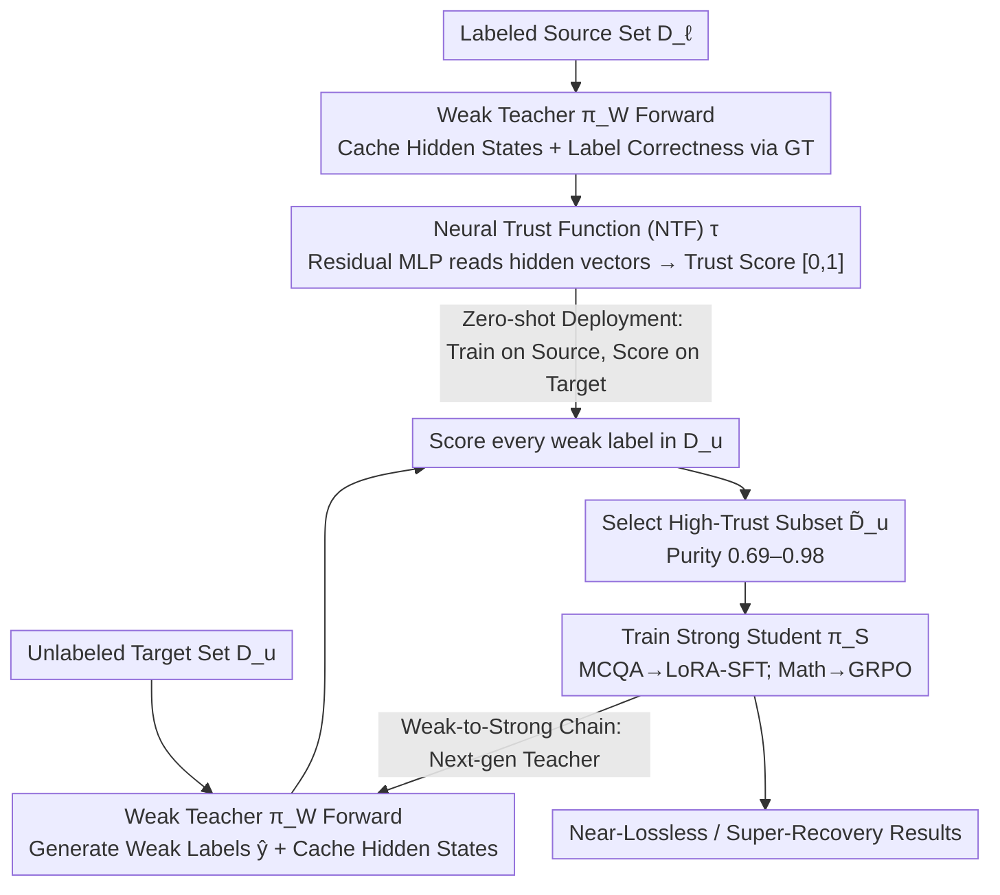

# Trust Functions: Near-Lossless Weak-to-Strong Generalization by Learning When to Trust the Weak Teacher

**Conference**: ICML 2026  
**arXiv**: [2606.01000](https://arxiv.org/abs/2606.01000)  
**Code**: Mentioned in paper (Code / Website link)  
**Area**: Alignment RLHF / Weak Supervision / Data Selection  
**Keywords**: Weak-to-Strong Generalization, Trust Functions, Data Filtering, Teacher Hidden States, Superalignment

## TL;DR
This paper reframes "Weak-to-Strong Generalization" as a **data selection** problem, proposing a "Trust Function" that uses a lightweight MLP to read the hidden states of the teacher model's final layer to predict whether weak labels are reliable. By training a strong student using only high-trust samples, it achieves near-lossless or even super-recovery performance compared to ground-truth supervision across multiple tasks and can be iterated into a "Weak-to-Strong Chain" to amplify gains.

## Background & Motivation
**Background**: As LLMs approach or exceed human levels in complex tasks, the traditional assumption of "humans providing reliable supervision" collapses. Superalignment shifts toward using a weak teacher $\pi_{\mathcal{W}}$ to train a stronger student $\pi_{\mathcal{S}}$. Pioneering work by Burns et al. showed that weak supervision can allow students to outperform teachers, but a gap (compared to GT supervision) remains.

**Limitations of Prior Work**: Pseudo-labels from weak teachers contain two types of systematic errors: (i) incorrect labels are inherited by the strong model along the data geometry; (ii) task-related directions not present in the weak teacher's representation space cannot be transmitted. Consequently, weak supervision often brings instability or degradation under distribution shift, making it difficult to close the gap to GT levels.

**Key Challenge**: Existing attempts at "selecting data" generally use **output-layer heuristics**—such as entropy, multi-model consistency, or self-assessment. These signals themselves are poorly calibrated on complex tasks (high scores for confident errors, low scores for correct-but-uncertain samples) and are particularly fragile under distribution shift. The root cause is that **output-layer signals are insufficient for judging the reliability of weak labels**.

**Goal**: Given a fixed architecture and training algorithm, identify the subset of the weak labeling pool that "truly makes the student stronger" and unify the formalization of "how to judge label reliability."

**Key Insight**: The authors noted that prior work (Kadavath et al. 2022; Kuhn et al. 2023) found that **internal representations themselves** encode separable signals of "whether the answer is correct," which are often smoothed out by the decoding layer. Therefore, one should return to hidden states to train a discriminator rather than trusting decoded probabilities.

**Core Idea**: Use a small MLP $\tau$ to predict "whether this weak label is actually correct" directly from the weak teacher's hidden states. Perform SFT/GRPO using only high-trust samples, and treat the resulting student as the teacher for the next round, forming a "Weak-to-Strong Chain."

## Method

### Overall Architecture
The framework is named **Learning to Trust (L2T)**. Its core concept is to attribute the difficult-to-close gap in "Weak-to-Strong" to the mixture of trustworthy and untrustworthy labels in the weak teacher's pseudo-labels. If the trustworthy part can be identified and fed exclusively to the strong student, performance can approach or exceed GT supervision. It requires two datasets—a labeled source set $\mathcal{D}_{\ell}=\{(x_i, y_i)\}$ and an unlabeled target set $\mathcal{D}_u=\{x_j\}$, which do not need to be from the same distribution. First, the weak teacher $\pi_{\mathcal{W}}$ performs a forward pass on $\mathcal{D}_u$ to generate weak labels $\hat{y}=\pi_{\mathcal{W}}(x)$ while caching hidden states. Second, a trust discriminator $\tau$ is trained on $\mathcal{D}_{\ell}$ to predict "if the weak prediction is correct." Then, $\tau$ scores every sample in $\mathcal{D}_u$ to select a high-trust subset $\tilde{\mathcal{D}}_u$. Finally, the strong student $\pi_{\mathcal{S}}$ is trained using SFT or GRPO solely on this subset's weak labels—without ever touching the GT of $\mathcal{D}_u$. The chained version treats the trained student as the next-generation teacher and repeats the process.

### Key Designs

**1. Hidden State-based Neural Trust Function (NTF): Judging weak label correctness in the hidden space to bypass miscalibrated output confidence**

The core challenge is that output-layer confidence is systematically miscalibrated on hard problems (confident-but-wrong); thus, data selection based on entropy or consistency is unreliable. NTF moves the discriminator to the hidden space—it reads the hidden vector $g_{\pi_{\mathcal{W}}}(x,\hat{y})\in\mathbb{R}^d$ of the final generated token in the weak teacher's last layer (which has aggregated prefix and intermediate reasoning via attention) and maps it to a trust score $\tau(\cdot) \in [0,1]$, estimating the probability that "this weak label is true." $\tau$ itself is a residual MLP: stacked RMSNorm-SwiGLU blocks (with Dropout + stochastic depth), ending with an RMSNorm + linear head for logit production, followed by a sigmoid. Training uses class-reweighted BCE to handle label imbalance. Supervision signals are automatically constructed on the source set $\mathcal{D}_{\ell}$ by comparing "weak prediction vs. ground truth." This path is practical because intermediate layers encode separable signals of "whether I am likely right" (Kadavath et al. 2022); placing the discriminator here avoids the confident-but-wrong trap. Furthermore, the compute cost is dominated by the teacher's forward pass (anyway required for labeling), making $\tau$ nearly zero overhead.

**2. Zero-shot Deployment under In-domain distribution shift: Training on labeled source domains and migrating to unlabeled target domains**

In reality, label distributions are highly imbalanced—large annotated sets like MMLU/MATH are readily available, while target domains like AIME have almost no available labels. L2T relaxes the requirement for target-domain labels: $\tau$ is trained only on source distributions and performs zero-shot scoring on target domains with the same task interface but different data distributions. The authors explicitly categorize generalization scenarios into three tiers: ID (held-out of the same benchmark), OOD$_{\text{dist}}$ (same task interface, different data distribution, e.g., MMLU $\to$ ARC-Easy), and OOD$_{\text{domain}}$ (different task interface, e.g., MCQA $\to$ Chess). "Zero-shot migration" in the paper refers to OOD$_{\text{dist}}$. Table 1 shows that NTF achieves AUCs of 0.83–0.92 and purities of 0.69–0.98 in ID and OOD$_{\text{dist}}$, proving that trust signals generalize across data distributions; degradation in OOD$_{\text{domain}}$ is also noted as a limitation.

**3. Weak-to-Strong Chain: Rolling gains by treating the trained student as the next teacher**

While single-generation L2T approaches GT supervision, there is still room for improvement as student scales increase. The chain structure consumes this remaining space without adding new components. The mechanism functions like snowballing: each generation of students improves its accuracy monotonically because it consumes only high-purity labels. When it becomes the next-generation teacher, the purity of produced weak labels increases, allowing the available sample volume and average accuracy to grow even with the same $\tau$. Specifically, $\pi_{\mathcal{S}}^{(1)}$ from L2T becomes $\pi_{\mathcal{W}}^{(2)}$, and the same NTF filtering process is used to train a larger $\pi_{\mathcal{S}}^{(2)}$.

### Loss & Training
NTF is trained with class-reweighted BCE + AdamW (with weight decay). Metrics include AUC / ECE / Brier / Purity. For strong students: MCQA uses LoRA-SFT on top-$n$ high-trust samples; mathematical reasoning uses GRPO on high-trust rollouts. The recovery metric is defined as: $\text{Recovery}=\frac{\text{Baseline}-\text{Base}}{\text{GT}-\text{Base}}\times 100\%$.

## Key Experimental Results

### Main Results
World Knowledge (Mean accuracy across 5 MCQA benchmarks; Recovery% in parentheses):

| Teacher $\to$ Student | Naive | I-Confidence | ICL+I-Conf | Reward Model | **NTF (Ours)** | Ground Truth |
|---|---|---|---|---|---|---|
| OLMo2-1B $\to$ OLMo2-7B | 69.3 (48.3) | 69.2 (47.1) | 72.0 (79.3) | 68.8 (42.5) | **73.7 (98.9)** | 73.8 |
| OLMo2-1B $\to$ OLMo2-13B | 74.7 (12.2) | 75.1 (17.6) | 77.9 (55.4) | 78.4 (62.2) | **80.9 (95.9)** | 81.2 |
| Qwen3-0.6B $\to$ Qwen3-1.7B | 74.0 (86.0) | 74.3 (91.2) | 74.4 (93.0) | 71.7 (45.6) | **75.0 (103.5)** | 74.8 |
| Qwen3-0.6B $\to$ Qwen3-14B | 86.0 (86.8) | 85.7 (82.9) | 86.5 (93.4) | 86.1 (88.2) | **87.1 (101.3)** | 87.0 |

Across 8 settings, NTF was statistically indistinguishable from GT in 5 cases (near-lossless) and significantly outperformed GT in 1 case (super-recovery).

### Ablation Study
Calibration metrics for NTF across different domains (Table 1):

| Domain | AUC ↑ | ECE ↓ | Brier ↓ | Purity ↑ |
|---|---|---|---|---|
| World Knowledge | 0.92 | 0.03 | 0.07 | 0.98 |
| Quantitative Reasoning (Omni) | 0.83 | 0.11 | 0.13 | 0.69 |
| Quantitative Reasoning (MATH) | 0.84 | 0.14 | 0.17 | 0.95 |
| Strategy Games | 0.91 | 0.02 | 0.11 | 0.95 |

### Key Findings
- Gains do not just come from filtering: The authors attribute success to three mechanisms—retaining samples that induce an implicit easy-first curriculum, occasionally "correcting" labels that were sub-optimal in GT (observed in MATH), and better aligning gradient directions.
- Effective for extremely weak teachers: Qwen3-1.7B has <5% accuracy on AIME, but paired with NTF, it still achieves near-lossless recovery, showing the discriminator can find rare reliable samples in low-purity pools.
- OOD$_{\text{domain}}$ failures: Trust functions are coupled with task interfaces/output spaces; cross-interface migration remains an open problem.

## Highlights & Insights
- **Problem Redefinition**: Shifts W2S focus from "loss/algorithm design" to "data selection." The trust function serves as an umbrella concept for entropy, agreement, self-eval, and RMs, enabling horizontal comparison.
- **Minimal Compute Overhead**: NTF is a small MLP using already-computed hidden states. Compared to external reward models, it is cheaper and more effective.
- **Chain Amplification**: Treat the chain as iterative self-training, providing a sustainable bootstrap path for superalignment scenarios.

## Limitations & Future Work
- Source label dependency: Requires a labeled source domain with the same task interface.
- Cross-interface (OOD$_{\text{domain}}$) failure: NTF is task-coupled; migrating across distinct tasks (e.g., MCQA $\to$ Math) causes degradation.
- Scale verification: Evaluation limited to mid-scale models (up to 14B); performance on 70B+ scales remains to be verified.
- Stability of the chain: Lack of analysis on "collapse points"—how many generations can the chain sustain before becoming unstable?

## Related Work & Insights
- **vs. Burns et al. 2023**: The latter focuses on training objectives; this work leaves the loss/architecture unchanged and filters data, closing the GT gap faster.
- **vs. Internal/Verbalized Confidence**: Both measure teacher reliability, but output-layer signals are unstable on hard tasks; hidden states provide more robust signals.
- **vs. Reward Model Filtering**: RM signals do not map one-to-one to "correctness"; NTF models correctness directly.
- **vs. Self-training**: Traditional self-training uses model confidence; this uses a specialized discriminator trained on teacher hidden states.

## Rating
- Novelty: ⭐⭐⭐⭐ Reframing W2S as data selection and using hidden state discriminators is a valuable perspective shift.
- Experimental Thoroughness: ⭐⭐⭐⭐⭐ Comprehensive coverage across 3 domains, 2 model families, multiple scales, and significance tests.
- Writing Quality: ⭐⭐⭐⭐ Clear formalization and rigorous generalization regimes.
- Value: ⭐⭐⭐⭐⭐ Provides an engineering-grade solution for near-lossless W2S, highly relevant for superalignment.

<!-- RELATED:START -->

## Related Papers

- [\[ICML 2025\] When Can In-Context Learning Generalize Out of Task Distribution?](../../ICML2025/llm_pretraining/when_can_in-context_learning_generalize_out_of_task_distribution.md)
- [\[ICLR 2026\] Lossless Vocabulary Reduction for Auto-Regressive Language Models](../../ICLR2026/llm_pretraining/lossless_vocabulary_reduction_for_auto-regressive_language_models.md)
- [\[ICML 2026\] Data Difficulty and the Generalization--Extrapolation Tradeoff in LLM Fine-Tuning](data_difficulty_and_the_generalization--extrapolation_tradeoff_in_llm_fine-tunin.md)
- [\[ICML 2026\] Tuning the Implicit Regularizer of Masked Diffusion Language Models: Enhancing Generalization via Insights from k-Parity](tuning_the_implicit_regularizer_of_masked_diffusion_language_models_enhancing_ge.md)
- [\[ICML 2025\] Towards Robust Influence Functions with Flat Validation Minima](../../ICML2025/llm_pretraining/towards_robust_influence_functions_with_flat_validation_minima.md)

<!-- RELATED:END -->
