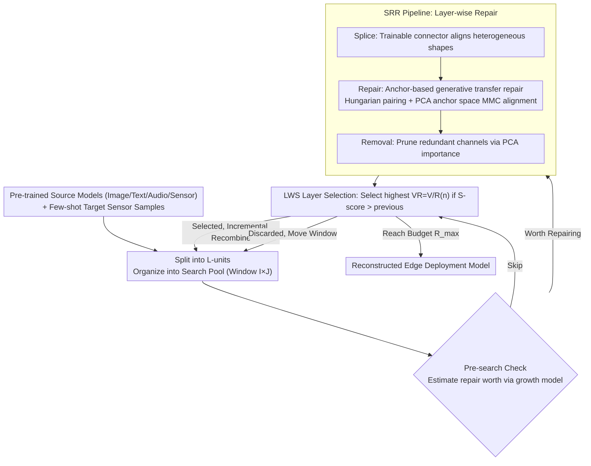

# XTransfer: Modality-Agnostic Few-Shot Model Transfer for Human Sensing at the Edge

**Conference**: ICML2026  
**arXiv**: [2506.22726](https://arxiv.org/abs/2506.22726)  
**Code**: https://github.com/zhangy10/XTransfer  
**Area**: Human Understanding / Human Sensing / Edge Intelligence  
**Keywords**: human sensing, few-shot transfer, cross-modality, edge deployment, layer recombining  

## TL;DR
XTransfer targets human sensing tasks on edge devices by transferring pre-trained models from any modality (image, text, audio, or sensors) using limited target sensor data. It mitigates cross-modality feature misalignment through layer-wise model repairing and resource-constrained layer recombining, simultaneously improving few-shot accuracy and edge deployment efficiency.

## Background & Motivation
**Background**: Human sensing tasks encompass activity recognition, gestures, emotions, vital signs, and sensor applications like mmWave or ultrasound. While deep learning significantly enhances recognition, training and deployment on edge devices are constrained by data scarcity, computational power, privacy, and collection costs. Few-shot learning (FSL), transfer learning, and cross-domain FSL attempt to adapt existing models with minimal data.

**Limitations of Prior Work**: Human sensing data differs from images or text, often exhibiting low signal-to-noise ratios, individual variability, scene changes, hardware differences, and privacy restrictions. Many FSL methods still require large-scale source datasets of the same modality or target-modality foundation models. Multimodal or cross-modal learning often relies on paired data, shared semantic spaces, or massive unlabeled data, conditions which are frequently unmet for new sensor tasks.

**Key Challenge**: Numerous pre-trained models are publicly available, yet a severe modality shift exists between source modalities and target sensor modalities. Direct fine-tuning leads to overfitting, while straightforward pruning or structuring damages accuracy under few-shot cross-modal conditions. This paper addresses how to reuse pre-trained models from arbitrary sources using only few-shot sensor data while satisfying edge resource constraints.

**Goal**: XTransfer aims to achieve modality-agnostic model transfer: it does not rely on paired data, require a shared semantic space, or train a target model from scratch. Instead, it repairs the source model at the layer-wise latent feature distribution level and recombines useful layers into a model suitable for edge deployment.

**Key Insight**: The authors discovered that modality shift affects layers unevenly; the shift in Mean Magnitude of Channels (MMC) in specific layers disrupts layer-wise accuracy convergence. Essentially, the problem is not that the entire model is unusable, but that certain intermediate representations are misaligned with the target sensor distribution, necessitating layer-wise diagnosis, repair, and selection.

**Core Idea**: Cross-modality transfer is decomposed into two steps: first, repairing the feature distribution of each layer in an anchor PCA space using the SRR pipeline, and second, selecting and recombining the most valuable layers from candidates across multiple source models within resource constraints using LWS control.

## Method
The XTransfer workflow includes model repairing and layer recombining. The former addresses misalignment of layer representations when target sensor inputs enter a source model, while the latter determines which repaired layers are worth retaining to balance accuracy and edge resources.

### Overall Architecture
XTransfer decomposes "arbitrary modality pre-trained model $\rightarrow$ few-shot sensor task" transfer into two main components: **model repairing (implemented via the SRR pipeline)** and **layer recombining (implemented via LWS control)**.

Given one or more pre-trained source models, XTransfer first partitions each model into **L-units** (independently searchable single layers or non-decomposable blocks like ResNet residual blocks). Candidate layers from different sources and depths are organized into a **search pool** (window size $I\times J$ = number of source models × layer depth). LWS control progresses through the pools: it uses a **pre-search check** to estimate if a candidate layer is worth repairing (avoiding SRR for every candidate). Layers deemed worthy are passed to the **SRR pipeline** for layer-wise repair. A few labeled sensor samples are spliced before and after the layer via a trainable connector to align shapes, then the target MMC distribution is aligned to the source anchor in a PCA anchor space. Finally, redundant channels are removed. Repaired layers are scored by LWS based on the "accuracy / resource" ratio. The candidate with the highest score that also exceeds the S-score of the previously selected layer is chosen as a layer of interest and incrementally recombined into the output model; otherwise, it is discarded and the window moves forward. This search continues until the device resource budget is reached, resulting in a reconstructed model optimized for edge deployment.

### Key Designs

**1. SRR pipeline: Splice-Repair-Removal layer-wise repair flow**

During cross-modality transfer, the representation of every layer in the source model is misaligned with the target sensor distribution. Simple fine-tuning overfits in few-shot scenarios, while fixed resizing discards sensor features. SRR constrains repair to "layer-level + lightweight connector" in three steps: **Splice** inserts a trainable compact connector (Pre-header adaptive convolution + Resizer + encoder-decoder pair) between heterogeneous layers to force shape compatibility, replacing non-trainable fixed sampling that loses features. **Repair** is the core, using generative transfer to align target features with the distribution of the frozen source layer anchors. **Removal** follows repair, using PCA channel importance (more reliable than L2-norm under MMC shift) to delete redundant channels, further compressing the model while preserving the S-score. Efficiency stems from restricting trainable parameters to the connector and low-dimensional anchor space, enabling stable alignment even with minimal samples.

**2. Anchor-based generative transfer repair (Mechanism of Repair)**

In the absence of shared semantic spaces or paired data, conventional alignment fails. This method first identifies classes with the highest S-scores in the source model as **anchor classes**. The **Hungarian algorithm** is used to pair source and target categories one-to-one by minimizing the sum of centroid distances, creating the pair set $\mathcal{P}_{ST}$. A **generative transfer module** is designed where the generator is the connector, and the discriminator operates on each frozen source layer and its PCA anchor space. The optimization target is the **anchor-based repair loss**: the positive term minimizes the distance between MMC centroids of each (source, target) pair projected in the PCA anchor space, while the negative term uses a margin to push different target classes apart (penalized only if distance is less than $M_{max}$ via ReLU). MMC is chosen as the alignment signal because it is an activation-based statistic that is inherently modality-agnostic and more stable than high-dimensional distributions in few-shot settings.

**3. LWS control: Resource-aware layer-wise search and recombination**

The search space for multi-source candidate layers is vast, and edge devices have strict FLOPs/memory constraints. Inspired by NAS, LWS defines the search space across all source model layers organized in a windowed pool ($I\times J$). It supports four actions: init, continue/skip (same-model recombination), and cross (cross-model recombination). A layer value function $V$ based on S-score measures discriminative power and convergence, which is then divided by a resource factor to get the **resource-constrained value** $VR_{ij}=V_{ij}/R(n)_{ij}$. $R(n)$ combines actual FLOPs/memory with a resource coefficient $\mathrm{RC}(n)$ that increases with depth $n$, encouraging early-layer reuse. Two mechanisms ensure feasibility: the **pre-search check** uses a growth model $rate_n=\exp(an)+b$ to estimate the S-score after repair, skipping unworthy layers. The **dynamic search range** expands or contracts based on estimation error to prevent premature pruning.

### Loss & Training
The primary training objective is the anchor-based repair loss of SRR. It minimizes the distance of projected MMC centroids for each source-target class pair and applies a margin-based negative loss for distinct target classes. During the LWS stage, candidates are selected by maximizing $VR_{ij}=V_{ij}/R(n)_{ij}$, where $V_{ij}$ is the S-score and $R(n)_{ij}$ incorporates FLOPs, parameter count, and position-dependent resource coefficients. Training utilizes only few-shot target labeled data, requiring no additional unlabeled or paired cross-modal data.

## Key Experimental Results

### Main Results
Experiments covered image, text, audio, and sensor source datasets targeting HHAR, WESAD, Gesture, Writing, Emotion, and ChestX. Evaluation metrics included accuracy and ATR (Accuracy per normalized resource cost). Representative 5-shot accuracy results from Table 4 are shown below:

| Target Task 5-shot | ProtoNet | DAPN | MAML | SemiCMT | MetaSense oracle | Ours-Single | Ours-Multi |
|-----------------|----------|------|------|---------|------------------|------------|-----------|
| HHAR | 45.7 | 51.2 | 42.3 | 38.9 | 69.0 | 71.8 | 74.3 |
| WESAD | 49.3 | 61.2 | 57.9 | 40.0 | 64.0 | 78.4 | 77.8 |
| Gesture | 55.8 | 49.4 | 41.3 | 34.4 | 73.4 | 69.6 | 73.1 |
| Writing | 78.7 | 78.6 | 39.7 | 38.6 | 83.3 | 87.0 | 86.1 |
| Emotion | 49.2 | 50.0 | 26.9 | 33.6 | 56.3 | 55.6 | 55.1 |
| ChestX | 23.4 | 24.4 | 20.4 | 25.6 | 28.1 | 28.6 | 30.0 |

### Ablation Study
The paper analyzes SRR, channel removal, LWS, and efficient search independently. Key findings are summarized below:

| Analysis Item | Setting | Result | Conclusion |
|--------|------|------|------|
| Repair loss | HHAR + ResNet18, 5-shot | Repair loss avg S-score ~0.20, vs N-Pair ~0.05, Triplet ~0.07 | Anchor-based repair better restores layer discriminability |
| Efficient search | Multi-Pre vs Multi-Efficient | Multi-Pre is fastest but accuracy is 3.36%/7.94% lower; Multi-Efficient search is 2.1x-4x faster than Multi | Dynamic range balances speed and stability |
| Source modality | Image/Text/Audio/Sensing on HHAR | 3-10-shot avg accuracy: Image 70.5%, Text 69.6%, Audio 64.3%, Sensing 67.0% | Quality and semantics matter; Image is generally robust |
| SRR only | SRR vs SRR-w/o-Removal | SRR beats w/o Removal on most targets | Channel removal helps, best when linked with LWS |
| ATR | Ours variants vs baselines | Ours-Single/Multi ATR is 1.6-98x higher than baselines | LWS contributes significantly to edge efficiency |

### Key Findings
- SRR independently improves accuracy across HHAR, WESAD, and Gesture, validating that layer-wise MMC repair mitigates modality shift.
- LWS converts "repaired utility" into "deployable utility." Without LWS, connectors add overhead, potentially lowering ATR; with LWS, accuracy and ATR both rise.
- Dynamic search allows Multi-Efficient to handle a 5x larger search space with only a 2.1x increase in search time compared to single-source baselines.
- Source model selection remains critical. Image sources are strong overall, but Text/Sensing sources can be more stable in extreme low-sample (2-3 shot) regimes.

## Highlights & Insights
- The paper localizes cross-modality transfer failure to layer-wise latent distribution misalignment rather than a generic "domain gap," providing actionable layer-level metrics for repair and search.
- MMC + PCA anchor space is a practical design: it bypasses the need for semantic alignment or paired data and is more stable than high-dimensional activations in few-shot settings.
- LWS integrates model transfer with structural search, making it highly suitable for edge scenarios where FLOPs/Params are as important as accuracy.

## Limitations & Future Work
- The method depends on the availability of suitable source models. Automating the selection of the optimal source for a specific target remains an open question.
- S-score/MMC serve as proxies for layer value; while correlated with final accuracy, they may need refinement for complex regression tasks like vital sign estimation.
- The pipeline (connectors, PCA, Hungarian pairing, adversarial repair, etc.) is complex, implying non-trivial engineering and hyperparameter tuning costs for real-world deployment.

## Related Work & Insights
- **vs FSL / Cross-domain FSL**: Unlike ProtoNet or MAML which often stay within similar domains, XTransfer emphasizes transfer from arbitrary source modalities to sensors.
- **vs Multimodal / Cross-modal learning**: Unlike CLIP-style distillation, XTransfer avoids the requirement for shared semantic spaces or paired data.
- **vs Pruning / NAS for edge**: Traditional NAS assumes sufficient target data; XTransfer repairs before recombining to avoid compressing a negatively-transferred model.
- **Insight**: For edge human sensing, the source doesn't have to be a sensor model; image or text models can be high-quality sources if their latent distributions are repaired layer-wise.

## Rating
- Novelty: ⭐⭐⭐⭐☆
- Experimental Thoroughness: ⭐⭐⭐⭐⭐
- Writing Quality: ⭐⭐⭐⭐☆
- Value: ⭐⭐⭐⭐⭐

<!-- RELATED:START -->

## Related Papers

- [\[ECCV 2024\] Learning to Obstruct Few-Shot Image Classification over Restricted Classes](../../ECCV2024/llm_pretraining/learning_to_obstruct_few-shot_image_classification_over_restricted_classes.md)
- [\[ICML 2025\] Revisiting Continuity of Image Tokens for Cross-Domain Few-Shot Learning](../../ICML2025/llm_pretraining/revisiting_continuity_of_image_tokens_for_cross-domain_few-shot_learning.md)
- [\[ICML 2026\] Dropout Universality: Scaling Laws and Optimal Scheduling at the Edge-of-Chaos](dropout_universality_scaling_laws_and_optimal_scheduling_at_the_edge-of-chaos.md)
- [\[CVPR 2026\] Linking Modality Isolation in Heterogeneous Collaborative Perception](../../CVPR2026/llm_pretraining/linking_modality_isolation_in_heterogeneous_collaborative_perception.md)
- [\[ACL 2025\] Data Whisperer: Efficient Data Selection for Task-Specific LLM Fine-Tuning via Few-Shot In-Context Learning](../../ACL2025/llm_pretraining/data_whisperer_data_selection.md)

<!-- RELATED:END -->
## Related Papers

- [\[ECCV 2024\] Learning to Obstruct Few-Shot Image Classification over Restricted Classes](../../ECCV2024/llm_pretraining/learning_to_obstruct_few-shot_image_classification_over_restricted_classes.md)
- [\[ICML 2025\] Revisiting Continuity of Image Tokens for Cross-Domain Few-Shot Learning](../../ICML2025/llm_pretraining/revisiting_continuity_of_image_tokens_for_cross-domain_few-shot_learning.md)
- [\[ICML 2026\] Dropout Universality: Scaling Laws and Optimal Scheduling at the Edge-of-Chaos](dropout_universality_scaling_laws_and_optimal_scheduling_at_the_edge-of-chaos.md)
- [\[CVPR 2026\] Linking Modality Isolation in Heterogeneous Collaborative Perception](../../CVPR2026/llm_pretraining/linking_modality_isolation_in_heterogeneous_collaborative_perception.md)
- [\[ACL 2025\] Data Whisperer: Efficient Data Selection for Task-Specific LLM Fine-Tuning via Few-Shot In-Context Learning](../../ACL2025/llm_pretraining/data_whisperer_data_selection.md)

<!-- RELATED:END -->
