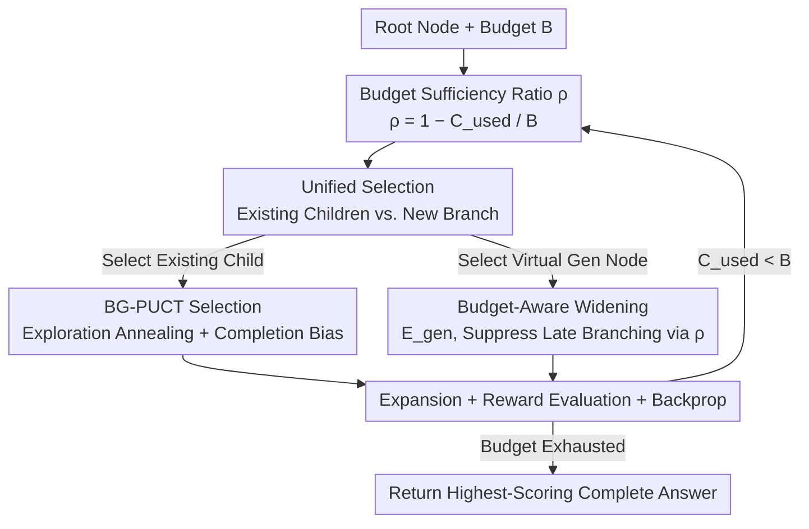

# Aligning Tree-Search Policies with Fixed Token Budgets in Test-Time Scaling of LLMs

**Conference**: ICML2026  
**arXiv**: [2602.09574](https://arxiv.org/abs/2602.09574)  
**Code**: https://github.com/Sora-Miyamoto/bg-mcts  
**Area**: LLM Reasoning / Test-Time Scaling / Tree-Search Decoding  
**Keywords**: Test-time scaling, Tree search, MCTS, Fixed token budget, Inference efficiency

## TL;DR
Addressing the practical constraint of "fixed token budgets per query" during deployment, this paper proposes Budget-Guided MCTS (BG-MCTS). It utilizes a "budget sufficiency ratio $\rho$" as a unified scheduling signal to transition tree search from broad exploration in early stages to deep refinement and answer completion as the budget depletes, consistently outperforming budget-agnostic tree search baselines on mathematical and physical reasoning benchmarks.

## Background & Motivation
**Background**: Test-time scaling is a primary method for improving answer quality by increasing inference computation without modifying model parameters. It generally falls into three categories: aggregate-after-parallel-sampling (e.g., best-of-N, majority voting), sequential refinement, and hybrid methods. Hybrid methods often utilize **tree-search decoding**, expanding partial generations into a tree and iteratively performing "selection–expansion–evaluation–backpropagation" to expand promising branches. Typically, higher computation enables broader exploration and better answers.

**Limitations of Prior Work**: in real-world deployment, inference budgets per query are **fixed and vary across products/scenarios** (measured by the total output tokens $C_{\mathrm{used}}$ generated, requiring $C_{\mathrm{used}} \le B$). However, most tree search strategies are "budget-agnostic": they either use fixed hyperparameters (iterations, branch factors, width/depth) or treat the budget merely as a termination condition.

**Key Challenge**: The disconnection between budget and strategy leads to two typical failure modes: **late over-branching** (initiating new branches when the budget is nearly exhausted, resulting in forced stops before refinement/verification) and **premature termination** (leaving budget unused). Existing early-stopping variants (e.g., LiteSearch) focus only on "when to stop" but do not define a **budget-conditioned strategy** that transitions from branching to refinement as the budget decreases.

**Goal**: Design a tree search algorithm that explicitly conditions every search decision on the "remaining budget" to produce more reliable answers within fixed token constraints.

**Key Insight**: Effective search should be "wide-to-deep": exploring broadly when the budget is ample to avoid premature commitment, and focusing on refining a few promising candidates for completion when the budget is low. A scalar signal is required to smoothly control this transition throughout the process.

**Core Idea**: Introduce the **budget sufficiency ratio** $\rho = 1 - C_{\mathrm{used}}/B$ as the sole scheduling variable. Modify MCTS **selection** and **widening** decisions such that the search automatically transitions from "broad exploration" to "deep refinement" as $\rho$ drops from 1 towards 0.

## Method

### Overall Architecture
BG-MCTS is built upon standard PUCT-style MCTS (Selection → Expansion → Evaluation → Backpropagation). Input includes problem root $p_0$, token budget $B$, and leaf expansion width $k$. All modifications depend on a scalar: at the start of each cycle, $\rho = 1 - C_{\mathrm{used}}/B$ is calculated ($\rho \simeq 1$ for early ample budget, $\rho \simeq 0$ for late-stage depletion). Two types of decisions are conditioned on $\rho$: **selecting an existing child node** (using BG-PUCT scores) and **deciding whether to create a new branch** (using generation score $E_{\mathrm{gen}}$). Both anneal as $\rho$ decreases, naturally sliding the search from exploration to refinement.

### Key Designs

**1. Budget Sufficiency Ratio $\rho$: Converting Fixed Budget into a Scheduling Signal**

Standard search treats budget as a "kill switch." BG-MCTS defines a normalized ratio:
$$\rho = 1 - \frac{C_{\mathrm{used}}}{B} \in [0,1],$$
This serves as the **conditioning variable** for all search decisions. It provides a smooth "remaining budget scale": behavioral patterns remain close to standard PUCT when $\rho \simeq 1$, but lean towards exploitation and completion as $\rho$ decreases.

**2. BG-PUCT Selection: Annealing Exploration + Injecting "Completion Bias"**

Standard PUCT selection is modified to be budget-conditioned:
$$\mathrm{BG\text{-}PUCT}(p,s,\rho)=\frac{\tilde{W}(s,\rho)}{m_s}+\rho\,cP(s\mid p)\sqrt{\frac{\ln m_p}{m_s}}.$$
Two modifications: the exploration term is scaled by $\rho$, suppressing exploration rewards as budget depletes. The exploitation term uses "depth-bias-corrected" $\tilde{W}(s,\rho)=\sum_{x\in\mathcal{T}(s)}\tilde{Q}(x,\rho)$, where:
$$\tilde{Q}(x,\rho)=Q(x)+\underbrace{\kappa(1-\rho)\frac{d(x)}{\hat{d}_{\mathrm{ans}}}}_{\text{completion bias}}.$$
Here $d(x)$ is node depth and $\hat{d}_{\mathrm{ans}}$ is the running estimate of the typical answer depth. The completion bias is scaled by $(1-\rho)$, pushing the selection towards deeper nodes as the budget runs out.

**3. Budget-Aware Widening: Suppressing New Branches via Virtual Nodes**

To avoid late-stage branching, BG-MCTS makes widening budget-aware by adding a **virtual generation child node** $s_{\mathrm{gen}}(p)$ to the candidate set $\mathcal{S}(p)$. If selected, a new standard child is generated. The generation score is:
$$E_{\mathrm{gen}}(p,\rho)=\underbrace{\mu(p)}_{\text{value level}}+\lambda\,\rho\,\underbrace{\sigma^2(p)}_{\text{uncertainty}},$$
where $\mu(p)$ and $\sigma^2(p)$ are the mean and variance of $Q$-values of $p$'s existing children. The uncertainty term is scaled by $\rho$, suppressing late-stage expansion from shallow nodes and encouraging completion.

### Loss & Training
BG-MCTS is a **pure inference** algorithm requiring no parameter training. Node expansion uses two generation units: full and sequential generation. Each new node is scored by a reward model (GenPRM-7B) to provide $Q(x)$. Default hyperparameters include $k=2$, $c=\sqrt{2}$, $\kappa=1$, and $\lambda=1$.

## Key Experimental Results

### Main Results
On MATH500 (Lv.5) and AIME24/25 with budgets $B \in \{10\text{K}, 20\text{K}, 30\text{K}\}$, BG-MCTS consistently outperforms baselines across models.

| Model | Benchmark | Greedy | Repeated | MCTS | BG-MCTS |
|------|------|--------|----------|------|---------|
| Llama-3.1-8B-Instruct | MATH500 Lv.5 | .224 | .427 | .390 | **.434** |
| Llama-3.1-8B-Instruct | AIME24/25 | .033 | .048 | .067 | **.087** |
| Qwen2.5-7B-Instruct | MATH500 Lv.5 | .493 | .666 | .645 | **.691** |
| Qwen2.5-7B-Instruct | AIME24/25 | .100 | .167 | .163 | **.176** |
| Qwen3-32B | MATH500 Lv.5 | .731 | .765 | .758 | **.798** |
| Qwen3-32B | AIME24/25 | .267 | .285 | .278 | **.311** |

BG-MCTS effectively manages the "wide-to-deep" transition, peaking as budget approaches exhaustion. Baselines like AB-MCTS-M underperform in low-budget/scalar-reward settings, while LiteSearch often terminates prematurely, leaving accuracy on the table.

### Ablation Study
Ablations on MATH500 Lv.5 show that removing any component—Exploration Annealing, Completion Bias, or Widening Annealing—results in overall performance degradation.

| Configuration | Llama 10K/20K/30K | Qwen2.5 10K/20K/30K |
|------|------|------|
| All Off (≈MCTS) | .333 / .406 / .430 | .619 / .657 / .659 |
| Exploration Anneal Only | .377 / .478 / .418 | .649 / .653 / .679 |
| Utilization Shaping Only | .340 / .418 / .425 | .646 / .664 / .660 |
| Widening Anneal Only | .310 / .392 / .433 | .642 / .526 / .664 |
| Full BG-MCTS | **.393 / .465 / .443** | **.662 / .699 / .711** |

### Key Findings
- **Complementary Components**: No single ablation variant matches the full method across all budgets, indicating each component addresses a unique aspect of fixed-budget search.
- **Model Sensitivity**: Budget alignment is particularly valuable for smaller models or difficult benchmarks (e.g., Llama on AIME sees a +30% relative gain).
- **Answer Tree Density**: The proportion of the search tree containing correct answers increases continuously with budget consumption in BG-MCTS, validating the bias towards late-stage completion.

## Highlights & Insights
- **Unified Scheduling**: A single scalar $\rho$ controls both exploration annealing and widening motivation, providing a smooth transition from exploration to completion.
- **First-Class Widening**: The "virtual generation node" allows branching to compete directly with deepening in a single `argmax`, which is an elegant abstraction for dynamic expansion.
- **Adaptive Depth**: Utilizing the running estimate $\hat{d}_{\mathrm{ans}}$ for completion bias avoids hard-coded assumptions about where answers are typically found.

## Limitations & Future Work
- **Reward Model Dependence**: Performance relies heavily on PRM (GenPRM-7B) accuracy; the impact of reward noise remains under-explored.
- **Fixed Annealing Forms**: Uses linear annealing and fixed weights ($\kappa, \lambda$); non-linear or task-adaptive annealing curves might yield better results.
- **Budget Metric**: Only considers output token counts, ignoring wall-clock time or PRM inference overhead.

## Related Work & Insights
- **vs. Standard MCTS/PUCT**: Standard PUCT is budget-agnostic until termination; BG-MCTS injects budget awareness into the core selection mechanics.
- **vs. AB-MCTS-M**: While AB-MCTS-M uses dynamic widening, it wastes tokens on new branches late in the search. BG-MCTS suppresses this via budget-aware widening.
- **vs. LiteSearch**: LiteSearch focuses on early stopping to save tokens; BG-MCTS focuses on a "budget-conditioned strategy" to optimize performance within a given fixed budget.

## Rating
- Novelty: ⭐⭐⭐⭐
- Experimental Thoroughness: ⭐⭐⭐⭐
- Writing Quality: ⭐⭐⭐⭐
- Value: ⭐⭐⭐⭐

<!-- RELATED:START -->

## Related Papers

- [\[ICML 2026\] Prism: Efficient Test-Time Scaling via Hierarchical Search and Self-Verification for Discrete Diffusion Language Models](prism_efficient_test-time_scaling_via_hierarchical_search_and_self-verification_.md)
- [\[ICLR 2026\] Plan and Budget: Effective and Efficient Test-Time Scaling on Reasoning LLMs](../../ICLR2026/llm_reasoning/plan_and_budget_effective_and_efficient_test-time_scaling_on_reasoning_large_lan.md)
- [\[ICLR 2026\] Test-Time Scaling in Diffusion LLMs via Hidden Semi-Autoregressive Experts](../../ICLR2026/llm_reasoning/test-time_scaling_in_diffusion_llms_via_hidden_semi-autoregressive_experts.md)
- [\[NeurIPS 2025\] SolverLLM: Solving Optimization Problems via Test-Time Scaling with LLM-Guided Search](../../NeurIPS2025/llm_reasoning/solverllm_leveraging_test-time_scaling_for_optimization_problem_via_llm-guided_s.md)
- [\[ICML 2026\] Lookahead Sample Reward Guidance for Test-Time Scaling of Diffusion Models](lookahead_sample_reward_guidance_for_test-time_scaling_of_diffusion_models.md)

<!-- RELATED:END -->
