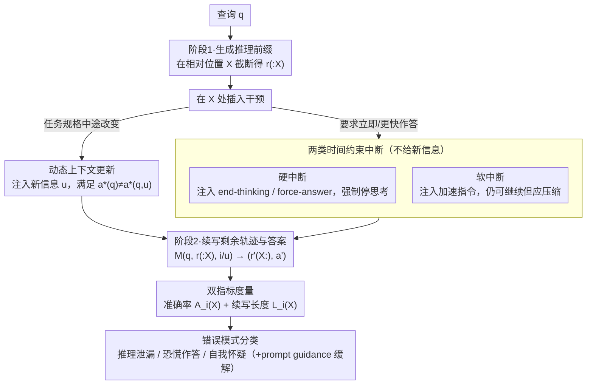

# Are Large Reasoning Models Interruptible?

**Conference**: ICML 2026  
**arXiv**: [2510.11713](https://arxiv.org/abs/2510.11713)  
**Code**: The authors have released code and data; see the project page in the paper.  
**Area**: LLM Reasoning  
**Keywords**: Interruptible Reasoning, Dynamic Context, Long Reasoning Models, Reasoning Robustness, Evaluation Benchmark  

## TL;DR
This paper shifts the evaluation of large reasoning models from static problem-solving to dynamic environments where models may be interrupted or receive mid-generation updates. The authors construct evaluation protocols for mathematics and programming and identify three consistent failure modes: reasoning leakage, panic answering, and self-doubt.

## Background & Motivation
**Background**: Large reasoning models typically generate long, explicit reasoning traces before providing a final answer. Current evaluations for mathematics and code generally assume that the problem, context, and user objectives remain static during generation, requiring the model to submit an answer only after a complete generation cycle.

**Limitations of Prior Work**: Real-world interactions are not always so stable. Users may want partial answers immediately, might discover errors in their original request and insert new conditions, or might change the state of an environment in multi-user or multi-agent collaborative codebases. If every change requires terminating generation, manually modifying the context, and restarting, it results in wasted computation and the loss of intermediate reasoning already formed.

**Key Challenge**: While long reasoning improves static accuracy, it also exposes models to longer windows of interaction time. Evaluations that focus only on the final answer after a full trace mask a critical capability: whether a model can robustly stop, compress, redirect, or incorporate new information when reasoning is incomplete.

**Goal**: The authors aim to answer three questions. First, whether models exhibit properties similar to anytime algorithms when hard-interrupted (i.e., whether more reasoning leads to better answers). Second, whether models can maintain correctness while reducing reasoning length when receiving acceleration commands. Third, whether models can recognize and incorporate mid-generation updates into subsequent reasoning.

**Key Insight**: Instead of proposing a new training algorithm, the paper first defines "interruptibility" as a standalone object of evaluation. It places interruption points within the model's existing reasoning trace and compares accuracy and output length under conditions of no interruption, hard interruption, soft interruption, and dynamic updates for the same problem.

**Core Idea**: Replace static, one-shot evaluations with a controlled mid-generation intervention protocol to directly measure the stability of long reasoning models under time constraints and context changes.

## Method
The methodology of this paper is essentially an evaluation framework: models first generate a complete reasoning trace for standard problems, then interruptions or updates are inserted at various proportional locations in the trace. The authors observe the subsequent answers, lengths, and error types. The focus is not "how to make the model think less," but "whether the model can continue to work correctly when the world has changed."

### Overall Architecture
Given a query $q$, a model $M$ in a static evaluation outputs a reasoning trace $r=(r_1, r_2, \dots, r_T)$ and a final answer $a$. Dynamic evaluation splits generation into two stages: the first stage generates up to a proportional position $X$, yielding the prefix $r_{:X}$; the second stage adds an intervention marker $i$ or update $u$ to the input, then prompts the model to generate the remaining trace $r'_{X:}$ and answer $a'$.

There are two types of evaluation metrics. Accuracy is denoted as $A_i(X)=Pr[a'=a^* \mid X,i]$, measuring whether the final answer is correct under interruption conditions. Length is denoted as $L_i(X)=|r'_{X:}\oplus a'|$, serving as a proxy for the additional computation required after the interruption. This allows the paper to observe not only the correctness of the answer but also whether the model "smuggles" reasoning that should have stopped into the final answer section.

Experiments cover two types of long reasoning tasks: mathematics and programming. Mathematics includes a 500-question subset of GSM8K, MATH-500, and AIME-24/25. Programming utilizes LiveCodeBench-v6, filtered for problems published after October 1, 2024. Primary models include Qwen3-8B, GPT-OSS-20B (high reasoning effort), and Mistral-Small-1.2, with the appendix extending to GPT-OSS-120B, DeepSeek-R1, Nemotron-3-Nano, and approximate experiments for GPT-5.4-Mini.

Interruption points use relative reasoning lengths $X\in\{0.1,0.3,\dots,0.9\}$, as reasoning token counts vary significantly across models and problems. The authors also conduct robustness checks in the appendix using sentence-level and absolute token interruptions, confirming consistent conclusion trends.

### Key Designs
**1. Two Types of Time-Constrained Interruptions: Forcing the model to "Answer now / Answer faster" without changing the problem**

This branch corresponds to the "Time Constraints" path in the framework. At relative position $X$, a hard interruption injects `end-thinking` or `force-answer` (the latter followed by a format indicator $\delta$ like `\boxed{`), making the remaining trace $r'_{X:}=\varnothing$ and forcing the model directly into the answer area. A soft interruption merely injects the phrase "Please answer faster"; the model may continue thinking but is expected to actively compress the subsequent length. This separation tests two distinct capabilities: the hard interruption checks if a partial trace supports a usable answer (anytime property), while the soft interruption checks if the model can adjust its reasoning budget under pressure rather than simply failing.

**2. Dynamic Context Update Protocol: Inserting mandatory new information to test redirection**

This corresponds to the "Update" branch. When an update $u$ is injected, it is intentionally constructed such that $a^*(q)\neq a^*(q,u)$—meaning failure to incorporate $u$ renders the answer incorrect. This cleanly separates whether the model truly used the update from whether it merely guessed correctly based on the original problem. Specifically, math tasks modify initial conditions and then use mid-generation updates to "revert" the semantics to the original problem; programming tasks involve providing only a text description initially and then supplementing starter code, variable ranges, or extra constraints mid-way. All updates were generated by GPT-5 and manually verified to ensure $u$ is necessary for the correct solution.

**3. Error Mode Classification and Lightweight Mitigation: Decomposing accuracy drops into interpretable pathologies**

At the end of the framework, behavior is categorized into three consistent failure modes: reasoning leakage (after a hard interrupt, the model moves thinking into the answer area, with answers expanding up to 10×), panic answering (after an acceleration command, the model terminates thinking with <1% of the remaining budget and provides an incorrect answer), and self-doubt (after an update, the model repeatedly questions its reliability and ultimately adheres to the old problem or produces incoherent output). To address self-doubt, the paper provides a training-free baseline: appending a prompt guidance statement in the model's persona confirming the update's validity. This categorization identifies specific gaps—stopping control, budget regulation, and context trust—that can be addressed in future work.

### Loss & Training
This work is not a training method and thus introduces no new loss functions. All experiments are inference-time evaluations. Primary variables include interruption type, position, update form, the presence of prompt guidance, model family, and scale. For AIME-24/25, 16 independent trials per question were run due to small sample size and high variance; other datasets used a single run with reported means and bootstrap 95% confidence intervals.

## Key Experimental Results

### Main Results
The primary conclusion is that models with high static performance suffer systematically under dynamic conditions. Under hard interruptions, models generally exhibit anytime behavior (accuracy increases with later interruption), but early interruptions lead to significant reasoning leakage. Soft interruptions maintain accuracy on simple tasks but trigger panic answering on difficult tasks like AIME and LiveCodeBench. Dynamic updates are the most fragile; performance drops by up to 60% when updates occur late in the reasoning process.

| Scenario | Primary Evaluation Target | Key Result | Description |
|------|--------------|----------|------|
| Hard Interruption | GSM8K / MATH-500 / AIME / LiveCodeBench | Overall upward trend in accuracy with later interruption points | Partial reasoning has value, but early stopping is not stable |
| Hard Interruption Length | AIME / LiveCodeBench | Answer length can reach 10x that of full-trace answers for early interrupts | Models leak reasoning into final answers or code comments |
| Soft Interruption | AIME / LiveCodeBench | Accuracy drops by up to ~30% | Acceleration commands cause models to terminate thinking prematurely |
| Dynamic Update | Math & Code Update Tasks | Performance drops by up to ~60% for late updates | Static evaluation significantly overestimates dynamic robustness |
| Prompt Guidance | GSM8K / MATH-500 | Mostly eliminates major issues from updates | Brief confirmations mitigate self-doubt in simple math tasks |

### Ablation Study
Ablations indicate that these failures are not caused by a single implementation detail. Model scale, user-turn insertion, prompt guidance phrasing, and compact reasoning methods like Chain of Draft change the curves, but the three pathologies persist.

| Ablation / Analysis | Setting | Key Metric/Observation | Description |
|-------------|------|----------------|------|
| Leakage Attribution | 30% Hard Interruption | Up to 10x answer expansion in failure cases | Stopping thinking block does not guarantee stopping reasoning |
| Panic Answering Attribution | 30% Soft Interruption | >90% of new errors from panic; up to ~80% of total loss | "Faster" may be interpreted as "End immediately" |
| Self-Doubt Attribution | 30% Dynamic Update | ~80% of update-driven errors related to self-doubt | Models do not always trust or incorporate mid-way updates |
| Chain of Draft | Qwen3-8B, 30% Hard Interruption | AIME answer length still 1.38x, LCB-v6 still 6.27x | Compressed reasoning does not automatically solve interruptibility |
| Chain of Draft Soft Interruption | AIME, 30% Interruption | Panic rate of 13.1%, higher than 3.8% for standard turns | Shorter draft reasoning may be more prone to abruption |
| Dynamic Update Cost | Prompt Guidance Setting | GPT-OSS code task late update cost <110% of original | Continuing after an update is often cheaper than a full restart |

### Key Findings
- Static accuracy does not imply dynamic robustness. Strong performance on fixed problems does not translate to handling mid-generation changes.
- Reasoning token curves underestimate true computation. Hard interrupts can cause hidden reasoning in the answer section; counting only "thinking tokens" misjudges efficiency.
- Prompt guidance suggests the problem is fixable. Simple confirmations improve GSM8K and MATH-500, but AIME and coding tasks remain largely unresolved.
- Model scale is not a panacea. While Qwen3-8B/32B outperform 1.7B on updates, hard and soft interruptions do not show a monotonic fix via scaling.
- User-turn interruptions are more natural, but current model format control is unstable. Assistant-turn insertion was used in main experiments to avoid format variations in thinking block support.

## Highlights & Insights
- The most valuable contribution is framing "interruptibility" as a measurable capability rather than just an engineering UX issue. It highlights that models in deployment are reasoning processes running in a changing world.
- The three error modes are highly explanatory. Reasoning leakage, panic answering, and self-doubt correspond to gaps in stopping control, budget regulation, and context trust, respectively.
- The dynamic update construction is clever. Reverting problems to their original state via updates ensures models must incorporate the new information rather than relying on memorized answers.
- The findings are particularly relevant for agentic systems. Multi-agent collaboration and IDE agents naturally involve interruptions and environment changes, making this benchmark more realistic for interactive deployment risks.
- The authors honestly acknowledge that prompt guidance is not a final solution; while it helps simple tasks, AIME and coding require better training or inference control.

## Limitations & Future Work
- The task scope is limited to mathematics and programming due to their long traces and automated verification; multi-turn QA, research assistants, and tool-use scripts are not yet included.
- Interruption forms are idealized. Experiments use single, clear, pre-set interruptions, whereas real users might provide noisy, continuous, or contradictory updates.
- Closed-source evaluation is incomplete. Many APIs do not expose intermediate reasoning or allow insertions within a reasoning trace, necessitating proxy experiments.
- The paper is more diagnostic than remedial. It does not propose interruption-aware training or new decoding constraints, which could involve incorporating simulated interruptions into post-training.
- Manual update construction has scale limitations. Larger, more complex dynamic tasks will require more systematic automated data generation and verification pipelines.

## Related Work & Insights
- **vs. Budget Forcing / S1**: While budget forcing studies fixed token budgets, this work emphasizes unpredictable external interruptions and evaluates reasoning leakage in the answer area.
- **vs. NoThinking**: Unlike work questioning if explicit thought is necessary, this study truncates existing thoughts to see if partial traces support reliable answers.
- **vs. Chain of Draft**: Compact reasoning does not eliminate leakage, panic, or self-doubt.
- **vs. Efficient Reasoning Training**: Many methods optimize for "thinking less but correctly"; this work highlights the need to "remain correct even when interrupted."
- **vs. Overthinking Work**: While missing premises can amplify overthinking, this work studies if models can trust and use those premises when they are provided mid-reasoning.

## Rating
- Novelty: ⭐⭐⭐⭐☆ Systematically defines interruptibility for long reasoning models with a clear taxonomy; the problem setting is novel though the method is primarily illustrative.
- Experimental Thoroughness: ⭐⭐⭐⭐☆ Covers multiple datasets, models, and interruption points; while some data is purely visual, the conclusions are well-supported.
- Writing Quality: ⭐⭐⭐⭐☆ High problem awareness and intuitive failure naming; good integration of formalisms and case studies.
- Value: ⭐⭐⭐⭐⭐ Vital for interactive LLMs, IDE agents, and long-task reasoning systems; serves as a reminder that static accuracy alone is insufficient for reliable deployment.

<!-- RELATED:START -->

## Related Papers

- [\[ICML 2026\] DecepChain: Inducing Deceptive Reasoning in Large Language Models](decepchain_inducing_deceptive_reasoning_in_large_language_models.md)
- [\[ICML 2026\] Internalizing Safety Understanding in Large Reasoning Models via Verification](internalizing_safety_understanding_in_large_reasoning_models_via_verification.md)
- [\[ICML 2026\] Reasoning Structure of Large Language Models](reasoning_structure_of_large_language_models.md)
- [\[ICML 2026\] Modeling Hierarchical Thinking in Large Reasoning Models](modeling_hierarchical_thinking_in_large_reasoning_models.md)
- [\[AAAI 2026\] Text-to-Scene with Large Reasoning Models](../../AAAI2026/llm_reasoning/text-to-scene_with_large_reasoning_models.md)

<!-- RELATED:END -->
