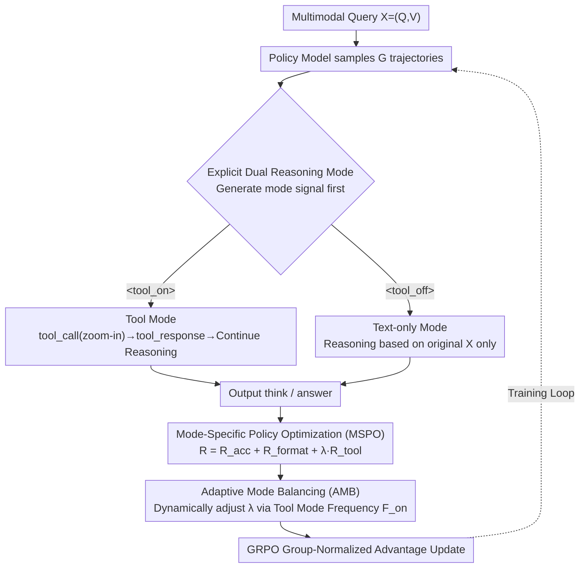

# Are Tools Always Beneficial? Learning to Invoke Tools Adaptively for Dual-Mode Multimodal LLM Reasoning

**Conference**: ICML2026  
**arXiv**: [2605.19852](https://arxiv.org/abs/2605.19852)  
**Code**: https://github.com/MQinghe/AutoTool  
**Area**: Multimodal VLM  
**Keywords**: Adaptive Tool Invocation, Multimodal Reasoning, Reinforcement Learning, Visual Grounding, Mode Balancing  

## TL;DR
AutoTool utilizes reinforcement learning to enable Multimodal Large Language Models (MLLMs) to first determine whether a "zoom-in tool" is truly necessary for a given task. By adaptively switching between tool-assisted reasoning and pure text reasoning, the model achieves simultaneous improvements in accuracy and efficiency across high-resolution perception, grounding, hallucination detection, and reasoning tasks.

## Background & Motivation
**Background**: MLLMs can already decompose complex problems into intermediate reasoning steps via Chain-of-Thought (CoT). However, many methods still follow the text-centric paradigm of LLMs, where visual information is typically encoded only once at the input stage. To allow models to re-examine local visual evidence during reasoning, recent methods like MCoT and "Thinking with Images" have introduced external tools such as search, segmentation, OCR, depth estimation, or image zoom-in.

**Limitations of Prior Work**: While tools assist models in handling fine-grained objects, local attributes, and high-resolution images, existing tool-augmented MLLMs often default to the assumption that "using tools is always beneficial." Methods like DeepEyes and OpenThinkIMG emphasize how to invoke tools and generate correct answers but fail to explicitly model "whether to invoke a tool." This leads to two primary issues: first, simple questions undergo unnecessary multi-round tool interactions, increasing training and inference costs; second, incorrect or redundant local crops may distract the model's attention, thereby inducing hallucinations.

**Key Challenge**: The benefit of tool invocation is highly dependent on the question type. If a question requires inspecting small objects, fine-grained attributes, or local regions, zoom-in provides additional evidence. However, if the question depends on global layout, spatial relationships, or if objects are already clear in the original image, tool invocation provides marginal gains and may even discard necessary context. Thus, the core problem is not just learning "how to use a tool," but learning "when not to use a tool."

**Goal**: The authors aim to train a dual-mode multimodal reasoning model: for each multimodal query, the model first chooses between a tool-assisted mode or a text-only mode. In tool mode, it must correctly locate and utilize zoom-in observations; in text-only mode, it must avoid meaningless invocations while still providing accurate answers.

**Key Insight**: Instead of relying on manually constructed SFT cold-start data, the paper integrates mode selection, format following, answer correctness, and tool effectiveness into a unified Group Relative Policy Optimization (GRPO) framework. This allows the model to simultaneously explore both reasoning paths during training and gradually learn when to favor one over the other through reward constraints.

**Core Idea**: By using explicit `<tool_on>` / `<tool_off>` dual-mode control tokens, mode-specific rewards, and adaptive mode balancing, the model transforms tool invocation from a fixed workflow into a strategic choice triggered by problem characteristics.

## Method

### Overall Architecture
The key innovation of AutoTool is not a stronger visual tool, but a rewritten decision mechanism for tool invocation. Given a multimodal query $X=(Q,V)$ where $Q$ is the text question and $V$ is the image, the model generates a mode signal before answering. When `<tool_on>` is selected, subsequent reasoning can issue a `<tool_call>`, execute a zoom-in, and append the `<tool_response>` back into the context for further reasoning. When `<tool_off>` is selected, the model completes internal reasoning and answers based solely on the original context. Built on Qwen2.5-VL-7B, the training uses GRPO to sample candidate trajectories for each question. Each trajectory carries process information including mode selection, format compliance, tool invocation, and whether the tool led to a correct answer. The reward function calculates these signals separately, and individual strategies are updated using relative advantages within the group. During inference, the model automatically selects the mode or follows user-specified prompts.

### Key Designs

**1. Explicit Dual Reasoning Mode: Promoting tool usage to the first decision point**

Existing tool-augmented MLLMs often treat tool calls as a default process, forcing simple questions into tool chains, which causes redundant interaction and context pollution. AutoTool mandates that the model generate `<tool_on>` or `<tool_off>` at the start of every question. The former allows zoom-in calls and local observations, while the latter requires answering based only on the original context. Explicitly defining modes allows the reward function to distinguish which strategy a trajectory belongs to, enabling specific constraints on both paths. This is clearer than implicitly deciding when to invoke tools and allows the model to develop different preferences for global understanding, local detail, and hallucination detection tasks.

**2. Mode-Specific Policy Optimization (MSPO): Defining "tool utility" as "assisting correctness"**

If only the final answer is rewarded, the model might guess correctly based on linguistic priors after incorrect grounding. If only tool invocation is rewarded, the model might invoke tools excessively. MSPO ties tool rewards directly to answer correctness and applies different rules based on the mode. The total reward is defined as $R=R_{acc}+R_{format}+\lambda^{mode}_{tool}R_{tool}$. $R_{acc}$ combines rule-based checks and a Qwen2.5-72B-Instruct reward model to judge semantic equivalence. $R_{format}$ checks for tags like `<think>`/`<answer>`. $R_{tool}$ varies by mode: under `<tool_on>`, it yields $1$ for a correct answer with a tool call, $-0.5$ for an incorrect answer after a tool call, and $0$ otherwise; under `<tool_off>`, it yields $1$ only if no tool is called and the answer is correct. This design penalizes "wrong grounding but lucky answer" scenarios without requiring a complex tool-quality evaluator.

**3. Adaptive Mode Balancing (AMB): Forcing exploration before allowing adaptation**

Base models naturally lean toward text-only reasoning as it is easier to obtain format and answer rewards. Left unmanaged, `<tool_on>` might be marginalized due to insufficient exploration. AMB calculates the tool mode frequency $F_{on}=N_{on}/(N_{on}+N_{off})$ across $N\times G$ rollouts in each batch. If tool mode is over-represented, the tool reward coefficient is lowered; if under-represented, it is increased via a dynamic $\lambda^{mode}_{tool}$. Crucially, this constraint is used only during training. It maintains approximately 50% dual-mode exploration in the early and middle stages. In the last ~20 steps of training, the constraint is removed, allowing the model to freely converge to a mode distribution suited to the dataset characteristics.

### Loss & Training
The optimizer uses GRPO. Given question $X$, the old policy samples $G$ outputs $o_i$ with rewards $r_i$, which are normalized into advantages $\hat{A}_i=(r_i-\mathrm{mean}(r))/\mathrm{std}(r)$. The objective function employs a PPO-style clipped ratio with $\epsilon=0.2$ and no additional KL regularization. Training data follows the DeepEyes setup, including fine-grained samples from V*, chart data from ArxivQA, and reasoning data from ThinkLite-VL. The Qwen2.5-VL-7B base model is trained for 80 iterations using 8x H200 for policy training and 2x H200 for the Qwen2.5-72B-Instruct reward model. Each batch of 256 samples is divided into 4 PPO mini-batches, with 16 rollouts per query, an initial $\lambda^{base}_{tool}=1.2$, a learning rate of $1\times10^{-6}$, and a maximum response length of 20,480 tokens.

## Key Experimental Results

### Main Results
The paper evaluates AutoTool across four task categories: high-resolution perception, visual grounding, hallucination detection, and multimodal reasoning. Benchmarks include HRbench-4K/8K, V*, RefCOCO series, ReasonSeg, POPE, MathVista, MathVerse, MathVision, WeMath, DynaMath, and LogicVista.

| Task/Dataset | Metric | AutoTool | Qwen2.5-VL-7B | DeepEyes | Main Conclusion |
|--------|------|------|------|------|------|
| HRbench-4K | Overall acc | 76.9 | 69.6 | 74.9 | 7.3 points higher than base; outperforms fixed-tool methods |
| HRbench-8K | Overall acc | 74.0 | 63.0 | 71.5 | Gain is more pronounced in high-res scenarios |
| V* | Overall acc | 90.1 | 69.1 | 87.4 | 21.0 points higher than base; surpasses most grounding models |
| RefCOCO test | IoU@0.5 acc | 88.5 | 84.7 | 86.0 | Tool mode enables more accurate target area localization |
| ReasonSeg val | IoU@0.5 acc | 63.0 | 59.5 | 61.5 | Continued gains in complex referring expressions |
| POPE Overall | Acc | 88.9 | 87.2 | 86.0 | Adaptive calls reduce hallucinations from invalid local evidence |
| MathVista testmini | Acc | 72.8 | 70.6 | 71.6 | Maintains general reasoning ability while optimizing perception |

### Ablation Study
Ablations show that forcing tool usage is not optimal. The combination of dual-mode, error-based tool penalties, and late-stage free exploration yields the best results.

| Configuration | HRbench-4K Overall | HRbench-8K Overall | V* Overall | Description |
|------|------|------|------|------|
| Text-only GRPO | 73.6 | 70.2 | 85.3 | Strengthening internal reasoning alone outperforms the base |
| Always Tool on | 74.9 | 71.5 | 87.4 | Fixed zoom-in helps but introduces redundant calls |
| Tool on + Tool off | 75.3 | 72.4 | 88.5 | Dual mode mitigates impact of incorrect tool calls |
| With MSPO penalty | 75.8 | 73.3 | 89.0 | Penalizing errors after tool calls leads to cautious grounding |
| Late Free Exploration| 76.8 | 73.2 | 89.5 | Strategy adapts better to questions without fixed constraints |
| Full AutoTool | 76.9 | 74.0 | 90.1 | All components combined achieve peak performance |

### Efficiency and Hyperparameter Analysis

| Analysis Item | Setup/Comparison | Result | Explanation |
|------|------|------|------|
| Training Time | DeepEyes vs AutoTool | 44.9 h vs 35.8 h (-20.3%) | Avoids toolchains for all samples; rollouts are shorter |
| V* Direct Inference | DeepEyes vs AutoTool | 2.23 min vs 1.68 min (-24.7%) | Simple samples skip zoom-in |
| HRbench-8K Inference | DeepEyes vs AutoTool | 53.45 min vs 33.08 min (-38.1%) | Tools invoked only for necessary problems in high-res |
| POPE Random Inference | DeepEyes vs AutoTool | 13.07 min vs 7.20 min (-44.9%) | POPE targets are large; text mode dominates |
| AMB Removal Step | step 0 / 50 / 60 / 70 / 80 | step 60 is best (V* 90.1) | Early release favors `<tool_off>`; late release over-constrains |
| $\lambda^{base}_{tool}$ | 0.0 to 5.0 | Stable at 1.2; robust between 0.5-3.0 | Extremes lead to reward imbalance or mode collapse |

### Key Findings
- Tool invocation is most valuable for high-resolution, fine-grained, and grounding tasks. For POPE tasks with large objects, the gain from frequent zoom-in is low.
- The penalty for incorrect tool usage corrects the "lucky answer" reward loophole, forcing the tool mode to focus on genuinely effective visual evidence.
- The value of AMB lies in the training process, not inference. It maintains 50% exploration early on, then allows the model to naturally adjust its mode ratio later.

## Highlights & Insights
- The paper redefines tool usage from a "capability problem" to a "decision problem." This is critical as MLLM toolchains become complex; the highest cost is often not the tool itself, but multi-round latency and context pollution from unneeded tools.
- The MSPO reward design is restrained. It avoids complex evaluation of tool quality by binding process correctness to the final answer, simultaneously rewarding effective calls and punishing "invocation for the sake of invocation."
- AMB reflects practical experience in RL exploration. Models tend to favor modes with easy scores; without external balancing, one mode might be marginalized before it is learned.
- This approach is transferable to broader agent systems: search, code execution, OCR, and segmentation tools should not be "always on" but should follow a cost-sensitive gated policy.

## Limitations & Future Work
- Current tools are limited to zoom-in, suitable for local visual checks. Expanding to multiple tools (OCR, search, depth) would transform the mode space into multi-tool scheduling, requiring redesigns for MSPO and AMB.
- Correctness rewards depend on rules and Qwen2.5-72B-Instruct. For open-ended or multi-solution tasks, reward model bias could affect mode selection.
- Experiments focus on existing benchmarks. Real-world interaction scenarios with long-chain tool use (e.g., multi-round search or dynamic environments) are not yet fully explored.
- Future work could analyze token consumption and cost-benefit curves across different hardware setups beyond simple time metrics.
- While the dual-mode token is clear, it compresses complex decisions into a single initial step. Future iterations might allow text-only reasoning to "fall back" to tools if evidence is found insufficient.

## Related Work & Insights
- **vs DeepEyes**: DeepEyes learns tool-based grounding via GRPO but leans toward universal zoom-in. AutoTool retains these advantages while adding `<tool_off>` and error penalties to solve redundant calls.
- **vs OpenThinkIMG / Thinking with Images**: These highlight the value of intermediate visual evidence. AutoTool differs by making the visual operation an optional strategic move rather than a default step.
- **vs Pure Text CoT / GRPO**: Text-only RL improves general reasoning but misses fine-grained visual details. AutoTool provides a complementary path for visual-heavy tasks.
- **Insight**: For multimodal agents, more tools necessitate better "invocation gating." A practical direction is extending AutoTool to cost-aware policies that estimate required evidence types before selecting the most efficient tool combination.

## Rating
- Novelty: ⭐⭐⭐⭐☆ Explicitly integrating tool necessity into RL objectives is a clear and effective mechanism.
- Experimental Thoroughness: ⭐⭐⭐⭐☆ Covers perception, grounding, hallucination, and reasoning with extensive ablation; real-world multi-tool scenarios could be strengthened.
- Writing Quality: ⭐⭐⭐⭐☆ Logical flow from motivation to method is clear, though some math/tables are dense.
- Value: ⭐⭐⭐⭐⭐ Direct inspiration for tool-augmented MLLMs and multimodal agents, particularly for cost-sensitive training.

<!-- RELATED:START -->

## Related Papers

- [\[NeurIPS 2025\] SRPO: Enhancing Multimodal LLM Reasoning via Reflection-Aware Reinforcement Learning](../../NeurIPS2025/llm_reasoning/srpo_enhancing_multimodal_llm_reasoning_via_reflection-aware_reinforcement_learn.md)
- [\[ICML 2026\] Chain-of-Thought Reasoning in the Wild Is Not Always Faithful](chain-of-thought_reasoning_in_the_wild_is_not_always_faithful.md)
- [\[ICLR 2026\] Adaptive Social Learning via Mode Policy Optimization for Language Agents](../../ICLR2026/llm_reasoning/adaptive_social_learning_via_mode_policy_optimization_for_language_agents.md)
- [\[ICML 2026\] PowerFlow: Unlocking the Dual Nature of LLMs via Principled Distribution Matching](powerflow_unlocking_the_dual_nature_of_llms_via_principled_distribution_matching.md)
- [\[ACL 2026\] TemplateRL: Structured Template-Guided Reinforcement Learning for LLM Reasoning](../../ACL2026/llm_reasoning/templaterl_structured_template-guided_reinforcement_learning_for_llm_reasoning.md)

<!-- RELATED:END -->
