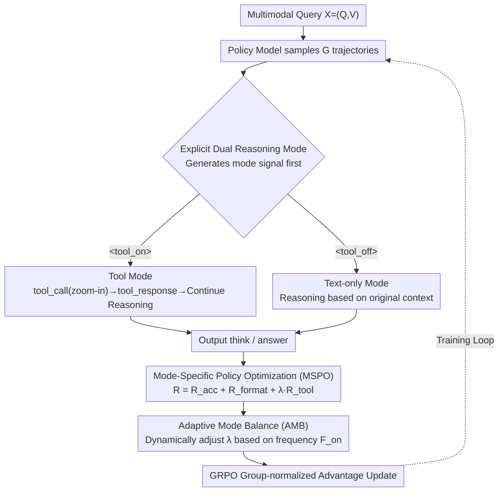

# Are Tools Always Beneficial? Learning to Invoke Tools Adaptively for Dual-Mode Multimodal LLM Reasoning

**Conference**: ICML2026  
**arXiv**: [2605.19852](https://arxiv.org/abs/2605.19852)  
**Code**: https://github.com/MQinghe/AutoTool  
**Area**: Multimodal VLM  
**Keywords**: Adaptive Tool Invocation, Multimodal Reasoning, Reinforcement Learning, Visual Grounding, Mode Balancing  

## TL;DR
AutoTool utilizes reinforcement learning to enable multimodal large language models to first determine whether a "zoom-in" tool is truly necessary. By adaptively switching between tool-assisted reasoning and pure text reasoning, the model simultaneously improves accuracy and efficiency in high-resolution perception, grounding, hallucination detection, and reasoning tasks.

## Background & Motivation
**Background**: Multimodal Large Language Models (MLLMs) can decompose complex questions into intermediate reasoning steps via Chain-of-Thought (CoT). However, many methods still follow the text-centric paradigm of LLMs, where visual information is often encoded only once at the input stage. To allow models to re-examine local visual evidence during reasoning, recent methods like MCoT and "Thinking with Images" have introduced external tools such as search, segmentation, OCR, depth estimation, or image zoom-in.

**Limitations of Prior Work**: While tools help models process fine-grained objects, local attributes, and high-resolution images, existing tool-augmented MLLMs often default to the assumption that "using tools is always beneficial." Methods like DeepEyes and OpenThinkIMG emphasize how to invoke tools and generate correct answers but fail to explicitly model "whether a tool should be invoked." This leads to two primary issues: first, simple questions undergo unnecessary multi-turn tool interactions, increasing training and inference costs; second, incorrect or redundant local crops can misdirect the model's attention, thereby inducing hallucinations.

**Key Challenge**: The benefit of tool invocation is highly dependent on the problem type. If a question requires checking small objects or fine-grained attributes, zoom-in provides additional evidence. If the question depends on global layout, spatial relationships, or already clear targets, tool invocation offers minimal marginal gain and may even lose necessary context. Thus, the key is not just learning "how to use tools," but learning "when not to use tools."

**Goal**: The authors aim to train a dual-mode multimodal reasoning model. For each multimodal query, the model first selects between a tool-assisted mode or a text-only mode. In tool mode, it must correctly locate and utilize zoom-in observations; in text-only mode, it must avoid meaningless calls and still provide accurate answers.

**Key Insight**: Instead of relying on auxiliary SFT cold-start data, the paper integrates mode selection, format following, answer correctness, and tool effectiveness into a unified Group Relative Policy Optimization (GRPO) framework. This allows the model to explore both reasoning paths during training and gradually learn when to favor one over the other through reward constraints.

**Core Idea**: Using explicit `<tool_on>` / `<tool_off>` dual-mode control tokens, mode-specific rewards, and adaptive mode balancing, the model transforms tool invocation from a fixed process into a strategy triggered by problem characteristics.

## Method

### Overall Architecture
The key change in AutoTool is not a stronger visual tool, but a rewritten decision mechanism for tool invocation. Given a multimodal query $X=(Q,V)$ where $Q$ is the text question and $V$ is the image, the model generates a mode signal before answering. Selecting `<tool_on>` allows subsequent reasoning to issue a `<tool_call>`; after executing zoom-in, the observation `<tool_response>` is appended back to the context for further reasoning. Selecting `<tool_off>` requires the model to complete internal reasoning and answer directly within the original context. Training is based on Qwen2.5-VL-7B using GRPO to sample a group of candidate trajectories for each question. Each trajectory carries process information, including mode selection, format compliance, tool invocation status, and whether the tool led to a correct answer. The reward function calculates these signals separately and updates the policy based on relative advantage within the group. During inference, the model can automatically select the mode or be manually guided by user prompts or special tokens.

### Key Designs

**1. Explicit Dual Reasoning Mode: Promoting "to use or not to use" as the first decision**

Existing tool-augmented MLLMs treat tool invocation as a default process, dragging simple questions into tool chains, which causes redundant interactions and context pollution. AutoTool requires the model to generate `<tool_on>` or `<tool_off>` at the start of each problem. The former allows zoom-in calls, while the latter mandates answering based only on the original context. Explicitly defining modes allows the reward function to identify which strategy a trajectory belongs to, enabling separate constraints for each path. This is clearer than allowing the model to decide tool calls at any time and enables the model to learn different preferences for global understanding, local detail, and hallucination detection tasks.

**2. Mode-Specific Policy Optimization (MSPO): Defining "Tool Utility" as "Tool Helps You Answer Correctly"**

If only the final answer is rewarded, the model might guess correctly based on linguistic priors even after incorrect grounding. If only tool invocation is rewarded, the model may invoke tools excessively. MSPO ties the tool reward strictly to answer correctness and applies different rules based on the mode. The total reward is defined as:
$$R = R_{acc} + R_{format} + \lambda^{mode}_{tool} R_{tool}$$
$R_{acc}$ uses rule-based matching and a Qwen2.5-72B-Instruct reward model to judge semantic equivalence, while $R_{format}$ checks format tags like `<think>`/`<answer>`. $R_{tool}$ varies by mode: under `<tool_on>`, it gives $1$ for a correct tool call and answer, $-0.5$ for tool usage followed by a wrong answer, and $0$ otherwise. Under `<tool_off>`, it gives $1$ only if the answer is correct without tool invocation. This design penalizes "wrong grounding with a lucky correct answer," suppressing invalid calls and fluke successes at the reward level.

**3. Adaptive Mode Balance (AMB): Forcing exploration before allowing adaptation**

Base models naturally favor text-only reasoning because it is easier to obtain format and answer rewards. If left unmanaged, the `<tool_on>` mode might be marginalized due to insufficient exploration. AMB calculates the frequency of the tool mode $F_{on} = N_{on} / (N_{on} + N_{off})$ across $N \times G$ rollouts in each batch. If the tool mode is too frequent, its reward coefficient is lowered while the text-only coefficient is raised, and vice-versa, realized via a dynamic $\lambda^{mode}_{tool}$. Crucially, this constraint is used only during training. In the early and middle stages, it maintains approximately 50% exploration pressure for both modes. In the final 20 steps, the constraint is removed, allowing the model to freely converge to a mode distribution that fits the dataset characteristics.

### Loss & Training
GRPO is used for optimization: for a question $X$, the old policy samples $G$ outputs $o_i$ with rewards $r_i$, which are normalized to advantages $\hat{A}_i = (r_i - \mathrm{mean}(r)) / \mathrm{std}(r)$. The objective function uses the PPO-style clipped ratio with $\epsilon = 0.2$ and no additional KL regularization. The training data follows the DeepEyes setup, including fine-grained samples from V*, chart data from ArxivQA, and reasoning data from ThinkLite-VL. The policy model Qwen2.5-VL-7B is trained for 80 iterations using 8 H200 GPUs, with 2 H200 GPUs deploying the Qwen2.5-72B-Instruct reward model. Each batch contains 256 samples split into 4 PPO mini-batches, with 16 rollouts per query. Initial tool reward coefficient $\lambda^{base}_{tool} = 1.2$, learning rate $1 \times 10^{-6}$, and max response length is 20,480 tokens.

## Key Experimental Results

### Main Results
AutoTool was validated across four task categories: high-resolution perception, visual grounding, hallucination detection, and multimodal reasoning. Evaluated datasets include HRbench-4K/8K, V*, RefCOCO, ReasonSeg, POPE, MathVista, and others.

| Task/Dataset | Metric | AutoTool | Qwen2.5-VL-7B | DeepEyes | Main Conclusion |
|--------|------|------|------|------|------|
| HRbench-4K | Overall acc | 76.9 | 69.6 | 74.9 | 7.3 pts higher than base, surpasses fixed-tool methods |
| HRbench-8K | Overall acc | 74.0 | 63.0 | 71.5 | Higher gains in high-resolution scenarios |
| V* | Overall acc | 90.1 | 69.1 | 87.4 | 21.0 pts higher than base, competitive with grounding models |
| RefCOCO test | IoU@0.5 acc | 88.5 | 84.7 | 86.0 | Tool mode enables more precise target grounding |
| ReasonSeg val | IoU@0.5 acc | 63.0 | 59.5 | 61.5 | Gains maintained in complex referring and segmentation |
| POPE Overall | Acc | 88.9 | 87.2 | 86.0 | Adaptive invocation reduces hallucinations from invalid evidence |
| MathVista testmini | Acc | 72.8 | 70.6 | 71.6 | Maintains general MLLM reasoning, not just perception |

### Ablation Study
Ablations show that forcing consistent tool usage is sub-optimal; the combination of dual-mode, error penalties, and late-stage free exploration achieves the best performance.

| Configuration | HRbench-4K Overall | HRbench-8K Overall | V* Overall | Description |
|------|------|------|------|------|
| Text-only GRPO | 73.6 | 70.2 | 85.3 | Strengthening internal reasoning alone outperforms base |
| Always Tool on | 74.9 | 71.5 | 87.4 | Fixed zoom-in helps but introduces redundant calls |
| Tool on + Tool off | 75.3 | 72.4 | 88.5 | Dual-mode mitigates impact of incorrect tool calls |
| With MSPO penalty | 75.8 | 73.3 | 89.0 | Penalizing wrong answers after tools leads to cautious grounding |
| With Late Free Exploration | 76.8 | 73.2 | 89.5 | Removing constraints allows policy to fit problem types |
| Full AutoTool | 76.9 | 74.0 | 90.1 | Combination of three core components yields best results |

### Efficiency and Hyperparameter Analysis
| Analysis Item | Setting/Comparison | Result | Explanation |
|------|------|------|------|
| Training Time | DeepEyes vs AutoTool | 44.9 h vs 35.8 h (-20.3%) | Shorter rollouts by avoiding tool chains for all samples |
| V* Direct Inference | DeepEyes vs AutoTool | 2.23 min vs 1.68 min (+24.7%) | Simple samples skip zoom-in |
| HRbench-8K Inference | DeepEyes vs AutoTool | 53.45 min vs 33.08 min (+38.1%) | Tools invoked only for necessary problems |
| POPE Random Inference | DeepEyes vs AutoTool | 13.07 min vs 7.20 min (+44.9%) | Higher text-only mode ratio for large-object tasks |
| AMB Removal Step | step 0 / 50 / 60 / 70 / 80 | Step 60 is best for V* (90.1) | Early release favors `<tool_off>`; late release over-constrains |
| $\lambda^{base}_{tool}$ | 0.0 to 5.0 | Stable around 1.2; robust between 0.5 to 3.0 | Extremes lead to reward imbalance or mode collapse |

### Key Findings
- Tool invocation is most valuable for high-resolution, fine-grained, and grounding tasks. For tasks like POPE where targets are large, frequent zoom-in yields low marginal returns.
- The penalty for incorrect tool usage does more than save time; it fixes the "correct answer via wrong grounding" reward loophole, forcing the tool mode to focus on truly effective visual evidence.
- The value of AMB lies in the training process rather than inference. Maintaining a balance early on ensures both modes are fully trained, while late-stage release allows the model to naturally adapt its mode ratio.

## Highlights & Insights
- The paper re-frames tool usage from a "capability problem" to a "decision problem." As MLLM tool chains become more complex, the primary cost often lies not in the tool itself but in the multi-turn latency and context pollution caused by unnecessary tools.
- The MSPO reward design is restrained; it avoids complex tool quality evaluators by binding process correctness to final answer correctness. This rewards effective tool use while penalizing "invocation for the sake of invocation."
- AMB reflects exploration engineering insights in RL. Models tend to select modes that yield easy points; without external balancing, one mode may be marginalized before it is learned. Conversely, persistent constraints hinder late-stage adaptation.
- This approach is transferable to broader agent systems: search, code execution, and OCR tools should not be default-on but guided by a cost-sensitive invocation gating policy.

## Limitations & Future Work
- The current tool is primarily zoom-in, suited for local visual inspection. Extending this to multiple tools (OCR, retrieval, etc.) would transform the decision space into multi-tool scheduling, requiring a redesign of MSPO and AMB.
- Final answer correctness relies on rules and the Qwen2.5-72B-Instruct reward model. Reward model bias may affect mode selection for open-ended or fine-grained explanation tasks.
- Experiments focus on existing VQA and grounding benchmarks; long-chain tool usage in real interaction scenarios (e.g., multi-turn visual search) remains to be fully explored.
- Future work could analyze memory, token consumption, and cost-benefit curves under different hardware and tool implementations.
- While the dual-mode token is a clean design, it may compress complex decisions into a single initial choice. A more granular policy could allow text-only reasoning to start and delay tool invocation only when evidence is found to be insufficient.

## Related Work & Insights
- **vs DeepEyes**: DeepEyes learns tool reasoning via GRPO but tends to apply zoom-in to all questions. AutoTool retains these advantages while adding `<tool_off>` and error penalties to solve redundancy and grounding issues.
- **vs OpenThinkIMG / Thinking with Images**: These methods introduce visual operations during reasoning. AutoTool differs by not viewing visual operations as default steps, instead learning when intermediate visual evidence is required.
- **vs Text-only CoT / GRPO Reasoning**: Text-only RL improves general reasoning but remains insensitive to high-resolution local evidence. AutoTool complements text-only paths with tool-assisted paths.
- **Insight**: For multimodal agents, the more tools available, the more "invocation gating" is needed. A practical direction is extending the binary AutoTool mode to a cost-aware policy that estimates required evidence types before selecting tools.

## Rating
- Novelty: ⭐⭐⭐⭐☆ Clearly frames tool necessity as an RL objective with a concise mechanism.
- Experimental Thoroughness: ⭐⭐⭐⭐☆ Covers perception, grounding, hallucination, and reasoning; multi-tool scenarios could be further explored.
- Writing Quality: ⭐⭐⭐⭐☆ Logic and methods are clear, supported by strong visuals.
- Value: ⭐⭐⭐⭐⭐ Directly instructive for tool-augmented MLLMs and multimodal agents, especially for cost-sensitive training.

<!-- RELATED:START -->

## Related Papers

- [\[NeurIPS 2025\] SRPO: Enhancing Multimodal LLM Reasoning via Reflection-Aware Reinforcement Learning](../../NeurIPS2025/llm_reasoning/srpo_enhancing_multimodal_llm_reasoning_via_reflection-aware_reinforcement_learn.md)
- [\[ICML 2026\] Chain-of-Thought Reasoning in the Wild Is Not Always Faithful](chain-of-thought_reasoning_in_the_wild_is_not_always_faithful.md)
- [\[ICLR 2026\] Adaptive Social Learning via Mode Policy Optimization for Language Agents](../../ICLR2026/llm_reasoning/adaptive_social_learning_via_mode_policy_optimization_for_language_agents.md)
- [\[ICLR 2026\] Vision-R1: Incentivizing Reasoning Capability in Multimodal Large Language Models](../../ICLR2026/llm_reasoning/vision-r1_incentivizing_reasoning_capability_in_multimodal_large_language_models.md)
- [\[ACL 2026\] TemplateRL: Structured Template-Guided Reinforcement Learning for LLM Reasoning](../../ACL2026/llm_reasoning/templaterl_structured_template-guided_reinforcement_learning_for_llm_reasoning.md)

<!-- RELATED:END -->
