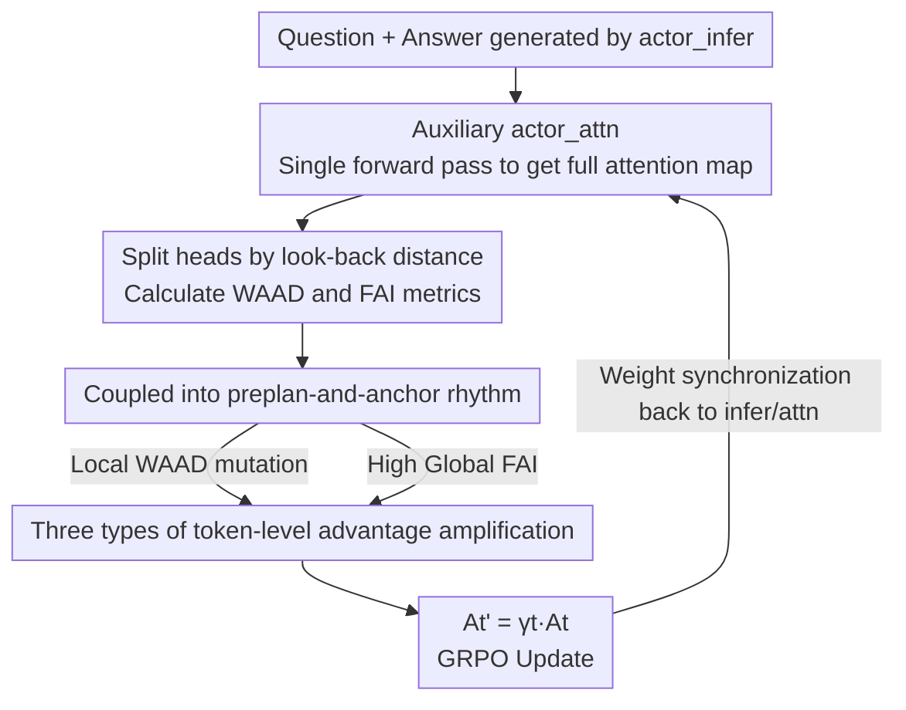

# Attention Illuminates LLM Reasoning: The Preplan-and-Anchor Rhythm Enables Fine-Grained Policy Optimization

**Conference**: ICML2026  
**arXiv**: [2510.13554](https://arxiv.org/abs/2510.13554)  
**Code**: To be confirmed  
**Area**: LLM Reasoning / Reinforcement Learning  
**Keywords**: RLVR, Credit Assignment, Attention Analysis, GRPO, token-level advantage  

## TL;DR
The authors use attention dynamics to "develop" the reasoning process—discovering a "preplan-and-anchor" two-beat rhythm during generation. They convert two internal metrics (WAAD/FAI) characterizing this rhythm into token-level advantage amplification coefficients for RL. This allows GRPO to concentrate credit on critical tokens that dictate the direction of downstream reasoning, achieving consistent performance gains across Countdown, QA, and multiple mathematical reasoning benchmarks.

## Background & Motivation
**Background**: Training large reasoning models using Reinforcement Learning from Verifiable Rewards (RLVR) is the current mainstream. GRPO/PPO optimizes models using rewards from automated correctness checks, forcing the model to generate a long chain-of-thought (CoT) before providing an answer.

**Limitations of Prior Work**: Rewards are sequence-level (a single 0/1 for the entire response), and the standard practice is to **distribute this sequence-level reward/advantage uniformly across every token**. This ignores the distinction between "key nodes determining the reasoning path" and "filler tokens merely completing local phrasing," leading to coarse credit assignment and limited data efficiency and interpretability.

**Key Challenge**: There is a mismatch between "how the model appears to reason" and "how we optimize it." Internally, the model treats certain positions as structurally decisive hubs, yet optimization treats all tokens equally.

**Goal**: To find an **internally recognized signal** from the model that identifies "which tokens are critical" and non-intrusively integrate it into existing RLVR pipelines for fine-grained credit assignment.

**Key Insight**: Instead of using external heuristics (such as high-entropy tokens), the authors directly analyze the model's **attention maps** from two complementary perspectives: looking back (how much a token depends on immediate neighbors vs. distant context) and looking forward (how much influence a token exerts on subsequent tokens).

**Core Idea**: Attention dynamics reveal a stable "preplan-and-anchor" two-beat rhythm. By converting the WAAD and FAI metrics that characterize this rhythm into amplification weights for token-level advantages, RL optimization can be focused on the key nodes identified by the model itself.

## Method

### Overall Architecture
The method consists of two parts. The first is **Diagnostics**: an additional forward pass is performed on a generated "question + answer" sequence to extract attention maps. Attention heads are grouped into local and global sets based on their "average look-back distance." Two token-level metrics—WAAD (local look-back distance) and FAI (frequency of being visited by future attention)—are calculated to demonstrate their coupling into a "preplan-and-anchor" rhythm. The second is **Intervention**: during the RL training loop, these attention signals are used to multiply the advantage $A_t$ of each token by a data-dependent amplification coefficient $\gamma_t$, redistributing credit to preplan and anchor tokens. This logic is integrated into GRPO with minimal additional computational overhead.

### Key Designs

**1. Dividing heads into local/global groups using attention span to define WAAD and FAI metrics**

The root cause of uniform advantage distribution is the lack of an internal measure for token criticality. For each attention head $(l,h)$, its weighted average look-back distance at a response position is defined as $d^{(l,h)}=\frac{1}{|\mathcal{R}|}\sum_{t\in\mathcal{R}}\sum_{s\le t}\mathbf{A}^{(l,h)}_{t,s}(t-s)$. Heads are sorted by $d^{(l,h)}$, with the lowest and highest percentiles (e.g., 30% each) designated as the local head set $\mathcal{H}_{\text{loc}}$ and global head set $\mathcal{H}_{\text{glob}}$. Visualization reveals that local heads show "sawtooth" patterns along the diagonal (local attention within a phrase, sudden look-backs at phrase boundaries), while global heads concentrate attention on sparse, specific tokens.

Two metrics are derived: **WAAD (Windowed Average Attention Distance)** measures how far a token looks back within a truncated window—low values indicate smooth local continuation (valleys), while high values (peaks) indicate calls to long-range context at boundaries; **FAI (Future Attention Influence)** measures the average attention a token receives from subsequent positions. High FAI tokens serve as "semantic anchors," corresponding to key definitions, intermediate results, or decision points. Counterfactual validation shows that replacing tokens at high FAI positions results in a Jaccard similarity of 0.534 with the original trajectory, significantly lower than 0.631 at low FAI positions, and 87.14% of trials show larger deviations under high FAI perturbations—proving FAI anchors are causal drivers of reasoning.

**2. Coupling metrics into the "preplan-and-anchor" rhythm**

The joint dynamics reveal three robust couplings: ① Tokens at WAAD peaks have higher entropy (0.2386 → 0.3608, +51.97%); ② Anchors identified by global heads align highly with "receiver heads" in existing literature (FAI peak co-occurrence 22.41% → 60.84%, +171.49%); ③ FAI peaks **closely follow or coincide with** WAAD peaks (36.87% → 52.53%, +42.47%). These converge into a two-beat rhythm: **Preplan**—WAAD spikes near semantic boundaries as the model invokes distant context to draft an introductory token; **Anchor**—A high FAI anchor token is generated simultaneously or immediately after, which is repeatedly revisited to stabilize subsequent reasoning. A key insight is that anchor tokens are often locally dominated by the preceding preplan token (low WAAD), offering little exploration space themselves. Therefore, credit should be assigned to the preplan and anchor **together**.

**3. Using an auxiliary actor_attn model for non-intrusive attention extraction during RL**

Standard engines like vLLM or Megatron use Flash Attention, which does not retain full attention matrices. The solution is an **actor_attn** instance (standard Transformer implementation). After `actor_infer` generates a response, a single additional forward pass is performed on `actor_attn` using the "question + answer" sequence. Attention maps from 5 representative layers in the middle third ($\lfloor L/3\rfloor$ to $\lfloor 2L/3\rfloor$) are extracted. This adds only one forward pass per full sequence generation, resulting in near-zero latency through parallelization. Weights are synchronized after each `actor_train` update.

**4. Three rhythm-based token-level advantage amplification strategies**

The rhythm signal modifies the token advantage $A_t$ to $\tilde{A}_t=\gamma_t A_t$ (amplification factor $\gamma_{\text{amp}}=1.5$). The strategies are:

(1) **Local Chunk Credit**: Uses the adjacent WAAD difference $\Delta_t=|\text{WAAD}_t-\text{WAAD}_{t+1}|$ to identify preplan tokens at boundaries (top-$q$ percentile $\mathcal{T}_{\text{loc}}$), amplifying their advantage by $\gamma_t=1+(\gamma_{\text{amp}}-1)\mathbf{1}\{t\in\mathcal{T}_{\text{loc}}\}$.

(2) **Global Anchor Credit**: Amplifies the top percentile of the anchor set $\mathcal{T}_{\text{glob}}$ based on FAI, encouraging the policy to articulate and maintain core semantic commitments.

(3) **Coupled Rhythm Credit**: Combines the above with backward allocation. When a high FAI anchor is locally dominated (meaning $\text{WAAD}_t\le\tau_{\text{waad}}$ and there is a $\max\Delta_u\ge\tau_\Delta$ within the preceding $k$ tokens, denoted as $t\in\mathcal{D}$), its own optimization space is limited. Part of the amplification $\alpha$ is redistributed to its corresponding preplan token: $\gamma_t=1+(\gamma_{\text{amp}}-1)\mathbf{1}\{t\in\mathcal{T}_{\text{glob}}\setminus\mathcal{D}\}+(1-\alpha)(\gamma_{\text{amp}}-1)\mathbf{1}\{t\in\mathcal{D}\}+\alpha(\gamma_{\text{amp}}-1)\mathbf{1}\{t\in\mathcal{I}(\mathcal{D})\}$.

### Loss & Training
The base models are Qwen3-4B-Base / 8B-Base integrated with GRPO. Training batch size is 512, micro-batch 32 (16 steps per batch), learning rate $1\times10^{-6}$, and $T=1.0$. WAAD window $W=10$, FAI horizon $H\in[10,100]$, anchors selected from top 40%. 4B was trained on 8 GPUs for 500 steps; 8B on 16 GPUs for 600 steps.

## Key Experimental Results

### Main Results
Baselines include standard GRPO and two control groups: Random (random token amplification) and Entropy (amplifying high-entropy tokens).

| Dataset | Metric | GRPO | +Random | +Entropy | +Local Chunk | +Global Anchor | +Coupled Rhythm |
|--------|------|------|------|------|---------|---------|-----------|
| Countdown | acc | 52.6 | 55.0 | 57.7 | 59.9 | 60.4 | **63.1** (+10.5) |
| CrossThink-QA | acc | 48.0 | 47.8 | 48.0 | 50.0 | 49.6 | **50.1** (+2.1) |

Mathematical Reasoning (Qwen3-4B-Base, 1K context; AIME uses avg@16, others pass@1):

| Method | AIME24 | AIME25 | AMC23 | MATH | Olympiad | Avg. |
|------|--------|--------|-------|------|----------|------|
| GRPO | 8.4 | 5.2 | 55.1 | 74.2 | 42.8 | 37.1 |
| +Random | 8.7 | 5.5 | 55.2 | 74.4 | 42.0 | 37.1 |
| +Entropy | 8.3 | 4.9 | 55.5 | 74.8 | 42.5 | 37.2 |
| +Global Anchor | 9.3 | 5.8 | 57.6 | 75.5 | 43.0 | 38.2 |
| +Local Chunk | 10.5 | 5.9 | 58.4 | 74.9 | 43.1 | 38.6 |
| +Coupled Rhythm | **10.7** | **7.8** | 57.4 | **75.8** | **44.1** | **39.2** (+2.1) |

### Key Findings
- **Coupled rhythm credit is most effective**: All three strategies outperform GRPO, but the coupled version redistributing credit to preplan tokens performs best across nearly all benchmarks, validating that rewarding only the anchor is insufficient.
- **Random/Entropy selection is nearly ineffective**: This indicates that gains do not stem from simply amplifying arbitrary tokens, but from attention signals identifying structurally critical nodes.
- **Faster convergence and higher plateaus**: The coupled credit strategy accelerates training early on; the primary analysis used shorter contexts (1K) to prevent long-range dependencies from diluting attention effects.

## Highlights & Insights
- **Converting Interpretability into Training Signals**: While most white-box analyses end at descriptions, this work closes the loop by feeding WAAD/FAI back into RL advantages.
- **Practical Engineering via auxiliary actor_attn**: Solves the Flash Attention visibility issue with an additional single forward pass and zero practical latency, a trick transferable to other internal signal-based RL work.
- **Backward Credit Assignment**: The concept of redistributing credit from a fixed anchor to its preceding preplan tokens provides a "chunk-level scaffolding" perspective for sequence-to-token credit assignment problems.

## Limitations & Future Work
- Amplification factors and thresholds are manually tuned hyperparameters; a systematic sensitivity scan is missing, potentially affecting transferability across tasks/models.
- Primary analysis was restricted to 1K context to avoid "long-range dilution," but long CoT reasoning is often dense with such dependencies. Evidence for effectiveness in very long contexts is weaker.
- The rhythm was observed on Qwen3 models; its existence in other model families (e.g., Llama) or domains (e.g., coding) requires further validation.

## Related Work & Insights
- **vs. High-entropy forking tokens**: Such methods focus on "branching points" for exploration. Ours uses **causal downstream influence** (FAI), validated by counterfactuals to show it changes reasoning outcomes, whereas entropy only reflects surface-level uncertainty.
- **vs. White-box Analysis**: Ours aligns with "receiver head" research (+171% co-occurrence) but goes further by utilizing these signals for targeted credit assignment in RL.
- **vs. Uniform Advantage (GRPO/DAPO)**: It is fully compatible with sequence-level reward workflows while refining them with token-level $\gamma_t$ targeting structural nodes.

## Rating
- Novelty: ⭐⭐⭐⭐⭐ Distilling attention dynamics into a "two-beat rhythm" for RL training signals is highly original.
- Experimental Thoroughness: ⭐⭐⭐⭐ Covers multiple benchmarks and model sizes with mechanism quantification, though hyperparameter sensitivity and long-context evidence are slightly lacking.
- Writing Quality: ⭐⭐⭐⭐⭐ Logical progression from observation to metric definition to RL strategy; counterfactual validations are convincing.
- Value: ⭐⭐⭐⭐ Provides a reusable paradigm and engineering trick for internal signal-driven credit assignment in RLVR.

<!-- RELATED:START -->

## Related Papers

- [\[ICLR 2026\] Reference-guided Policy Optimization for Molecular Optimization via LLM Reasoning](../../ICLR2026/llm_reasoning/reference-guided_policy_optimization_for_molecular_optimization_via_llm_reasonin.md)
- [\[ICML 2026\] The Easy, the Hard, and the Learnable: Confidence and Difficulty-Adaptive Policy Optimization for LLM Reasoning](the_easy_the_hard_and_the_learnable_confidence_and_difficulty-adaptive_policy_op.md)
- [\[ACL 2026\] Adapt to Thrive! Adaptive Power-Mean Policy Optimization for Improved LLM Reasoning](../../ACL2026/llm_reasoning/adapt_to_thrive_adaptive_power-mean_policy_optimization_for_improved_llm_reasoni.md)
- [\[CVPR 2026\] APPO: Attention-guided Perception Policy Optimization for Video Reasoning](../../CVPR2026/llm_reasoning/appo_attention-guided_perception_policy_optimization_for_video_reasoning.md)
- [\[ICML 2026\] UCPO: Uncertainty-Aware Policy Optimization](ucpo_uncertainty-aware_policy_optimization.md)

<!-- RELATED:END -->
