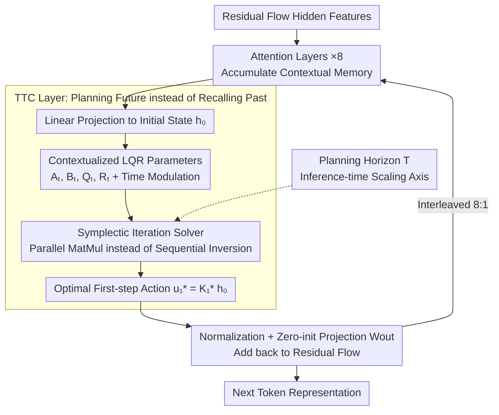

# Beyond Test-Time Memory: State-Space Optimal Control for LLM Reasoning

**Conference**: ICML 2026  
**arXiv**: [2603.09221](https://arxiv.org/abs/2603.09221)  
**Code**: https://vita-group.github.io/TTC-Net (Project Page)  
**Area**: LLM Reasoning  
**Keywords**: Optimal Control, LQR, Test-Time Planning, State-Space Models, Mathematical Reasoning  

## TL;DR

This work models LLM reasoning as an optimal control problem (Linear Quadratic Regulator, LQR) in latent space. It proposes a Test-Time Control (TTC) layer that performs finite-horizon planning during forward propagation and decodes the optimal control action as the next token representation. Combined with an efficient Symplectic Iteration CUDA solver, it serves as an adapter for pre-trained LLMs, achieving gains of up to +27.8% on MATH-500 and 2-3x improvement in Pass@8 on AMC/AIME.

## Background & Motivation

**Background**: Current mainstream sequence models (Transformers, SSMs, Linear RNNs) share a core design principle: prediction based on associative memory. Attention retains the entire KV cache for query matching, while linear RNNs compress historical context into a fixed-size hidden state. Both are essentially System 1-style fast pattern matching.

**Limitations of Prior Work**: Pure memory paradigms are limited in tasks requiring discovery, reasoning, and solving. Although Reinforcement Learning (RL) can make models more goal-oriented, RL serves only as an external training or post-training process and is absent during inference. The model learns "what to optimize" but does not learn "how to reason through planning" during computation.

**Key Challenge**: Memory architectures correspond to System 1 thinking, whereas System 2-style deliberation, multi-step planning, and long-range reasoning require specialized architectural support. RL training cannot break the reasoning ceiling imposed by memory architectures; planning capability remains external to the model.

**Goal**: Internalize planning directly into the model architecture, enabling LLMs to perform goal-oriented reasoning during forward propagation rather than relying on external training procedures.

**Key Insight**: The authors observe that LQR is a sub-class of MDPs with analytical solutions, and linear dynamical systems have been proven to represent a broad family of MDPs. By modeling the next token prediction at each layer as a differentiable finite-horizon LQR problem, planning can be executed natively during inference.

**Core Idea**: Replace pure memory retrieval with LQR planning from optimal control, allowing the model to "contemplate future trajectories" before prediction, thus architecturalizing System 2 reasoning.

## Method

### Overall Architecture

TTC-Net re-interprets "predicting the next token" as a finite-horizon optimal control planning task: instead of retrieving answers from memory, it deduces a future trajectory in latent space and uses the first action of this trajectory as the representation for the next token. This is implemented as a hybrid architecture—inserting a TTC layer every 8 Attention layers in a pre-trained Transformer. Input token features are projected to an initial hidden state $\boldsymbol{h}_0$. The TTC layer constructs and solves an LQR problem on this state to obtain the optimal first action $\boldsymbol{u}_1^*$, which is added back to the residual flow via normalization and projection. The process is end-to-end differentiable, supporting both training from scratch and fine-tuning as an adapter.

### Key Designs

**1. Test-Time Control (TTC) Layer: Replacing "Recalling the Past" with "Planning the Future"**

Existing Attention/SSM memory layers only recall information from the occurred context, serving as System 1 pattern matching, which struggles with multi-step deduction. The TTC layer solves a finite-horizon optimal control problem during forward propagation: using context-encoded $\boldsymbol{h}_0$ as the initial state, it assumes latent states evolve via linear dynamics $\boldsymbol{h}_t = \boldsymbol{A}_t \boldsymbol{h}_{t-1} + \boldsymbol{B}_t \boldsymbol{u}_t$ and applies a quadratic cost $\sum_{t=1}^{T}(\boldsymbol{h}_t^\top \boldsymbol{Q}_t \boldsymbol{h}_t + \boldsymbol{u}_t^\top \boldsymbol{R}_t \boldsymbol{u}_t)$ over the next $T$ steps. The Riccati iteration yields the optimal first action $\boldsymbol{u}_1^* = \boldsymbol{K}_1^* \boldsymbol{h}_0$. All LQR parameters ($\boldsymbol{A}_t, \boldsymbol{B}_t, \boldsymbol{Q}_t, \boldsymbol{R}_t$) are dynamically generated from $\boldsymbol{h}_0$ (contextualized) and scaled by time-modulation coefficients $\boldsymbol{\Gamma}_\Box^t$ for time-heterogeneous parameterization. Backpropagation is handled via a KKT system solving the dual LQR, making the layer fully differentiable. This works because it endows each sequence block with an intrinsic value function $V_t(\boldsymbol{h}_t) = -\frac{1}{2}\boldsymbol{h}_t^\top \boldsymbol{P}_t \boldsymbol{h}_t$—the model no longer just retrieves but "reasons toward a goal" by minimizing long-range costs.

**2. Symplectic Iteration Solver: Enabling Optimal Control Layers on GPUs**

Classical Riccati solvers require sequential backward iteration of $T$ steps, each involving a dense matrix inversion ($O(Td^3)$). This sequential inversion pattern is incompatible with GPUs. The proposed solver utilizes the symplectic structure of LQR dynamics to rewrite Riccati recursion as a cumulative product of symplectic matrices $\boldsymbol{\Sigma}_t$. Inversions for $\boldsymbol{A}_t$ and $\boldsymbol{R}_t$ are independent and parallelizable across time steps. Sequential computation is reduced to matrix multiplications. By diagonalizing $\boldsymbol{A}_t$ and $\boldsymbol{R}_t$, the inversion bottleneck is reduced from $O(T)$ to $O(1)$. This is fused into a CUDA kernel that streams parameters into SRAM with row normalization for stability. Throughput is improved by over 10x, and forward passes cache LU decompositions of $\boldsymbol{Y}_1$ for backward pass reuse, eliminating additional symplectic iteration overhead.

**3. Hybrid Architecture & Test-Time Scaling: The Planning Horizon as a New Scaling Axis**

The TTC layer excels at trajectory optimization but is less effective at context accumulation, requiring Attention to provide rich memory states. A hybrid 8:1 interleaved ratio is used with multi-head structures (head size 16), treating TTC as a lightweight adapter. To prevent distribution shift between training and testing, the planning horizon $T_{train}$ is sampled from a truncated Poisson log-normal distribution (mean $T_\mu = 8$, max 32) during training. This exposes a native architectural scaling axis: at inference, $T_{test}$ can be increased (e.g., to $T=64$) to achieve continuous performance gains beyond the training horizon. Zero-initialization of $\boldsymbol{W}_{out}$ ensures that the model initially behaves identically to the frozen backbone.

### Loss & Training

A mixed-horizon training strategy is employed: $T_{train}$ is sampled per iteration from a Poisson log-normal distribution ($T_\mu=8, T_\sigma=0.1, \text{limit } 32$). When fine-tuning pre-trained models, the OpenThoughts2-114K dataset combined with 800K self-collected reasoning samples is used for SFT, resembling a form of imitation learning and inverse reinforcement learning.

## Key Experimental Results

### Main Results — Mathematical Reasoning (Finetuned on Llama-3-Instruct-7B)

| Model | MATH-500 | AMC Acc@8 | AMC Pass@8 | AIME24 Acc@8 | AIME24 Pass@8 | AIME25 Pass@8 |
|------|----------|-----------|------------|-------------|---------------|---------------|
| Base model | 25.00 | 6.63 | 31.32 | 0.00 | 0.00 | 0.00 |
| Full Finetuning | 46.80 | 20.78 | 46.98 | 1.67 | 6.67 | 0.00 |
| + Attention | 47.00 | 20.48 | 44.58 | 0.42 | 3.33 | 6.67 |
| + Mamba | 44.80 | 22.29 | 44.58 | 0.83 | 3.33 | 3.33 |
| + GDN | 47.80 | 17.77 | 37.35 | 0.42 | 3.33 | 6.67 |
| + MesaNet | 47.40 | 12.65 | 27.71 | 1.25 | 10.00 | 0.00 |
| **TTC-Net** | **52.80** | **23.34** | **54.22** | **3.33** | **20.00** | **20.00** |

### Ablation Study — MATH-500

| Configuration | $T_{test}=8$ | $T_{test}=16$ | Description |
|------|------------|-------------|------|
| Time-homogeneous | 48.40 | 45.70 | Without time modulation, performance drops with larger $T$. |
| Fixed $T$ during training | 50.60 | 31.50 | Failing to generalize to larger test horizons. |
| Uniform $T$ sampling | 50.80 | 51.00 | Similar performance but double the training cost. |
| Attn:TTC = 4:1 | 53.00 | — | More layers improve performance at higher compute cost. |
| Attn:TTC = 16:1 | 47.20 | — | Too few TTC layers degrade performance. |
| **TTC-Net (PLN + 8:1)** | **52.80** | **53.60** | Optimal balance; generalizes up to $T=64$. |

## Highlights & Insights

- **Architectural Paradigm Shift**: Redefines reasoning from "memory retrieval" to "optimal control," providing an architectural implementation of System 2 cognition for LLMs.
- **New Test-Time Scaling Axis**: The planning horizon $T$ provides a scaling axis orthogonal to the number of generated tokens. Increasing $T$ improves accuracy without retraining.
- **Breaking Reasoning Ceilings**: TTC-Net achieves a breakthrough from 0% to 20% Pass@8 on AIME, suggesting control objectives provide inductive biases that memory layers cannot reach.
- **Symplectic Iteration Solver**: Co-design of algorithms and hardware yields >10x throughput improvement, making optimal control layers practical for large-scale LLMs.

## Limitations & Future Work

- Theoretical understanding of the joint dynamics of multiple TTC layers and their interlayer interactions is still lacking.
- Evaluation is currently limited to 7B models; the effectiveness at larger scales and throughout full pre-training/RL stages remains unknown.
- LQR's linear dynamics and quadratic costs still impose expressivity limits; non-linear MDP formulations may offer further improvements.
- Parameter contextualization via simple linear layers could be enhanced with richer world model parameterizations.

## Related Work & Insights

- Contrast with TTT (Test-Time Training): TTT focuses on test-time memory (self-supervised regression), while TTC focuses on test-time decision-making (optimal control).
- Complementary to RL for LLMs (e.g., DeepSeek-R1): RL provides training-time objectives, while TTC internalizes objectives into the architectural forward pass.
- Symplectic solver designs can be generalized to other scenarios requiring optimization layers within neural networks.
- Potential to mix with other memory architectures like Titans or DeltaNet to explore richer memory-planning interactions.

## Rating

- Novelty: 9/10 — Paradigmatic innovation embedding optimal control as an architectural component in LLMs.
- Experimental Thoroughness: 7/10 — Strong validation on Sudoku and math, but limited to 7B models and lacks general NLP/code tasks.
- Writing Quality: 9/10 — Coherent narrative from cognitive science to control theory with rigorous mathematical derivation.
- Value: 8/10 — Opens a new architectural direction for LLM reasoning, though larger-scale validation is needed.

<!-- RELATED:START -->

## Related Papers

- [\[ICLR 2026\] ∇-Reasoner: LLM Reasoning via Test-Time Gradient Descent in Latent Space](../../ICLR2026/llm_reasoning/nabla-reasoner_llm_reasoning_via_test-time_gradient_descent_in_latent_space.md)
- [\[NeurIPS 2025\] Towards Thinking-Optimal Scaling of Test-Time Compute for LLM Reasoning](../../NeurIPS2025/llm_reasoning/towards_thinking-optimal_scaling_of_test-time_compute_for_llm_reasoning.md)
- [\[ICML 2026\] Beyond Two-Stage Training: Cooperative SFT and RL for LLM Reasoning](beyond_two-stage_training_cooperative_sft_and_rl_for_llm_reasoning.md)
- [\[ICML 2026\] Conformal Thinking: Risk Control for Reasoning on a Compute Budget](conformal_thinking_risk_control_for_reasoning_on_a_compute_budget.md)
- [\[ICLR 2026\] A State-Transition Framework for Efficient LLM Reasoning](../../ICLR2026/llm_reasoning/a_state-transition_framework_for_efficient_llm_reasoning.md)

<!-- RELATED:END -->
