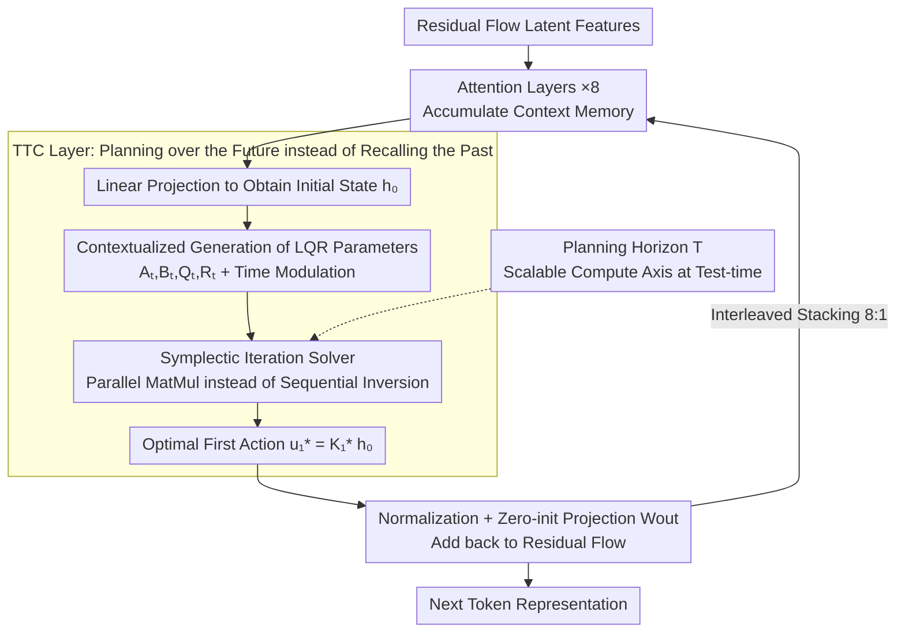

# Beyond Test-Time Memory: State-Space Optimal Control for LLM Reasoning

**Conference**: ICML 2026  
**arXiv**: [2603.09221](https://arxiv.org/abs/2603.09221)  
**Code**: https://vita-group.github.io/TTC-Net (Project page)  
**Area**: LLM Reasoning  
**Keywords**: Optimal Control, LQR, Test-Time Planning, State-Space Models, Mathematics Reasoning  

## TL;DR

Ours models LLM reasoning as an optimal control problem in latent space (Linear Quadratic Regulator, LQR) and proposes the Test-Time Control (TTC) layer to perform finite-horizon planning during the forward pass. The optimal control action is decoded as the next-token representation. Combined with a Symplectic Iteration CUDA-efficient solver, this adapter-style layer achieves up to +27.8% gain on MATH-500 and a 2-3× increase in Pass@8 on AMC/AIME when inserted into pretrained LLMs.

## Background & Motivation

**Background**: Current mainstream sequence models (Transformers, SSMs, Linear RNNs) share a core design principle: prediction based on associative memory. Attention retains the entire KV cache and retrieves via query matching, while Linear RNNs compress historical context into a fixed-size latent state for decoding. Both are essentially System 1-style fast pattern matching.

**Limitations of Prior Work**: Pure memory paradigms are limited in tasks requiring discovery, reasoning, and solving. While reinforcement learning (RL) can make models more goal-oriented, RL serves only as an external training/post-training process and is absent during test-time inference. Models learn "what to optimize" but do not learn "how to reason via planning" during computation.

**Key Challenge**: Memory architectures correspond to System 1 thinking, whereas System 2-style deliberation, multi-step planning, and long-range reasoning require specialized architectural support. RL training cannot break the reasoning ceiling imposed by memory architectures; planning remains external to the model.

**Goal**: Direct internalization of planning into the model architecture, enabling LLMs to perform goal-oriented reasoning during the forward pass rather than relying on external training procedures.

**Key Insight**: The authors observe that LQR (Linear Quadratic Regulator) is an analytically solvable subclass of MDPs, and linear dynamical systems have been proven capable of expressing a wide family of MDPs. By modeling the next-token prediction at each layer as a differentiable finite-horizon LQR problem, planning can be executed natively during test-time inference.

**Core Idea**: Replace pure memory retrieval with LQR planning from optimal control, allowing the model to "think about future trajectories" before prediction, thus architecturalizing System 2 reasoning.

## Method

### Overall Architecture

TTC-Net reimagines "predicting the next token" as a finite-horizon optimal control planning task: instead of retrieving answers from memory, it simulates a future trajectory in latent space and treats the first action of this trajectory as the representation for the next token. Physically, this is implemented as a hybrid architecture—a TTC layer is inserted after every 8 Attention layers in a pretrained Transformer. Input token features are linearly projected to obtain the initial latent state $\boldsymbol{h}_0$. The TTC layer constructs and solves an LQR problem on this state to find the optimal first action $\boldsymbol{u}_1^*$, which is then added back to the residual flow via normalization and linear projection. The entire process is end-to-end differentiable, allowing it to be trained from scratch or fine-tuned as an adapter on pretrained models.

### Key Designs

**1. Test-Time Control (TTC) Layer: Replacing "Recalling the Past" with "Planning the Future"**

Existing Attention/SSM memory layers can only recall information from context that has already occurred, essentially performing System 1 pattern matching, which struggles with problems requiring multi-step deduction. The TTC layer acts by solving a finite-horizon optimal control problem directly in the forward pass: starting from $\boldsymbol{h}_0$ (which encodes context), it assumes latent states evolve via linear dynamics $\boldsymbol{h}_t = \boldsymbol{A}_t \boldsymbol{h}_{t-1} + \boldsymbol{B}_t \boldsymbol{u}_t$ and imposes a quadratic cost $\sum_{t=1}^{T}(\boldsymbol{h}_t^\top \boldsymbol{Q}_t \boldsymbol{h}_t + \boldsymbol{u}_t^\top \boldsymbol{R}_t \boldsymbol{u}_t)$ over a future horizon $T$. The optimal first action $\boldsymbol{u}_1^* = \boldsymbol{K}_1^* \boldsymbol{h}_0$ is then solved via Riccati iteration. All LQR parameters ($\boldsymbol{A}_t, \boldsymbol{B}_t, \boldsymbol{Q}_t, \boldsymbol{R}_t$) are dynamically generated from $\boldsymbol{h}_0$ through linear layers (**Mechanism**) and adjusted by time-modulation coefficients $\boldsymbol{\Gamma}_\Box^t$ for time-heterogeneous parametrization. Backpropagation is handled by solving the dual LQR via the KKT system, making the layer fully differentiable. This is effective because it grants each sequence modeling block an intrinsic value function $V_t(\boldsymbol{h}_t) = -\frac{1}{2}\boldsymbol{h}_t^\top \boldsymbol{P}_t \boldsymbol{h}_t$—the model no longer just retrieves but "evolves toward a goal" by minimizing long-range costs, an inductive bias memory layers lack.

**2. Symplectic Iteration Solver: Making Optimal Control Efficient on GPUs**

Classical Riccati solvers require sequential backward iteration for $T$ steps, each involving a dense matrix inversion ($O(Td^3)$). This sequential/inversion pattern is poorly suited for GPUs optimized for parallel matrix multiplication. The solver leverages the inherent symplectic structure of LQR dynamics to rewrite Riccati recursion as a cumulative product of symplectic matrices $\boldsymbol{\Sigma}_t$. The required inversions $\boldsymbol{A}_t^{-1}$ and $\boldsymbol{R}_t^{-1}$ for each timestep are independent and can be computed in parallel; the remaining sequential computation consists only of matrix multiplications (ideal for Tensor Cores). By diagonalizing $\boldsymbol{A}_t$ and $\boldsymbol{R}_t$, the complexity of dense inversion is reduced from $O(T)$ to $O(1)$. This workflow is fused into a CUDA kernel that blocks by row, streams parameters into SRAM, and uses row normalization for numerical stability. Consequently, the computational bottleneck shifts from "inversion" to "multiplication," yielding over 10× throughput gains. The forward pass also caches the LU decomposition of $\boldsymbol{Y}_1$ and intermediate results for reuse in backpropagation, eliminating extra symplectic iteration overhead.

**3. Hybrid Architecture and Test-Time Scaling: Horizon as a New Compute Axis**

Since TTC layers optimize trajectories but are less suited for accumulating context, they rely on Attention layers to provide rich memory states. A 8:1 interleaved ratio (1 TTC layer per 8 Attention layers) with a multi-head structure (head size 16) is used. When TTC is embedded as a lightweight adapter into a pretrained LLM, training with a fixed horizon can lead to distribution shifts if $T$ is increased at test-time. Therefore, the planning horizon $T_{train}$ is sampled from a truncated Poisson log-normal distribution (mean $T_\mu = 8$, upper bound 32) during training to expose the model to various planning depths. This reveals a test-time compute scaling axis that is architectural and orthogonal to the number of generated tokens: by increasing the planning horizon $T_{test}$ during inference, the model generalizes even beyond $T=32$ to $T=64$, achieving continuous performance gains. During fine-tuning, the output projection $\boldsymbol{W}_{out}$ is zero-initialized, ensuring the initial TTC-integrated model is identical to the original backbone.

### Loss & Training

A mixed-horizon training strategy is used: in each iteration, the planning horizon $T_{train}$ is sampled from a Poisson log-normal distribution with mean $T_\mu = 8$, log-standard deviation $T_\sigma = 0.1$, and a maximum of 32. When fine-tuning on pretrained models, the OpenThoughts2-114K dataset along with 800K self-collected reasoning samples are used for SFT, effectively performing imitation learning and inverse reinforcement learning.

## Key Experimental Results

### Main Results — Mathematical Reasoning (Fine-tuned on Llama-3-Instruct-7B)

| Model | MATH-500 | AMC Acc@8 | AMC Pass@8 | AIME24 Acc@8 | AIME24 Pass@8 | AIME25 Pass@8 |
|------|----------|-----------|------------|-------------|---------------|---------------|
| Base model | 25.00 | 6.63 | 31.32 | 0.00 | 0.00 | 0.00 |
| Full Finetuning | 46.80 | 20.78 | 46.98 | 1.67 | 6.67 | 0.00 |
| + Attention | 47.00 | 20.48 | 44.58 | 0.42 | 3.33 | 6.67 |
| + Mamba | 44.80 | 22.29 | 44.58 | 0.83 | 3.33 | 3.33 |
| + GDN | 47.80 | 17.77 | 37.35 | 0.42 | 3.33 | 6.67 |
| + MesaNet | 47.40 | 12.65 | 27.71 | 1.25 | 10.00 | 0.00 |
| **TTC-Net** | **52.80** | **23.34** | **54.22** | **3.33** | **20.00** | **20.00** |

### Ablation Study — MATH-500

| Configuration | $T_{test}=8$ | $T_{test}=16$ | Description |
|------|------------|-------------|------|
| Time-homogeneous parametrization | 48.40 | 45.70 | Without time modulation, increasing horizon hurts performance |
| Fixed training horizon | 50.60 | 31.50 | Fails to generalize to larger test-time horizons |
| Uniformly sampled horizon | 50.80 | 51.00 | Similar performance but doubles training cost |
| Attn:TTC = 4:1 | 53.00 | — | More TTC layers improve performance but increase compute |
| Attn:TTC = 16:1 | 47.20 | — | Performance drops with too few TTC layers |
| **TTC-Net (PLN + 8:1)** | **52.80** | **53.60** | Optimal balance point; generalizes up to $T=64$ |

## Highlights & Insights

- **Architecture Paradigm Shift**: Re-defines reasoning from "memory retrieval" to "optimal control" for the first time, providing an architectural implementation of System 2 cognition in LLMs.
- **New Test-Time Scaling Axis**: The planning horizon $T$ provides a compute scaling axis orthogonal to the number of generated tokens; increasing $T$ continuously improves reasoning accuracy without retraining.
- **Breaking Reasoning Ceilings**: TTC-Net achieves a breakthrough from 0% to 20% Pass@8 on AIME, suggesting that control objectives provide inductive biases unreachable by memory layers alone.
- **Symplectic Iteration Solver**: Achieves over 10× throughput gain through algorithm-hardware co-design, making optimal control layers practically usable in large-scale LLMs.

## Limitations & Future Work

- Joint dynamical behavior across multiple TTC layers lacks theoretical understanding; the mechanisms of inter-layer interaction remain unclear.
- Currently verified only on 7B models; performance on larger models and across all training stages (pre-training + RL) is unknown.
- The linear dynamics and quadratic costs of LQR still have expressivity limits; non-linear MDP formulations might offer further improvements.
- The contextualized linear layers for parameters are simple; richer world-model parametrizations are worth exploring.

## Related Work & Insights

- Contrast with TTT (Test-Time Training) series: TTT focuses on test-time memory (self-supervised regression), whereas TTC focuses on test-time decision-making (optimal control).
- Complementary to RL for LLMs (e.g., DeepSeek-R1): RL provides training-time objectives, while TTC internalizes objectives into the architecture's forward pass.
- The Symplectic Iteration Solver design can be generalized to other scenarios requiring optimization layers within neural networks.
- Memory architectures like Titans or DeltaNet could be hybridized with TTC to explore richer memory-planning interactions.

## Rating

- Novelty: 9/10 — Paradigmatic innovation embedding optimal control as an architectural component in LLMs.
- Experimental Thoroughness: 7/10 — Strong validation on Sudoku and math reasoning, but limited to 7B models and lacks general NLP/code tasks.
- Writing Quality: 9/10 — Coherent narrative spanning cognitive science to control theory with rigorous math.
- Value: 8/10 — Opens a new architectural direction for LLM reasoning, though large-scale validation is still needed.

<!-- RELATED:START -->

## Related Papers

- [\[ICLR 2026\] Optimal Aggregation of LLM and PRM Signals for Efficient Test-Time Scaling](../../ICLR2026/llm_reasoning/optimal_aggregation_of_llm_and_prm_signals_for_efficient_test-time_scaling.md)
- [\[ICLR 2026\] $\nabla$-Reasoner: LLM Reasoning via Test-Time Gradient Descent in Latent Space](../../ICLR2026/llm_reasoning/nabla-reasoner_llm_reasoning_via_test-time_gradient_descent_in_latent_space.md)
- [\[NeurIPS 2025\] Towards Thinking-Optimal Scaling of Test-Time Compute for LLM Reasoning](../../NeurIPS2025/llm_reasoning/towards_thinking-optimal_scaling_of_test-time_compute_for_llm_reasoning.md)
- [\[ICML 2026\] Conformal Thinking: Risk Control for Reasoning on a Compute Budget](conformal_thinking_risk_control_for_reasoning_on_a_compute_budget.md)
- [\[ICML 2026\] Beyond Two-Stage Training: Cooperative SFT and RL for LLM Reasoning](beyond_two-stage_training_cooperative_sft_and_rl_for_llm_reasoning.md)

<!-- RELATED:END -->
