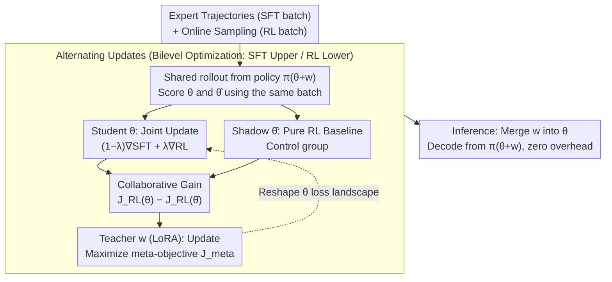

# Beyond Two-Stage Training: Cooperative SFT and RL for LLM Reasoning

**Conference**: ICML 2026  
**arXiv**: [2509.06948](https://arxiv.org/abs/2509.06948)  
**Code**: https://github.com/ChanLiang/BRIDGE  
**Area**: Reinforcement Learning  
**Keywords**: LLM Reasoning, Reinforcement Learning, Supervised Fine-Tuning, Bilevel Optimization, Meta-Learning  

## TL;DR

Ours proposes the BRIDGE framework, which models the integration of SFT and RL as a bilevel optimization problem. In this framework, an SFT-based upper-level teacher learns to selectively transfer beneficial supervisory signals to an RL-based student via a lightweight LoRA module, achieving an average absolute improvement of over 3 percentage points across five mathematical reasoning benchmarks.

## Background & Motivation

**Background**: SFT (Supervised Fine-Tuning) and RLVR (Reinforcement Learning from Verifiable Rewards) are the two primary paradigms for post-training LLM reasoning. SFT efficiently imitates expert trajectories but is prone to overfitting, while RLVR discovers high-reward trajectories through exploration but suffers from low sampling efficiency. The current mainstream approach is a "two-stage pipeline"—performing SFT followed by RL.

**Limitations of Prior Work**: The two-stage approach does not always outperform pure RL (performance is even worse on Llama-3.2-3B). The advantage of SFT is primarily a static initialization effect; once the RL stage begins, supervisory signals are discarded, and the model relies solely on unguided exploration. Meanwhile, single-stage hybrid methods (direct weighting $J_{\text{hyb}}(\theta) = J_{\text{RL}}(\theta) + \mu J_{\text{SFT}}(\theta)$) perform worse—experiments show that the rewards of naive hybridization are even lower than those of pure RL.

**Key Challenge**: Not all supervisory updates are beneficial for reward optimization. Directly mixing SFT and RL gradients can be counterproductive. The core problem is: how to dynamically extract supervisory signals that truly assist in maximizing RL rewards?

**Key Insight**: The authors observe a hierarchical teacher-student relationship between SFT and RL—SFT possesses expert reasoning trajectories (teacher), while RL seeks high-reward policies through exploration (student). Modeling the two as a bilevel optimization (Stackelberg game) allows SFT to adaptively adjust supervision based on its helpfulness to RL.

**Core Idea**: Use meta-learning to enable SFT to learn how to "teach" RL. By maximizing a collaborative gain signal of joint training relative to pure RL, supervisory updates are only adopted when they contribute to reward optimization.

## Method

### Overall Architecture

BRIDGE reformulates the "SFT then RL" two-stage pipeline into a teacher-student bilevel game: the upper level (leader) is the SFT objective, which manipulates a lightweight LoRA teacher module $w$; the lower level (follower) is the RL objective, responsible for optimizing the LLM backbone parameters $\theta$. Each training step alternates between two tasks: the student update fuses SFT and RL gradients to advance $\theta$, and the teacher update adjusts $w$ based on "how much more reward this joint training earned compared to pure RL," ensuring supervisory signals are only adopted when they truly assist reward optimization. At inference, $w$ is merged directly into $\theta$, incurring no additional overhead.

### Key Designs

**1. Bilevel Optimization Formulation: Subordinating SFT to the RL Optimal Solution**

The root cause of failure in naive hybridization ($J_{\text{RL}} + \mu J_{\text{SFT}}$) is that SFT and RL are placed on the same level with equal weighting, where supervisory updates may pull the model away from high-reward regions. BRIDGE uses a hierarchy to express the relationship where "SFT is here to assist RL": the upper-level objective is $\max_w J_{\text{SFT}}(w, \theta^*(w))$, and the lower-level constraint is $\theta^*(w) = \arg\max_\theta J_{\text{RL}}(\theta, w)$. The optimization of SFT is predicated on RL having converged to an optimal solution, structurally ensuring that supervisory signals do not interfere with rewards. Since direct computation requires second-order derivatives of $\theta^*(w)$—infeasible at LLM scale—the authors relax it into a single level using a penalty: $\max_{\theta,w} (1-\lambda) J_{\text{SFT}}(\theta,w) - \lambda \, p(w,\theta)$, where $p(w,\theta)$ measures the deviation of $\theta$ from the RL optimum. This allows optimization with first-order gradients, keeping approximation errors at the $O(1-\lambda)$ level.

**2. LoRA Teacher Module and Collaborative Gain Signal: Reshaping the Landscape via Low-Rank Subspaces**

If SFT and RL share the same parameters, their updates contaminate each other. BRIDGE sets the policy to $\pi_{\theta+w}$, where the teacher only modifies the low-rank $w$. This reshapes the loss landscape for $\theta$ without direct parameter conflict, as they operate in independent subspaces. The meta-objective for the teacher is $J_{\text{meta}} = (1-\lambda) J_{\text{SFT}}(\theta,w) + \lambda [J_{\text{RL}}(\theta,w) - J_{\text{RL}}(\hat{\theta},w)]$, where $\hat{\theta}$ is an auxiliary parameter updated only by pure RL. The term in brackets is the **collaborative gain**—the additional reward from joint training over pure RL. Supervision is considered "correct" only when this difference is positive. This design also mitigates reward noise: any additive bias in rewards is naturally canceled out during subtraction, making the meta-signal robust to imperfect verifiers.

**3. Alternating Three-Way Update Algorithm: Accurate Gain Estimation via Shared Rollouts**

To implement the meta-objective, BRIDGE samples both SFT and RL mini-batches at each step and performs three updates: the student $\theta^{k+1} = \theta^k + \alpha [(1-\lambda)\nabla_\theta J_{\text{SFT}} + \lambda \nabla_\theta J_{\text{RL}}]$ executes joint training; the auxiliary parameter $\hat{\theta}^{k+1} = \hat{\theta}^k + \alpha \nabla_{\hat\theta} J_{\text{RL}}$ maintains a pure RL baseline as a control; and the teacher $w^{k+1} = w^k + \beta \nabla_w J_{\text{meta}}$ updates the LoRA accordingly. The shadow parameter $\hat{\theta}$ turns collaborative gain into a computable quantity. To avoid noise from separate policy sampling, both share the same batch of rollouts to evaluate the reward difference, significantly reducing variance.

## Key Experimental Results

### Main Results

Evaluated on three LLMs of different scales, trained on the MATH dataset hard split (8.5K problems) across five reasoning benchmarks:

| Method | MATH500 | Minerva Math | OlympiadBench | AIME24 | AMC23 | Average |
|------|---------|-------------|---------------|--------|-------|------|
| RL | 64.4 | 26.5 | 27.0 | 3.3 | 40.0 | 32.2 |
| SFT→RL | 66.0 | 24.3 | 26.8 | 9.0 | 35.0 | 32.2 |
| SFT+RL | 55.6 | 20.6 | 25.0 | 3.3 | 42.5 | 29.4 |
| CHORD | 66.0 | 23.2 | 25.9 | 6.7 | 40.5 | 32.5 |
| **BRIDGE** | **66.2** | **23.9** | **28.9** | **13.3** | **47.5** | **36.0** |

> Qwen2.5-3B results. BRIDGE averages 36.0%, exceeding the strongest baseline CHORD by 3.5 percentage points.

| Model | Prev. SOTA | BRIDGE | Gain |
|------|---------|--------|---------|
| Qwen2.5-3B | 32.5 (CHORD) | 36.0 | +3.5 |
| Llama-3.2-3B | 21.9 (LUFFY) | 24.7 | +2.8 |
| Qwen3-8B | 45.9 (CHORD) | 49.9 | +4.0 |

### Ablation Study

| Configuration | Average Accuracy | Description |
|------|-----------|------|
| BRIDGE | 49.9 | Full method (Qwen3-8B) |
| w/o $J_{\text{meta}}$ | 40.3 | Meta-objective removed, degrades to naive multi-task, down 9.6 points |

| Metric | RL | SFT→RL | BRIDGE | Description |
|------|-----|---------|--------|------|
| Training Time (hr, 3B) | 6.1 | 12.3 | 6.9 | BRIDGE saves 44% time compared to two-stage |
| Training Time (hr, 8B) | 38.5 | 39.1 | 33.5 | BRIDGE saves 14% time compared to two-stage |
| Memory (GB, 3B) | 52.2 | 45.9 | 59.3 | Memory increased by ~11% |
| Accuracy (%, 3B) | 32.2 | 32.2 | 36.0 | Performance gain of 11.8% |

Robustness to reward noise: When rewards are flipped with probability $p=0.2$, BRIDGE still achieves 32.9%, while pure RL drops to 13.9% (the gap widens from +3.8 to +19.0), as the additive bias $p$ in the collaborative gain is canceled out.

## Highlights & Insights

- **SFT-RL integration from a meta-learning perspective**: First to model LLM reasoning training as a bilevel optimization, providing a more principled framework than heuristic blending.
- **Collaborative gain signal naturally handles noise**: Mathematically proves that bias in reward noise is eliminated in the difference, making the method robust even with imperfect verifiers.
- **Solution diversity increased**: Pass@32 on AIME24 is 10 percentage points higher than pure RL, indicating that SFT trajectories enrich the exploration space.
- **Cross-domain zero-shot generalization**: Models trained on math outperform pure RL zero-shot in coding (LiveCodeBench) and science (GPQA), whereas SFT→RL often falls below the base model.

## Limitations & Future Work

- Only tested on automatically verifiable tasks (math/logic/code); performance on subjective rewards (e.g., open-ended generation) is not verified.
- The auxiliary parameter $\hat{\theta}$ requires maintaining a full LLM copy, posing significant memory pressure at 70B+ scales.
- Although experiments show robustness for $\lambda$ in the 0.3-0.7 range, the optimal value still requires adjustment per model/task.

## Related Work & Insights

- **CHORD** (Zhang et al., 2025): Dynamic weighting at global and token levels, the strongest heuristic baseline.
- **LUFFY** (Yan et al., 2025): Injects SFT demonstrations as off-policy trajectories in RL, limited by distribution mismatch.
- **SRFT** (Fu et al., 2025): Entropy-aware weighting and clipping to reduce target interference, yet remains a heuristic mixture.
- **SimpleRL** (Zeng et al., 2025): Pure RL baseline framework, finding that short CoT fine-tuning may harm reasoning.
- Insight: Bilevel optimization provides a general framework for "learning how to teach," transferable to other scenarios requiring the integration of imitation and exploration.

## Rating

- Novelty: ⭐⭐⭐⭐ (First to model SFT-RL integration as bilevel optimization)
- Experimental Thoroughness: ⭐⭐⭐⭐⭐ (Three models, five benchmarks, multi-dimensional analysis, robustness/generalization/diversity)
- Writing Quality: ⭐⭐⭐⭐ (Clear motivation derivation, complete mathematical formulas)
- Value: ⭐⭐⭐⭐ (Provides a principled alternative for SFT-RL integration)

<!-- RELATED:START -->

## Related Papers

- [\[ICML 2026\] ETS: Energy-Guided Test-Time Scaling for Training-Free RL Alignment](ets_energy-guided_test-time_scaling_for_training-free_rl_alignment.md)
- [\[ICLR 2026\] Beyond Markovian: Reflective Exploration via Bayes-Adaptive RL for LLM Reasoning](../../ICLR2026/llm_reasoning/beyond_markovian_reflective_exploration_via_bayes-adaptive_rl_for_llm_reasoning.md)
- [\[NeurIPS 2025\] First SFT, Second RL, Third UPT: Continual Improving Multi-Modal LLM Reasoning via Unsupervised Post-Training](../../NeurIPS2025/llm_reasoning/first_sft_second_rl_third_upt_continual_improving_multi-modal_llm_reasoning_via_.md)
- [\[ICML 2026\] Beyond Test-Time Memory: State-Space Optimal Control for LLM Reasoning](beyond_test-time_memory_state-space_optimal_control_for_llm_reasoning.md)
- [\[ICLR 2026\] AceReason-Nemotron 1.1: Advancing Math and Code Reasoning through SFT and RL Synergy](../../ICLR2026/llm_reasoning/acereason-nemotron_11_advancing_math_and_code_reasoning_through_sft_and_rl_syner.md)

<!-- RELATED:END -->
