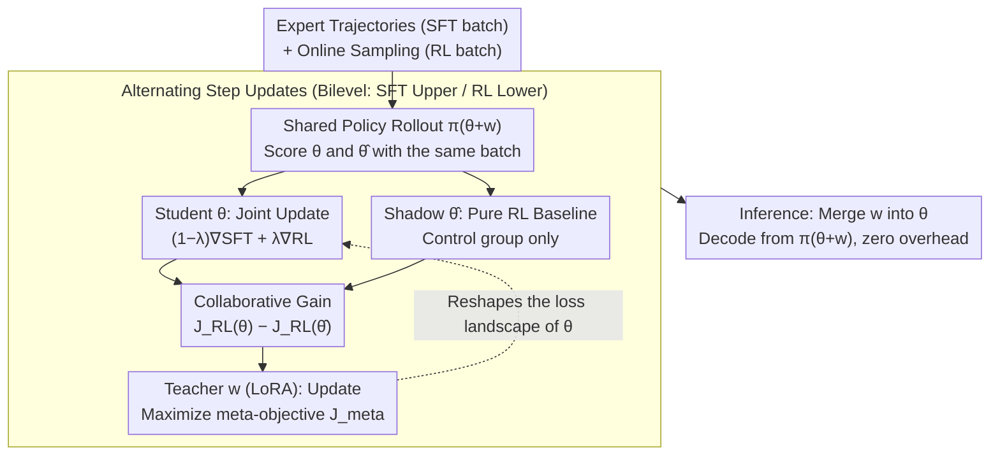

# Beyond Two-Stage Training: Cooperative SFT and RL for LLM Reasoning

**Conference**: ICML 2026  
**arXiv**: [2509.06948](https://arxiv.org/abs/2509.06948)  
**Code**: https://github.com/ChanLiang/BRIDGE  
**Area**: Reinforcement Learning  
**Keywords**: LLM Reasoning, Reinforcement Learning, Supervised Fine-Tuning, Bilevel Optimization, Meta-Learning  

## TL;DR

The BRIDGE framework is proposed to model the integration of SFT and RL as a bilevel optimization problem. SFT acts as an upper-level teacher that learns to selectively transmit beneficial supervisory signals to the RL student through a lightweight LoRA module, achieving an average absolute improvement of over 3 percentage points across five mathematical reasoning benchmarks.

## Background & Motivation

**Background**: SFT (Supervised Fine-Tuning) and RLVR (Reinforcement Learning from Verifiable Rewards) are the two primary paradigms for LLM reasoning post-training. SFT efficiently mimics expert trajectories but is prone to overfitting, while RLVR discovers high-reward trajectories through exploration but suffers from low sample efficiency. The current mainstream practice follows a "two-stage pipeline"—SFT followed by RL.

**Limitations of Prior Work**: The two-stage approach does not always outperform pure RL (it even performs worse on Llama-3.2-3B). The advantage of SFT is primarily a static initialization; once the RL stage begins, supervisory signals are discarded, and the model relies on unguided exploration. Conversely, single-stage hybrid methods (direct weighting $J_{\text{hyb}}(\theta) = J_{\text{RL}}(\theta) + \mu J_{\text{SFT}}(\theta)$) perform even worse—experiments show that naive hybrid rewards are often lower than those of pure RL.

**Key Challenge**: Not all supervisory updates are beneficial for reward optimization. Directly mixing SFT and RL gradients may produce counterproductive effects. The core problem is: how to dynamically extract supervisory signals that truly contribute to maximizing RL rewards?

**Key Insight**: The authors observe a teacher-student hierarchical relationship between SFT and RL—SFT possesses expert reasoning trajectories (teacher), and RL explores to find high-reward policies (student). Modeling the two as a bilevel optimization (Stackelberg game) allows SFT to adaptively adjust its supervision based on its helpfulness to RL.

**Core Idea**: Use meta-learning to allow SFT to learn how to "teach" RL—by maximizing the collaborative gain signal of joint training relative to pure RL, supervisory updates are only adopted when they facilitate reward optimization.

## Method

### Overall Architecture

BRIDGE reformulates the "first SFT, then RL" two-stage pipeline into a teacher-student bilevel game. The upper level (leader) is the SFT objective, which manipulates a lightweight LoRA teacher module $w$; the lower level (follower) is the RL objective, responsible for optimizing the LLM backbone parameters $\theta$. Each training step alternates between two tasks: student updates fuse SFT and RL gradients to advance $\theta$, while teacher updates adjust $w$ based on the "collaborative gain" (how much additional reward joint training achieved compared to pure RL). During inference, $w$ is merged into $\theta$ directly, incurring no extra overhead.

### Key Designs

**1. Bilevel Optimization Formulation: Subordinating SFT to the RL Optimal Solution**

The failure of naive mixing ($J_{\text{RL}} + \mu J_{\text{SFT}}$) stems from SFT and RL being weighted equally on the same level, where supervisory updates may pull the model away from high-reward regions. BRIDGE uses a hierarchical structure: the upper-level objective is $\max_w J_{\text{SFT}}(w, \theta^*(w))$, subject to the lower-level constraint $\theta^*(w) = \arg\max_\theta J_{\text{RL}}(\theta, w)$. This ensures SFT optimization is predicated on RL converging to an optimal solution, structurally guaranteeing that supervisory signals do not interfere with rewards. Solving this requires second-order derivatives of $\theta^*(w)$, which is infeasible at LLM scales; authors instead use penalty relaxation: $\max_{\theta,w} (1-\lambda) J_{\text{SFT}}(\theta,w) - \lambda \, p(w,\theta)$, where $p(w,\theta)$ measures the deviation from the RL optimum. This allows for first-order gradient optimization while maintaining an approximation error of $O(1-\lambda)$.

**2. LoRA Teacher Module and Collaborative Gain: Reshaping the Landscape and Judging Supervision**

Updating SFT and RL within the same parameter space can lead to mutual interference. BRIDGE defines the policy as $\pi_{\theta+w}$, where the teacher only modifies the low-rank $w$, effectively reshaping the loss landscape for $\theta$ without direct parameter conflict. The teacher's meta-objective is $J_{\text{meta}} = (1-\lambda) J_{\text{SFT}}(\theta,w) + \lambda [J_{\text{RL}}(\theta,w) - J_{\text{RL}}(\hat{\theta},w)]$, where $\hat{\theta}$ represents auxiliary parameters updated only by pure RL gradients. The term in brackets is the **collaborative gain**—the additional reward from joint training compared to pure RL. Supervision is deemed "correct" only when this delta is positive. This design also mitigates reward noise: additive bias in rewards naturally cancels out during subtraction, making the meta-signal robust to imperfect verifiers.

**3. Alternating Three-Way Update Algorithm: Quantifying "How Much More" is Earned**

To implement the meta-objective, BRIDGE maintains three sets of updates per step: the student $\theta^{k+1} = \theta^k + \alpha [(1-\lambda)\nabla_\theta J_{\text{SFT}} + \lambda \nabla_\theta J_{\text{RL}}]$ for joint training; the shadow parameters $\hat{\theta}^{k+1} = \hat{\theta}^k + \alpha \nabla_{\hat\theta} J_{\text{RL}}$ for the pure RL baseline; and the teacher $w^{k+1} = w^k + \beta \nabla_w J_{\text{meta}}$ for LoRA updates. The shadow parameters $\hat{\theta}$ turn the abstract collaborative gain into a computable quantity. To avoid noise from separate samplings, both policies share the same batch of rollouts to estimate the reward difference, significantly reducing variance.

## Key Experimental Results

### Main Results

Evaluated across three different LLM series and scales using the MATH dataset hard split (8.5K problems) for training, across five benchmarks:

| Method | MATH500 | Minerva Math | OlympiadBench | AIME24 | AMC23 | Average |
|------|---------|-------------|---------------|--------|-------|------|
| RL | 64.4 | 26.5 | 27.0 | 3.3 | 40.0 | 32.2 |
| SFT→RL | 66.0 | 24.3 | 26.8 | 9.0 | 35.0 | 32.2 |
| SFT+RL | 55.6 | 20.6 | 25.0 | 3.3 | 42.5 | 29.4 |
| CHORD | 66.0 | 23.2 | 25.9 | 6.7 | 40.5 | 32.5 |
| **BRIDGE** | **66.2** | **23.9** | **28.9** | **13.3** | **47.5** | **36.0** |

> Qwen2.5-3B results. BRIDGE averages 36.0%, outperforming the strongest baseline CHORD by 3.5 percentage points.

| Model | Prev. SOTA | BRIDGE | Gain |
|------|---------|--------|---------|
| Qwen2.5-3B | 32.5 (CHORD) | 36.0 | +3.5 |
| Llama-3.2-3B | 21.9 (LUFFY) | 24.7 | +2.8 |
| Qwen3-8B | 45.9 (CHORD) | 49.9 | +4.0 |

### Ablation Study

| Configuration | Average Accuracy | Description |
|------|-----------|------|
| BRIDGE | 49.9 | Full method (Qwen3-8B) |
| w/o $J_{\text{meta}}$ | 40.3 | Removing meta-objective (reduces to naive multi-tasking), -9.6 pts |

| Metric | RL | SFT→RL | BRIDGE | Description |
|------|-----|---------|--------|------|
| Training Time (hr, 3B) | 6.1 | 12.3 | 6.9 | BRIDGE saves 44% time vs. two-stage |
| Training Time (hr, 8B) | 38.5 | 39.1 | 33.5 | BRIDGE saves 14% time vs. two-stage |
| Memory (GB, 3B) | 52.2 | 45.9 | 59.3 | Increases VRAM by ~11% |
| Accuracy (%, 3B) | 32.2 | 32.2 | 36.0 | Performance gain of 11.8% |

Reward Noise Robustness: With a reward flip probability $p=0.2$, BRIDGE maintains 32.9% accuracy, while pure RL drops to 13.9% (the gap increases from +3.8 to +19.0) because the additive bias $p$ in the collaborative gain is canceled out.

## Highlights & Insights

- **SFT-RL Integration from a Meta-Learning Perspective**: This is the first work to model reasoning LLM training as a bilevel optimization, providing a more principled framework than heuristic mixing.
- **Inherent Noise Robustness of Collaborative Gain**: Mathematically proven that bias terms in reward noise are eliminated in the difference, making the method robust even with imperfect verifiers.
- **Increased Solution Diversity**: Pass@32 on AIME24 is 10 points higher than pure RL, suggesting that SFT trajectories enrich the exploration space.
- **Cross-Domain Zero-Shot Generalization**: Models trained on math outperform pure RL on Code (LiveCodeBench) and Science (GPQA), whereas SFT→RL often performs worse than the base model.

## Limitations & Future Work

- Tested only on automatically verifiable tasks (math/logic/code); effect on subjective rewards (e.g., open-ended generation) remains unverified.
- Shadow parameters $\hat{\theta}$ require maintaining a full LLM copy, creating significant VRAM pressure at 70B+ scales.
- Although experiments show the mixing coefficient $\lambda$ is robust in the 0.3-0.7 range, the optimal value still needs adjustment per model/task.

## Related Work & Insights

- **CHORD** (Zhang et al., 2025): Dynamic weighting of SFT and RL at global and token levels; serve as the strongest heuristic baseline.
- **LUFFY** (Yan et al., 2025): Injects SFT demonstrations as off-policy trajectories into RL, but constrained by distribution mismatch.
- **SRFT** (Fu et al., 2025): Entropy-aware weighting and clipping to reduce target interference, though still heuristic.
- **SimpleRL** (Zeng et al., 2025): A pure RL baseline framework suggesting that short CoT fine-tuning might harm reasoning.
- Insight: Bilevel optimization provides a general framework for "learning how to teach," extensible to other scenarios integrating imitation and exploration.

## Rating

- Novelty: ⭐⭐⭐⭐ (First to model SFT-RL integration as bilevel optimization)
- Experimental Thoroughness: ⭐⭐⭐⭐⭐ (Three models, five benchmarks, multi-dimensional analysis, robustness/generalization/diversity)
- Writing Quality: ⭐⭐⭐⭐ (Clear motivation and complete mathematical derivation)
- Value: ⭐⭐⭐⭐ (Provides a principled alternative for SFT-RL integration)

<!-- RELATED:START -->

## Related Papers

- [\[ICML 2026\] ETS: Energy-Guided Test-Time Scaling for Training-Free RL Alignment](ets_energy-guided_test-time_scaling_for_training-free_rl_alignment.md)
- [\[NeurIPS 2025\] First SFT, Second RL, Third UPT: Continual Improving Multi-Modal LLM Reasoning via Unsupervised Post-Training](../../NeurIPS2025/llm_reasoning/first_sft_second_rl_third_upt_continual_improving_multi-modal_llm_reasoning_via_.md)
- [\[ICML 2026\] Beyond Test-Time Memory: State-Space Optimal Control for LLM Reasoning](beyond_test-time_memory_state-space_optimal_control_for_llm_reasoning.md)
- [\[ICML 2026\] On Robustness and Chain-of-Thought Consistency of RL-Finetuned VLMs](on_robustness_and_chain-of-thought_consistency_of_rl-finetuned_vlms.md)
- [\[ACL 2026\] SHAPE: Stage-aware Hierarchical Advantage via Potential Estimation for LLM Reasoning](../../ACL2026/llm_reasoning/shape_stage-aware_hierarchical_advantage_via_potential_estimation_for_llm_reason.md)

<!-- RELATED:END -->
