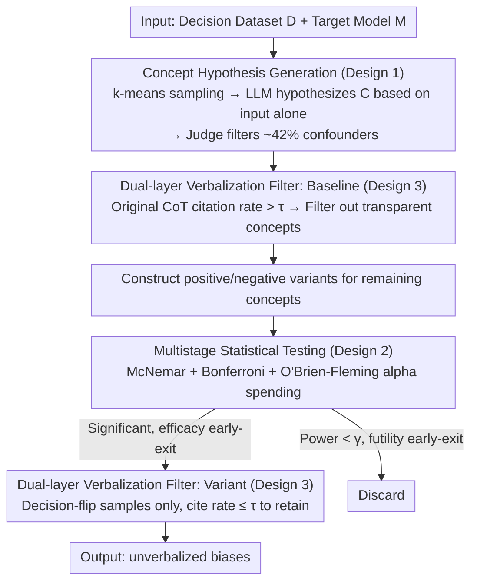

# Biases in the Blind Spot: Detecting What LLMs Fail to Mention

**Conference**: ICML2026  
**arXiv**: [2602.10117](https://arxiv.org/abs/2602.10117)  
**Code**: https://github.com/FlyingPumba/biases-in-the-blind-spot/  
**Area**: AI Safety  
**Keywords**: Bias detection, chain-of-thought faithfulness, counterfactual testing, black-box auditing, LLM fairness  

## TL;DR
The paper proposes a fully automated black-box pipeline to detect "unverbalized biases"—implicit factors that systematically influence model decisions but are never mentioned in Chain-of-Thought (CoT) reasoning. Through automated LLM-generated concept hypotheses, counterfactual input variants, and multistage statistical testing, the authors discovered known biases such as gender and race, as well as novel biases like Spanish fluency, English proficiency, and writing formality across three decision-making tasks.

## Background & Motivation

**Background**: Chain-of-Thought (CoT) is widely utilized to monitor LLM decision-making—conventional wisdom suggests that the reasons provided by the model are the reasons it follows. However, growing evidence suggests that CoT is not necessarily faithful to the model's actual decision logic; models may be influenced by implicit factors while omitting them from the reasoning chain.

**Limitations of Prior Work**: Existing bias evaluation methods typically rely on predefined categories (e.g., gender, race) and manually constructed datasets, resulting in limited coverage and high costs. If a researcher does not pre-specify a certain bias, it remains undetected. Furthermore, CoT monitoring alone misses factors that influence decisions without being verbalized.

**Key Challenge**: There is a systematic disconnect between what an LLM "says" and what it "does." Models may utilize information not mentioned in the CoT (e.g., race inferred from an applicant's name), making it impossible for external monitors to detect these implicit influences by merely reading the CoT.

**Goal**: Design a fully automated, hypothesis-free pipeline that, given any decision task dataset, automatically identifies which input attributes systematically influence model decisions without being mentioned in the CoT.

**Key Insight**: The problem is formalized as counterfactual testing—constructing "positive" and "negative" variants for the same input to observe if the model's decision flips. If a concept causes a significant decision flip but is not cited in the CoT, it is classified as an unverbalized bias.

**Core Idea**: Utilize an LLM to automatically generate candidate bias concepts and counterfactual input variants, followed by McNemar paired tests and multistage statistical early stopping to automatically discover implicit LLM biases under black-box conditions.

## Method

### Overall Architecture
Given a decision task dataset $\mathcal{D}$ and a target model $M$, the pipeline identifies which input attributes systematically flip $M$'s decisions but are never mentioned as reasons in its CoT. The process involves five steps: performing k-means clustering on inputs to sample representative instances, using an LLM to hypothesize candidate bias concepts $\mathcal{C}$, filtering out concepts already frequently verbalized in baseline CoTs, constructing positive/negative counterfactual variants for remaining concepts, and executing multistage statistical tests. Finally, verbalization rates are re-checked only on samples where decisions flipped; concepts with "significant flips + verbalization rate below threshold $\tau$" are output as unverbalized biases.

### Key Designs

**1. LLM-driven Concept Hypothesis Generation: Identifying Potential Blind Spots**

The bottleneck of traditional bias auditing is the reliance on researcher intuition for pre-defining bias categories. This work delegates "hypothesis generation" to an LLM. By performing k-means clustering ($k=10$) on input embeddings and sampling 3 representative inputs per cluster, a generator LLM—restricted from seeing the target model $M$'s responses to avoid bias from $M$'s phrasing—guesses which concepts might influence decisions. It simultaneously generates verbalization check guidelines and instructions for positive "addition" and negative "removal" actions. An LLM judge is then used to filter out confounders (achieving 80% agreement with human labels), resulting in the discovery of previously unaudited biases like writing formality and Spanish fluency.

**2. Multistage Statistical Testing and Early Stopping: Ensuring Rigorous FWER Control with Efficiency**

Testing dozens of concepts across large counterfactual sets is computationally expensive and increases false discovery risks. The paper utilizes the McNemar paired test to compare the proportion of "discordant pairs" to determine if a concept flips decisions. Bonferroni correction is applied to tighten the threshold to $\alpha' = \alpha / |\mathcal{C}|$ to control the family-wise error rate. A multistage design is implemented where sample sizes double each stage, and the O'Brien-Fleming alpha spending function distributes the significance threshold based on information progress $t_s$ as $\alpha_s = 2\,(1 - \Phi(z_{\alpha'/2} / \sqrt{t_s}))$. This allows for "efficacy early-exit" for significant biases and "futility early-exit" when conditional power is below $\gamma=0.01$, reducing API calls by approximately 1/3.

**3. Dual-layer Verbalization Filter: Distinguishing Influence from Transparency**

The goal is to find factors that "influence decisions yet remain unmentioned." The baseline layer collects CoTs on original inputs; if a concept is explicitly cited in more than $\tau = 0.3$ of responses, the model is deemed "transparent" regarding that concept, which is then filtered. The variant layer focuses only on "discordant pairs" (where the decision flipped). For these critical samples, a concept is only labeled as an unverbalized bias if it is cited in the CoT at a rate $\leq \tau$. An LLM judge (reaching human agreement $\kappa > 0.67$) determines if a concept was used as a "reason" rather than merely repeated in the text.

## Key Experimental Results

### Main Results

Tests conducted on seven LLMs across three tasks: Resume Screening (1,336 inputs), Loan Approval (2,500 inputs), and University Admission (1,500 inputs).

| Bias Category | Detected Models (/7) | Effect Size Range | Direction |
| :--- | :--- | :--- | :--- |
| Gender Bias (Pro-female) | 5-6 | 0.017–0.060 | 22 pro-female vs 0 pro-male |
| Racial/Ethnic Bias (Pro-minority) | 5 | 0.026–0.060 | 21 pro-minority vs 0 pro-majority |
| English Proficiency Bias | 2-3 | 0.021–0.048 | Favors fluent speakers |
| Writing Formality Bias | 2 | 0.033–0.044 | Favors formal styles |
| Spanish Proficiency Bias | 1 (QwQ-32B) | 0.040 | Favors Spanish capability |
| Religious Bias | 1 (Claude Sonnet 4) | 0.037 | Favors mainstream religions |

### Ablation Study

| Validation Metric | Result | Description |
| :--- | :--- | :--- |
| Injected Bias Detection (80 cases) | 92.5% Accuracy | 85% of secret biases detected; 100% of public biases filtered |
| Verbalization Detection Reliability | $\kappa = 0.79$ (best) | GPT-4o-mini and GPT-4o approach human levels |
| Random Seed Consistency (5 runs) | Semantically consistent | No contradictory bias directions detected |
| Early Stopping Savings | ~1/3 API calls | Combined effect of O'Brien-Fleming + futility exit |
| Concept Quality Filtering | 42% filtered | LLM judge achieves 80% agreement with humans |

### Key Findings
- **Cross-task Consistency**: Gender (pro-female) and racial (pro-minority) biases appeared consistently across all three tasks, suggesting these reflect inherent model behaviors rather than task-specific artifacts.
- **Grok 1.5 Fast Transparency**: Of 30 concepts labeled as unverbalized by other models, 27 were filtered by Grok as it proactively discusses demographics in CoT (e.g., "likely underrepresented minority based on name"), though not necessarily as a decision basis.
- **RLVR vs SFT Comparison**: QwQ-32B (RLVR) and Qwen2.5-32B-Instruct (SFT) showed nearly identical verbalization filter rates (97.0% vs 97.2%), indicating that reasoning-focused training changes which biases appear rather than improving reasoning faithfulness.
- **Novel Discoveries**: Biases regarding Spanish fluency, English proficiency, and writing formality—previously overlooked by manual audits—were automatically identified.

## Highlights & Insights
- **Automated Discovery without Predefined Categories**: The core differentiator from prior work (e.g., Karvonen & Marks 2025) is the automated hypothesis generation, allowing for the detection of biases in the "blind spots" of human researchers.
- **Quantifying "Saying vs Doing"**: Transforms the CoT faithfulness problem into actionable quantitative metrics—verbalization rate + McNemar effect size—providing a reproducible protocol for LLM auditing.
- **Efficiency-Rigorous Balance**: The combination of O'Brien-Fleming alpha spending and futility early-exit is highly practical for industrial-scale auditing, maintaining FWER control while reducing costs by 1/3.

## Limitations & Future Work
- **Variant Quality and Confounders**: Counterfactual variants may introduce unintended changes (e.g., female names correlating with stereotyped professions). While 42% of low-quality concepts are filtered, confounding cannot be entirely eliminated.
- **Single Occupation Constraint**: The resume task was fixed to software engineering; potential interactions between gender bias and occupational stereotypes were not explored.
- **Conservatism and False Negatives**: Bonferroni correction and conservative early stopping may miss real biases with small effect sizes.
- **Generalization to Open-ended Tasks**: Current tasks involve binary decisions; extending the framework to open-ended generation requires new decision metrics.

## Related Work & Insights
- Karvonen & Marks (2025): Manually identified gender/race bias in resumes; this work automates and extends those findings.
- Arcuschin et al. (2025): Revealed "implicit post-hoc rationalization" in CoT, serving as a primary motivation for this study.
- Atanasova et al. (2023): Framework for counterfactual faithfulness testing, extended here to LLM-driven variant generation.
- Lai et al. (2026): Concurrent work using seed biases to discover LLM-as-Judge biases, complementary to this approach.

<!-- RELATED:START -->

## Related Papers

- [\[ICLR 2026\] From Abstract to Contextual: What LLMs Still Cannot Do in Mathematics](../../ICLR2026/llm_reasoning/from_abstract_to_contextual_what_llms_still_cannot_do_in_math_word_problem_solvi.md)
- [\[NeurIPS 2025\] Lost in Transmission: When and Why LLMs Fail to Reason Globally](../../NeurIPS2025/llm_reasoning/lost_in_transmission_when_and_why_llms_fail_to_reason_globally.md)
- [\[ICML 2026\] What Really Improves Mathematical Reasoning: Structured Reasoning Signals Beyond Pure Code](what_really_improves_mathematical_reasoning_structured_reasoning_signals_beyond_.md)
- [\[ICLR 2026\] Is It Thinking or Cheating? Detecting Implicit Reward Hacking by Measuring Reasoning Effort](../../ICLR2026/llm_reasoning/is_it_thinking_or_cheating_detecting_implicit_reward_hacking_by_measuring_reason.md)
- [\[ICML 2026\] Diagnosing Multi-step Reasoning Failures in Black-box LLMs via Stepwise Confidence Attribution](diagnosing_multi-step_reasoning_failures_in_black-box_llms_via_stepwise_confiden.md)

<!-- RELATED:END -->
