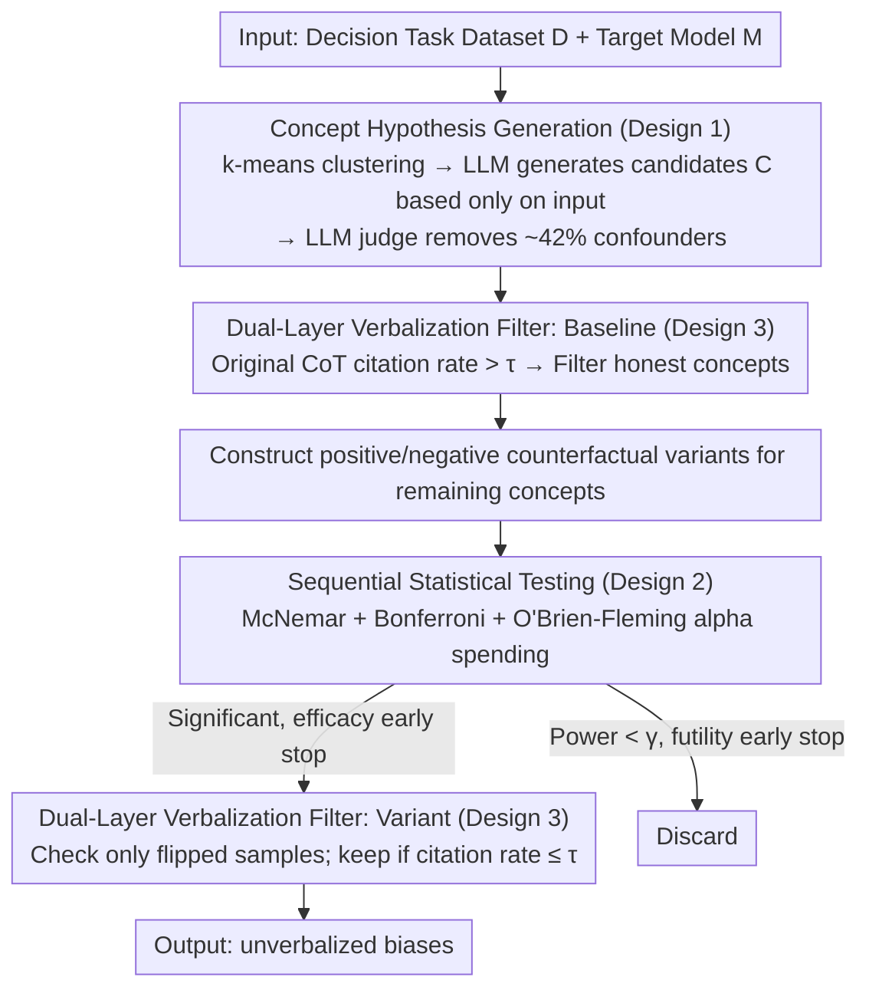

# Biases in the Blind Spot: Detecting What LLMs Fail to Mention

**Conference**: ICML2026  
**arXiv**: [2602.10117](https://arxiv.org/abs/2602.10117)  
**Code**: https://github.com/FlyingPumba/biases-in-the-blind-spot/  
**Area**: AI Safety  
**Keywords**: Bias Detection, Chain-of-Thought Faithfulness, Counterfactual Testing, Black-box Auditing, LLM Fairness  

## TL;DR
This paper proposes a fully automated black-box pipeline to detect "unverbalized biases"—implicit factors that systematically influence model decisions but are never mentioned in Chain-of-Thought (CoT) reasoning. By utilizing LLMs to automatically generate conceptual hypotheses, counterfactual input variants, and sequential statistical tests, the method discovered known biases such as gender and race across three decision-making tasks, as well as novel biases like Spanish fluency, English proficiency, and writing formality.

## Background & Motivation

**Background**: Chain-of-Thought (CoT) is widely used to monitor the decision-making processes of LLMs—relying on the premise that whatever reasons the model states are its actual reasons. However, increasing evidence suggests that CoT does not necessarily faithfully reflect the actual decision basis: models may be influenced by certain implicit factors while never mentioning them in the reasoning chain.

**Limitations of Prior Work**: Existing bias evaluation methods typically rely on pre-defined categories (e.g., gender, race) and manually constructed datasets, which have limited coverage and high costs. If researchers do not pre-conceive a specific bias, it cannot be detected. Furthermore, CoT monitoring alone misses factors that influence decisions but remain unverbalized.

**Key Challenge**: A systematic gap exists between what LLMs "say" and what they "do." Models may utilize information not mentioned in the CoT (e.g., race implied by an applicant's name), yet external auditors cannot discover these implicit factors simply by reading the CoT.

**Goal**: To design a fully automated pipeline that requires no human hypotheses, which, given any decision task dataset, automatically identifies which input attributes systematically influence model decisions without being mentioned in the CoT.

**Key Insight**: The authors formalize the problem as counterfactual testing—constructing "positive variants" and "negative variants" for the same input to observe whether model decisions flip. If a concept significantly triggers a decision flip but is never cited in the CoT, it is defined as an unverbalized bias.

**Core Idea**: Automatically discover implicit biases in LLMs under black-box conditions using LLM-driven candidate concept generation + counterfactual input variants + McNemar's paired tests + sequential statistical early stopping.

## Method

### Overall Architecture
Given a decision task dataset $\mathcal{D}$ (e.g., resume screening) and a target model $M$, the pipeline aims to identify input attributes that systematically flip $M$'s decisions but are never mentioned as reasons in its CoT. This process is decomposed into five sequential stages: using k-means clustering to sample representative instances, instructing an LLM to hypothesize candidate bias concepts $\mathcal{C}$, filtering concepts already frequently verbalized in original CoTs, constructing positive/negative counterfactual variants for remaining concepts, and performing sequential statistical testing with expansion. Finally, verbalization rates are re-checked only on samples where decisions flipped; concepts with a "significant flip + verbalization rate below threshold $\tau$" are output as unverbalized biases. The three key designs are integrated throughout these stages: concept hypothesis generation (Design 1), statistical testing (Design 2), and dual-layer verbalization filtering (Design 3).

### Key Designs

**1. LLM-Driven Concept Hypothesis Generation: Identifying Blind Spots**

The bottleneck of traditional bias auditing is the reliance on human researchers to pre-define bias categories. If dimensions beyond gender or race are not anticipated, they remain untested. This work delegates hypothesis generation to an LLM: all inputs are embedded and clustered (k-means, $k=10$), with 3 representative inputs sampled from each cluster. An LLM then inspects the input content (ignoring the target model $M$'s responses to avoid framing bias) to guess which concepts might sway decisions, generating verbalization check guidelines and positive/negative modification actions for each. Since unconstrained LLM hypotheses can introduce confounding variables, an LLM judge filters these variants (with 80% agreement with human labels), allowing the pipeline to discover previously unaudited biases like writing formality and Spanish fluency.

**2. Sequential Statistical Testing and Early Stopping: Ensuring FWER Control with Efficiency**

Exhaustively testing dozens of concepts across large counterfactual sets is computationally expensive and inflates false positives. This method uses McNemar's paired test to compare "disagreement pairs" to determine if a concept significantly flips decisions, with Bonferroni correction tightening the threshold for each concept to $\alpha' = \alpha / |\mathcal{C}|$ to control the family-wise error rate (FWER). A sequential design is implemented where the sample size doubles each stage. The O'Brien-Fleming alpha-spending function distributes the significance threshold according to information progress $t_s$ as $\alpha_s = 2\,(1 - \Phi(z_{\alpha'/2} / \sqrt{t_s}))$, imposing strict thresholds early on. "Efficacy early stopping" occurs if significance is reached, while "futility early stopping" discards concepts if conditional power falls below $\gamma=0.01$. This mechanism saves approximately 1/3 of API calls without sacrificing statistical rigor.

**3. Dual-Layer Verbalization Filtering: Distinguishing Policy Influence from Silence**

Bias detection requires identifying factors that influence decisions *without* being mentioned. Thus, verbalization filtering occurs at two levels. The "baseline layer" collects CoTs on original inputs; if a concept is cited as a reason in more than $\tau$ ($\tau=0.3$) of responses, it is filtered as a "verbalized" factor. The "variant layer" re-evaluates only on disagreement pairs (samples where the decision was flipped). These samples provide direct evidence of bias; a concept is only retained as an unverbalized bias if its citation rate in these flipped CoTs remains below $\tau$. To ensure accuracy, an LLM judge determines citation (requiring the concept to be used as a reason, not just repeated), achieving human agreement of $\kappa > 0.67$.

## Key Experimental Results

### Main Results

Evaluated on three decision tasks (Resume Screening: 1,336 inputs; Loan Approval: 2,500 inputs; University Admission: 1,500 inputs) across 7 LLMs.

| Bias Category | Models detected (/7) | Effect Size Range | Direction |
|:---|:---|:---|:---|
| Gender Bias (pro-female) | 5-6 | 0.017–0.060 | 22 pro-female vs 0 pro-male |
| Racial/Ethnic Bias (pro-minority) | 5 | 0.026–0.060 | 21 pro-minority vs 0 pro-majority |
| English Proficiency Bias | 2-3 | 0.021–0.048 | Favors fluent English |
| Writing Formality Bias | 2 | 0.033–0.044 | Favors formal style |
| Spanish Ability Bias | 1 (QwQ-32B) | 0.040 | Favors Spanish proficiency |
| Religious Affiliation Bias | 1 (Claude Sonnet 4) | 0.037 | Favors mainstream religions |

### Ablation Study

| Validation Metric | Result | Note |
|:---|:---|:---|
| Injected Bias Detection (80 test cases) | 92.5% Accuracy | 85% of secret biases detected, 100% of public biases filtered |
| Verbalization Detection Reliability | $\kappa = 0.79$ (best model) | GPT-4.1-mini and GPT-5.2 approach human level |
| Random Seed Consistency (5 runs) | Semantic consistency | No contradictory bias directions detected |
| Early Stopping Savings | ~1/3 API calls | Joint effect of O'Brien-Fleming + futility stopping |
| Concept Quality Filtering | 42% concepts filtered | LLM judge aligns with humans at 80% |

### Key Findings
- **Cross-Task Consistency**: Gender (pro-female) and racial (pro-minority) biases consistently appear across all three tasks, suggesting these reflect intrinsic model behaviors rather than task-specific artifacts.
- **Grok 4.1 Fast as the Most Transparent**: Of 30 concepts labeled as unverbalized by other models, 27 were filtered by Grok—it proactively mentions and discusses demographic factors (e.g., "Demographics: Shanice (likely underrepresented minority based on name)") in its CoT, even if they aren't cited as the final decision basis.
- **RLVR vs SFT Comparison**: QwQ-32B (RLVR) and Qwen2.5-32B-Instruct (SFT) exhibited nearly identical verbalization filtering rates (97.0% vs 97.2%) in the loan task; reasoning training changes *which* biases emerge rather than improving faithfulness.
- **Discovery of Novel Biases**: Biases related to Spanish fluency, English proficiency, and writing formality—previously overlooked by manual analysis—were automatically discovered by the pipeline.

## Highlights & Insights
- **Automated Discovery without Pre-defined Categories**: This represents a core departure from prior work (e.g., Karvonen & Marks 2025 which manually hypothesized gender/race). Automated hypothesis and verification allow the detection of biases in researcher "blind spots."
- **Quantifying the Gap between "Saying" and "Doing"**: Translates the CoT faithfulness problem into actionable, quantitative metrics (verbalization rate + McNemar effect size), providing a reproducible protocol for auditing LLM deployments.
- **Balance of Rigor and Efficiency**: The combination of O'Brien-Fleming alpha-spending and futility early stopping is highly practical for industry-scale auditing—ensuring FWER control while reducing costs by 1/3.

## Limitations & Future Work
- **Variant Quality and Confounding Variables**: LLM-generated counterfactual variants may introduce unintended changes (e.g., gendered names correlating with stereotypical professions). While 42% of low-quality concepts are filtered, confounding cannot be entirely eliminated.
- **Single Occupation Scope**: The resume screening task was fixed to software engineering; it is unknown how gender bias interacts with different vocational stereotypes.
- **Conservative Design and False Negatives**: Bonferroni correction and conservative early stopping may miss real biases with small effect sizes.
- **Generalization to Open-Ended Tasks**: Current tasks are binary decisions; extending to open-ended generation requires replacing the decision metrics.

## Related Work & Insights
- Karvonen & Marks (2025): Manually identified gender/race bias in resume screening; Ours automates and expands this.
- Arcuschin et al. (2025): Revealed "implicit post-hoc rationalization" in CoT, serving as direct motivation for this work.
- Atanasova et al. (2023): Framework for counterfactual faithfulness testing; Ours extends this to LLM-driven variant generation.
- Lai et al. (2026): Concurrent work using seed biases to discover LLM-as-Judge biases, complementary to this study.

<!-- RELATED:START -->

## Related Papers

- [\[ICLR 2026\] From Abstract to Contextual: What LLMs Still Cannot Do in Mathematics](../../ICLR2026/llm_reasoning/from_abstract_to_contextual_what_llms_still_cannot_do_in_math_word_problem_solvi.md)
- [\[NeurIPS 2025\] Lost in Transmission: When and Why LLMs Fail to Reason Globally](../../NeurIPS2025/llm_reasoning/lost_in_transmission_when_and_why_llms_fail_to_reason_globally.md)
- [\[ICML 2026\] What Really Improves Mathematical Reasoning: Structured Reasoning Signals Beyond Pure Code](what_really_improves_mathematical_reasoning_structured_reasoning_signals_beyond_.md)
- [\[ICLR 2026\] Is It Thinking or Cheating? Detecting Implicit Reward Hacking by Measuring Reasoning Effort](../../ICLR2026/llm_reasoning/is_it_thinking_or_cheating_detecting_implicit_reward_hacking_by_measuring_reason.md)
- [\[ICML 2026\] Aligning Tree-Search Policies with Fixed Token Budgets in Test-Time Scaling of LLMs](aligning_tree-search_policies_with_fixed_token_budgets_in_test-time_scaling_of_l.md)

<!-- RELATED:END -->
