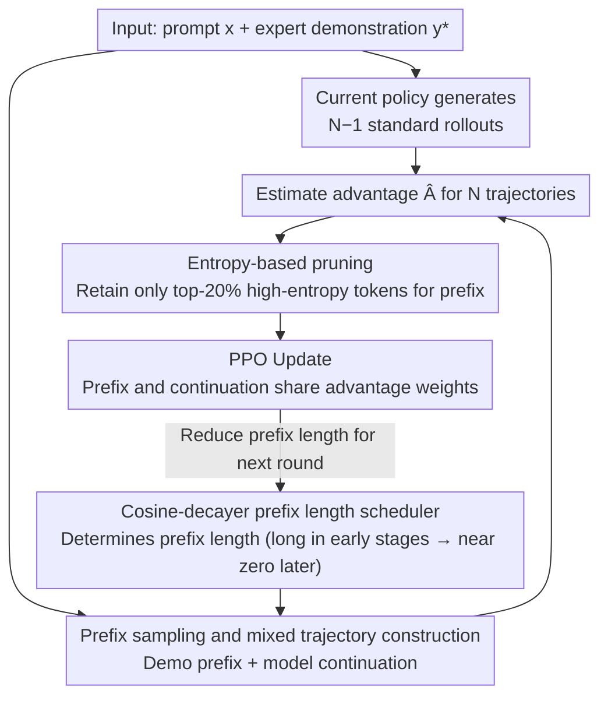

# Blending Supervised and Reinforcement Fine-Tuning with Prefix Sampling

**Conference**: ICML 2026  
**arXiv**: [2507.01679](https://arxiv.org/abs/2507.01679)  
**Code**: None  
**Area**: LLM Reasoning  
**Keywords**: Post-training, Supervised Fine-Tuning, Reinforcement Fine-Tuning, Prefix Sampling, Mathematical Reasoning  

## TL;DR
This paper proposes Prefix-RFT, which constructs mixed trajectories by sampling prefixes from expert demonstrations and concatenating model continuations. This approach injects knowledge guidance from SFT while maintaining the objective-oriented optimization of RFT, significantly outperforming independent SFT, RFT, and existing hybrid methods on mathematical reasoning tasks.

## Background & Motivation

**Background**: LLM post-training primarily follows two paradigms: Supervised Fine-Tuning (SFT) injects knowledge by imitating expert demonstrations, while Reinforcement Fine-Tuning (RFT) improves task performance through trial-and-error exploration and reward signals. In practice, a two-stage pipeline—SFT followed by RFT—is typically adopted.

**Limitations of Prior Work**: SFT is essentially behavior cloning; while it teaches correct problem-solving patterns, it suffers from generalization and robustness issues. RFT directly optimizes task performance but faces sparse learning signals, potential unexpected behaviors like language mixing, and a performance ceiling heavily dependent on the initial policy's capability—recent research even questions if RL can truly break a model's intrinsic capability ceiling.

**Key Challenge**: SFT provides dense supervision but over-constrains the solution space, while RFT encourages exploration but is limited by the current policy's capability. Simple joint training using "RL + SFT Loss" can be counterproductive because demonstration gradients tend to dominate RFT gradients; meanwhile, the two-stage serial pipeline (SFT→RFT) fails to dynamically balance both learning signals during the training process.

**Goal**: Design a unified framework to organically integrate SFT's process supervision with RFT's objective-oriented optimization during the training process, achieving a dynamic balance between knowledge injection and capability enhancement.

**Key Insight**: The authors first establish a unified perspective for SFT and RFT—the gradient updates for both are essentially weighted gradients applied to token log-probabilities, differing only in how weights are assigned. Based on this unified framework, integrating both paradigms naturally requires only designing an appropriate weight distribution.

**Core Idea**: Sample prefixes from expert demonstrations and have the model generate continuations from the prefix positions. These mixed trajectories are combined with standard rollouts for PPO updates, utilizing trajectory-level advantage to automatically regulate the learning intensity of the demonstration data.

## Method

### Overall Architecture
Prefix-RFT aims to leverage both SFT's knowledge guidance and RFT's exploration benefits within a single RFT training session by "embedding" expert demonstrations into rollouts. Given a prompt $x$ and a demonstration $y^*$, the current policy $\pi_{\theta_{\text{old}}}$ generates $N-1$ standard rollouts. The $N$-th trajectory is not generated freely from the start; instead, a prefix $y^*_{<L}$ is taken from the demonstration, and the model continues generating $y_{\geq L}$ from the $L$-th position to form a mixed trajectory $y^{(N)}$, which combines an "expert-provided first half" and a "model-generated second half." These $N$ trajectories are used together for advantage estimation and PPO updates, where prefix tokens and continuation tokens share the same PPO weight $\mathcal{W}_{i,t}^{\text{PPO}} = \mathbb{I}_{\text{clip}}(r_t, \hat{A}_t)\,\hat{A}_t\, r_t$. This process replaces one standard rollout with a mixed trajectory without increasing sampling overhead.

### Key Designs

**1. Prefix Sampling and Mixed Trajectory Construction: Demonstrations as "Starting Hints" rather than "Standard Answers"**

The pain point of pure RFT is low exploration efficiency and an inability to break the initial policy's ceiling, while SFT fixes the entire sequence and over-constrains the solution space. Prefix sampling finds a middle ground: it截取 only the first $L$ tokens of a demonstration as a prefix, and the model continues autonomously. Crucially, the prefix is not supervised by a separate SFT loss but is determined by the advantage of the entire mixed trajectory. If a trajectory with a prefix receives a higher reward, the prefix is positively reinforced; otherwise, it is suppressed. This gives the model "constrained autonomy"—starting in the direction of expert guidance but still allowed to explore continuation paths superior to the demonstration, bypassing SFT rote memorization while providing RFT with a high-quality starting point.

**2. Entropy-based Pruning: Learning only the 20% tokens the model is most uncertain about**

When the offline policy $\pi_{\text{off}}$ differs significantly from the current policy, the probability of prefix tokens under the current model is extremely low, and their gradient magnitude can overwhelm RFT gradients. Without constraints, the training degenerates into simple SFT. The solution is to filter by token entropy: only the top-$k$% (default $k=20$) highest entropy tokens in the prefix participate in updates, while the advantage for other tokens is zeroed out. The rationale is that low-entropy tokens are either already matched by the current policy (little to learn) or high-confidence deviations (forcing weight changes triggers severe overwriting), whereas high-entropy tokens represent the model's highest uncertainty and greatest learning value. Concentrating the gradient budget on these 20% high-entropy tokens prevents demonstration gradients from drowning out RFT signals while precisely absorbing the most useful parts of the demonstration.

**3. Cosine-decayer Prefix Length Scheduler: Smooth transition from "SFT-like long prefixes" to "RFT-like short prefixes"**

The prefix length is determined by $L = \lfloor l \cdot |y^*| \rfloor$, where the ratio $l \sim U(\text{low}, \text{high})$ is sampled. Two issues are addressed: first, uniform sampling would cause the model to systematically encounter demonstration beginnings more often, missing out on concluding/reasoning skills at the end (position bias); second, the model becomes stronger in later training stages and should rely less on demonstrations. The scheduler keeps $low$ close to $high$ in early training (longer prefixes, closer to SFT) and decays it toward zero following a cosine curve (shorter prefixes, closer to RFT). This constructs a curriculum moving from "heavy demonstration dependence" to "autonomous exploration." Observations show prefix advantages gradually shrinking across epochs, validating this curriculum-based transition.

## Key Experimental Results

### Main Results (Qwen2.5-Math-7B)

| Method | AIME24 | AIME25 | AMC | MATH-500 | Minerva | Olympiad | Math Avg |
|------|--------|--------|-----|----------|---------|----------|----------|
| Base | 11.5 | 4.9 | 31.3 | 43.6 | 7.4 | 15.6 | 19.0 |
| SFT | 22.2 | 22.3 | 52.8 | 82.6 | 40.8 | 43.7 | 44.1 |
| RFT | 25.1 | 15.3 | 62.0 | 84.4 | 39.3 | 46.8 | 45.5 |
| SFT+RFT | 25.8 | 23.1 | 62.7 | 87.2 | 39.7 | 50.4 | 48.2 |
| RL w/ SFT Loss | 19.5 | 16.4 | 49.7 | 80.4 | 34.9 | 39.4 | 40.1 |
| LUFFY | 29.4 | 23.1 | 65.6 | 87.6 | 37.5 | 57.2 | 50.1 |
| ReLIFT | 28.2 | 20.1 | 64.9 | 87.4 | 33.8 | 52.5 | 47.8 |
| **Prefix-RFT** | **31.8** | **26.4** | **68.2** | **88.4** | **40.3** | **55.7** | **51.8** |

### Ablation Study (Qwen2.5-Math-1.5B)

| Configuration | AIME24 | AIME25 | AMC | MATH-500 | Avg | Description |
|------|--------|--------|-----|----------|------|------|
| SFT | 11.7 | 13.2 | 37.8 | 70.6 | 31.9 | Pure SFT baseline |
| RFT | 11.8 | 7.7 | 40.2 | 61.8 | 30.0 | Pure RFT baseline |
| Prefix-RFT (full) | 17.7 | 17.1 | 50.5 | 81.4 | 41.1 | Complete method |
| 10% Data (4.5k) | 17.8 | 15.9 | 49.7 | 79.0 | 40.8 | Gain -0.3 only |
| 1% Data (0.45k) | 15.2 | 11.8 | 46.3 | 76.0 | 37.6 | Beats baseline w/ 1% data |
| 1.5B Generator | 15.9 | 12.6 | 47.7 | 79.0 | 39.8 | Weak generator remains effective |
| 32B Generator | 18.1 | 15.3 | 50.9 | 81.2 | 40.6 | Minimal impact from quality |

### Key Findings
- Prefix-RFT comprehensively outperforms all baselines across 6 mathematical reasoning and 3 general reasoning benchmarks, with a math average of 51.8 vs. LUFFY 50.1 and RFT 45.5.
- Pass@2048 experiments indicate that Prefix-RFT is the only method that truly elevates the model's reasoning capability ceiling, showing a 6.67 percentage point increase over the base model on AIME24 and AIME25.
- Top-20% entropy pruning significantly outperforms top-50%/80%, random-20%, or bottom-20%, verifying the necessity of high-entropy token selection.
- The cosine-decayer scheduler outperforms uniform sampling, with training dynamics showing prefix advantages gradually narrowing—demonstrating the model's automatic transition from demo-dependence to autonomous exploration.
- The method is robust to demonstration data quantity and quality: reducing data by 99% only results in a 3.5-point drop, and using demonstrations from a small 1.5B model achieves performance close to using DeepSeek-R1.

## Highlights & Insights
- **Profoundly Simple Unified Perspective**: The structural identity of SFT and RFT gradients (weighted log-prob gradients) provides a solid theoretical foundation. From this viewpoint, the design of Prefix-RFT is natural and elegant—avoiding extra loss functions or complex multi-stage scheduling.
- **Advantage-Driven Adaptive Learning**: The learning intensity for prefixes is automatically regulated by trajectory-level advantages—high advantages for hard problems lead to more learning from demos, while low advantages for easy problems shift focus to self-exploration. This instance-level dynamic balance requires no manual weight tuning.
- **High-Entropy Token Selection**: Using information-theoretic metrics to filter the gradient contribution of offline data is a universal technique for off-policy training stability, transferable to other mixed online/offline learning scenarios.

## Limitations & Future Work
- Experiments primarily focus on verifiable reasoning tasks (Math, Code); performance in open-ended generation and noisy reward scenarios remains unverified.
- When multiple candidate demonstrations are available for each prompt, simple random selection may not be optimal; systematic demonstration selection strategies are left for future work.
- Optimal values for the entropy pruning ratio (20%) and scheduler parameters might vary by task or model; unified hyperparameter search strategies haven't been explored.
- Code generation experiments are preliminary (Qwen3-1.7B); generalization at larger scales and across more domains needs further confirmation.

## Related Work & Insights
- **LUFFY** (Yan et al., 2025): Mixes full offline demonstrations into rollouts for RFT without prefix truncation.
- **UFT** (Liu et al., 2025b): Also samples prefixes but applies SFT loss to prefixes and RFT loss to continuations using static small weights.
- **ReLIFT** (Ma et al., 2025): Alternates between SFT and RFT across multiple stages, with SFT focusing on problems RFT fails to solve.
- Ours possesses advantages in simplicity and effectiveness: unified weights (PPO advantage) replace multi-loss designs, entropy pruning replaces static weights, and cosine decay replaces manual staging—making it more concise and easier to integrate into existing RFT pipelines.

<!-- RELATED:START -->

## Related Papers

- [\[AAAI 2026\] Well Begun, Half Done: Reinforcement Learning with Prefix Optimization for LLM Reasoning](../../AAAI2026/llm_reasoning/well_begun_half_done_reinforcement_learning_with_prefix_optimization_for_llm_rea.md)
- [\[NeurIPS 2025\] VideoRFT: Incentivizing Video Reasoning Capability in MLLMs via Reinforced Fine-Tuning](../../NeurIPS2025/llm_reasoning/videorft_incentivizing_video_reasoning_capability_in_mllms_via_reinforced_fine-t.md)
- [\[ACL 2025\] Enhancing Chain-of-Thought Reasoning with Critical Representation Fine-tuning](../../ACL2025/llm_reasoning/enhancing_chain-of-thought_reasoning_with_critical_representation_fine-tuning.md)
- [\[ACL 2025\] TRACT: Regression-Aware Fine-tuning Meets Chain-of-Thought Reasoning](../../ACL2025/llm_reasoning/tract_regression_cot.md)
- [\[AAAI 2026\] Small Language Models for Efficient Agentic Tool Calling: Outperforming Large Models with Targeted Fine-tuning](../../AAAI2026/llm_reasoning/small_language_models_for_efficient_agentic_tool_calling_outperforming_large_mod.md)

<!-- RELATED:END -->
