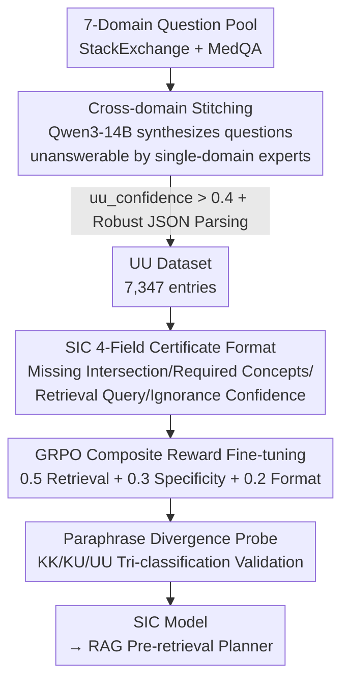

# Calibration of Structured Ignorance Certificates for Diagnosing Unknown Unknowns in Reasoning Models

**Conference**: ICML 2026  
**arXiv**: [2606.08571](https://arxiv.org/abs/2606.08571)  
**Code**: TBD  
**Area**: LLM Reasoning / Uncertainty Calibration  
**Keywords**: Epistemic Uncertainty, Unknown Unknowns, GRPO, Structured Generation, Retrieval Planning

## TL;DR
This paper proposes the **Structured Ignorance Certificate (SIC)**—an output format that mandates models, when encountering cross-domain problems exceeding their knowledge boundaries, to explicitly state via JSON "which two domains' intersection is missing, which concepts are required, and what should be retrieved" instead of hallucinating answers. Through a dataset of 7,347 automatically synthesized "Unknown Unknown" (UU) cross-domain problems and Group Relative Policy Optimization (GRPO) reinforcement fine-tuning, a 14B model learns to stably produce these certificates (99.46% JSON validity, 0.967 concept specificity).

## Background & Motivation

**Background**: A prerequisite for the reliable deployment of Large Language Models (LLMs) is their ability to identify the boundaries of their own knowledge. Existing uncertainty research primarily focuses on **token-level probability calibration** (Kadavath 2022), **verbalized confidence expressions** ("I am 70% sure," Xiong 2024), or **selective prediction/abstention** (Kamath 2020).

**Limitations of Prior Work**: These methods exclusively handle **known unknowns (KU)**—cases where the model has a representation of the problem domain but lacks sufficient confidence, allowing it to provide a low score or opt out. However, they are powerless against truly dangerous failure modes: **unknown unknowns (UU)**. Facing cross-domain problems entirely outside the training distribution, models often fluently fabricate incorrect answers rather than admitting ignorance. Furthermore, "abstention" methods provide only a rejection signal without **actionable information**: they explain neither why they cannot answer nor how to find the answer.

**Key Challenge**: When a problem falls outside the model's representational coverage, the model lacks "self-awareness" signals, and downstream systems (e.g., RAG) receive no structured clues for remediation. Ignorance itself has not been organized into a machine-consumable product.

**Goal**: Transform "ignorance" from a vague excuse into a **structured, actionable, and measurable** output—clearly identifying missing domain intersections, required concept lists, and a retrieval query that could unlock the answer.

**Key Insight**: The authors observe that cross-domain "stitching" problems (e.g., "explaining a biological population dynamic using economic game theory") are natural carriers of unknown unknowns—no single domain expert can answer them independently. Thus, one can: ① automatically synthesize such problems at scale; ② define the "structure of ignorance" using a fixed JSON template; and ③ train the ability to "produce high-quality certificates" as a learnable skill via RL rewards.

**Core Idea**: Replace "hallucinatory answers" with a **JSON certificate** containing four specific fields. Directly train this structured cognitive output into the model using GRPO with a composite reward targeting "retrieval utility + concept specificity + format validity."

## Method

### Overall Architecture
The pipeline addresses how to make a model output a machine-usable ignorance certificate when faced with unanswerable cross-domain queries. It consists of three stages: **Data Generation** (stitching questions from seven domains to create the UU dataset) → **Format Definition & Training** (constraining output with the four-field SIC template and fine-tuning with GRPO composite rewards) → **Verification** (confirming via an independent paraphrase divergence probe that the behavior is truly "cognitively structured"). The SIC template serves as the centerpiece: it is both the scoring object for the reward function during training and the interface consumed directly by downstream RAG systems during inference.

### Key Designs

**1. UU Dataset: Synthesizing "Unanswerable" Problems via Cross-domain Stitching**

To train models to identify unknown unknowns, a large set of UU problems is required, yet such problems are difficult to collect because they do not exist in single-domain corpora. The authors use **cross-domain stitching**: extracting seven domain buckets (Physics, Biology, Engineering, CS, Economics, Medicine, Law) from StackExchange Preferences and MedQA-USMLE. For $\binom{7}{2}=21$ domain pairs $(d_a, d_b)$, a pair of questions $(q_a, q_b)$ is sampled, and Qwen3-14B is prompted to synthesize a new question that "truly requires concepts from both domains to answer," retaining only samples with $\texttt{uu\_confidence} > 0.4$. To scale synthesis, a **multi-stage robust JSON parser** is employed (iterating through `json.loads` → bracket matching → regex fallback → prefix repair), rescuing 7,347 valid samples from 7,404 prompts with a 99.3% success rate. The value lies in transforming "unknown unknown" from an abstract epistemological concept into a mass-producible training signal.

**2. SIC 4-Field Certificate: Formatting Ignorance into Consumable Metadata**

The core of SIC is a fixed JSON template that forces the model to rewrite vague excuses into actionable cognitive metadata. The four fields serve specific roles: `missing_intersection` (natural language description of missing intersections), `required_concepts` (listing concepts needed from each domain, measured by a **Certificate Specificity Score** $\text{CSS} = \min(1.0, |C|/4)$), `retrieval_query` (a targeted search string scored against ground truth concepts via ROUGE-L), and `confidence_of_ignorance` (a scalar $[0,1]$). The key design principle is not just "saying I don't know" but **structuring ignorance for machine consumption**: `retrieval_query` serves as a pre-retrieval query for RAG, and `required_concepts` acts as filtering/reranking criteria. Essentially, SIC repositions the model from an "answerer" to a "retrieval planner."

**3. GRPO Composite Reward: Training "Good Certificate Generation" as a Skill**

The authors use **GRPO** (Group Relative Policy Optimization) to fine-tune Qwen3-14B (4-bit NF4 quantization + LoRA with $r=16, \alpha=32$, 0.43% trainable parameters). The reward function decomposes a "good certificate" into three measurable, weighted components:

$$R(c,r) = 0.5\,r_{\text{retrieval}} + 0.3\,r_{\text{specificity}} + 0.2\,r_{\text{format}}$$

Where $r_{\text{retrieval}} = \mathrm{ROUGE\text{-}L}(r, \texttt{retrieval\_query}(c))$ measures query relevance, $r_{\text{specificity}} = \min(1.0, |\texttt{required\_concepts}(c)|/3)$ measures conceptual depth, and $r_{\text{format}} = \mathbf{1}[\text{valid JSON}]$ is a hard threshold (invalid JSON results in $R=0$). The weights reflect the judgment that **retrieval utility is the most critical actionable attribute**. Training for 500 steps (approx. 9 hours on an A100) shapes structured cognitive output into a stable behavior rather than a fragile prompt-engineered artifact.

**4. Paraphrase Divergence Probe: Independent Behavioral Verification**

To prove that fine-tuning fundamentally altered cognitive behavior (rather than just learning a JSON template), an **independent paraphrase divergence probe** was trained. The core hypothesis is that internal uncertainty manifests as inconsistency across **paraphrases** of the same question. For a question $q$, $K-1=4$ paraphrases are generated. Responses to all $K$ variants are collected, embedded using all-MiniLM-L6-v2, and four scalar features are extracted from the $K \times K$ cosine similarity matrix (mean divergence $\bar{\delta}$, max divergence $\delta_{\max}$, standard deviation $\sigma_s$, and min similarity $s_{\min}$). A logistic regression classifier is then trained on 300 MMLU (KK) + 300 KU + 300 UU samples. This acts as an external judge: if the SIC-tuned model's output is classified as UU by the probe, it confirms the model has shifted toward a "self-aware ignorance" behavioral mode.

### Loss & Training
GRPO effective batch size 8, learning rate $2 \times 10^{-5}$, clipping $\epsilon=0.2$, KL coefficient $\beta=0.04$, 500 steps. LoRA applied to all 7 projection matrices (64.2M parameters). Data generation took ~448 GPU-minutes; training took ~9 hours on a single A100-40GB.

## Key Experimental Results

### Main Results
Evaluated on 735 held-out UU problems. SIC generation quality metrics reached near-optimal levels for JSON validity and specificity, proving the format constraints were reliably learned. The lower SPS (ROUGE-L overlap between retrieval query and ground truth concepts) reflects the inherent difficulty of lexical matching for open-ended conceptual phrasing.

| Metric | Definition | Value |
|--------|------------|-------|
| JSON validity rate | Percentage of valid JSON outputs | 0.9946 |
| Mean SPS (Productivity) | Retrieval query ROUGE-L | 0.1783 |
| Mean CSS (Specificity) | Adequacy of concept enumeration | 0.9667 |
| Mean probe UU prob. | Avg probability assigned to UU by probe | 0.3891 (>0.333 baseline) |

Probe results show that UU samples are the easiest to isolate, while KK (Known-Known) are the hardest, as difficult but answerable MMLU questions also trigger divergent responses similar to UU:

| Category | Precision | Recall | F1 | n |
|----------|-----------|--------|----|---|
| KK (Known-Known) | 0.361 | 0.190 | 0.249 | 300 |
| KU (Known-Unknown) | 0.466 | 0.530 | 0.496 | 300 |
| UU (Unknown-Unknown) | 0.469 | 0.627 | **0.536** | 300 |
| Accuracy | — | — | 0.449 | 900 |

### Ablation Study
Comparison of SIC-Tuned model vs. Base model (LoRA disabled) on 100 UU problems using ROUGE-L against ground truth concepts:

| Configuration | ROUGE-L | Δ | % Improved Samples | Note |
|---------------|---------|---|--------------------|------|
| Base Qwen3-14B | 0.0421 | — | — | Base model already outputs some relevant concept terms |
| SIC-Tuned | 0.0436 | +0.0015 | 27.0% | 3.6% relative gain; positive deltas reach +0.025 |

### Key Findings
- **Format and specificity are mastered perfectly** (99.46% / 0.967), showing GRPO is stable for "hard constraint" objectives. CSS saturates at $|C| \ge 4$, meaning the model habitually lists at least 4 concepts.
- **Low SPS is an inherent task difficulty**, not failure: lexical overlap between queries and open concepts is naturally limited. Medical domain pairs show consistently lower SPS due to highly specific clinical terminology.
- **Asymmetric fine-tuning gains**: Positive improvements (up to +0.025) are steeper and more frequent than regressions, indicating SIC tuning is beneficial across diverse cross-domain queries.
- **Probe accuracy (44.9%)** is above the 33.3% random baseline but limited by the KK/KU boundary overlap in divergence features.

## Highlights & Insights
- **Productizing Ignorance**: The most significant insight is reframing a failure mode (hallucination) as a designed output contract—not just blocking hallucinations, but reshaping "I don't know" into actionable retrieval planning signals for downstream RAG.
- **Cross-domain Stitching as a UU Generator**: UU data is naturally scarce; using "two single-domain questions to create one that no single expert can answer" bypasses this scarcity. This approach is transferable to any scenario requiring out-of-distribution yet semantically plausible samples.
- **Paraphrase Divergence as a Probe Feature**: Using response inconsistency across paraphrases as a proxy for epistemic uncertainty is closer to "behavioral" uncertainty than token probabilities and does not require logit access.
- **Composite Rewards for Abstract Goals**: The weighting of retrieval utility, specificity, and format provides a reusable template for RL-ifying fuzzy objectives like "good certificates."

## Limitations & Future Work
- **Limited Probe Precision (44.9%)**: The KK/KU boundary is blurry. Authors suggest incorporating token-level entropy, hidden state geometry, or ensemble-based divergence estimation.
- **Domain Coverage**: Seven predefined domains cannot cover all real-world intersections (e.g., computational biology, AI policy). Expansion to more diverse corpora (arXiv cross-listings, Wiki disambiguation) is needed.
- **Lexical Reward Limitations**: GRPO uses ROUGE-L against concept strings, missing semantic equivalence. Using embedding-based rewards or human-evaluated Reward Models could better align training signals.
- **Single Model Family & Lacking End-to-End Validation**: Experiments were limited to Qwen3-14B. Scaling to other architectures (Llama/Mistral) and integrating SIC into a real RAG pipeline for downstream quality evaluation (e.g., Natural Questions) remains a critical next step.

## Related Work & Insights
- **vs. Confidence Calibration (Kadavath 2022 / Xiong 2024 / Kuhn 2023 Semantic Entropy)**: These calibrate confidence on **answerable** questions (KU). This work focuses on **unanswerable** cross-domain problems, providing structured metadata; they are complementary.
- **vs. Selective Prediction/Abstention (Kamath 2020 / Whitehead 2022)**: Abstention provides only a binary signal; SIC explains **why** and **how to fix it**.
- **vs. RAG (Lewis 2021 / Guu 2020)**: RAG fills knowledge gaps post-retrieval; SIC acts as a **pre-retrieval planner** based on explicit cognitive diagnosis.
- **vs. Representation Probes (Meng 2023 / Marks & Tegmark 2024)**: Traditional probes detect factual truth; this work extends the paradigm to KK/KU/UU classification using behavioral divergence.

## Rating
- Novelty: ⭐⭐⭐⭐ Reframing ignorance as an actionable certificate + stitching for UU data is novel.
- Experimental Thoroughness: ⭐⭐⭐ Metrics are consistent and self-contained, but limited to one model family and small absolute gains.
- Writing Quality: ⭐⭐⭐⭐ Clear motivation, well-defined metrics, and honest about weaknesses.
- Value: ⭐⭐⭐⭐ Provides a trainable, measurable paradigm for "self-aware ignorance," valuable for RAG and reliable deployment.

<!-- RELATED:START -->

## Related Papers

- [\[ICML 2026\] From LLM-Generated Conjectures to Lean Formalizations: Automated Polynomial Inequality Proving via Sum-of-Squares Certificates](from_llm-generated_conjectures_to_lean_formalizations_automated_polynomial_inequ.md)
- [\[ICML 2026\] SmartThinker: Progressive Chain-of-Thought Length Calibration for Efficient Large Language Model Reasoning](smartthinker_progressive_chain-of-thought_length_calibration_for_efficient_large.md)
- [\[ACL 2026\] Calibration-Aware Policy Optimization for Reasoning LLMs](../../ACL2026/llm_reasoning/calibration-aware_policy_optimization_for_reasoning_llms.md)
- [\[ICML 2026\] FloorplanQA: A Benchmark for Spatial Reasoning in LLMs Using Structured Representations](floorplanqa_a_benchmark_for_spatial_reasoning_in_llms_using_structured_represent.md)
- [\[ACL 2026\] RSAT: Structured Attribution Makes Small Language Models Faithful Table Reasoners](../../ACL2026/llm_reasoning/rsat_structured_attribution_makes_small_language_models_faithful_table_reasoners.md)

<!-- RELATED:END -->
