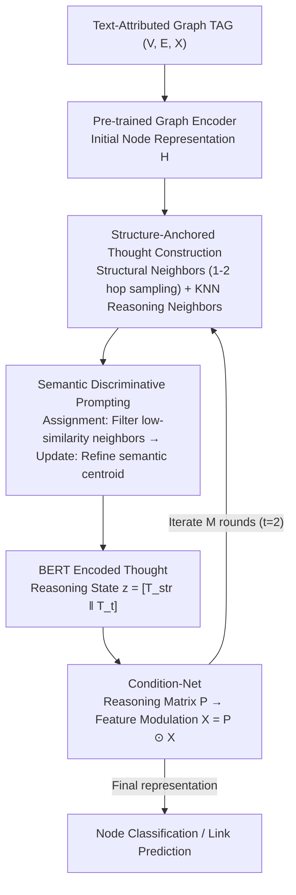

# Clustering as Reasoning: A $k$-Means Interpretation of Chain-of-Thought Graph Learning

**Conference**: ICML 2026  
**arXiv**: [2605.24867](https://arxiv.org/abs/2605.24867)  
**Code**: https://github.com/Uncnbb/KCoT  
**Area**: LLM Reasoning  
**Keywords**: Chain-of-Thought, Graph Learning, $k$-means clustering, Text-Attributed Graphs, semantic-structural alignment  

## TL;DR
This paper reveals the mathematical equivalence between Transformer self-attention and $k$-means clustering. Based on this, it designs the KCoT framework, which explicitly decomposes CoT reasoning into "assignment-update" semantic filtering prompts. It employs Condition-Net to dynamically fuse topological priors with evolving thought representations, consistently surpassing SOTA in node classification and link prediction.

## Background & Motivation

**Background**: Chain-of-Thought (CoT) prompting has been widely utilized to enhance the reasoning capabilities of LLMs on Text-Attributed Graphs (TAGs). Existing approaches include translating graph topology into natural language prompts (HetGCoT), simulating reasoning steps in latent space (GCoT), fine-tuning LLMs with explicit reasoning trajectories (GraphInstruct), and extending multi-agent toolchains to industrial-scale graphs (GraphChain).

**Limitations of Prior Work**: Existing graph CoT paradigms suffer from two fundamental flaws. First, **architectural loose coupling**—LLMs and GNNs are partitioned into independent stages where the LLM serves only as a semantic parser/generator, isolating semantic reasoning from structural propagation and preventing step-by-step semantic-topological interaction. Second, **insufficient interpretability**—existing CoT operates as a "black box," lacking geometric interpretability regarding how natural language reasoning drives node representation optimization and failing to map generated "thoughts" to clear mathematical optimization targets in graph learning.

**Key Challenge**: GNN message passing relies on structural neighborhoods, while LLM semantic reasoning is based on representation similarity, leading to a semantic–structural misalignment. Without explicit alignment, message propagation aggregates semantically inconsistent neighbors, resulting in blurred representations and category confusion.

**Goal**: (1) Provide a theoretically grounded geometric interpretation of CoT reasoning; (2) Design a unified framework to achieve step-by-step semantic-topological interaction.

**Key Insight**: The authors start from a critical theoretical discovery—self-attention layers in Transformers possess a parameterization that makes them functionally equivalent to the assignment-update steps of $k$-means. This implies that CoT reasoning is essentially iterative clustering, where each step of thought updates semantic centroids.

**Core Idea**: Reconstruct CoT prompt design using the $k$-means assignment-update framework, allowing the LLM to act as a semantic filter (assignment) and semantic centroid refiner (update), while injecting topological priors into the evolving reasoning states via Condition-Net.

## Method

### Overall Architecture
KCoT reinterprets "reasoning on a text-attributed graph $\mathcal{G}=(\mathcal{V},\mathcal{E},\mathcal{X})$" as "iterative $k$-means clustering": in each round, the LLM first filters out semantically inconsistent neighbors and then abstracts the retained neighbors into a new "semantic centroid." This thought is then used to modulate node features for the next round. Specifically, a pre-trained graph encoder first obtains initial node representations. In each subsequent round, **Structure-Anchored Thought Construction** retrieves two types of neighbors (structural sampling + KNN semantic neighbors). These are passed to **Semantic Discriminative Prompting** to simulate $k$-means assignment-update and generate thought text. The text is encoded by BERT into reasoning states, which **Condition-Net** translates into reasoning matrices to modulate node features. This iterates for $M$ rounds (with $t=2$ being empirically optimal), and the final round representation is used for node classification or link prediction.

### Key Designs

**1. Structure-Anchored Thought Construction: Topology Prior + Evolving Semantic Dual Channels**

Using only fixed edges on the graph provides insufficient neighbors for clustering when nodes are sparsely or noisily connected; using only semantic KNN neighbors discards topological constraints entirely. KCoT retrieves two classes of neighbors at each round $t$: structural neighbors $\mathcal{N}_i^{\text{str}}$ randomly sampled ($K$ nodes) from 1-hop and 2-hop neighborhoods to maintain explicit geometric priors; and reasoning-induced neighbors $\mathcal{N}_i^{(t)}$ obtained via KNN on current representations $\mathbf{H}^{(t)}$ to capture semantic dynamics evolving with reasoning. Both sets are processed via semantic discriminative prompts and encoded by BERT into $T^{\text{str}}$ and $T^{(t)}$, forming the reasoning state $z^{(t)} = [T^{\text{str}} \| T^{(t)}]$. This ensures semantic reasoning is grounded by structural priors—ablation shows performance drops without either channel, with the removal of KNN neighbors (semantic dynamics) causing a more severe decline.

**2. Semantic Discriminative Prompting: Replacing Rigid $k$-means Distance with LLM Discrimination**

After obtaining candidate neighbors, the system must decide which should be clustered and how to abstract them. Traditional $k$-means relies on Euclidean distance $\|x_i - \mu_j\|^2$ to assign samples, but "distance" between texts in TAGs is subjective and context-dependent. KCoT translates the assignment-update steps into two CoT prompts: the **Assignment Step** prompts the LLM to "identify shared aspects and discard low-similarity nodes," replacing distance thresholds with semantic judgment to sieve out inconsistent neighbors. The **Update Step** prompts the LLM to "state derivative insights in a concise, dense paragraph" for the filtered neighbors, compressing their semantic variance into a new semantic centroid, denoted as $\mathcal{T}_i \leftarrow \operatorname{Prompt}(\mathbf{T}_i, \mathbf{N}_i)$. This is effective because the LLM's ability to refine semantic centroids exceeds rigid mathematical distances—removing this prompt caused the largest performance drop (e.g., Cora link prediction fell from 88.45% to 83.47%), indicating that LLMs require explicit algorithmic guidance rather than just acting as text encoders.

**3. Condition-Net: Translating Linguistic Thoughts into Feature Modulation Matrices**

Since thoughts are in natural language and node features are graph representations, a bridge is needed to inject semantics back into features. Condition-Net acts as a hypernetwork: it takes the reasoning state $z^{(t)}$, passes it through a lightweight MLP to output a reasoning matrix $\mathbf{P}^{(t)} = \text{CondNet}(z^{(t)}; \phi)$, and performs element-wise multiplication to modulate the original features $\mathbf{X}_{t+1} = \mathbf{P}^{(t)} \odot \mathbf{X}$. This serves as the input for the next round's graph encoder. Using a hypernetwork rather than direct concatenation allows for a dynamic balance between fixed topological connections and evolving thoughts, bridging the modality gap between linguistic and graph representation spaces.

### Loss & Training
Pre-training utilizes a contrastive learning framework (with link prediction as the pretext task). Downstream fine-tuning uses cross-entropy for node classification and binary cross-entropy for link prediction. During reasoning iterations, graph encoder parameters are frozen while only the Condition-Net parameters $\phi$ are optimized; thoughts are updated every 100 epochs, with reasoning steps fixed at $t=2$ and neighbor count $K=5$.

## Key Experimental Results

### Main Results (Single Focus Protocol)

| Dataset | Task | KCoT | LLAGA-HO | GraphGPT | GCN | Gain (vs LLAGA-HO) |
|--------|------|------|----------|----------|-----|-------------------|
| Arxiv | Node Classification | **79.25** | 76.66 | 75.11 | 73.72 | +2.59 |
| Products | Node Classification | **86.39** | 84.67 | 84.15 | 80.75 | +1.72 |
| Cora | Node Classification | **90.63** | 89.22 | 88.45 | 88.93 | +1.41 |
| Pubmed | Node Classification | **95.87** | 95.03 | 94.23 | 92.96 | +0.84 |
| Cora | Link Prediction | **88.45** | 86.82 | 80.19 | 81.59 | +1.63 |
| Products | Link Prediction | **96.70** | 95.56 | 94.32 | 93.95 | +1.14 |

All improvements were verified via $t$-test ($p < 0.01$). Comprehensive leadership was maintained under Task Expert and Classification Expert protocols.

### Ablation Study

| Configuration | Cora (NC) | Products (NC) | Cora (LP) | Products (LP) | Description |
|------|-----------|---------------|-----------|----------------|------|
| KCoT (Full) | **90.63** | **86.39** | **88.45** | **96.70** | Complete model |
| w/o $\mathcal{N}^{\text{str}}$ | 89.84 | 85.12 | 87.68 | 96.03 | Remove structural neighbors, -0.8-1.3% |
| w/o $\mathcal{N}^{(t)}$ | 89.02 | 84.17 | 85.32 | 94.47 | Remove KNN neighbors, -1.6-3.1% |
| w/o Prompt | 87.97 | 82.35 | 83.47 | 92.05 | Remove semantic prompts, max drop (2.7-5.0%) |
| w/o CoT ($t=1$) | 89.12 | 82.47 | 82.65 | 94.21 | Single-step reasoning, -1.5-5.8% |

### Key Findings
- **Semantic discriminative prompting is the most critical component**: Its removal led to the largest decline across all tasks, proving LLMs need explicit algorithmic guidance.
- **Iterative CoT outperforms single-step reasoning**: $t=2$ is the optimal number of steps; $t>2$ leads to performance degradation due to over-smoothing and noise overfitting, consistent with $k$-means behavior under excessive iteration.
- **LLM backbones are replaceable**: Vicuna-7B, Llama2-7B, and ChatGPT-4.1 nano all proved effective, with ChatGPT-4.1 nano reaching 91.04% on Cora node classification.
- **t-SNE visualization** confirms that CoT iterations progressively form clearer category clusters, consistent with $k$-means centroid update dynamics.

## Highlights & Insights
- **Transformer-$k$-means equivalence** is the core theoretical contribution: proving that self-attention layers can be parameterized to exactly match the assignment-update steps of soft $k$-means ($\epsilon=0$). This provides the first geometric interpretability framework for CoT.
- **Semantic-structural misalignment contraction theorem** (Theorem 4.4) proves that CoT iterations reduce the misalignment metric $\Delta_t$ at a geometric rate ($\Delta_{t+1} \leq \rho \Delta_t + \varepsilon$), repositioning CoT as an iterative alignment mechanism.
- **Dual-channel neighbor design** is transferable: combining structural sampling for topological constraints with KNN for semantic dynamics offers a generalizable approach for multimodal alignment in graph-text tasks.

## Limitations & Future Work
- Reasoning depth $t$ is limited by GNN over-smoothing; performance drops at $t>2$, restricting deeper reasoning chains.
- Time complexity $|\mathcal{V}| \cdot C_{\text{LLM}}$ is high for large-scale graphs (e.g., Products with 2.45M nodes) due to LLM text generation and BERT encoding.
- Experiments focus on citation networks and e-commerce; validation on heterogeneous graphs like social networks or knowledge graphs is needed.
- Element-wise modulation in Condition-Net ($\mathbf{P}^{(t)} \odot \mathbf{X}$) may be less expressive than attention mechanisms.
- Future work could integrate over-squashing solutions and design adaptive reasoning steps based on local structural complexity.

## Related Work & Insights
- **LLAGA** (Chen et al., 2024a): A projector-based Graph-LLM alignment scheme; KCoT inherits its baselines and experimental settings.
- **GraphGPT** (Tang et al., 2024): Uses CoT to align text and structure but lacks interpretability; KCoT’s theoretical framework addresses this gap.
- **GCoT** (Yu et al., 2025b): Simulates reasoning in latent space but only for non-textual graphs; KCoT operates directly on TAGs.
- Insight: The $k$-means interpretability framework could be extended to other Transformer applications (e.g., token selection in VLMs) to design more efficient token pruning strategies via a clustering perspective.

<!-- RELATED:START -->

## Related Papers

- [\[ICLR 2026\] Verifying Chain-of-Thought Reasoning via Its Computational Graph](../../ICLR2026/llm_reasoning/verifying_chain-of-thought_reasoning_via_its_computational_graph.md)
- [\[ICML 2026\] Hidden Error Awareness in Chain-of-Thought Reasoning: The Signal Is Diagnostic, Not Causal](hidden_error_awareness_in_chain-of-thought_reasoning_the_signal_is_diagnostic_no.md)
- [\[ICLR 2026\] DAG-Math: Graph-of-Thought Guided Mathematical Reasoning in LLMs](../../ICLR2026/llm_reasoning/dag-math_graph-of-thought_guided_mathematical_reasoning_in_llms.md)
- [\[ICML 2026\] When the Chain of Thought Knows Better: Failure Modes in Multi-Turn Reasoning Models](when_the_chain_of_thought_knows_better_failure_modes_in_multi-turn_reasoning_mod.md)
- [\[ACL 2026\] Learning to Edit Knowledge via Instruction-based Chain-of-Thought Prompting](../../ACL2026/llm_reasoning/learning_to_edit_knowledge_via_instruction-based_chain-of-thought_prompting.md)

<!-- RELATED:END -->
