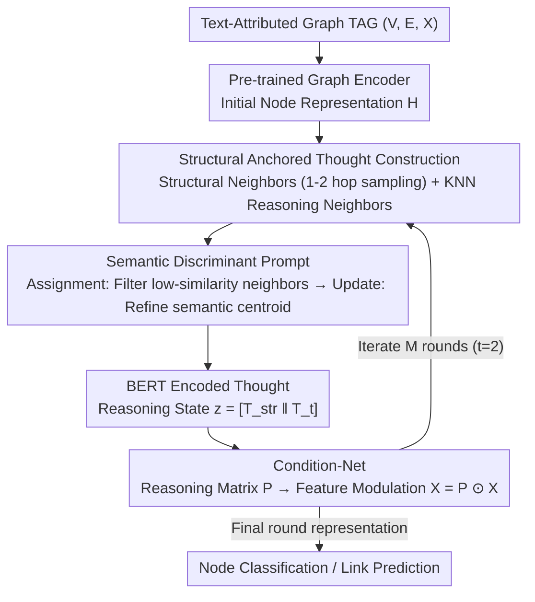

# Clustering as Reasoning: A $k$-Means Interpretation of Chain-of-Thought Graph Learning

**Conference**: ICML 2026  
**arXiv**: [2605.24867](https://arxiv.org/abs/2605.24867)  
**Code**: https://github.com/Uncnbb/KCoT  
**Area**: LLM Reasoning  
**Keywords**: Chain-of-Thought, Graph Learning, $k$-means Clustering, Text-Attributed Graphs, Semantic-Structural Alignment  

## TL;DR
This paper reveals the mathematical equivalence between Transformer self-attention and $k$-means clustering. Based on this, it designs the KCoT framework, which explicitly decomposes CoT reasoning into two-step "assignment-update" semantic filtering prompts. Combined with a Condition-Net to dynamically fuse topological priors with evolving thought representations, KCoT consistently outperforms SOTA in node classification and link prediction.

## Background & Motivation

**Background**: Chain-of-Thought (CoT) prompting has been widely used to enhance the reasoning capabilities of LLMs on Text-Attributed Graphs (TAGs). Existing methods include translating graph topology into natural language prompts (HetGCoT), simulating reasoning steps in latent space (GCoT), fine-tuning LLMs with explicit reasoning trajectories (GraphInstruct), and multi-agent toolchain extensions for industrial-scale graphs (GraphChain).

**Limitations of Prior Work**: Existing graph CoT paradigms suffer from two fundamental flaws. First, **Architectural Loose Coupling**—LLM and GNN are treated as independent processing stages. The LLM serves only as a semantic parser/generator, isolating semantic reasoning from structural propagation and preventing step-by-step semantic-topological interaction. Second, **Insufficient Interpretability**—existing CoT operates as a "black box," lacking geometric interpretability regarding how natural language reasoning drives node representation optimization. It fails to map generated "thoughts" to explicit mathematical optimization objectives in graph learning.

**Key Challenge**: GNN message passing relies on structural neighborhoods, while LLM semantic reasoning is based on representation similarity. This leads to a semantic–structural misalignment. Without explicit alignment, message propagation aggregates semantically inconsistent neighbors, resulting in representation blurring and category confusion.

**Goal**: (1) Provide a theoretically grounded geometric interpretation for CoT reasoning; (2) Design a unified framework for step-by-step semantic-topological interaction.

**Key Insight**: The authors start from a critical theoretical finding: there exists a parameterization of the Transformer self-attention layer that makes it functionally equivalent to the assignment-update steps of $k$-means. This implies that CoT reasoning is essentially iterative clustering, where each step of thought updates a semantic centroid.

**Core Idea**: Reconstruct CoT prompt design using the $k$-means assignment-update framework, allowing the LLM to act as a semantic filter (assignment) and a semantic centroid refiner (update). Meanwhile, topological priors are injected into evolving reasoning states via a Condition-Net.

## Method

### Overall Architecture
KCoT reinterprets "reasoning on a text-attributed graph $\mathcal{G}=(\mathcal{V},\mathcal{E},\mathcal{X})$" as "iterative $k$-means clustering." In each round, the LLM first filters out semantically inconsistent neighbors and then abstracts the retained neighbors into a new "semantic centroid." This thought is then used to modulate node features for the next round. Specifically, a pre-trained graph encoder first obtains initial node representations. For each subsequent round $t$, **Structural Anchored Thought Construction** takes two sets of neighbors (structural sampling + KNN semantic neighbors). These are passed to **Semantic Discriminant Prompts** to simulate $k$-means assignment-update steps, generating thought text. This text is encoded by BERT into reasoning states and translated by a **Condition-Net** into reasoning matrices to modulate node features. This iterates for $M$ rounds (optimally $t=2$), with the final round representations used for node classification or link prediction.

### Key Designs

**1. Structural Anchored Thought Construction: Topological Prior + Evolving Semantic Dual Channels**

Relying solely on fixed edges in a graph leads to insufficient neighbors for sparse or noisily connected nodes. Conversely, using only semantic KNN neighbors discards topological constraints. KCoT retrieves two types of neighbors in each round $t$: structural neighbors $\mathcal{N}_i^{\text{str}}$ randomly sampled ($K$ nodes) from 1-hop and 2-hop neighborhoods to maintain explicit geometric priors; and reasoning-induced neighbors $\mathcal{N}_i^{(t)}$ obtained via KNN on the current representation $\mathbf{H}^{(t)}$ to capture semantic dynamics evolving with reasoning. Both sets are processed through the semantic discriminant prompt and encoded by BERT into $T^{\text{str}}$ and $T^{(t)}$, forming the reasoning state $z^{(t)} = [T^{\text{str}} \| T^{(t)}]$. This ensures semantic reasoning is grounded by structural priors. Ablations show that removing either channel decreases performance, with the removal of KNN neighbors (semantic dynamics) causing a more significant drop.

**2. Semantic Discriminant Prompt: Replacing Rigid $k$-means Distance with LLM Discriminative Ability**

After obtaining candidate neighbors, the model must decide which to cluster and how to abstract them. Traditional $k$-means relies on Euclidean distance $\|x_i - \mu_j\|^2$, but "distance" between texts in TAGs is subjective and context-dependent. KCoT translates the assignment-update steps into two CoT prompt segments for the LLM. The **Assignment Step** prompts the LLM to "identify shared aspects and discard low-similarity nodes," effectively replacing distance thresholds with semantic discrimination to filter out inconsistent neighbors. The **Update Step** prompts the LLM to provide "a concise and dense paragraph stating derived insights" from the remaining neighbors, compressing their semantic variance into a new semantic centroid: $\mathcal{T}_i \leftarrow \operatorname{Prompt}(\mathbf{T}_i, \mathbf{N}_i)$. This works because the LLM’s ability to refine semantic centroids is superior to rigid mathematical distances—removing this prompt led to the largest performance drop in ablations (Cora link prediction fell from 88.45% to 83.47%).

**3. Condition-Net: Translating Linguistic Thoughts into Feature Modulation Matrices**

Thoughts are in natural language, while node features are graph representations. Condition-Net acts as a hypernetwork to bridge this gap. It takes the reasoning state $z^{(t)}$, passes it through a lightweight MLP to output a reasoning matrix $\mathbf{P}^{(t)} = \text{CondNet}(z^{(t)}; \phi)$, and modulates the original features via element-wise multiplication: $\mathbf{X}_{t+1} = \mathbf{P}^{(t)} \odot \mathbf{X}$. This serving as the input for the next-round graph encoder. Using a hypernetwork instead of direct concatenation allows for a dynamic trade-off between fixed topological connections and evolving thoughts, closing the modal gap.

### Loss & Training
Pre-training utilizes a contrastive learning framework (with link prediction as the pretext task). Downstream fine-tuning uses Cross-Entropy for node classification or Binary Cross-Entropy for link prediction. During reasoning iterations, the graph encoder parameters are frozen; only the Condition-Net parameters $\phi$ are optimized. Thoughts are updated every 100 epochs, with reasoning steps fixed at $t=2$ and $K=5$ neighbors.

## Key Experimental Results

### Main Results (Single Focus Protocol)

| Dataset | Task | KCoT | LLAGA-HO | GraphGPT | GCN | Gain (vs LLAGA-HO) |
|--------|------|------|----------|----------|-----|-------------------|
| Arxiv | Node Class. | **79.25** | 76.66 | 75.11 | 73.72 | +2.59 |
| Products | Node Class. | **86.39** | 84.67 | 84.15 | 80.75 | +1.72 |
| Cora | Node Class. | **90.63** | 89.22 | 88.45 | 88.93 | +1.41 |
| Pubmed | Node Class. | **95.87** | 95.03 | 94.23 | 92.96 | +0.84 |
| Cora | Link Pred. | **88.45** | 86.82 | 80.19 | 81.59 | +1.63 |
| Products | Link Pred. | **96.70** | 95.56 | 94.32 | 93.95 | +1.14 |

All improvements are validated via $t$-test ($p < 0.01$). KCoT maintains a comprehensive lead under Task Expert and Classification Expert protocols.

### Ablation Study

| Configuration | Cora (NC) | Products (NC) | Cora (LP) | Products (LP) | Description |
|------|-----------|---------------|-----------|----------------|------|
| KCoT (Full) | **90.63** | **86.39** | **88.45** | **96.70** | Full model |
| w/o $\mathcal{N}^{\text{str}}$ | 89.84 | 85.12 | 87.68 | 96.03 | Remove structural neighbors, drop 0.8-1.3% |
| w/o $\mathcal{N}^{(t)}$ | 89.02 | 84.17 | 85.32 | 94.47 | Remove KNN neighbors, drop 1.6-3.1% |
| w/o Prompt | 87.97 | 82.35 | 83.47 | 92.05 | Remove semantic prompts, largest drop (2.7-5.0%) |
| w/o CoT ($t=1$) | 89.12 | 82.47 | 82.65 | 94.21 | Single-step reasoning, drop 1.5-5.8% |

### Key Findings
- **Semantic discriminant prompts are the most critical components**: Their removal caused the largest decline across all tasks, proving that LLMs require explicit algorithmic guidance rather than just serving as text encoders.
- **Iterative CoT outperforms single-step reasoning**: $t=2$ is the optimal number of reasoning steps; $t > 2$ leads to performance drops due to over-smoothing and noise overfitting, consistent with $k$-means behavior when over-iterated toward outliers.
- **LLM backbones are replaceable**: Vicuna-7B, Llama2-7B, and ChatGPT-4.1 nano were all effective. ChatGPT-4.1 nano reached 91.04% on Cora node classification, suggesting stronger backbones further enhance performance.
- **t-SNE visualization** confirms that CoT iterations gradually form clearer category clusters, aligning with the centroid update dynamics of $k$-means.

## Highlights & Insights
- The **Transformer-$k$-means equivalence** is the core theoretical contribution: proving that a self-attention layer can be parameterized to exactly match soft $k$-means assignment-update steps ($\epsilon=0$). This provides the first geometric interpretability framework for CoT.
- The **Semantic-structural misalignment contraction theorem** (Theorem 4.4) proves that CoT iterations cause the misalignment metric $\Delta_t$ to converge geometrically ($\Delta_{t+1} \leq \rho \Delta_t + \varepsilon$), repositioning CoT as an iterative alignment mechanism.
- The **dual-channel neighbor design** is transferable to other graph-text multimodal tasks: structural sampling maintains topological constraints while KNN search captures semantic dynamics.

## Limitations & Future Work
- The number of reasoning steps $t$ is limited by GNN over-smoothing; performance drops when $t > 2$, restricting deeper reasoning chains.
- Time complexity includes an $|\mathcal{V}| \cdot C_{\text{LLM}}$ term due to per-round LLM text generation and BERT encoding, which is expensive for large-scale graphs (e.g., Products with 2.45 million nodes).
- Experiments mainly cover citation networks and e-commerce; validation on heterogeneous graphs like social networks or knowledge graphs is lacking.
- Element-wise product modulation ($\mathbf{P}^{(t)} \odot \mathbf{X}$) in Condition-Net may be less expressive than attention mechanisms.
- Adaptive reasoning step strategies could be designed to let different nodes determine reasoning depth based on local structural complexity.

## Related Work & Insights
- **LLAGA** (Chen et al., 2024a): A projector-based graph-LLM alignment scheme; KCoT's baseline and experimental settings are inherited from this work.
- **GraphGPT** (Tang et al., 2024): Uses CoT to align text and structural data but lacks interpretability; KCoT's framework fills this gap.
- **GCoT** (Yu et al., 2025b): Simulates reasoning in latent space but target non-textual graphs; KCoT operates directly on TAGs.
- Insight: The $k$-means interpretability framework can be generalized to other Transformer applications (e.g., visual token selection in VLMs) to design more efficient token pruning strategies through a clustering lens.

<!-- RELATED:START -->

## Related Papers

- [\[ICLR 2026\] Verifying Chain-of-Thought Reasoning via Its Computational Graph](../../ICLR2026/llm_reasoning/verifying_chain-of-thought_reasoning_via_its_computational_graph.md)
- [\[ICLR 2026\] DAG-Math: Graph-of-Thought Guided Mathematical Reasoning in LLMs](../../ICLR2026/llm_reasoning/dag-math_graph-of-thought_guided_mathematical_reasoning_in_llms.md)
- [\[ICML 2026\] The Expressive Power of Low Precision Softmax Transformers with (Summarized) Chain-of-Thought](the_expressive_power_of_low_precision_softmax_transformers_with_summarized_chain.md)
- [\[ICML 2026\] How Far Ahead Do LLMs Plan? Uncovering the Latent Horizon in Chain-of-Thought Reasoning](how_far_ahead_do_llms_plan_uncovering_the_latent_horizon_in_chain-of-thought_rea.md)
- [\[ICML 2026\] A Formal Comparison Between Chain of Thought and Latent Thought](a_formal_comparison_between_chain_of_thought_and_latent_thought.md)

<!-- RELATED:END -->
