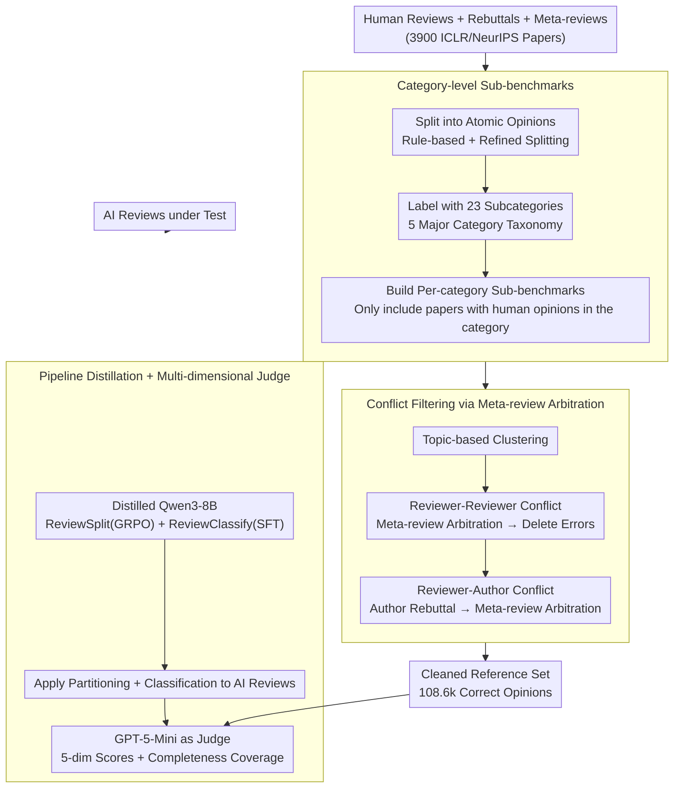

# CoCoReviewBench: A Completeness- and Correctness-Oriented Benchmark for AI Reviewers

**Conference**: ICML 2026  
**arXiv**: [2605.07905](https://arxiv.org/abs/2605.07905)  
**Code**: https://github.com/hexuandeng/CoCoReviewBench (Yes)  
**Area**: LLM Reasoning / AI Reviewing / Evaluation Benchmark  
**Keywords**: AI Reviewer, Completeness, Correctness, Conflict Detection, Meta-Review

## TL;DR
This paper proposes CoCoReviewBench, which transforms human reviews of 3,900 ICLR/NeurIPS papers into a more credible AI reviewing evaluation reference through a two-step process: "category-based sub-benchmark construction + meta-review arbitration of reviewer/author conflicts to filter erroneous opinions." The study finds that current AI reviewers still lag behind humans in correctness and thoroughness, while reasoning models exhibit greater potential.

## Background & Motivation
**Background**: With the surge in paper submissions and the decline in review quality, the research community has explored using LLMs as "AI Reviewers," leading to two evaluation paradigms: LLM-as-a-judge without human references, or using human reviews as gold references via metrics like BLEU/ROUGE/BERTScore or LLM-based matching.

**Limitations of Prior Work**: The first paradigm lacks expert signals and is prone to LLM bias. The second treats human reviews as "ground truth," yet human reviews are **neither complete nor always correct**. A single reviewer covers an average of only 5.10 out of 23 subcategories (9.23 or 40% collectively). Furthermore, 13% of papers show score discrepancies $\ge 4$, 22% have reviewer-reviewer conflicts, and 76% have reviewer-author conflicts.

**Key Challenge**: Using incomplete and occasionally erroneous human reviews as gold references causes systematic biases: (1) valid "unseen" points raised by AI are penalized as irrelevant; (2) AI learns errors from human reviews and is rewarded for them during evaluation.

**Goal**: (a) Construct an evaluation that does not unfairly penalize AI for "incompleteness"; (b) bridge expert signals (other reviewers, author rebuttals, meta-reviews) to filter out errors in human reviews; (c) compare various AI reviewers on this trusted reference to clarify the current gap and direction.

**Key Insight**: Rather than synthesizing reviews "better than humans," it is more effective to **align with the multi-party discussion structure of OpenReview**. Meta-reviews naturally serve as high-level arbitration signals when reviewer opinions conflict or when authors oppose specific points. These constitute **free expert annotations**.

**Core Idea**: Redefine "AI review evaluation" as **category-level matching + human reference alignment after conflict filtering**. The benchmark is split into 5 major categories and 23 subcategories, scoring only when both parties cover the same category. Meta-reviews act as referees to remove incorrect human opinions, followed by a multi-dimensional AI evaluation via LLM-as-a-judge on cleaned references.

## Method

### Overall Architecture
CoCoReviewBench aims to transform "incomplete and occasionally erroneous" human reviews into a credible evaluation reference. The pipeline (Figure 4) follows "partition → filter → distill → score": first, human reviews and corresponding author responses are split into "atomic opinions" and labeled with 23 category tags; then, opinions on the same topic are clustered to perform two rounds of conflict detection (reviewer-reviewer, reviewer-author). Whenever a conflict exists, meta-reviews are used for arbitration, and opinions deemed incorrect are discarded. Next, this partitioning and classification capability is distilled into a Qwen3-8B model (ReviewSplit + ReviewClassify) to process the **AI reviews under evaluation**. Finally, GPT-5-Mini acts as a judge to calculate scores across five dimensions: Correctness, Thoroughness, Grounding, Verifiability, and Clarity, alongside a cross-category Completeness coverage metric.

Regarding data scale, the benchmark covers NeurIPS 2021-2024 and ICLR 2017-2025, with 3,900 papers sampled (300 per year). Each paper is required to have $\ge 3$ independent reviews and $\ge 75\%$ of reviews with author responses, resulting in 14.1k reviews, 134.8k atomic opinions, 115.9k opinion clusters, and 108.6k "correct" reference opinions.

### Key Designs

**1. Category-level Sub-benchmarks: Converting "Reference Missing" into a Skip**

Human reviews involve inherent incompleteness—a single reviewer touches an average of 5.10 out of 23 subcategories, while the collective coverage reaches only 9.23 (40%). When using human reviews as a global gold reference, valid opinions raised by AI that reviewers happened to omit are systematically penalized as off-topic. This method constructs a two-level taxonomy based on NeurIPS 2025 guidelines and ARR forms—comprising 5 major categories (Quality, Clarity, Significance, Originality, Policy) and 23 subcategories. Each paper's opinions are aggregated into a per-paper label set, and **a separate sub-benchmark is constructed for each subcategory** containing only papers where humans provided opinions for that category. During evaluation, scoring occurs only when both AI and humans speak in the same category; categories without human signals are skipped rather than penalized. This eliminates "coverage bias" and distinguishes "lack of breadth" from "lack of depth" for diagnosis.

**2. Conflict Filtering via Meta-review Arbitration: Removing Erroneous Human Opinions with Free Expert Signals**

Skipping missing categories is insufficient, as the retained human references may be incorrect. Instead of relying on a "strong LLM judge" alone, this work utilizes the multi-party discussion structure of OpenReview as **natural expert annotations**. Conflict implies at least one party is wrong, and meta-reviews provide high-level rulings by ACs. Two sources are derived through independent LLM requests (aggregate / detect conflict / adjudicate): for inter-reviewer conflicts, topic-based clusters with $\ge 2$ opinions are checked for contradictions, and meta-reviews are used to retain the correct (and longest) opinion; for reviewer-author conflicts, reviewer opinions and author responses are treated as a pair, identified for explicit opposition, and ruled on by the meta-review. Erroneous opinions are removed from the reference set. Though imperfect (averaging 3.24/5 on strong-conflict papers), this signal is more reliable than raw reviews and effectively filters errors in 22% and 76% of papers, respectively.

**3. Pipeline Distillation + Multi-dimensional Judge: Making Evaluation Efficient and Granular**

Processing human reviews is a one-time cost, but evaluating AI reviews requires repeated runs. Distilling the splitting and classification abilities into an 8B model reduces costs: ReviewSplit is trained on Qwen3-8B using GRPO with 32 trajectories per sample, using the Omega Index for clustering accuracy. The reward is:

$$R = \max\!\left(0.5,\ \text{OmegaIndex} + \mathbb{1}(\text{Correct Format})\right)$$

ReviewClassify is trained via SFT. The 8B model achieves 87.09% accuracy on human verification. The judge defines 5 dimensions (1-5 scale): Correctness (alignment with cleaned human opinions), Thoroughness (depth of coverage), Grounding (contextual citations), Verifiability (checkability), and Clarity (writing quality). Additionally, $\text{Completeness} = \dfrac{\text{Subcategories covered by AI}}{\text{Subcategories covered by all human reviewers}} \times 100$.

### Loss & Training
Two components are trained in two stages: ReviewSplit uses GRPO for segmenting sentences to align 0/1 judgements with the Omega Index; ReviewClassify uses SFT to map atomic opinions to the 23 subcategories. Each step of the pipeline utilizes 6 strong LLMs for leave-one-out consistency verification to ensure high-quality final labels.

## Key Experimental Results

### Main Results
Testing 18 models on a random sample of 1,300 papers. Numbers represent the delta compared to human references (+/-):

| Model Group | Old Metrics BLEU/ROUGE/BERT | Correct./Thoro. | Ground./Verify. | Clarity | Complete. |
| :--- | :--- | :--- | :--- | :--- | :--- |
| GPT-5.2 (Strong Closed) | -1.93/-5.06/-1.31 | +0.36/+0.64 | +0.92/+0.78 | +0.32 | 84.49 |
| Gemini-3-Pro | -0.95/-1.12/-0.36 | +0.14/+0.16 | +0.69/+0.34 | +0.42 | 67.69 |
| QwQ-32B (Reasoning) | -1.38/-2.44/-0.63 | -0.01/+0.13 | +0.58/+0.02 | +0.27 | 79.83 |
| Qwen3-8B (No-think) | -0.87/-0.53/-1.10 | -0.28/-0.10 | -0.40/-0.58 | -0.07 | 72.28 |
| CycleReviewer-70B (Spec. Non-reasoning) | -0.78/+0.34/-1.11 | -0.15/-0.22 | -0.55/-0.48 | +0.48 | 50.89 |
| DeepReviewer-14B (Spec. Reasoning) | -1.11/-3.53/-0.09 | -0.17/+0.28 | +0.41/+0.41 | +0.17 | 81.98 |
| Human Baseline (leave-one-out) | 2.73/17.54/84.04 | 3.55/2.37 | 3.75/2.38 | 4.15 | 55.66 |

Counter-intuitively, **non-reasoning small models and specialized AI reviewers outperform GPT-5/Gemini-3 on old metrics**, suggesting BLEU/ROUGE rewards "surface-level stylistic mimicry" rather than correctness. The new LLM judge scores align more closely with model power.

### Ablation Study

| Config | Key Finding | Description |
| :--- | :--- | :--- |
| Strong-conflict papers ($\ge 5$ errors) vs. weak-conflict | Meta-review avg. 3.24 vs 2.94 | Confirmed that meta-reviews provide valid signals when conflicts are significant. |
| Human 50-paper verification | Classify 85.45% / Cluster 93.41% | The overall pipeline is reliable. |
| 6 strong LLM leave-one-out | High cross-model consistency | Noise in steps is controlled by selecting the highest-agreement output. |
| Direct inclusion of "incorrect" opinions | AI-Human Correctness gap narrowed | Proved that AI risks "learning bad habits" by fitting erroneous human opinions. |

### Key Findings
- Reasoning models match or exceed humans in **Grounding / Verifiability**, suggesting LRM reasoning capabilities translate into more verifiable reviews. **Recommendation: Future AI reviewing should prioritize reasoning models**.
- **AI reviews are "wide but shallow"**: Coverage (Completeness) often exceeds single reviewers but remains below the collective, while depth (Thoroughness) shows no significant improvement.
- **Hallucination signals**: Models generate small amounts of figure-related comments (<0.05/paper) despite text-only input.
- **Category Profile**: AI performs well in "Quality" (experiments/comparisons) but is weakest in "Clarity" and "Policy."

## Highlights & Insights
- **Decoupling "Reference Missing" from "Reference Erroneous"**: Category-level evaluation addresses the former, and conflict-based filtering addresses the latter.
- **Meta-reviews as free expert supervision**: This is the first systematic use of meta-reviews as "high-level judges" for error detection in benchmarking.
- **Pipeline distillation for industrialization**: Distilling the pipeline into 8B models makes long-term evaluation affordable.
- **Multi-dimensional clarity**: Granular diagnostics reveal that high clarity does not equate to high correctness.

## Limitations & Future Work
- Conflict-based filtering only catches **explicit disagreements**; implicit errors or soft-toned rebuttals may be missed.
- The evaluation remains **dependent on a strong LLM-judge** (GPT-5-Mini), which introduces potential "LLM-eval-LLM" circularity.
- The 23-category taxonomy based on NeurIPS/ARR may lack granularity for specialized fields like computer vision or theory.

## Related Work & Insights
- **vs PeerRead / NLPeer / ReviewMT**: These lack atomic opinions, category labels, or conflict/error identifiers.
- **vs RevUtil**: RevUtil uses categories but lacks rebuttal/meta-review conflict signals.
- **vs Specialized AI Reviewers**: Specialized models mimic human style but lag behind general LLMs in reasoning-based correctness.

## Rating
- Novelty: ⭐⭐⭐⭐ Utilizing meta-reviews as conflict signals combined with category-level skips is a solid, well-reasoned innovation.
- Experimental Thoroughness: ⭐⭐⭐⭐⭐ 3,900 papers, 18 models, human verification, and multi-dimensional analysis provide a very complete evidence chain.
- Writing Quality: ⭐⭐⭐⭐ The structure is clean, though terms like Grounding and Verifiability are similar enough to require close reading.
- Value: ⭐⭐⭐⭐⭐ Provides an industrializable benchmark and clear direction (reasoning models > non-reasoning) for the field.

<!-- RELATED:START -->

## Related Papers

- [\[ICML 2026\] FloorplanQA: A Benchmark for Spatial Reasoning in LLMs Using Structured Representations](floorplanqa_a_benchmark_for_spatial_reasoning_in_llms_using_structured_represent.md)
- [\[ACL 2026\] LLM Reasoning as Trajectories: Step-Specific Representation Geometry and Correctness Signals](../../ACL2026/llm_reasoning/llm_reasoning_as_trajectories_step-specific_representation_geometry_and_correctn.md)
- [\[ICML 2026\] ToolMATH: A Math Tool Benchmark for Realistic Long-Horizon Multi-Tool Reasoning](toolmath_a_math_tool_benchmark_for_realistic_long-horizon_multi-tool_reasoning.md)
- [\[ACL 2026\] CoAct: Co-Active LLM Preference Learning with Human-AI Synergy](../../ACL2026/llm_reasoning/coact_co-active_llm_preference_learning_with_human-ai_synergy.md)
- [\[ICLR 2026\] On The Fragility of Benchmark Contamination Detection in Reasoning Models](../../ICLR2026/llm_reasoning/on_the_fragility_of_benchmark_contamination_detection_in_reasoning_models.md)

<!-- RELATED:END -->
