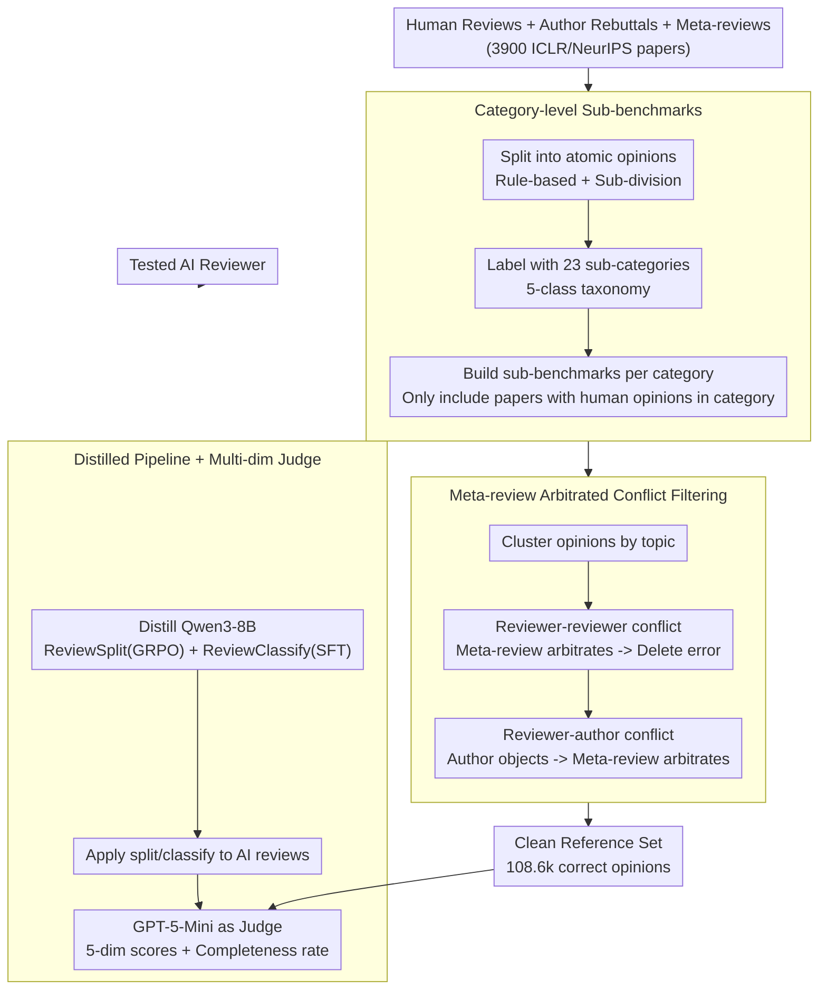

# CoCoReviewBench: A Completeness- and Correctness-Oriented Benchmark for AI Reviewers

**Conference**: ICML 2026  
**arXiv**: [2605.07905](https://arxiv.org/abs/2605.07905)  
**Code**: https://github.com/hexuandeng/CoCoReviewBench (Present)  
**Area**: LLM Reasoning / AI Reviewing / Evaluation Benchmarking  
**Keywords**: AI Reviewer, Completeness, Correctness, Conflict Detection, Meta-Review

## TL;DR
This paper proposes CoCoReviewBench, which transforms human reviews of 3,900 ICLR/NeurIPS papers into a more credible evaluation reference for AI reviewers through a two-step process: constructing category-based sub-benchmarks and filtering erroneous opinions using meta-review arbitration of reviewer/author conflicts. The study reveals that current AI reviewing still lags behind humans in correctness and thoroughness, while reasoning models demonstrate significantly higher potential.

## Background & Motivation
**Background**: As submission volumes surge and review quality declines, the research community has attempted to use LLMs as "AI Reviewers." Evaluation generally follows two paths: LLM-as-a-judge without human references, or using human reviews as gold references scored via BLEU/ROUGE/BERTScore or LLM matching.

**Limitations of Prior Work**: The first path lacks expert signals and is prone to LLM self-bias. The second path treats human reviews as "ground truth," yet human reviews are often **neither complete nor necessarily correct**. On average, a single reviewer covers only 5.10 out of 23 sub-categories, while the aggregate of all reviewers for a paper covers only 9.23 (40%). Furthermore, 13% of papers exhibit score variances of $\ge 4$, 22% have reviewer-reviewer conflicts, and 76% have reviewer-author conflicts.

**Key Challenge**: Using incomplete and occasionally erroneous human reviews as gold references causes two systematic biases: (1) Valid "unseen" questions from AI are penalized as irrelevant; (2) AI models are rewarded for learning incorrect perspectives present in human reviews.

**Goal**: (a) Construct an evaluation that does not erroneously penalize AI for "incompleteness" in references; (b) Use expert signals (other reviewers, author rebuttals, meta-reviews) to filter erroneous opinions in human reviews; (c) Re-evaluate AI review models on credible references to identify current gaps.

**Key Insight**: Instead of synthesizing "better-than-human" reviews, it is more effective to **leverage the multi-party discussion structure inherent in OpenReview**. When opinions on a topic conflict among reviewers, the meta-review naturally serves as a high-level arbitration signal. Similarly, when an author explicitly refutes an opinion, the meta-review determines who is correct. These serve as **free expert annotations**.

**Core Idea**: Redefine "AI review evaluation" as **category-level matching + human reference alignment after conflict filtering**. The benchmark is split into 23 sub-categories across 5 major categories, scoring only when both parties cover the same category. Meta-reviews act as judges to remove incorrect human opinions, and an LLM-as-a-judge evaluates AI across multiple dimensions on the cleaned references.

## Method

### Overall Architecture
CoCoReviewBench aims to refine "incomplete and occasionally erroneous" human reviews into a credible reference. The pipeline (Figure 4) follows a "Split $\rightarrow$ Filter $\rightarrow$ Distill $\rightarrow$ Score" sequence: First, human reviews and author responses are decomposed into "atomic opinions" and labeled across 23 categories. Opinions on the same topic are clustered, followed by two rounds of conflict detection (reviewer-reviewer and reviewer-author). Conflicts are arbitrated by the meta-review, and erroneous opinions are discarded. This decomposition/classification capability is then distilled into a Qwen3-8B model (ReviewSplit + ReviewClassify) to process the **tested AI reviews**. Finally, GPT-5-Mini acts as a judge to calculate scores across five dimensions: Correctness, Thoroughness, Grounding, Verifiability, and Clarity at the category level, combined with a cross-category Completeness coverage rate.

The benchmark covers NeurIPS 2021-2024 and ICLR 2017-2025. 300 papers are stratified-sampled per year (3,900 total), requiring $\ge 3$ independent reviews and $\ge 75\%$ review-response rates. This results in 14.1k reviews, 134.8k atomic opinions, 115.9k opinion clusters, and 108.6k opinions identified as "correct" references.

### Key Designs

**1. Category-level Sub-benchmarks: Converting "Reference Absence" from Penalty to Skip**
Human reviews are naturally incomplete; a single reviewer covers only 5.10/23 sub-categories. If evaluated against the whole, valid AI opinions not mentioned by a reviewer are penalized. This work builds a two-level taxonomy (5 major categories: Quality, Clarity, Significance, Originality, Policy; 23 sub-categories). Sub-benchmarks are constructed for each category, only including papers where humans provided opinions for that category. AI is scored only when it speaks on a category humans also addressed. Both paper-level (aggregate) and category-level (independent) metrics are reported to decouple "coverage breadth" from "depth."

**2. Meta-review Conflict Filtering: Using Free Expert Signals to Remove Erroneous Human Opinions**
Incorrect human opinions (13% high score variance, etc.) must be removed to prevent AI from being rewarded for mimicking errors. Instead of using a standalone LLM judge, the paper leverages the OpenReview discussion structure as **natural expert annotation**. Three LLM steps (aggregate / detect conflict / adjudicate) are used: for inter-reviewer conflicts, meta-reviews decide the correct party within topic clusters; for reviewer-author conflicts, meta-reviews arbitrate when authors explicitly object. Erroneous opinions are removed from the reference set.

**3. Pipeline Distillation + Multi-dimensional Judge: Making Evaluation Scalable and Diagnostic**
To reduce costs, split and classify capabilities are distilled into an 8B model. ReviewSplit uses GRPO on Qwen3-8B with the reward function:

$$R = \max\!\left(0.5,\ \text{OmegaIndex} + \mathbb{1}(\text{Correct Format})\right)$$

ReviewClassify uses SFT. The distilled 8B model achieves 87.09% accuracy on human-verified分類 classification. GPT-5-Mini then judges five dimensions: Correctness, Thoroughness, Grounding, Verifiability, and Clarity (1-5 scale), alongside $\text{Completeness} = \dfrac{\text{AI Covered Categories}}{\text{Aggregate Human Covered Categories}} \times 100$.

## Key Experimental Results

### Main Results
Testing 18 models on 1,300 papers. Values denote differences relative to human references:

| Model Group | BLEU/ROUGE/BERT | Correct./Thoro. | Ground./Verify. | Clarity | Complete. |
| :--- | :--- | :--- | :--- | :--- | :--- |
| GPT-5.2 (Strong Closed) | -1.93/-5.06/-1.31 | +0.36/+0.64 | +0.92/+0.78 | +0.32 | 84.49 |
| Gemini-3-Pro | -0.95/-1.12/-0.36 | +0.14/+0.16 | +0.69/+0.34 | +0.42 | 67.69 |
| QwQ-32B (Reasoning) | -1.38/-2.44/-0.63 | -0.01/+0.13 | +0.58/+0.02 | +0.27 | 79.83 |
| Qwen3-8B no-think | -0.87/-0.53/-1.10 | -0.28/-0.10 | -0.40/-0.58 | -0.07 | 72.28 |
| CycleReviewer-70B (Spec.)| -0.78/+0.34/-0.11 | -0.15/-0.22 | -0.55/-0.48 | +0.48 | 50.89 |
| DeepReviewer-14B (Reasoning)| -1.11/-3.53/-0.09 | -0.17/+0.28 | +0.41/+0.41 | +0.17 | 81.98 |
| Human Baseline (LOO) | 2.73/17.54/84.04 | 3.55/2.37 | 3.75/2.38 | 4.15 | 55.66 |

**Counter-intuitive Observation**: Under legacy metrics, **non-reasoning small models and specialized reviewers outperform GPT-5/Gemini**, suggesting BLEU/ROUGE rewards "superficial mimicry" rather than correctness. The new LLM judge aligns better with model reasoning capability.

### Ablation Study

| Configuration | Key Finding |
| :--- | :--- |
| Strong-conflict vs. weak-conflict | Meta-review avg. score is higher (3.24 vs. 2.94) in strong conflicts, verifying it as a valid arbitration signal. |
| Human Verification (50 papers) | Pipeline is reliable: 85.5% Classification accuracy / 93.4% Clustering / 81.4% Reviewer conflict detection. |
| Inclusion of "Error Opinions" | AI - Human correctness gap narrows significantly, proving AI models capture human errors when trained on raw reviews. |

### Key Findings
- Reasoning models match or exceed humans in **Grounding / Verifiability**, as chain-of-thought correlates with verifiable citations. **Reasoning models should be the priority for future AI reviewers.**
- **AI Reviewing is "Broad but Shallow"**: AI covers more categories than a single reviewer but offers less depth (thoroughness) within specific categories.
- **Hallucinations**: All models produced rare but persistent opinions on "Figures" despite receiving only text input, showing persistent hallucination risks.

## Highlights & Insights
- **Separation of "Absence" and "Error"**: Category-level sub-benchmarks handle completeness bias, while conflict-based filtering handles correctness bias. This approach is highly transferable to code reviews or dialogue evaluation.
- **Meta-review as Free Supervision**: This is the first systematic use of meta-reviews as high-level "arbitrators" to detect errors, unlocking a new direction for using OpenReview data.
- **8B Distillation for Scalability**: By distilling the pipeline, the cost of evaluating new AI reviews is reduced by an order of magnitude.

## Limitations & Future Work
- Conflict-based filtering only identifies **explicit** disagreements; it misses errors where authors do not respond or are too polite.
- Evaluation still relies on an **LLM-judge (GPT-5-Mini)**, entailing the risk of "LLM judging LLM."
- Taxonomy focus on NeurIPS 2025/ARR might lack granularity for specialized fields like Computer Vision or Theory.
- Future Work: (1) Use identified errors as negative training signals; (2) Use coverage signals to synthesize "complete" human references for data augmentation.

## Related Work & Insights
- **vs. PeerRead/NLPeer**: These provide review text but lack atomic opinions, category labels, and error identification.
- **vs. DeepReviewer/SEA**: Specialized models score high on legacy metrics but are outperformed by general closed LLMs on correctness/grounding, suggesting they overfit to human "style."

## Rating
- Novelty: ⭐⭐⭐⭐ (Meta-review as arbitrator is clever but incremental).
- Experimental Thoroughness: ⭐⭐⭐⭐⭐ (3,900 papers, 18 models, human verification).
- Writing Quality: ⭐⭐⭐⭐ (Structure is clean, though some metric definitions are similar).
- Value: ⭐⭐⭐⭐⭐ (Provides an industrial-grade benchmark and clear "Reasoning > Non-reasoning" direction).

<!-- RELATED:START -->

## Related Papers

- [\[ICML 2026\] FloorplanQA: A Benchmark for Spatial Reasoning in LLMs Using Structured Representations](floorplanqa_a_benchmark_for_spatial_reasoning_in_llms_using_structured_represent.md)
- [\[ICLR 2026\] CORE: Concept-Oriented Reinforcement for Bridging the Definition–Application Gap in Mathematical Reasoning](../../ICLR2026/llm_reasoning/core_concept-oriented_reinforcement_for_bridging_the_definitionapplication_gap_i.md)
- [\[ICML 2026\] ToolMATH: A Math Tool Benchmark for Realistic Long-Horizon Multi-Tool Reasoning](toolmath_a_math_tool_benchmark_for_realistic_long-horizon_multi-tool_reasoning.md)
- [\[ACL 2026\] LLM Reasoning as Trajectories: Step-Specific Representation Geometry and Correctness Signals](../../ACL2026/llm_reasoning/llm_reasoning_as_trajectories_step-specific_representation_geometry_and_correctn.md)
- [\[ACL 2026\] CoAct: Co-Active LLM Preference Learning with Human-AI Synergy](../../ACL2026/llm_reasoning/coact_co-active_llm_preference_learning_with_human-ai_synergy.md)

<!-- RELATED:END -->
