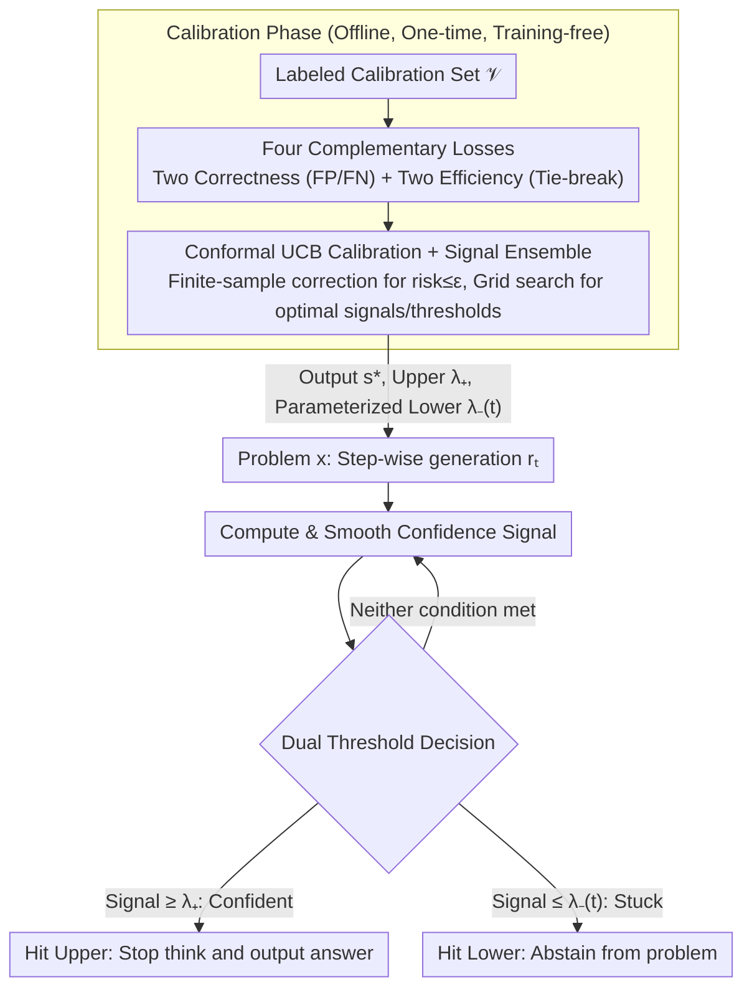

# Conformal Thinking: Risk Control for Reasoning on a Compute Budget

**Conference**: ICML 2026  
**arXiv**: [2602.03814](https://arxiv.org/abs/2602.03814)  
**Code**: https://github.com/xidulu/reasoning_risk_control/  
**Area**: LLM Reasoning / Adaptive Early Stopping; Conformal Prediction; Test-time Scaling  
**Keywords**: Dual-threshold early stopping, conformal risk control, parameterized lower threshold, UCB calibration, Qwen3 / DeepSeek-R1

## TL;DR
This paper reframes the problem of "when a reasoning LLM should stop thinking" from an uninterpretable threshold tuning task into a **user-specified risk tolerance** conformal risk control problem. By employing dual thresholds—an upper threshold to stop when the model is confident (controlling false positives) and a newly proposed **parameterized lower threshold** to force a stop when the model is "stuck" on unsolvable problems (controlling false negatives)—and automatically deriving thresholds via the UCB algorithm on a calibration set, the method achieves significant token savings on AIME / GPQA / MathVision while maintaining accuracy.

## Background & Motivation

**Background**: Reasoning LLMs (e.g., DeepSeek-R1, o1) improve accuracy through test-time scaling: more thinking tokens generally lead to higher accuracy. Adaptive early stopping (Wang et al., Yang et al.) monitors confidence/entropy to terminate the `<think>` phase once a certain threshold is reached.

**Limitations of Prior Work**: (i) Thresholds themselves are **uninterpretable**—values like 0.7 or 0.85 lack direct business meaning and are highly dependent on signal type (entropy/confidence/probe), model, and task, leading to poor transferability. (ii) Existing "stop-when-confident" methods **only use an upper threshold**; on difficult problems (e.g., AIME), models often never reach the confidence threshold, resulting in exhausted budgets and massive token waste. (iii) Current methods monitor confidence at the token level without distinguishing between "already solved" vs. "fundamentally unsolvable" conditions for stopping.

**Key Challenge**: Users are concerned with business metrics like "tolerable error rate," yet existing systems require tuning internal thresholds that lack a direct mapping to error rates. Furthermore, simple "stop-when-confident" logic cannot handle difficult problems where confidence never rises, leading to budget waste.

**Goal**: (i) Recast threshold tuning as a risk control problem, allowing users to directly specify $\epsilon$ (tolerable error rate). (ii) Introduce a lower threshold mechanism for early abstention on unsolvable instances. (iii) Use a distribution-free conformal algorithm (UCB) to find threshold combinations from a calibration set that satisfy $\mathbb{P}(\mathcal{R}\le\epsilon)\ge 1-\delta$.

**Key Insight**: The Early-Exit Neural Network (EENN) community has long used conformal risk control to decide which exit to stop at (Jazbec et al. 2024). Determining "when to stop thinking" in reasoning LLMs is essentially the same problem, where tokens act as the exit points. Applying the EENN conformal framework and adding a lower threshold mechanism for unsolvable cases addresses the core issue.

**Core Idea**: Bind dual thresholds (upper and lower) with the user's risk tolerance $\epsilon$ using conformal UCB. This automates threshold selection, guarantees error rates, and significantly saves tokens—especially when the proportion of difficult problems is high.

## Method

### Overall Architecture
The method monitors confidence signals at each step of the reasoning trajectory and uses dual thresholds to decide when to stop `<think>`. An upper threshold triggers when the model is confident, while a lower threshold forces a stop when the model is "stuck." Instead of manual tuning, both thresholds are automatically derived via a conformal UCB algorithm on a labeled calibration set, ensuring the final error rate does not exceed the user-specified tolerance $\epsilon$ with high probability. This process is training-free and only adds monitoring during inference.

Specifically, given a trajectory $y = \langle\text{think}\rangle r_{1:T}\langle/\text{think}\rangle a$ and step-wise signals $s_t = u(x, r_{1:t})$ (e.g., entropy, confidence, mutual predictability), smoothed signals $\tilde s_t = g(s_{1:t})$ are calculated. The early stopping time is $\tau = \min\{t\ge 1 : \tilde s_t \ge \lambda_+ \;\lor\; \tilde s_t \le \lambda_-\}$ (Eq. 5), where $\lambda_+>\lambda_-$. Hitting the upper threshold indicates a "confident answer," while hitting the lower threshold indicates "abstaining."

### Key Designs

**1. Parameterized Dynamic Lower Threshold: Early Abstention for "Stuck" Problems**

Existing "stop-when-confident" methods only have an upper threshold. On difficult benchmarks like AIME or GPQA, almost all problems fail to reach the confidence threshold, wasting entire token budgets. Ours introduces a dual mechanism: the upper threshold controls false positives (confident but wrong), and the lower threshold controls waste (false negatives, continuing when unsolvable). A static lower threshold is insufficient as it only triggers when confidence regresses. Instead, the lower threshold is defined as a sigmoid function of token usage $\omega_t$: $\lambda_-(t;c,s,l,u) = \dfrac{u-l}{1+e^{-c(\omega_t - sB)}}+l$, where $B$ is the budget, $c$ controls the slope (required rate of confidence growth), $s$ controls the shift (how early to apply pressure), and $l, u$ bound the range. This essentially dictates a "confidence schedule" the model must follow; adjusting $(c, s)$ allows for linear, exponential, logarithmic, or constant shapes, providing the conformal optimizer sufficient expressivity without complexity.

**2. Four Complementary Losses: Decoupling Correctness and Efficiency**

To enable independent UCB calibration, the quality of stopping is decomposed into four $[0, 1]$ losses. Two correctness losses determine feasibility: the upper threshold FP loss $\ell^+ = \mathbb{I}[\tilde s_t\ge\lambda_+]\cdot\mathbb{I}[f_t\ne y^*]$ (stopped confidently but wrong), and the lower threshold FN loss $\ell^- = \frac{\mathbb{I}[\tilde s_t\le\lambda_-]}{T-t+1}\sum_{k=t}^T \mathbb{I}[f_k=y^*]$ (abstained but would have eventually been correct). Two efficiency losses are used to select the cheapest thresholds among valid candidates: $\mathcal{J}^+(t) = \frac{1}{T}\max(0, t-t')$ (excess tokens after getting it right) and $\mathcal{J}^-(t) = \frac{1}{T}\sum_{k\le t}\mathbb{I}[f_k\ne y^*]$ (tokens spent while wrong before stopping). Conformal calibration focuses on ensuring correctness $\le\epsilon$, while efficiency acts as a tie-breaker. The lower threshold $\ell^-$ is **farsighted**, checking the entire range $[t, T]$ to avoid premature stopping on problems that are temporarily incorrect but eventually solved.

**3. Conformal UCB Calibration + Signal Ensemble: Removing Manual Tuning**

Calculating thresholds based solely on empirical risk $\widehat{\text{Risk}}(\lambda;\mathcal{V}) = \frac{1}{N}\sum\ell(\cdot;\lambda)$ is overly optimistic on small calibration sets and violates $\epsilon$ (Fig. 4 shows naive calibration frequently fails). Ours utilizes UCB (Bates 2021) to calculate $\widetilde{\text{Risk}}(\lambda;\mathcal{V}) = \widehat{\text{Risk}} + (\text{finite-sample correction})$, where the correction scales with calibration set size $|\mathcal{V}|$ and $\delta$, guaranteeing $\mathbb{P}(\text{true risk}\le\epsilon)\ge 1-\delta$. Calibration occurs in two steps: first, finding $\hat\lambda_+$ for a fixed $\epsilon^+$, then finding lower threshold parameters $\hat c$ that satisfy $\mathbb{E}[\ell^-\mid\hat\lambda_+]\le\epsilon^-$ while minimizing efficiency loss (Eq. 16). Furthermore, Algorithm 1 performs a grid search across multiple candidate signals $\mathcal{S}$ and threshold grids $\Lambda_s$. Since the optimal signal shifts depending on $\epsilon$, allowing the algorithm to automatically select the signal truly removes the tuning burden from the user.

### Loss & Training
The method is entirely training-free. Threshold and signal selection are performed via a one-time grid search with UCB correction on a calibration set $\mathcal{V}=\{(x_i, y_i^*)\}$. Once $(s^*, \lambda^*)$ are obtained, they are deployed directly. Model coverage includes Qwen3-8B, Qwen3-30B-A3B, DeepSeek-R1-Distill-Qwen-32B, and Qwen3-VL-8B.

## Key Experimental Results

### Main Results

| Experimental Setting | Signal | Key Observation |
| :--- | :--- | :--- |
| Risk Control Verification (Fig. 4) | Multi-signal | Naive calibration frequently violates $\epsilon$; UCB calibration remains $\le\epsilon$ (with prob $1-\delta$). |
| Signal Ensemble (Fig. 5) | 4 Models × Multi-signal | Risk control automatically selects the most efficient signal, outperforming any single signal. |
| Lower Threshold Value (Fig. 6) | Qwen3-8B + confidence | For solvable:unsolvable ratios of 1:1 / 1:3, Lower+Upper significantly saves tokens compared to Upper-only at the same accuracy. |

### Ablation Study

| Configuration | Key Effect | Description |
| :--- | :--- | :--- |
| Upper-only | Exhausts budget on hard problems | Many unsolvable problems never reach the confidence threshold. |
| Lower-only | Only triggers on confidence regression | Static lower thresholds are largely ineffective. |
| **Lower+Upper (dynamic)** | Accuracy stable, tokens reduced | Complementary effect of dual thresholds. |
| Naive Calibration | Frequently violates $\epsilon$ | Empirical risk is too optimistic. |
| UCB Calibration | Always $\le\epsilon$ | Finite-sample correction works. |
| Ensemble of signals | Outperforms any single signal | Risk control automatically finds the optimum. |

### Key Findings
- **Value of lower threshold scales with problem difficulty**: When the ratio of solvable to unsolvable is 3:1, gains are small. At 1:1 or 1:3, the lower threshold is critical—stopping unsolvable problems early is the key to token efficiency.
- **Trigger distribution matches intuition**: In Lower+Upper configurations, solvable problems mostly exit via the upper threshold, while unsolvable problems exit early via the lower threshold.
- **No single signal is universally optimal**: The best signal changes depending on $\epsilon$ (Fig. 1, right), necessitating the ensemble and automatic selection approach.
- **UCB correction is essential**: While the correction might seem "conservative," it ensures the risk bound is not violated, whereas naive calibration fails frequently.
- **Farsighted loss design for lower threshold prevents misjudgment**: Monitoring the entire $[t, T]$ range ensures that the lower threshold triggers only when the problem is truly unlikely to be solved later, rather than just currently incorrect.

## Highlights & Insights
- **Paradigm Shift from Threshold Tuning to Risk Specification**: Engineers no longer need to tune obscure values like 0.7; users can specify a "5% error rate," and the system derives the necessary thresholds. This is a model for interpretable ML deployment interfaces.
- **Lower Threshold as a Neglected Symmetric Mechanism**: While "stop-when-confident" is well-studied, "stop-when-stuck" has been ignored. This paper demonstrates the latter provides greater gains in difficult scenarios.
- **Elegant Dynamic Parameterization**: Using a sigmoid with four parameters (slope, shift, lower, upper) covers linear, exponential, and logarithmic schedules, giving the conformal optimizer expressivity without high dimensionality.
- **Immediate System Compatibility**: It is training-free, requires no changes to weights or decoding, and only adds monitoring at inference, making it highly industrial-friendly.
- **Bridge between Theory and Practice**: Systematically migrating the EENN conformal framework to reasoning LLMs and completing the unsolvable handling is a strong example of aligning existing theory with emerging problems.

## Limitations & Future Work
- **Theoretical Risk of Bound Violations**: The author notes that two-step calibration might technically violate the upper threshold risk bound if the lower threshold is completely broken (mis-abstaining on solvable problems). Though rare, this requires caution in OOD scenarios.
- **Dependency on Labeled Calibration Sets**: UCB requires ground truth for $\mathcal{V}$, making it less directly applicable to unlabeled open domains (e.g., creative writing).
- **Static Calibration vs. Dynamic Distribution**: Calibration is a one-time grid search, but distribution drift (new model versions, new topics) may necessitate re-calibration. Online conformalization is not discussed.
- **Efficiency/Accuracy Trade-off is not Pareto-optimal**: Fig. 1 shows that different methods are Pareto-optimal at different $\epsilon$; this method selects the best for a given $\epsilon$ but does not collapse the trade-off itself.
- **Lack of Comparison with Training-side Compression**: No comparison with methods that explicitly penalize reasoning length during training (e.g., via Reward Shaping).

## Related Work & Insights
- **vs. Wang 2025 / Yang 2025 (Upper-threshold stop-when-confident)**: Those use manual entropy/confidence thresholds; Ours is conformal-calibrated and dual-threshold.
- **vs. Thought Calibration (Wu 2025)**: Also uses risk control but focuses on "stop-when-stable" via linear probes; Ours uses general signals + UCB and explicitly handles unsolvable cases.
- **vs. PAC Reasoning (Zeng 2026)**: They use conformal logic to decide "whether to reason," while Ours decides "how long to reason."
- **vs. EENN conformal risk control (Jazbec 2024)**: Ours inherits the UCB framework but translates "exit points" to "tokens" and adds the lower threshold mechanism.
- **Insight**: The conformal calibration + dual-threshold paradigm can be extended to any cost-aware inference scenario, such as multi-agent debate termination, active learning, or search pruning.

## Rating
- Novelty: ⭐⭐⭐⭐ The dual-threshold + parameterized dynamic lower threshold is a truly novel design.
- Experimental Thoroughness: ⭐⭐⭐⭐ Extensive coverage across 4 models and 4 datasets; validates risk control and lower threshold utility well.
- Writing Quality: ⭐⭐⭐⭐ Clear bridging of conformal theory and reasoning early-exits; physical meanings of the four losses are well-explained.
- Value: ⭐⭐⭐⭐ Deployable, training-free, and provides an interpretable interface; highly practical for cost-sensitive industrial applications.

<!-- RELATED:START -->

## Related Papers

- [\[ICML 2026\] Inference-Time Conformal Reasoning with Valid Factuality Control for Large Language Models](inference-time_conformal_reasoning_with_valid_factuality_control_for_large_langu.md)
- [\[ICML 2026\] Beyond Test-Time Memory: State-Space Optimal Control for LLM Reasoning](beyond_test-time_memory_state-space_optimal_control_for_llm_reasoning.md)
- [\[ICML 2026\] DyCon: Dynamic Reasoning Control via Evolving Difficulty Modeling](dycon_dynamic_reasoning_control_via_evolving_difficulty_modeling.md)
- [\[ICML 2026\] LatentChem: From Textual CoT to Latent Thinking in Chemical Reasoning](latentchem_from_textual_cot_to_latent_thinking_in_chemical_reasoning.md)
- [\[ICML 2026\] Less Diverse, Less Safe: The Indirect But Pervasive Risk of Test-Time Scaling in Large Language Models](less_diverse_less_safe_the_indirect_but_pervasive_risk_of_test-time_scaling_in_l.md)

<!-- RELATED:END -->
