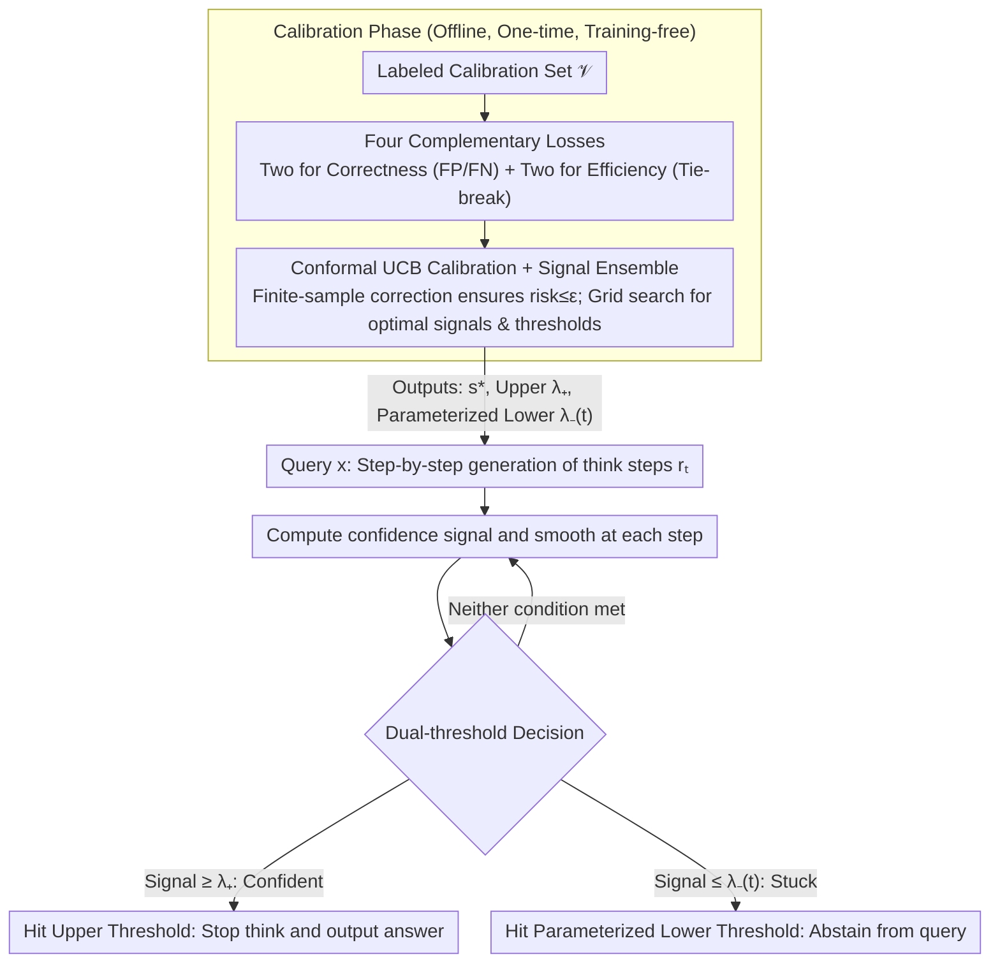

# Conformal Thinking: Risk Control for Reasoning on a Compute Budget

**Conference**: ICML 2026  
**arXiv**: [2602.03814](https://arxiv.org/abs/2602.03814)  
**Code**: https://github.com/xidulu/reasoning_risk_control/  
**Area**: LLM Reasoning / Adaptive Early Stopping; conformal prediction; test-time scaling  
**Keywords**: Dual-threshold early stopping, conformal risk control, parameterized lower threshold, UCB calibration, Qwen3 / DeepSeek-R1

## TL;DR
This paper reframes the question of "when a reasoning LLM should stop thinking" from an uninterpretable threshold tuning problem into a **user-specified risk tolerance** conformal risk control problem. It utilizes two thresholds—an upper threshold to stop when the model is confident (controlling false positives) and a newly proposed **parameterized lower threshold** to force an exit when the model is "stuck" on unsolvable problems (controlling false negatives). By automatically deriving thresholds that satisfy risk constraints via the UCB algorithm from a calibration set, this method achieves significant token savings on AIME, GPQA, and MathVision with almost no drop in accuracy.

## Background & Motivation

**Background**: Reasoning LLMs (such as DeepSeek-R1, o1) improve accuracy through test-time scaling: the more thought tokens generated, the higher the accuracy. Adaptive early stopping methods (e.g., Wang et al., Yang et al.) monitor confidence/entropy and stop the `<think>` phase once a certain threshold is reached.

**Limitations of Prior Work**: (i) Thresholds are **uninterpretable**—0.7 or 0.85 has no direct business meaning, and these numbers depend heavily on signal type (entropy/confidence/probe), model, and task, leading to poor transferability; (ii) Existing "stop-when-confident" methods **only have an upper threshold**, meaning on hard problems (e.g., AIME), the model often never reaches the required confidence, exhausting the budget and wasting tokens; (iii) Existing methods only monitor confidence at the token level without distinguishing between "already correct" vs. "inherently unsolvable" scenarios where stopping is appropriate.

**Key Challenge**: Users care about business metrics like "what error rate can I tolerate," whereas current systems force users to tune internal thresholds with no direct mapping to error rates. Furthermore, simple "stop-when-confident" logic cannot handle cases where confidence never rises, leading to budget waste.

**Goal**: (i) Reformulate threshold tuning as a risk control problem, allowing users to specify $\epsilon$ (tolerable error rate); (ii) Introduce a lower threshold mechanism for early abstention on unsolvable instances; (iii) Use a distribution-free conformal algorithm (UCB) to find a threshold combination from a calibration set that satisfies $\mathbb{P}(\mathcal{R}\le\epsilon)\ge 1-\delta$.

**Key Insight**: The Early Exit Neural Network (EENN) community has long used conformal risk control to decide which exit to stop at (Jazbec et al. 2024); the "when to stop thinking" problem in reasoning LLMs is essentially the same, where the number of exits corresponds to the number of tokens. Applying the EENN conformal framework and adding a lower threshold for unsolvable cases solves this problem.

**Core Idea**: Bind the "dual thresholds (upper + lower)" to the user's risk tolerance $\epsilon$ via conformal UCB, making threshold selection automated, providing error rate guarantees, and yielding significant token savings—especially when the proportion of hard problems is high.

## Method

### Overall Architecture
The method monitors confidence signals at each step of the reasoning trajectory and uses dual thresholds to decide when to stop the `<think>` process: the upper threshold stops when the model is confident, and the lower threshold forces a stop when the model "gets stuck." Both thresholds are automatically derived from a labeled calibration set using the conformal UCB algorithm, ensuring the final error rate does not exceed the user-specified tolerance $\epsilon$ with high probability. The entire process is training-free and only adds monitoring at inference time.

Specifically, given a trajectory $y = \langle\text{think}\rangle r_{1:T}\langle/\text{think}\rangle a$ and a signal $s_t = u(x, r_{1:t})$ at each step (e.g., entropy, confidence, mutual predictability), the smoothed signal is $\tilde s_t = g(s_{1:t})$. The early stopping time is $\tau = \min\{t\ge 1 : \tilde s_t \ge \lambda_+ \;\lor\; \tilde s_t \le \lambda_-\}$ (Eq. 5), where $\lambda_+>\lambda_-$. Hitting the upper threshold indicates a "confident answer," while hitting the lower threshold indicates "abstention."

### Key Designs

**1. Parameterized Dynamic Lower Threshold: Early abstention for being "stuck"**

Existing stop-when-confident methods only use an upper threshold. On hard problems like AIME or GPQA, many queries never reach the confidence threshold, wasting the entire token budget. This paper adds a dual mechanism: an upper threshold for false positives (confident but wrong) and a lower threshold for waste (false negatives—hard problems that won't be solved). However, a static lower threshold only triggers when confidence regresses, which rarely happens. The key innovation is parameterizing the lower threshold as a sigmoid function of token usage $\omega_t$: $\lambda_-(t;c,s,l,u) = \dfrac{u-l}{1+e^{-c(\omega_t - sB)}}+l$, where $B$ is the budget, $c$ controls the slope (required confidence growth rate), $s$ controls the shift (how early to apply pressure), and $l,u$ are bounds. This forces the model to demonstrate confidence growth according to a "schedule"; tuning $(c,s)$ allows the schedule to take various shapes (linear, exponential, etc.), providing the conformal optimizer with sufficient flexibility without parameter explosion.

**2. Four Complementary Losses: Decoupling Correctness and Efficiency**

To enable independent UCB calibration, the quality of stopping is decomposed into four $[0,1]$ losses. Two correctness losses determine validity: the FP loss $\ell^+ = \mathbb{I}[\tilde s_t\ge\lambda_+]\cdot\mathbb{I}[f_t\ne y^*]$ for the upper threshold (stopped confidently but wrong), and the FN loss $\ell^- = \frac{\mathbb{I}[\tilde s_t\le\lambda_-]}{T-t+1}\sum_{k=t}^T \mathbb{I}[f_k=y^*]$ for the lower threshold (abstained, but would have been correct later). Two efficiency losses are used to break ties among valid thresholds: $\mathcal{J}^+(t) = \frac{1}{T}\max(0, t-t')$ (where $t'=\min\{t:f_t=y^*\}$, measuring tokens wasted after being correct) and $\mathcal{J}^-(t) = \frac{1}{T}\sum_{k\le t}\mathbb{I}[f_k\ne y^*]$ (measuring incorrect tokens before stopping). Conformal calibration focuses on ensuring correctness $\le\epsilon$, while efficiency is only for optimization. The FN loss $\ell^-$ is a **farsighted** design—it checks if the query would be correct at *any* point in $[t,T]$, preventing it from prematurely abandoning cases where the intermediate steps are wrong but the final result is correct.

**3. Conformal UCB Calibration + Signal Ensemble: Removing Tuning from the User**

If thresholds were selected by simply minimizing empirical risk $\widehat{\text{Risk}}(\lambda;\mathcal{V}) = \frac{1}{N}\sum\ell(\cdot;\lambda)$, the results would be overly optimistic on small sets, violating $\epsilon$ (as shown in Fig. 4 left). Instead, this paper uses UCB (Bates 2021): $\widetilde{\text{Risk}}(\lambda;\mathcal{V}) = \widehat{\text{Risk}} + (\text{finite-sample correction})$. The correction scales with $|\mathcal{V}|$ and $\delta$, guaranteeing $\mathbb{P}(\text{true risk}\le\epsilon)\ge 1-\delta$. Calibration occurs in two steps: first, solve for $\hat\lambda_+$ using a risk target $\epsilon^+$; then, solve for lower threshold parameters $\hat c$ such that $\mathbb{E}[\ell^-\mid\hat\lambda_+]\le\epsilon^-$. If multiple thresholds qualify, the one with minimum efficiency loss is chosen. Furthermore, Algorithm 1 performs a grid search over multiple candidate signals $\mathcal{S}$ and threshold grids $\Lambda_s$ together—since the optimal signal changes with $\epsilon$, automating signal selection is a crucial step in truly removing "tuning" from the user.

### Loss & Training
Completely training-free—all threshold and signal selections are completed via a one-time grid search with UCB correction on a calibration set $\mathcal{V}=\{(x_i, y_i^*)\}$ using Algorithm 1. Once $(s^*, \lambda^*)$ are obtained, they are deployed directly. The model side only requires inference. Experiments cover Qwen3-8B, Qwen3-30B-A3B, DeepSeek-R1-Distill-Qwen-32B, and Qwen3-VL-8B.

## Key Experimental Results

### Main Results

| Experimental Setup | Signal | Key Observation |
|---------|------|---------|
| Risk Control Verification (Fig. 4) | Multi-signal | Naive calibration frequently violates $\epsilon$, while UCB calibration stays $\le\epsilon$ (with prob $1-\delta$). |
| Signal Ensemble (Fig. 5) | 4 Models × Multi-signal | Risk control automatically selects the most efficient signal, outperforming any single signal. |
| Value of Lower Threshold (Fig. 6) | Qwen3-8B + confidence | When solvable:unsolvable = 1:1 / 1:3, Lower+Upper significantly saves tokens compared to Upper-only at the same accuracy. |

### Ablation Study

| Configuration | Key Effect | Description |
|------|---------|------|
| Upper-only | Exhausts budget on hard problems | Many unsolvable queries never reach the confidence threshold. |
| Lower-only | Triggers only on confidence regression | Static lower thresholds are mostly ineffective. |
| **Lower+Upper (dynamic)** | Accuracy nearly constant, tokens significantly reduced | Complementary effect of dual thresholds. |
| Naive Calibration | Frequently violates $\epsilon$ | Empirical risk is overly optimistic. |
| UCB Calibration | Always $\le\epsilon$ | Finite-sample correction works as intended. |
| Ensemble of Signals | Superior to any single signal | Risk control selects the optimal combination. |

### Key Findings
- **Value of lower threshold scales with task difficulty**: Gains are small when solvable:unsolvable = 3:1 (most queries converge confidently), but significant at 1:1 and 1:3—identifying unsolvable queries for early abstention is key to saving tokens.
- **Trigger distribution matches intuition**: Using Lower+Upper, solvable queries mostly exit via the upper threshold, while unsolvable ones mostly exit via the lower threshold.
- **No single signal is universally optimal**: The optimal signal switches depending on $\epsilon$ (Fig. 1 right), making ensemble and automated selection necessary.
- **UCB correction is essential**: While the finite-sample correction appears "conservative," it is actually "precise"—naive calibration fails frequently, while UCB keeps violation rates $\le\delta$.
- **Farsighted loss for lower threshold prevents misjudgment**: Checking the entire range $[t, T]$ ensures that the lower threshold statistically corresponds to cases that will *not* be solved in the future, avoiding the abandonment of queries that recover later.

## Highlights & Insights
- **Paradigm shift from tuning to risk specification**: Engineers used to tune an opaque 0.7; now users specify "I can tolerate a 5% error rate," and the system derives the threshold. This is a prime example of "interpretable interface" in ML deployment.
- **Lower threshold as a neglected symmetric mechanism**: While most research focuses on stop-when-confident, few tackle stop-when-stuck. This paper demonstrates higher gains for the latter in difficult scenarios.
- **Clever dynamic parameterization**: The 4-parameter sigmoid (slope, shift, lower, upper) is expressive enough to cover linear/exponential/logarithmic/constant schedules while remaining computationally feasible for conformal optimization.
- **Plug-and-play capability**: Training-free, no changes to weights or decoding, only adding threshold monitoring at inference; highly friendly to industrial deployment.
- **Bridge between theory and practice**: Systematically migrates the conformal framework of EENN (Jazbec 2024) to reasoning LLMs and complements it with unsolvable handling.

## Limitations & Future Work
- **Risk of upper bound violation**: The authors acknowledge that a two-step calibration could theoretically violate the upper risk bound if the lower threshold is completely broken (mis-abstaining on many solvable cases), though this is rare in practice.
- **Reliance on labeled calibration sets**: UCB requires ground truth $\mathcal{V}=\{(x_i, y_i^*)\}$, which is not directly applicable to open domains without standard answers (e.g., creative writing).
- **Static calibration vs. distribution shift**: Calibration is based on a one-time search, but distributions may shift (new model versions, new question types). Online conformal adaptation was not discussed.
- **Pareto optimality**: Fig. 1 shows different methods are Pareto optimal at different points; this paper helps select the right method for a given $\epsilon$ but doesn't skip the trade-off itself.
- **Lack of comparison with training-side compression**: This is an inference-only solution and lacks comparison with methods that explicitly penalize reasoning length during training (e.g., Reward Shaping).

## Related Work & Insights
- **vs. Wang 2025 / Yang 2025 (Upper threshold stop-when-confident)**: Those use manual entropy/confidence thresholds; this paper uses conformal-calibrated dual thresholds.
- **vs. Thought Calibration (Wu 2025)**: Also uses risk control, but for stop-when-stable (using a probe); this paper uses general signals and explicitly handles unsolvable cases.
- **vs. PAC Reasoning (Zeng 2026)**: They conformally decide "whether" to reason (binary); this paper decides "how long" to reason (continuous).
- **vs. EENN conformal risk control (Jazbec 2024)**: Inherits the UCB framework but replaces "exit indices" with "token counts" and adds the lower threshold mechanism.
- **Insight**: The paradigm of conformal calibration + dual thresholds ("confident when right" vs. "never confident") can be generalized to any cost-aware inference scenario—such as when to end multi-agent discussions, when to stop active learning, or when to prune search trees.

## Rating
- Novelty: ⭐⭐⭐⭐ Dual thresholds + parameterized dynamic lower thresholds are truly novel; the conformal framework is borrowed but elegantly migrated.
- Experimental Thoroughness: ⭐⭐⭐⭐ Covers 4 models and 4 datasets; validates risk control properties and ensemble value. However, end-to-end inference cost figures (e.g., average token % saved at different $\epsilon$) could be more readable.
- Writing Quality: ⭐⭐⭐⭐ Clearly bridges conformal prediction and reasoning early-exit; the physical meaning of the four losses is well-explained.
- Value: ⭐⭐⭐⭐ Directly deployable, training-free, and provides interpretable interfaces for users; highly practical for cost-sensitive industrial applications.

<!-- RELATED:START -->

## Related Papers

- [\[ICML 2026\] Beyond Test-Time Memory: State-Space Optimal Control for LLM Reasoning](beyond_test-time_memory_state-space_optimal_control_for_llm_reasoning.md)
- [\[NeurIPS 2025\] Towards Thinking-Optimal Scaling of Test-Time Compute for LLM Reasoning](../../NeurIPS2025/llm_reasoning/towards_thinking-optimal_scaling_of_test-time_compute_for_llm_reasoning.md)
- [\[ICML 2026\] LatentChem: From Textual CoT to Latent Thinking in Chemical Reasoning](latentchem_from_textual_cot_to_latent_thinking_in_chemical_reasoning.md)
- [\[ICML 2026\] Less Diverse, Less Safe: The Indirect But Pervasive Risk of Test-Time Scaling in Large Language Models](less_diverse_less_safe_the_indirect_but_pervasive_risk_of_test-time_scaling_in_l.md)
- [\[ICML 2026\] Modeling Hierarchical Thinking in Large Reasoning Models](modeling_hierarchical_thinking_in_large_reasoning_models.md)

<!-- RELATED:END -->
