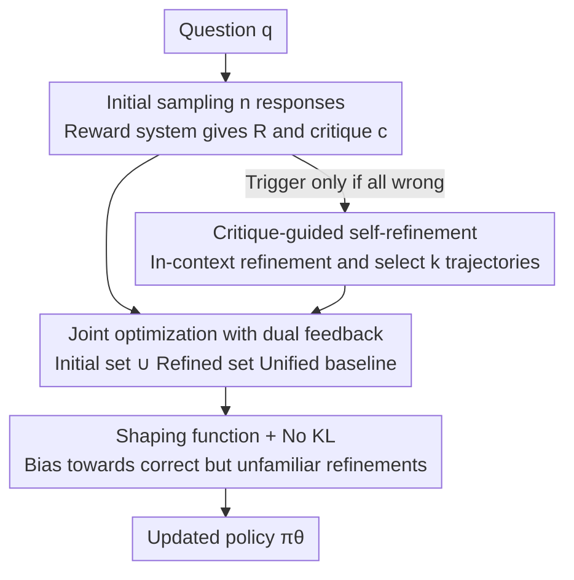

# Critique-GRPO: Advancing LLM Reasoning with Natural Language and Numerical Feedback

**Conference**: ICML2026  
**arXiv**: [2506.03106](https://arxiv.org/abs/2506.03106)  
**Code**: https://github.com/zhangxy-2019/critique-GRPO  
**Area**: LLM Reasoning / Reinforcement Learning  
**Keywords**: Reinforcement Learning, GRPO, Natural Language Feedback, Self-refinement, Reasoning

## TL;DR
The authors first identify three critical flaws in "pure numerical reward RL" (performance plateaus, ineffective spontaneous reflection, and stubborn failures), then integrate **natural language critique** into online RL. The model learns both the initial response and "self-refinement based on critique." A shaping function is used to bias towards "correct but unfamiliar" refinements while suppressing incorrect ones, achieving an average Pass@1 improvement of approximately +15.0~21.6% across eight reasoning benchmarks (Qwen series).

## Background & Motivation

**Background**: Online RL using numerical rewards (the R1-Zero paradigm) has become a primary driver for enhancing LLM reasoning, where models learn through trial and error under scalar rewards with significant results.

**Limitations of Prior Work**: Experimental findings reveal three fundamental limitations of pure numerical feedback: (i) **Performance Plateau**—stagnation occurs after sufficient training steps, and expanding training prompts from 4k to 32k (8x) no longer yields gains; (ii) **Ineffective Spontaneous Reflection**—R1-style "Aha moments" (verification, backtracking, backward chaining) rarely result in correcting wrong answers; (iii) **Stubborn Failures**—even the best RL models exhibit approximately 29% training problems where Pass@4=0 regardless of training duration. The root cause is that **scalar rewards are inherently unexpressive, failing to explain "why" a response is wrong or "how" to improve it.**

**Key Challenge**: While Process-based Reward Models (PRM) mitigate plateaus and stubborn failures via fine-grained credit assignment, they cannot address "ineffective reflection." Conversely, while Natural Language Feedback (NLF, text critique) is expressive, existing methods mostly use SFT to **imitate static, pre-collected critiques**, making them offline and incapable of active exploration or real-time adaptation. **Integrating expressive critique into the online RL loop** remains unexplored.

**Goal**: To investigate whether critique can be integrated into online RL, allowing LLMs to learn simultaneously from both natural language and numerical feedback.

**Key Insight**: A key observation experiment shows that feeding natural language critiques to a "plateaued" RL model enables it to correct previously stubborn wrong answers (CoT critiques successfully refined 55.37% of stubborn failures with Pass@4=0). This indicates that the "verbal credit assignment" provided by critiques allows models to reach **high-quality refinement trajectories unreachable via standard trial-and-error exploration** through in-context learning.

**Core Idea**: Propose **Critique-GRPO**, which adds a "critique-guided self-refinement" branch to GRPO. This allows the policy to optimize on both "initial responses + refined responses," internalizing exploration gains from both stages into the policy.

## Method

### Overall Architecture
Critique-GRPO is built upon GRPO, with a training round consisting of three sequential steps. **Step 1: Initial Sampling**: For each question $q$, $n$ initial responses are sampled from the old policy. The reward system provides scalar rewards $R^{(i)}$ and critiques $c^{(i)}$ (indicative critiques for rule-based systems, CoT critiques for model-based systems). **Step 2: Critique-guided Refinement**: Refinement is triggered only when all $n$ initial responses are incorrect. The "question-response-critique" triplet is fed back to the model for in-context self-refinement. Refined responses are generated and scored, and $k$ trajectories are selected (prioritizing correct ones). **Step 3: Online Policy Optimization**: The initial and refined sets are **combined** to calculate advantage using a unified baseline. A shaping function is applied to refined responses to bias towards "low-probability but correct" tokens, and the KL penalty is removed to allow for significant updates.

### Key Designs

**1. Joint Optimization with Dual Feedback: Integrating "refinement via critique" into online RL rather than offline imitation**

This directly addresses the three limitations of pure numerical rewards and the existing NLF limitation of SFT-based imitation. The Critique-GRPO objective is the sum of initial and refined response terms:

$$\mathcal{J}_{\text{Critique-GRPO}}(\theta)=\mathcal{J}_{\text{init}}(\theta)+\mathcal{J}_{\text{refi}}(\theta)$$

Where $\mathcal{J}_{\text{init}}$ follows standard GRPO—calculating advantage $\hat A^{(i)}=\frac{R^{(i)}-\text{mean}(\{R\})}{\text{std}(\{R\})}$ via group normalization for $n$ responses per $q$ and performing clipped importance sampling. $\mathcal{J}_{\text{refi}}$ performs similar updates on critique-guided refinements. The fundamental difference from SFT-based imitation is that refinements are **online, self-generated** high-quality trajectories, preserving active exploration while injecting diagnostic information from natural language feedback into the gradient. Proposition 4.1 uses the Transfer Eluder Dimension framework to argue critique sample efficiency: the Eluder dimension of the search space under pure rewards is exponential $O(|\mathcal{S}|^L)$; if critiques locate the first error step, it reduces to linear $O(|\mathcal{S}|L)$; if corrective suggestions are provided, it reduces to $O(L)$, independent of the search space size.

**2. Selective Refinement Triggering + Initial Response Prioritization: Preventing "entropy explosion caused by distribution drift"**

Refined responses are generated via in-context learning, and their distribution differs significantly from the current policy. Integrating them fully would cause entropy explosion and performance degradation. Two gates control this: first, **refinement only triggers when zero initial responses are correct** (Step 2), saving computation and using critiques only when the model fails; second, only a **subset of $k$ trajectories** ($k < n$, prioritizing correct solutions) is sampled from the refinement set to combine with the initial set $\{y^{(i)}\}_{i=1}^n\cup\{y_{\text{refined}}^{(i')}\}_{i'=1}^k$. Training is primarily based on initial responses, with refinements providing precise injections.

**3. Shaping Function: Enabling Learning of "Correct but Unfamiliar" Refinement Tokens**

While refined responses are correct, many tokens may have low probability under the current policy $\pi_\theta$, leading to small weights and ineffective learning under standard importance sampling. This design uses a shaped policy ratio for refined responses:

$$\rho_t^{(i')}(\theta)=\frac{\pi_\theta(y_{\text{refined},t}^{(i')}\mid q,y_{\text{refined},<t}^{(i')})}{\pi_\theta(y_{\text{refined},t}^{(i')}\mid q,y_{\text{refined},<t}^{(i')})+\gamma},\quad 0<\gamma<1$$

The $\gamma$ term **increases** gradient weights for "currently low-probability" tokens, pulling effective but unfamiliar refinement content into the policy. The KL penalty is removed for refinements to allow large updates. Initial responses use the standard ratio $r_t^{(i)}$, and the advantage $\hat A$ for both is calculated using a **unified group mean across initial and refined sets** as a baseline $\hat A^{(i/i')}=R^{(i/i')}-\text{mean}(\{R^{(i)}\}\cup\{R_{\text{refined}}^{(i')}\})$, ensuring comparison within a consistent reference frame.

### Loss & Training
The total objective is $\mathcal{J}_{\text{init}}+\mathcal{J}_{\text{refi}}$ (Eq. 2-4). Following Dr.GRPO, length normalization $1/|y^{(i)}|$ and reward standard deviation are omitted to avoid biased gradients. The refinement path uses the shaping ratio $\rho$ and omits KL. Reward systems support rule-based (string matching Ground Truth, binary rewards + indicative critiques) and model-based (reward model generating CoT critiques, binary correctness inferred as scalar reward) approaches.

## Key Experimental Results

### Main Results
Five models across eight reasoning tasks (Math ID + Science/General OOD). Selected Pass@1 results for Qwen2.5-7B-Base (Avg is the average across eight tasks):

| Method | Supervision | MATH500 | AIME24 | GPQA-Diamond | MMLU-Pro | Avg. |
|------|---------|---------|--------|--------------|----------|------|
| Qwen2.5-7B-Base | — | 60.80 | 13.30 | 28.79 | 46.24 | 32.04 |
| + SFT | Expert Demo | 61.60 | 6.70 | 30.30 | 51.49 | 33.04 |
| + Critique FT | Lang. FB only| 66.00 | 13.30 | 28.79 | 44.46 | 34.76 |
| + R1-GRPO | Numerical FB | 74.00 | 16.70 | 33.33 | 51.81 | 41.18 |
| + R1-Dr.GRPO | Numerical FB | 78.40 | 13.30 | 38.89 | 52.83 | 42.66 |
| **+ Critique-GRPO (Indicative)** | Num + Lang | 76.00 | 13.30 | 37.88 | 55.97 | 44.62 |
| **+ Critique-GRPO (w/ GT)** | Num + Lang | 76.80 | **62.50**(AMC23) | 38.89 | 54.88 | 45.30 |
| **+ Critique-GRPO (CoT Critique)** | Num + Lang | 77.80 | **20.00** | 37.88 | 55.28 | **47.08** |

Key takeaway: The CoT critique version reaches 47.08 Avg, which is **+4.42** higher than the strongest numerical baseline R1-Dr.GRPO (42.66) and ~+15 higher than the base model. On AIME24, CoT critique pushes Pass@1 to 20.00 (vs. 13.3~16.7 for numerical baselines). Average gains for the Qwen series are +15.0~21.6%, and self-critique on AIME 2024 improves +16.7% over GRPO.

### Ablation Study (Critique Type Analysis, Qwen2.5-7B-Base Stubborn Failure Subset)

| Critique Type | % Effective Critique | % Effective Refinement | % Stubborn Problems Successfully Refined |
|---------|-----------|-----------|------------------|
| Indicative Critique | 100.00 | 2.09 | 7.05 |
| Indicative w/ GT | 100.00 | 1.98 | 6.88 |
| CoT Critique | 60.06 | **36.47** | **55.37** |

### Key Findings
- **CoT critique contributes the most**: It provides "step-by-step evaluation," achieving a 36.47% effective refinement rate and successfully refining 55.37% of stubborn failure problems, far exceeding indicative critiques (~2%, ~7%). Information-rich critique is critical.
- **Deliberate critique > Spontaneous reflection**: All three critique types corrected problems that previously had Pass@4=0, proving that being "pointed to an error" is significantly more effective than spontaneous "Aha moments."
- **No-KL + shaping is a prerequisite for stable refinement injection**: Otherwise, distribution drift in refinements causes entropy explosion. Selective triggering on full failures and subset sampling further control injection.

## Highlights & Insights
- **"Critique integrated into online RL" fills the NLF gap**: Unlike previous NLF methods that use SFT to imitate static critiques, this approach uses online critique to drive self-refinement and feed back into the strategy, effectively converting diagnostic information into gradients.
- **Theoretical-phenomenological alignment**: Proposition 4.1 uses Eluder dimensions to show critiques can exponentially reduce search space, explaining how plateaued models recover stubborn failures.
- **Transferable shaping function**: Weighting "low-probability but correct" tokens is applicable to any off-policy scenario learning from unfamiliar but high-quality trajectories (experts, refinement, or distillation).

## Limitations & Future Work
- **Refinement only triggers on "full failures"**: It does not inject critiques for "partially correct" medium-difficulty problems, potentially missing room for improvement; the trigger condition is relatively coarse.
- **Dependency on critique quality**: CoT critiques are generated by reward models with only a 60% effectiveness rate; incorrect critiques can mislead refinement. Indicative critiques are too information-sparse (success rate ~7%).
- **Stability risks of removing KL**: Stability relies on selective triggering and shaping to allow large steps; sensitivity to hyperparameters ($\gamma$, $k$) has not been fully explored.
- **Future directions**: Adaptive triggering based on problem difficulty, confidence filtering for critiques, or joint training of critiques and policies.

## Related Work & Insights
- **vs R1-GRPO / Dr.GRPO (Pure Numerical Online RL)**: These rely on scalar rewards and are limited by the three identified flaws; this work adds a language feedback branch to improve Avg Pass@1 and recover stubborn failures.
- **vs Critique-FT / Refinement-FT (Offline SFT Reflection Imitation)**: These imitate static critiques without active exploration; this work uses online self-refinement for more stable generalization.
- **vs RAFT / RL+Expert Demo**: These depend on curated high-quality demonstration data; this work uses automatically generated critiques.
- **vs Process-based Rewards (PRM)**: PRMs improve credit assignment but cannot address "ineffective reflection"; natural language critique tells the model exactly where and how to fix errors.

## Rating
- Novelty: ⭐⭐⭐⭐⭐ First integration of expressive critique into the online RL loop with Eluder Dimension theory support.
- Experimental Thoroughness: ⭐⭐⭐⭐⭐ 5 models × 8 tasks + comprehensive ablations on critique types and self-critique.
- Writing Quality: ⭐⭐⭐⭐ Clear progression from identifying limitations to experimental observation and methodology logic.
- Value: ⭐⭐⭐⭐⭐ Establishes a practical linguistic feedback direction for RL-enhanced LLM reasoning, with open-source code.

<!-- RELATED:START -->

## Related Papers

- [\[ICML 2026\] Reward Modeling from Natural Language Human Feedback](reward_modeling_from_natural_language_human_feedback.md)
- [\[ICML 2026\] The Role of Feedback Alignment in Self-Distillation](the_role_of_feedback_alignment_in_self-distillation.md)
- [\[ICML 2026\] GRPO is Secretly a Process Reward Model](grpo_is_secretly_a_process_reward_model.md)
- [\[AAAI 2026\] In-Token Rationality Optimization: Towards Accurate and Concise LLM Reasoning via Self-Feedback](../../AAAI2026/llm_reasoning/in-token_rationality_optimization_towards_accurate_and_concise_llm_reasoning_via.md)
- [\[ACL 2026\] Discovering a Shared Logical Subspace: Steering LLM Logical Reasoning via Alignment of Natural-Language and Symbolic Views](../../ACL2026/llm_reasoning/discovering_a_shared_logical_subspace_steering_llm_logical_reasoning_via_alignme.md)

<!-- RELATED:END -->
