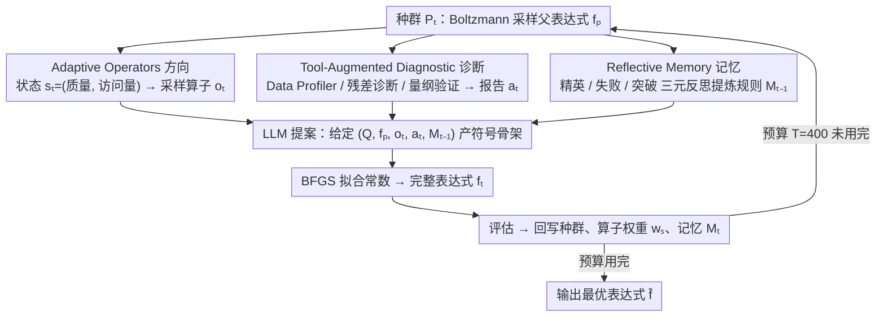

# Deliberate Evolution: Agentic Reasoning for Sample-Efficient Symbolic Regression with LLMs

**Conference**: ICML 2026  
**arXiv**: [2606.04360](https://arxiv.org/abs/2606.04360)  
**Code**: https://github.com/Xinyu-Pang/Deliberate-Evolution (Available)  
**Area**: LLM Reasoning / Agent / Symbolic Regression  
**Keywords**: Symbolic Regression, Evolutionary Search, Agentic Reasoning, Sample Efficiency, LLM Tool Calling

## TL;DR
The proposal-score loop dominated by LLMs in symbolic regression is decomposed into two layers: "Proposal vs. Navigation." By explicitly guiding the LLM with three types of signals—adaptive operators (direction), diagnostic tools (residuals/dimensions), and reflective memory (trajectory experience)—this method reduces the average NMSE by 37–55% on LLM-SRBench using only 40% of the evaluation budget.

## Background & Motivation

**Background**: Current mainstream LLM-based symbolic regression (LLM-SR, LASR, SGA) follows an "evolutionary optimization" approach—an LLM proposes candidate expressions, BFGS fits constants, MSE is used for scoring, and the feedback is sent back to the LLM for further mutation.

**Limitations of Prior Work**: This loop suffers from extremely poor sample efficiency, requiring an average of $10^3$ candidate evaluations per problem. This occurs because the LLM only receives a "parent expression + a scalar MSE," forcing it to simultaneously reason about three things: how to modify, why it is wrong, and what the past experiences were.

**Key Challenge**: Existing methods forcefully pack "proposal" and "search guidance"—two tasks that should be decoupled—into the same prompt. Scalar feedback lacks three critical signals: **Direction** (should it refine or regenerate?), **Diagnostics** (does the residual hide periodicity or dimensional errors?), and **Memory** (which motifs succeeded before and which edits failed?). Consequently, the search oscillates between candidates that "look reasonable but are uninformative."

**Goal**: To explicitize and modularize these three types of signals, allowing the LLM to focus on its strength—proposing symbolic skeletons—while delegating "navigation" to deterministic modules.

**Key Insight**: The authors redefine symbolic regression as a "guided scientific search" rather than a "scored trial-and-error." By ensuring each candidate is generated with clear intent, localized evidence, and accumulated experience, increasing the success probability of each step from $p_0$ to $p_0+\gamma$ can theoretically shorten hitting time exponentially ($\Pr(N>k)\le \exp[-k(p_0+\gamma)]$).

**Core Idea**: An agentic framework is used to **decouple** symbolic generation from search control—the LLM only proposes skeletons, while external modules handle direction setting, diagnostics, and memory accumulation.

## Method

### Overall Architecture

DE addresses the poor sample efficiency of the "propose-score" loop in LLM-based symbolic regression. When an LLM only receives a "parent expression + a scalar MSE," it is forced to reason about direction, error causes, and history simultaneously, leading to idling among uninformative candidates. DE decouples these signals into three deterministic modules, leaving the LLM to handle "symbolic skeleton proposal."

Specifically, in round $t$: a parent expression $f_p$ is sampled from population $P_t$ using Boltzmann sampling. Its state $s_t$ indexes an operator policy to sample an operator $o_t$ providing **direction**. A toolset $\mathcal{T}=\{T_{\text{data}},T_{\text{res}},T_{\text{dim}}\}$ is called to generate a **diagnostic** report $a_t$. These are combined with historical **memory** $M_{t-1}$ and injected into the proposal distribution $p_\theta(\cdot\mid Q,f_p,o_t,a_t,M_{t-1})$. The LLM generates a skeleton $\tilde f_t$, BFGS fits constants to obtain $f_t$, and the population, operator weights, and memory are updated after evaluation. The budget is capped at $T=400$ candidates, which is $1/2.5$ of the baseline.

### Key Designs

**1. Adaptive Operators: Deciding between refine or escape for the LLM rather than guessing directions**

**Design Motivation**: The first missing signal is "direction"—whether to refine, mutate, crossover, or regenerate. DE extracts this from the prompt into a simple state machine and bandit model. An operator set $\mathcal{O}=\{o_{\text{ref}},o_{\text{mut}},o_{\text{cross}},o_{\text{reg}}\}$ is defined. Each parent expression maps to a binary state $s_t=(\mathbb{I}[\tilde r_p\le \tau_r],\mathbb{I}[v_p\ge\tau_v])$, representing "quality" and "visit frequency." A set of operator weights $w_s^{(t)}$ is maintained for each of the four states. Sampling follows $\pi_s^{(t)}(o)=(1-\alpha)\,w_s^{(t)}(o)/\sum w + \alpha/|\mathcal{O}|$ with $\epsilon$-exploration. Weights are updated multiplicatively using relative improvement $r_t=\text{clip}((\ell(f_p)-\ell(f_t))/(\ell(f_p)+\varepsilon))$. A stagnation trigger $\text{Stag}_t$ is also used to force exploration if the best loss does not improve for $h$ rounds.

**2. Tool-Augmented Diagnostic Proposal: Translating "how much" error into "where and why"**

The second missing signal is "diagnostics." Scalar MSE only indicates the magnitude of error without explaining structural or dimensional failures. DE uses three tools to generate a structured report $a_t=(T_{\text{data}}(D),T_{\text{res}}(f_p,D),T_{\text{dim}}(f_p,Q))$: **Data Profiler** (statistical priors), **Residual Diagnostic** (analyzing $e_i=y_i-f_p(x_i)$ for missing periodic components or oscillations), and **Dimensional Verifier** (checking physical consistency). These reports are injected into the prompt as natural language, turning undirected mutation into target revision. In ablation studies, removing tools caused the Physics NMSE to jump from 4.37e-4 to 2.52e-2 (a 58x worsening).

**3. Reflective Memory: Condensing cross-round experience into rules for cumulative search**

The third missing signal is "memory." Pure in-context evolution is memoryless. DE maintains memory $M_t$ but only updates it when a trigger $\delta_t=\mathbb{I}[(t\bmod K=0)\vee(\Delta_t>\epsilon_{\text{mem}})]$ is activated. Reflections are based on a context $C_t$ comparing current elites, significant failures, and breakthrough edits. The LLM extracts reusable rules (e.g., "these variables should be wrapped in periodic functions"). A compression step $M_t\leftarrow\text{Compress}(M_{t-1}\cup p_\theta(\cdot\mid C_t))$ ensures the memory remains concise and relevant.

### Loss & Training

The process is entirely gradient-free and occurs at inference-time. Llama-3.1-8B-Instruct or Qwen3-4B-Instruct are used as backbones with a temperature of 0.8. Constants are fitted using BFGS. Hitting-time analysis provides theoretical backing: by increasing the success probability per step, the required number of evaluations decreases exponentially.

## Key Experimental Results

### Main Results

Evaluated on LLM-SRBench (240 problems from Physics/Chemistry, etc.). Baselines were given a 1000-candidate budget, while DE used only 400 (40%).

| Dataset (Qwen3-4B) | Metric | Ours | Prev. SOTA (LASR) | Gain |
|---|---|---|---|---|
| LSR-Transform | NMSE ↓ | 1.15e-1 | 1.83e-1 | -37% |
| LSR-Transform | Acc0.01 ↑ | **50.45%** | 30.91% | +19.5pt |
| Physics | NMSE ↓ | **4.37e-4** | 2.51e-3 (LLM-SR) | -83% |
| Chemistry | NMSE ↓ | **1.88e-4** | 2.31e-3 | -92% |
| Stress-Strain (real) | ID/OOD NMSE ↓ | **1.11e-1 / 2.98e-1** | 1.44e-1 / 6.34e-1 | OOD -53% |

OOD generalization is significant: while baseline NMSE skyrocketed in Physics and Chemistry, DE remained stable, indicating it recovers true structures rather than overfitting.

### Ablation Study

Physics + Qwen3-4B:

| Configuration | NMSE ↓ | Acc0.01 ↑ | Description |
|---|---|---|---|
| Full DE | **4.37e-4** | **15.91** | Complete model |
| w/o Memory | 1.34e-3 | 9.52 | No historical experience |
| **w/o Tool** | **2.52e-2** | 4.55 | **Diagnostics are critical** |
| Fixed Refine | 8.69e-3 | 9.52 | Degenerated to single operator |
| Uniform Ops | 1.02e-2 | 6.82 | Lost adaptive strategy |
| w/o Stagnation | 7.69e-4 | 13.63 | Lost escape mechanism |

### Key Findings

- **Diagnostic tools are the primary contributor**: Removing tools resulted in the largest performance drop (58x worsening in NMSE).
- **Mutual complementarity**: Each module serves a unique purpose, and removing any of them degrades performance.
- **Geometric improvement in efficiency**: Lower error was achieved with only 40% of the budget.
- **High stability**: The variance across runs was significantly lower compared to baselines.
- **Noise robustness**: Even with 5% noise, DE outperformed baselines running on noise-free data.

## Highlights & Insights

- **Decoupling Proposal and Navigation is a universal framework**: This philosophy is transferable to code generation, theorem proving, and other structured search tasks.
- **Minimalist Meta-RL**: A simple $2\times2$ state space successfully learns when to exploit or explore, which is much lighter than training an RL controller.
- **Trigger-based memory**: This solves the "what and when to remember" problem in agents, preventing context explosion while capturing critical insights.

## Limitations & Future Work

- The toolset is manually designed and may need recalibration for non-physical domains.
- The operator set and state space are small; complex domains might require higher granularity.
- Validation was mostly on 4B–8B models; the benefit of DE might diminish with stronger backbones that have better intrinsic priors.
- Long-term stability of the memory compression step and potential "hallucinated rules" were not fully explored.

## Related Work & Insights

- **vs LLM-SR (Shojaee et al., 2025a)**: While both use LLMs and BFGS, LLM-SR relies on scalar MSE, whereas DE translates error into "where it's wrong."
- **vs LASR (Grayeli et al., 2024)**: LASR uses massive brute-force mutation ($10^5$), while DE proves that structured guidance is more efficient than raw compute.
- **vs SGA (Ma et al., 2024)**: SGA uses gradient guidance, which is often poor in discrete symbolic spaces. DE's discrete guidance via tools and operators is more robust.

## Rating
- Novelty: ⭐⭐⭐⭐ Systematic decoupling in SR, though the components (bandit/memory) are known patterns.
- Experimental Thoroughness: ⭐⭐⭐⭐⭐ Extensive testing across datasets, noise levels, and robust ablation.
- Writing Quality: ⭐⭐⭐⭐⭐ Excellent clarity in figures and motivation.
- Value: ⭐⭐⭐⭐ Provides a strong baseline for sample-efficient LLM-based optimization.

<!-- RELATED:START -->

## Related Papers

- [\[ICLR 2026\] ShinkaEvolve: Towards Open-Ended and Sample-Efficient Program Evolution](../../ICLR2026/llm_reasoning/shinkaevolve_towards_open-ended_and_sample-efficient_program_evolution.md)
- [\[ICLR 2026\] Stabilizing Policy Gradients for Sample-Efficient Reinforcement Learning in LLM Reasoning](../../ICLR2026/llm_reasoning/stabilizing_policy_gradients_for_sample-efficient_reinforcement_learning_in_llm_.md)
- [\[ICML 2026\] ResRL: Boosting LLM Reasoning via Negative Sample Projection Residual Reinforcement Learning](resrl_boosting_llm_reasoning_via_negative_sample_projection_residual_reinforceme.md)
- [\[ICML 2026\] MOSAIC: Learning When to Act or Refuse — Guarding Agentic Reasoning Models for Safe Multi-step Tool Use](learning_when_to_act_or_refuse_guarding_agentic_reasoning_models_for_safe_multi-.md)
- [\[ICML 2026\] Evaluating Relational Reasoning in LLMs with REL](evaluating_relational_reasoning_in_llms_with_rel.md)

<!-- RELATED:END -->
