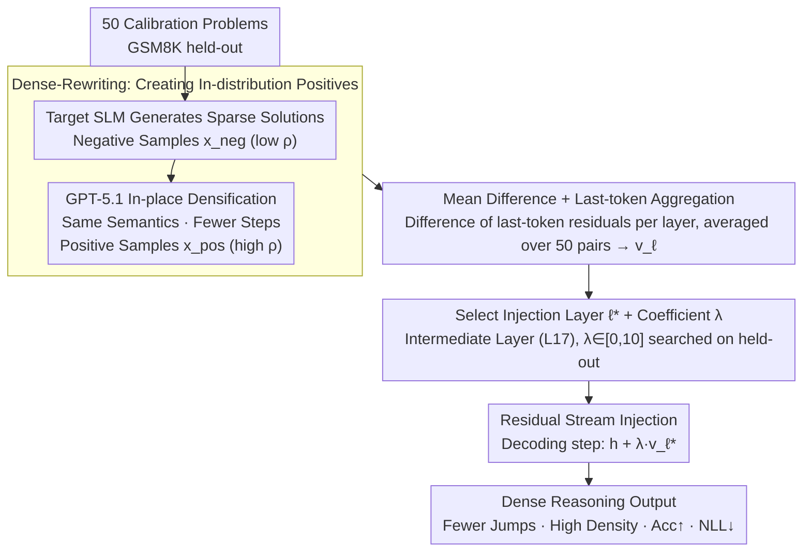

# DenseSteer: Steering Small Language Models towards Dense Math Reasoning

**Conference**: ICML 2026  
**arXiv**: [2605.29247](https://arxiv.org/abs/2605.29247)  
**Code**: https://github.com/oyy2000/DenseSteer  
**Area**: LLM Reasoning / SLM / Activation Steering  
**Keywords**: dense reasoning, steering vector, small language models, GSM8K, inference-time intervention

## TL;DR
It is observed that stronger models use fewer CoT steps but have higher information density per step (Dense Reasoning). DenseSteer uses GPT-5.1 to rewrite the sparse solutions generated by the small language model (SLM) itself into "information-dense" in-distribution positive samples. These form contrastive pairs with the original solutions. A steering vector, obtained via mean difference, is injected into the residual stream of an intermediate layer ($\approx$ L17). This zero-training method consistently improves performance on math benchmarks like GSM8K / MATH500 / AMC / AIME without increasing token-level NLL.

## Background & Motivation

**Background**: The mainstream approach for enabling multi-step mathematical reasoning in small language models (SLM, $\le$ 3B) is knowledge distillation: using large models to generate long CoT traces and fine-tuning the SLM (Short / Long CoT, Mix-Long, Mix-Large, etc.).

**Limitations of Prior Work**: (1) Distillation requires thousands of teacher samples and heavy training resources; (2) More critically, a "learnability gap" exists—SLMs struggle to ingest the traces of strong teachers, significantly increasing token-level NLL and causing distribution mismatch. Figure 3(a) quantifies this: the NLL of Qwen2.5-7B traces on Qwen2.5-3B is higher than the student's self-likelihood, and cross-family traces (Llama-3.2-8B $\rightarrow$ Qwen2.5-3B) are even higher.

**Key Challenge**: How to leverage reasoning capabilities from large models without deviating from the SLM's own generative prior. While Steering Vector approaches for inference-time intervention are lightweight (requiring only ~50 samples), directly using the hidden states of large models as positive samples pushes the target model out of its own manifold, leading to output collapse.

**Goal**: Find "in-distribution positive samples" that carry the superior reasoning structure of strong models while remaining within the generative prior of the target SLM.

**Key Insight**: Leveraging empirical observations on the Qwen2.5 family (Figure 1), the authors find that stronger models use fewer reasoning steps $N_\text{steps}$ but have more tokens per step $\rho = N_\text{tokens} / N_\text{steps}$. This suggests the structural characteristic of "strong reasoning" is **Dense Reasoning**: fewer jumps with higher information density per jump, thereby reducing intermediate error accumulation.

**Core Idea**: Instead of using traces from an alien teacher as positive samples, GPT-5.1 is used to minimally rewrite the SLM's **own** sparse solutions into "semantically invariant, higher density" versions (Dense-Rewriting). These serve as in-distribution contrastive pairs to extract a mean difference steering vector, which is then injected into the intermediate layer's residual stream.

## Method

### Overall Architecture
DenseSteer aims to supplement SLMs ($\le$ 3B) with the reasoning structure of strong models (fewer jumps, high density) without updating any parameters. First, it uses 50 calibration problems to let the target SLM generate sparse solutions as negative samples $x_\text{neg}$. Then, GPT-5.1 performs "in-place densification" of these solutions into positive samples $x_\text{pos}$ with identical semantics but tighter steps. The average difference in residual stream activations for each layer across these pairs yields a steering vector $v_\ell$ pointing toward dense reasoning. During inference, this vector is added to the residual stream of an intermediate layer $\ell^*$ with a coefficient $\lambda$. The entire pipeline requires only 50 pairs for calibration and involves no gradient updates.

### Key Designs

**1. Dense-Rewriting: Creating In-distribution Positives with the Model's Own Language**

This is the fundamental difference between DenseSteer and any method using "teacher traces as positive samples." The authors operationalize "good reasoning" as a measurable structural metric: Reasoning Density $\rho = N_\text{tokens} / N_\text{steps}$ (where steps are separated by double newlines). Stronger models exhibit larger $\rho$ and smaller $N_\text{steps}$. Directly using teacher traces seems convenient but hits the learnability gap: the NLL of 7B/8B teacher solutions on a 3B model is higher than the model's self-likelihood, meaning they fall outside the manifold. DenseSteer's solution is to have GPT-5.1 merge redundant steps and increase the information per step of the target SLM's **own** solutions to obtain $x_\text{pos}$, while the original solutions serve as $x_\text{neg}$. Figure 3(b) confirms that the NLL of these rewrites is close to the self-likelihood baseline and much lower than 7B teacher traces—ensuring distributional compatibility while cleanly injecting the "sparse vs. dense" structural signal.

**2. Mean Difference + Last-token Aggregation for Extraction**

Given 50 pairs of dense/sparse samples, the next step is compressing them into a steering vector $v_\ell$ for each layer. The challenge is that dense and sparse versions differ in length, making token-by-token alignment noisy. DenseSteer extracts only the residual activation of the **last token** for each sample at layer $\ell$, denoted as $h_\ell(x)[-1]$, as a sequence-level summary. It then calculates the mean difference across all $N=50$ pairs:

$$v_\ell = \frac{1}{N}\sum_{i=1}^{N}\bigl(h_\ell(x_\text{pos}^{(i)})[-1] - h_\ell(x_\text{neg}^{(i)})[-1]\bigr)$$

This Mean Difference approach, inherited from CAA (Panickssery et al.), is effective because token-by-token alignment or full-sequence pooling is unstable with extremely limited data (50 pairs), whereas last-token summary reliably captures the dominant direction of "dense vs sparse."

**3. Residual Stream Injection at Intermediate Layers with Moderate $\lambda$**

During inference, each decoding step executes $\tilde h_{\ell^*, t} = h_{\ell^*, t} + \lambda \cdot v_{\ell^*}$, where $\lambda$ is searched within $[-20, 20]$ on a held-out set. The choice of the injection layer $\ell^*$ is crucial. Layer sensitivity analysis (Figure 4) shows that early layers (L6) have almost no response, as they learn low-level features insensitive to high-level attributes like "reasoning structure." Late layers (L27/L35) are too close to the logits, where intervention conflicts with the already formed output trajectory, causing compensatory verbosity or token inflation. Only intermediate layers (L16/L17) offer the most stable control over step count and total tokens. This aligns with findings in Scaling Monosemanticity (Templeton et al.) that high-level semantic features aggregate in middle layers. Figures 5/6 show that for L17, accuracy monotonically increases and NLL monotonically decreases within $\lambda \in [0, 10]$.

### Loss & Training
**No training involved**. The only "hyperparameter search" is selecting $\ell^*$ and $\lambda$ for each target model using the GSM8K training subset. Greedy decoding is fixed at the generation side with a max length of 2048. The calibration set consists of 50 problems that do not overlap with the evaluation set.

## Key Experimental Results

### Main Results

Results on Qwen-2.5-3B-Instruct across 5 math benchmarks (GSM8K / MATH500 / AMC / Olympiad / AIME, Avg. is sample-weighted):

| Method | GSM8K | MATH500 | AMC | Olympiad | AIME | Avg. |
|------|-------|---------|-----|----------|------|------|
| Zero-shot CoT | 83.6 | 63.0 | 42.5 | 20.0 | 0.0 | 61.2 |
| Prompt Engineering (dense style) | 20.0 | 32.8 | 30.0 | 9.8 | 6.7 | 19.8 |
| Short CoT (Distillation) | 79.9 | 58.6 | 30.0 | 18.1 | 6.7 | 57.8 |
| Long CoT (Distillation) | 82.5 | 49.8 | 25.0 | 12.7 | 0.0 | 55.9 |
| Mix-Large (Strongest Distillation) | 83.7 | 61.6 | 37.5 | 21.0 | 6.7 | 61.3 |
| InFamilySteer (7B trace as pos) | 85.3 | 59.8 | 37.5 | 20.0 | 0.0 | 61.4 |
| **DenseSteer (Ours)** | 84.8 | **64.6** | **42.5** | 20.7 | **10.0** | **62.5** |

On Llama-3.2-3B-Instruct, DenseSteer achieves an Avg. of 52.7, matching the strongest distillation method Mix-Long (54.2), but **requires no training and only 50 pairs of samples** (Distillation requires 2000+ teacher traces).

### Ablation Study

| Configuration | Key Metrics | Explanation |
|------|---------|------|
| Layer = L6 (Early) | Steps/tokens barely change with $\lambda$ | Early layers learn low-level features, insensitive to reasoning structure. |
| Layer = L17 (Middle) | Steps/tokens decrease; accuracy increases | Optimal injection point, stable gains for $\lambda \in [0,10]$. |
| Layer = L35 (Late) | Steps/tokens increase; accuracy unstable | Conflicts with formed output trajectory, causing compensatory verbosity. |
| Prompt Engineering (same prompt, no steering) | Avg. 19.8 vs DenseSteer 62.5 | SLMs fail to follow complex rewrite prompts, skipping CoT to output answers directly. |
| InFamilySteer (using 7B trace as pos) | Avg. 61.4 | Close to DenseSteer, validating the NLL-based sample selection; but requires larger in-family models. |
| LogiQA (OOD Logical Reasoning) | 44.22 → 58.22 (DenseSteer) | "Dense reasoning" is not limited to math and transfers to logical reasoning. |
| MMLU / BBH CoT / HotpotQA | Performance matches baseline | No significant degradation on general tasks, side effects are controllable. |

### Key Findings
- **In-distribution > Strong Teacher**: The NLL of Dense-Rewriting samples is close to self-likelihood, whereas 7B traces have higher NLL (Figure 3). This quantifies the "learnability gap" and explains why DenseSteer outperforms distillation baselines on hard tasks like AIME.
- **Middle Layers are the Sweet Spot**: Intervention at L17 leads to a monotonic increase in accuracy and a decrease in NLL, consistent with middle layers containing high-level semantic features.
- **Prompt Engineering Fails on SLMs** (Avg. 19.8): Giving the same "dense" instructions via prompts to a 3B model causes it to skip CoT entirely. This reveals that **structural signals must be injected at the representation layer, not via text commands**—a fundamental advantage of representation-level intervention over prompt engineering.

## Highlights & Insights
- **"Borrow structure, not distribution"** is a paradigm worth adopting: use teacher models to define "what is good," but ensure positive samples are generated by the student itself. This can be extended to alignment, style transfer, and safety in SLM scenarios limited by the learnability gap.
- **Reasoning Density $\rho = N_\text{tokens} / N_\text{steps}$** is a "cheap" proxy metric—calculated just by counting double newlines, yet it captures the structural trait of "sparse jumps with high information." It can be applied to RL reward shaping, filtering distillation data, or CoT quality assessment.
- **NLL as a "Compatibility Filter"**: Using the target model to score candidate positive samples via NLL and selecting those with low NLL as positive samples can replace sample selection in any steering method.

## Limitations & Future Work
- The authors acknowledge that DenseSteer can only reorganize reasoning capabilities **already latent** within the model; it cannot inject new knowledge or skills.
- The method was primarily validated on math and some logical reasoning; transferability to more complex multi-step tasks (coding, agent planning, multimodal reasoning) and larger model families (>8B) remains to be explored.
- Dense-Rewriting relies on commercial GPT-5.1, shifting the "dependency on teachers" from training to sample construction. Using open-source models for self-distillation rewriting or training a small rewriter would achieve complete independence.
- Main results only report the best $(\ell^*, \lambda)$ for N=50 with greedy decoding; stability under sampling or temperature > 0, and performance on much longer traces (e.g., R1-style 8k+ tokens), have not been verified.

## Related Work & Insights
- **vs CAA (Panickssery et al., 2024)**: CAA uses behavioral/semantic oppositional pairs (e.g., safe vs. unsafe). DenseSteer uses "sparse vs. dense rewriting of the same solution," pivoting the contrastive signal from "semantic" to "structural" and using NLL for explicit distribution filtering.
- **vs SEAL (Chen et al., 2025a)**: SEAL is also training-free steering, but it aims to "steer **away from** redundancy and transition patterns" (subtraction). DenseSteer "steers **towards** the dense reasoning subspace" (addition) with a completely different contrastive pair construction.
- **vs Knowledge Distillation**: Distillation requires 2000+ teacher traces and GPU training. DenseSteer matches or exceeds these baselines with 50 pairs and a single addition at inference time, suggesting that "reasoning structure" is more a representation-level directional issue than a parameter issue.

## Rating
- Novelty: ⭐⭐⭐⭐ Shifting contrastive pairs from semantic opposition to self-densification and using NLL as a compatibility filter is a clean and generalizable new setting.
- Experimental Thoroughness: ⭐⭐⭐⭐ Coverage of 2 model families × 3 scales × 5 math benchmarks + OOD logic/general tasks. Layer and $\lambda$ sensitivity analyses are thorough, though limited to greedy decoding.
- Writing Quality: ⭐⭐⭐⭐ The chain of motivation-observation-method is very coherent. Figure 3's NLL comparison provides strong visual evidence for the "learnability gap."
- Value: ⭐⭐⭐⭐ Provides a practical "50 samples + zero training" baseline for SLM reasoning enhancement, which is deployment-friendly. The "borrow structure, not distribution" methodology is applicable to alignment and style control.

<!-- RELATED:START -->

## Related Papers

- [\[ICLR 2026\] SLM-MUX: Orchestrating Small Language Models for Reasoning](../../ICLR2026/llm_reasoning/slm-mux_orchestrating_small_language_models_for_reasoning.md)
- [\[ICLR 2026\] Following the Navigation: Enhancing Small Language Models Contextual Reasoning with LLM Guidance](../../ICLR2026/llm_reasoning/following_the_navigation_enhancing_small_language_models_contextual_reasoning_wi.md)
- [\[ACL 2026\] RSAT: Structured Attribution Makes Small Language Models Faithful Table Reasoners](../../ACL2026/llm_reasoning/rsat_structured_attribution_makes_small_language_models_faithful_table_reasoners.md)
- [\[AAAI 2026\] Small Language Models for Efficient Agentic Tool Calling: Outperforming Large Models with Targeted Fine-tuning](../../AAAI2026/llm_reasoning/small_language_models_for_efficient_agentic_tool_calling_outperforming_large_mod.md)
- [\[ICLR 2026\] T1: Tool-Integrated Verification for Test-Time Compute Scaling in Small Language Models](../../ICLR2026/llm_reasoning/t1_tool-integrated_verification_for_test-time_compute_scaling_in_small_language_.md)

<!-- RELATED:END -->
