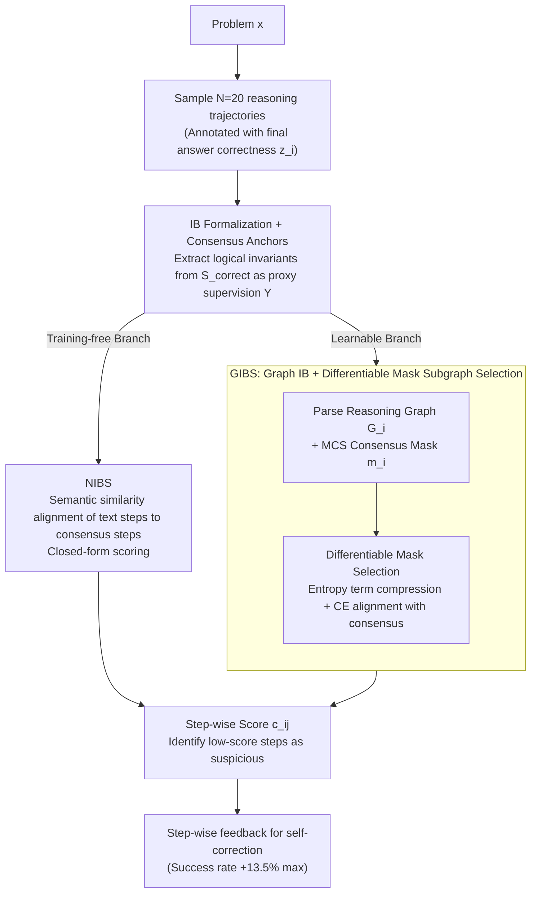

# Diagnosing Multi-step Reasoning Failures in Black-box LLMs via Stepwise Confidence Attribution

**Conference**: ICML2026  
**arXiv**: [2605.19228](https://arxiv.org/abs/2605.19228)  
**Code**: https://anonymous.4open.science/r/ICML_2026_step_wise-2D45  
**Area**: LLM Reasoning / Confidence Estimation / Reasoning Diagnosis  
**Keywords**: Step-wise Confidence, Information Bottleneck, Consensus Graph, Black-box LLMs, Self-correction

## TL;DR
This work formalizes the identification of erroneous steps in Chain-of-Thought (CoT) reasoning as a step-wise confidence attribution problem in black-box scenarios. By utilizing the Information Bottleneck (IB) principle, "correct reasoning trajectories obtained via multiple sampling of the same problem" are compressed into a consensus structure. Two implementations are provided: the training-free NIBS (Semantic Consensus Alignment) and the learnable GIBS (Graph Consensus Subgraph Selection). Both consistently outperform white-box baselines on GSM8K, Math, and MoreHopQA, improving self-correction success rates by up to 13.5% through step-wise feedback.

## Background & Motivation

**Background**: Long-chain reasoning (CoT / GoT) has become the mainstream paradigm for LLM problem-solving. To determine the reliability of a reasoning chain, existing approaches follow two main paths: training a Process Reward Model (PRM800K, Math-Shepherd, etc.) using human step-wise labels, or employing LLM-as-judge for self-evaluation. Confidence Estimation (CE) provides a third path, but most CE methods target the final answer, indicating overall correctness rather than identifying specific failed steps.

**Limitations of Prior Work**: Existing efforts in step-wise CE (e.g., LeCo, SL(norm)) require access to token-level logits or entropy, making them white-box methods inapplicable to closed-source APIs like GPT-4o or Claude. Simply decomposing answer-level CE to each step faces a challenge: correct solutions for the same problem can vary significantly in expression order and step granularity (as shown in Figure 1, where different sequences B and C are both correct). Naïve similarity comparisons might misclassify "legitimate variations" as "errors."

**Key Challenge**: Under black-box constraints, only the generated text is available. It is crucial to distinguish between "legitimate variations" (surface differences) and "actual errors" (logical deviations).

**Goal**: To provide a reliable confidence score for each reasoning step that reflects its "contribution to final correctness," given only the generated trajectories and the binary label of the final answer.

**Key Insight**: The authors observe that while correct solutions vary in order, they all traverse certain "logical invariants" (e.g., intermediate costs in math problems, key entity values in multi-hop QA). Erroneous solutions tend to deviate from this consensus structure. Consequently, the "degree of alignment with the consensus derived from multiple correct trajectories" can serve as a proxy signal for confidence.

**Core Idea**: The intuition of "compressing redundant expressions while preserving the consensus substructure related to correctness" is formalized using the Information Bottleneck $\min_Z I(T_i;Z) - \beta I(Z;Y)$, where $Y$ is approximated by consensus anchors aggregated from correct trajectories.

## Method

### Overall Architecture
Given a problem $x$, $N=20$ reasoning trajectories $\mathcal{S}=\{(T_i, A_i, z_i)\}$ are sampled from the LLM at temperature 1.0, where $z_i\in\{0,1\}$ indicates whether the final answer matches the ground truth (exact match for math, GPT-4o judge for QA). The pipeline consists of three stages: (A) Parsing each text trajectory into a directed reasoning graph $G_i=(V_i,E_i)$, where nodes $v_{ij}$ represent intermediate results and edges $e_{ij}$ represent sub-problems/operations (using LangFun-style prompts + rule-based parsing); (B) Aggregating "consensus anchors" from $\mathcal{S}_{\text{correct}}$—NIBS performs semantic similarity set aggregation, while GIBS calculates the Maximum Common Subgraph to obtain a mask $\mathbf{m}_i$; (C) Utilizing the IB objective to produce step-wise scores $c_{ij}$, where steps with low scores are flagged as suspicious. The two implementations diverge based on graph usage: the training-free NIBS compares semantic similarity of text steps, while the learnable GIBS performs differentiable subgraph selection on the reasoning graph.

### Key Designs

**1. IB Formulation + Consensus Anchors: Replacing unobservable step labels with computable proxy signals**

Under black-box constraints, token probabilities are unavailable, and there are no labels for step-wise correctness. Consequently, the supervision variable $Y$ in the IB objective $\min_Z I(T_i;Z) - \beta I(Z;Y)$ is unobservable. The authors' breakthrough is the observation that despite varying expression orders, correct solutions for the same problem almost always pass through a set of "logical invariants." Thus, $Y$ is replaced by "consensus anchors" aggregated from $\mathcal{S}_{\text{correct}}$. In this proxy setting, the compression term $I(T_i;Z)$ encourages retaining only key steps and discarding redundancy, while the relevance term $I(Z;Y)$ ensures the retained steps align with the consensus. Unlike PRM approaches that rely on expensive human labeling or LLM-as-judge which introduces bias, "consensus among correct samples" provides zero-cost supervision using only text, fitting the black-box setting perfectly.

**2. NIBS: Training-free non-parametric consensus alignment as a closed-form approximation of IB**

If training is not desired, $Z$ can be defined as the "set of steps appearing in multiple correct solutions," reducing the IB solution to a closed-form score. For each step $t_{ij}$ in trajectory $T_i$, the confidence is the expectation of its semantic similarity with steps in correct solutions:

$$c_{ij}=\mathbb{E}_{S\sim\mathcal{S}_{\text{correct}}}\big[\text{Agg}\big(\{\text{sim}(\mathbf{t}_{ij},\mathbf{t}')\mid\mathbf{t}'\in S\}\big)\big]$$

Here, $\text{sim}$ can be BERT cosine similarity or NLI entailment, and $\text{Agg}$ is max or mean. This algorithm has no trainable parameters. It serves as a strong baseline, proving that "consensus degree equals confidence" carries a strong signal (NLI-Max outperforms white-box baselines like P(true)/Entropy/LECO by over 100%). It also provides a ready-to-use solution for APIs like GPT-4o/Claude without training budgets.

**3. GIBS: Graph IB + Differentiable Mask for subgraph selection with structural dependencies**

NIBS considers only surface similarity and ignores step positions in the reasoning graph. GIBS first parses each trajectory into a directed reasoning graph $G_i$, then instantiates confidence $Z$ as a soft subgraph $G^*=G_i\odot \mathbf{p}_\theta$. Selection probabilities $\mathbf{p}_\theta$ are predicted by fusing BERT step features with 2-layer GCN structural features. Consensus supervision comes from a mask $\mathbf{m}_i$ aggregated from the Maximum Common Subgraph (MCS) between $G_i$ and correct graphs. To handle mutual information over discrete subgraphs, the objective is relaxed using a variational upper bound:

$$\mathcal{L}=H(\mathbf{p}_\theta)+\lambda\,\text{CE}(\mathbf{p}_\theta,\mathbf{m}_i)$$

The entropy term handles both "compression and sparsity," pushing each $p_{\theta,ij}$ toward 0 or 1. The CE term handles relevance, forcing the soft mask toward the MCS consensus. During inference, $c_{ij}=p_{\theta,ij}$ is used as the step score. The structural context introduced by GCN allows the model to learn "logical dependency patterns" rather than isolated patterns, which is why it outperforms NIBS and white-box baselines in OOD tests.

### Loss & Training
GIBS is trained on 2,000 reasoning graphs. The loss is defined by the entropy and CE terms in Equation (6). The variational prior is set to independent Bernoulli($\epsilon<0.5$). During evaluation, an average of 10,000 trajectories per dataset are tested. NIBS is entirely training-free.

## Key Experimental Results

### Main Results

Evaluated across 3 LLMs (Llama3.1-8B, DeepSeek-R1-Distill-Qwen-32B, Phi4-Reasoning) and 3 datasets (GSM8K, MoreHopQA, Math) using 4 metrics (AUROC↑, AUCPR↑, ACC@80%↑, ECE↓). GIBS achieved the best results in 7 out of 9 AUROC configurations.

| Dataset | LLM | Strongest White-box Baseline (AUROC) | Best NIBS (AUROC) | GIBS (AUROC) |
|--------|------|----------------------|-------------------|--------------|
| GSM8K | Phi4-Reasoning | NLI-Max 0.660 | NLI-Max 0.660 | **0.789** |
| MoreHopQA | DeepSeek-R1-32B | NLI-Max 0.666 | NLI-Max 0.666 | **0.808** |
| Math | Phi4-Reasoning | Cos-Mean 0.612 | Cos-Mean 0.612 | **0.695** |
| GSM8K | Llama3.1-8B | NLI-Max 0.710 | NLI-Max 0.710 | 0.691 |

NIBS (especially Cos-Mean / NLI-Max) significantly exceeds P(true), Entropy, and LECO. GIBS shows particularly notable improvements on the more complex Math and MoreHopQA datasets.

### Ablation Study
Phi4-Reasoning, AUROC:

| Configuration | GSM8K | MoreHopQA | Math | Description |
|------|-------|-----------|------|------|
| Full GIBS | 0.789 | 0.662 | 0.695 | Includes edge encoder + graph encoder |
| w/o Graph Encoder | 0.723 | 0.648 | 0.596 | GCN removed; Math drops by 0.10 |
| w/o Edge Encoder | 0.519 | 0.376 | 0.476 | Removing edges causes collapse; logic edges are key |

Consensus source ablation (GIBS, MoreHopQA AUROC): Correct-only 0.808 > Self-consistency 0.784 > All trajectories 0.648. This indicates that pseudo-label quality is strongly correlated with performance.

### Key Findings
- **Edge encoding is more critical than nodes**: Removing the edge encoder leads to an average AUROC drop of 0.26 across three datasets, compared to 0.07 for the graph encoder. This suggests that "logical dependencies between steps" are the decisive features for consensus structure.
- **MCS distribution**: Correct solutions concentrate around an MCS of 0.8, while incorrect ones stay around 0.4 (Figure 3), providing empirical support for the "consensus = correctness" hypothesis.
- **Step-wise feedback vs. Answer feedback**: For solving incorrect samples in MoreHopQA, GIBS step-wise feedback improves success rates by up to 13.5%. Stronger reasoning models (DeepSeek-R1, Phi4) benefit more as they better utilize localization signals.
- **OOD Robustness**: When trained on MoreHopQA and tested on Math, GIBS still outperforms NIBS and white-box baselines. The IB + Graph structure learns "abstract reasoning patterns" rather than dataset-specific vocabulary.

## Highlights & Insights
- This is the first work to formalize "step-wise confidence attribution" in a black-box setting, providing a clean optimization objective via IB that is lighter than training PRMs or using LLM-as-judge.
- The trick of "replacing unobservable step labels with correct-solution consensus" is highly portable. It can be applied to any problem where target variables are only visible at the sequence level but attribution is needed internally (e.g., generation evaluation, agent trajectories, RL credit assignment).
- Training-free NIBS (NLI-Max) achieves an AUROC of 0.710 on GSM8K with Llama3.1-8B, doubling the performance of P(true) (0.40) and LECO (0.39). This suggests that white-box token probabilities correlate poorly with logic correctness compared to consensus signals.
- The use of an entropy term in variational IB to handle both "sparsity and binarization" is an elegant engineering choice that avoids extra hyperparameters.

## Limitations & Future Work
- The method depends on $N=20$ samples, increasing reasoning costs significantly—a drawback for latency-sensitive or API-cost-sensitive deployments.
- The performance ceiling is dictated by consensus quality. If the problem is too difficult and few correct solutions are sampled, the method degrades significantly.
- Reasoning graph construction relies on LangFun-style prompts and rule-based parsing. Generalizing to free text or unstructured reasoning requires a new parser design.
- Evaluation is limited to objectively gradable tasks (Math + Multi-hop QA). Application to open-ended tasks (e.g., creative writing) using self-consistency as a ground-truth alternative was only briefly explored in Section 5.5.

## Related Work & Insights
- **vs. PRM (PRM800K, Math-Shepherd)**: PRM relies on human or synthetic step labels; Ours uses "sampling consensus" as a zero-cost alternative. GIBS also performs well on PRM800K (Appendix F), showing it is not limited to consensus signals.
- **vs. LLM-as-judge**: Self-evaluation inherits model bias and is unstable for identical problems; Ours uses group consistency for objectivity.
- **vs. White-box Step-wise CE**: White-box methods need logits; Ours is fully black-box. Experiments show token-level signals are weak predictors of logical correctness compared to consensus signals.
- **vs. Graph-of-Thought (GoT)**: GoT focuses on organizing the reasoning process; Ours uses graphs as a tool for consensus alignment. They are orthogonal and can be combined.

## Rating
- Novelty: ⭐⭐⭐⭐ First formalization of black-box step-level CE via IB and consensus alignment. Clever "consensus-as-supervision" proxy.
- Experimental Thoroughness: ⭐⭐⭐⭐ 3 LLMs × 3 Datasets × 4 Metrics + Ablations + OOD + PRM800K validation.
- Writing Quality: ⭐⭐⭐⭐ Clear IB derivation, intuitive examples in Figure 1, and detailed engineering explanations.
- Value: ⭐⭐⭐⭐ 13.5% gain in self-correction success is significant. Low deployment barrier for API-only users.

<!-- RELATED:START -->

## Related Papers

- [\[NeurIPS 2025\] Self-Evaluating LLMs for Multi-Step Tasks: Stepwise Confidence Estimation for Failure Detection](../../NeurIPS2025/llm_reasoning/self-evaluating_llms_for_multi-step_tasks_stepwise_confidence_estimation_for_fai.md)
- [\[ICML 2026\] Inducing Overthink: Hierarchical Genetic Algorithm-based DoS Attack on Black-Box Large Language Reasoning Models](inducing_overthink_hierarchical_genetic_algorithm-based_dos_attack_on_black-box_.md)
- [\[ICML 2026\] Inference Time Optimization with Confidence Dynamics](inference_time_optimization_with_confidence_dynamics.md)
- [\[ACL 2026\] Merlin's Whisper: Enabling Efficient Reasoning in Large Language Models via Black-box Persuasive Prompting](../../ACL2026/llm_reasoning/merlin39s_whisper_enabling_efficient_reasoning_in_large_language_models_via_blac.md)
- [\[ICML 2026\] MOSAIC: Learning When to Act or Refuse — Guarding Agentic Reasoning Models for Safe Multi-step Tool Use](learning_when_to_act_or_refuse_guarding_agentic_reasoning_models_for_safe_multi-.md)

<!-- RELATED:END -->
