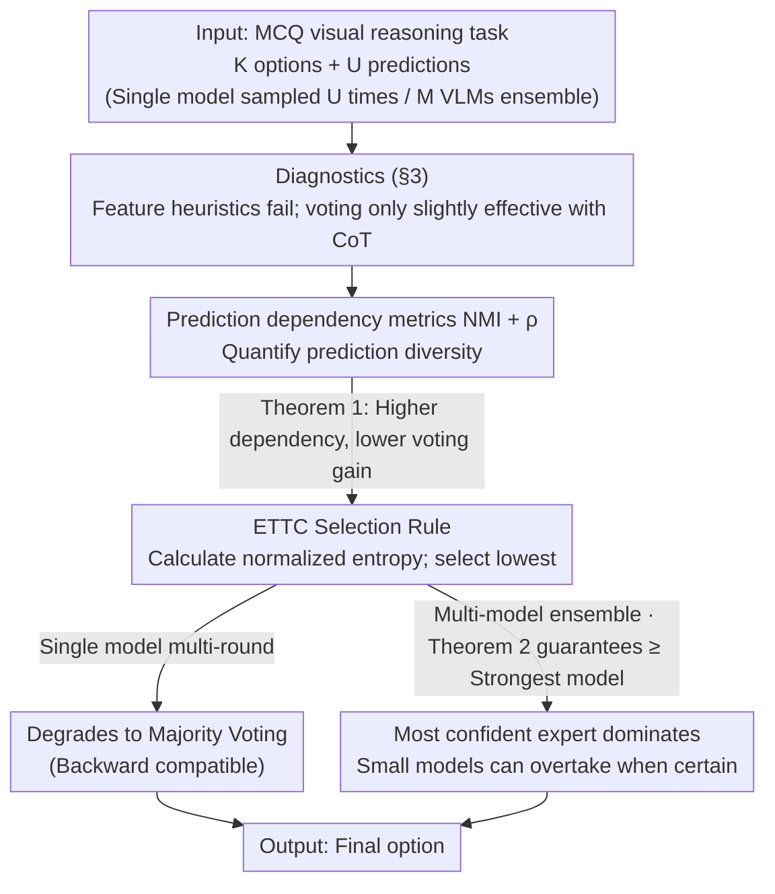

# Diversity Matters: Revisiting Test-Time Compute in Vision-Language Models

**Conference**: ICML2026  
**arXiv**: [2605.30713](https://arxiv.org/abs/2605.30713)  
**Code**: https://github.com/nanfang-wuyu/Diversity-Matters  
**Area**: LLM Inference / Multimodal VLM  
**Keywords**: test-time compute, majority voting, entropy selection, VLM ensemble, prediction diversity

## TL;DR
This paper systematically investigates the effectiveness of test-time compute (TTC) strategies on vision-language models. It theoretically proves that the gains from majority voting are limited by prediction diversity and proposes ETTC, which selects the most confident model based on prediction entropy. This allows smaller models to enhance larger ones, achieving an average improvement of +2.8% over voting across 7 VLMs and 6 benchmarks, outperforming the strongest single model.

## Background & Motivation

**Background**: In LLMs, test-time compute (TTC) has been proven to significantly improve inference quality without changing parameters. Mainstream approaches fall into two categories: feature-based Best-of-N (scoring via heuristics like pivot words, answer length, or lexical diversity) and confidence-based aggregation (self-consistency / majority voting). These methods are considered standard for "lightweight performance boosts," but their systematic effectiveness on VLMs has rarely been verified.

**Limitations of Prior Work**: Directly applying LLM-based TTC to VLMs faces three risks: (1) visual perception itself has a high error rate and differs significantly between models; (2) imperfect cross-modal alignment leads to subtle inconsistencies; (3) textual cues used to judge reasoning quality in LLMs (e.g., pivot words like "alternatively" or "let me check," CoT length) do not reflect the correctness of visual understanding—if perception fails, even a beautiful reasoning chain cannot recover the answer.

**Key Challenge**: The essence of voting is to amplify the correct signal through "diversity + average accuracy > 1/K." However, VLM outputs are highly converged during sampling, lacking diversity. Meanwhile, although multi-model ensembles are naturally diverse, standard voting weights all models equally, allowing weak models to drag down strong ones, often resulting in performance worse than the strongest single model.

**Goal**: The problem is decomposed into three sub-questions: (i) When exactly is TTC effective for VLMs? (ii) What is the quantitative relationship between voting gains and prediction diversity? (iii) Can an aggregation strategy be designed for multi-model ensembles to "automatically trust the strongest expert," allowing small models to enhance large ones?

**Key Insight**: The authors start from a simple observation: "If the same model answers incorrectly 16 times in the same way, voting is useless; if different models fail in different ways, voting is beneficial." This attributes voting effectiveness to "statistical dependency between predictions," which can be quantified using NMI and the correlation coefficient $\rho$. Furthermore, in multi-model scenarios, the "most confident model is most likely correct" can be used as a selection signal via normalized prediction entropy.

**Core Idea**: Replace "counting votes" with "selecting the model with the lowest entropy" as the answer. In single-model scenarios, this degrades to majority voting; in multi-model scenarios, it allows strong models to dominate while letting small models overtake larger ones when they are highly confident.

## Method

### Overall Architecture
The paper presents a complete chain of "diagnostic → theory → improvement." Input: A multiple-choice visual reasoning problem, $K$ candidate answers, $U$ predictions (from one model sampled $U$ times, or $M$ different VLMs sampled multiple times). Output: The aggregated final option. The process involves three stages: (1) Systematically testing feature heuristics (Pivot Word / CoT Length / Feature-All) and majority voting across 7 VLMs and 6 benchmarks, confirming that feature-based methods fail and voting is only slightly effective with CoT (§3); (2) Using Information Theory metrics NMI and correlation coefficient $\rho$ to characterize prediction dependency, proving that voting gain $\Delta A_{MV}(U)$ monotonically decreases with respect to $\rho$ and NMI (§4, Theorem 1); (3) Proposing ETTC, which selects the most confident model based on prediction entropy, theoretically proving it is strictly superior to voting under weak assumptions (§5, Theorem 2).

### Key Designs

**1. Prediction Dependency Metrics (NMI + ρ): Quantifying diversity before deciding to vote**

Voting often fails on VLMs because the $U$ sampled predictions are highly similar—errors occur in the same way, and more votes cannot fix them. The authors sought a **model-agnostic, ground-truth-free** metric to judge this beforehand. Two sets of metrics are used: at the answer option level, the Normalized Mutual Information $\mathrm{NMI}(X;X') = I(X;X') / \min\{H(X), H(X')\}$ is calculated for any pair of predictions and averaged across all $C(U,2)$ pairs; at the correctness level, a binary indicator $Z_u = \mathbb{I}\{X_u = Y\}$ is defined, and the correlation coefficient $\rho(Z,Z') = (E[ZZ'] - p^2) / (p(1-p))$ is averaged. Theorem 1 links these quantities to voting gain: if the dependency level is consistent across all pairs, the voting gain $\Delta A_{MV}(U)$ is **monotonically decreasing** with respect to $\rho$ and NMI. When $\rho=1$ (fully correlated), gain is zero; when $\rho=0$ and average accuracy $p > 1/K$, voting accuracy approaches 1 as $U \to \infty$. This transforms the intuition of "when voting works" into a measurable, pre-screenable criterion: large models with high $\rho$ should not waste compute on voting, while small models with low $\rho$ make voting worthwhile.

**2. Entropy-based TTC (ETTC) Selection Rule: Letting models speak by confidence, not headcounts**

Standard voting treats all models as equal voters, which is problematic in multi-model ensembles—a group of weak but correlated models can outvote the correct answer from a strong model. ETTC switches to "listen to whoever is most confident": for each model $u$, the normalized entropy is calculated from its prediction distribution $p_u(\cdot)$ over $K$ options as $\tilde{H}_u = -\frac{1}{\log K}\sum_k p_u(k)\log p_u(k) \in [0,1]$ with top-1 prediction $\hat{y}_u = \arg\max_k p_u(k)$. The final prediction $\hat{y}_{u^*}$ is chosen where $u^* = \arg\min_u \tilde{H}_u$. This rule has two elegant properties: for a single model across multiple rounds, taking the argmax of the averaged distribution **degrades to majority voting**, allowing seamless replacement of existing self-consistency pipelines with zero regression risk; for ensembles, it switches to "strongest expert dominance," where the strong model rules when confident, and a weak model can occasionally overtake it if it is trulyCertain. This holds because Assumption 1 (Entropy-Accuracy Monotonicity: lower entropy $\Rightarrow$ higher accuracy) is generally satisfied in practice, making entropy a cheap proxy for expertise.

**3. Theoretical Guarantee of ETTC over Voting (Theorem 2): Higher correlation, greater ETTC advantage**

To explain why ETTC is strictly better than voting in VLM ensembles, the authors built a coupling model to characterize error correlation: with probability $\lambda$, all non-optimal models give the same correlated incorrect prediction $W$ (with average accuracy $\bar{c}$); with probability $1-\lambda$, they are independent. Letting $c^*$ be the accuracy of the strongest model and $A_{MV}(0)$ be the base voting accuracy when independent, the voting accuracy is $A_{MV}(\lambda) = \lambda \bar{c} + (1-\lambda) A_{MV}(0)$, while ETTC accuracy satisfies $A_{\min H} \ge c^*$. The difference
$$A_{\min H} - A_{MV}(\lambda) = \lambda(c^* - \bar{c}) + (1-\lambda)\big(A_{\min H} - A_{MV}(0)\big)$$
is strictly positive as long as $\lambda>0$ and $\bar{c} < c^*$. Crucially, since VLMs share pre-training data and architectures, their errors are naturally correlated ($\lambda$ is non-zero). This theorem addresses the real-world scenario by structurally closing the "collective bias" loophole of voting; the stronger the correlation (larger $\lambda$), the more pronounced the advantage of ETTC over voting.

### Loss & Training
Ours is a pure inference-time method that requires no model training or reward models. All experiments use stochastic decoding (standard HuggingFace sampling settings) with zero-shot single-stage prompting. Both CoT and Direct Answer prompt templates are evaluated. In single-model settings, the number of samples $U = 16$ (based on §4.2 showing NMI and $\rho$ converge at $U \approx 12$), and multi-model ensembles use 4 models with multiple samples each.

## Key Experimental Results

### Main Results

| Dataset | Metric | Strongest Single Model | Majority Voting | ETTC | Gain (ETTC vs Voting) |
|--------|------|--------------------|----------|------|-----------------------|
| MathVista (cross-family) | Acc% | 72.08 (Qwen-7B) | 68.33 | **75.93** | +7.60 |
| MathVision (cross-family) | Acc% | 31.84 (Gemma) | 32.05 | **35.57** | +3.52 |
| TQA (cross-family) | Acc% | 78.86 (Gemma) | 83.65 | **83.90** | +0.25 |
| MMMU (cross-family) | Acc% | 52.49 (Gemma) | 53.66 | **58.63** | +4.97 |
| Average (6 datasets) | Acc% | 61.30 (Qwen-7B) | 63.75 | **66.56** | +2.81 |
| Average (same-family Qwen) | Acc% | 69.90 (Qwen-72B) | 68.84 | **71.68** | +2.84 |

Highlights: In the same-family Qwen series, voting (68.84) was even lower than the Qwen-72B single model (69.90), verifying the theoretical prediction that "voting dilutes strong models." ETTC (71.68) surpassed the strongest single model by 1.78 points, indicating that Qwen-3B/7B/32B can occasionally outperform the 72B model when they are highly confident.

### Ablation Study

| Configuration / Observation | Key Metric | Description |
|-------------|----------|------|
| Direct Answer + Voting | <1% Gain | Without CoT, VLM outputs across 16 samples are nearly identical; diversity is zero, making voting ineffective. |
| CoT + Heuristics (Pivot/Length) | ≈ 0% Gain | Textual heuristics completely fail for VLMs as perception bottlenecks decouple text style from correctness. |
| CoT + Majority Voting | 2–4% Gain | Voting shows small, consistent gains only with CoT but is limited by prediction dependency. |
| $\Delta A_{MV}(16)$ vs NMI / $\rho$ | Sig. negative correlation | Verified Theorem 1 across 7 models × 6 datasets: higher dependency leads to lower voting gain. |
| NMI/$\rho$ convergence ($U=2\dots16$) | Stable after $U \approx 12$ | Provides a practical upper bound for 16 samples. |
| Model scale vs Diversity | Qwen-3B/LLaMA | High diversity and voting gain; Qwen-72B/Pixtral outputs converge with almost zero gain. |

### Key Findings
- The fundamental reason majority voting is "more decorative than useful" in VLMs is the high correlation of sampled outputs; this conclusion provides a quantifiable and predictive criterion via NMI and $\rho$.
- ETTC not only beats voting but also outperforms the strongest single model—implying that small models are more confident than large models on problems they "actually know." Selecting these minority opinions is key to "smaller models enhance larger ones."
- Textual heuristics (pivot words, length, lexical diversity) failed completely, suggesting that VLM reasoning quality is primarily determined by visual perception, which cannot be measured by surface-level text features.
- Entropy-Accuracy Monotonicity (Assumption 1) generally holds in physical measurements (§C.2), providing the empirical basis for ETTC's cross-architecture generalization.

## Highlights & Insights
- **Linking Voting Gain to Statistical Dependency**: While voting was previously viewed as an engineering trick, Ours provides a theoretical criterion and empirical fit using NMI and $\rho$. This acts as a "budgeting tool" to determine if TTC is worth running for a given task/model without needing labels.
- **Elegant "Single-Model Degradation" of ETTC**: In single-model multi-round scenarios, ETTC is mathematically equivalent to majority voting. It can replace existing self-consistency pipelines with zero risk of regression while enabling "strongest expert dominance" in ensembles.
- **Counter-intuitive Conclusion: "Small models enhance large ones"**: Traditional ensembles assume large models should dominate. We proved that Qwen-3B is occasionally more confident and correct than 72B, showing that "per-instance expert selection" is more fine-grained than "per-model selection."
- **Tight Coupling of Theory and Evidence**: Theorem 1 explains "when voting fails" and Theorem 2 explains "when ETTC is superior." Both correspond to visual experiments in §4–§5, creating a clean logical chain that can be migrated to diagnose other inference-time methods like RAG or self-refinement.

## Limitations & Future Work
- Verified only in Multiple Choice Question (MCQ) scenarios, which allow entropy to be normalized directly to $[0,1]$. Defining "entropy of answer distribution" for open-ended generation (free-form QA, code, etc.) is non-trivial and may require clustering.
- Assumption 1 (low entropy $\Rightarrow$ high accuracy) holds at an "aggregate" level; on a per-instance basis, it may not be strict. For models with poor calibration (confident but wrong), ETTC might be misled, requiring calibration correction.
- The cost of ensembles is significant—the total inference cost of multiple models and multiple samples is dozens of times that of a single model. The "lightweight" claim of TTC is less applicable in multi-model scenarios.
- The possibility of combining ETTC with process reward models, self-refinement, or tree search was not explored; it could serve as a unified selection layer in those pipelines.

## Related Work & Insights
- **vs Self-Consistency / Majority Voting (Wang et al., 2023)**: Standard TTC baseline for LLMs. Ours shows it only yields 2-4% gain for VLMs and depends on CoT. ETTC is mathematically equivalent in single-model cases but strictly superior in ensembles.
- **vs Feature/Heuristic Best-of-N (Chang et al., 2025; Fu et al., 2023)**: These score reasoning traces based on length or diversity. Ours proves these fail for VLMs because visual perception bottlenecks make surface text cues non-discriminative.
- **vs Learned Reward Models / Verifiers**: These require training extra scorers. ETTC is training-free and model-agnostic with much lower deployment costs, though it may miss task-specific signals that a reward model could learn.
- **Insight**: Using prediction entropy as a proxy for quality can be extended to RAG (selecting among multiple retriever-augmented answers), agentic multi-path reasoning, and speculative decoding.

## Rating
- Novelty: ⭐⭐⭐⭐ Transforms "voting diversity" into measurable theorems and designs a backward-compatible ETTC.
- Experimental Thoroughness: ⭐⭐⭐⭐ 7 VLMs × 6 benchmarks × 2 ensemble configs. Theory and evidence are well-coupled, though lacks open-ended tasks.
- Writing Quality: ⭐⭐⭐⭐ Smooth "why → when → how" narrative; theorems and intuition support each other well.
- Value: ⭐⭐⭐⭐ The conclusion "don't just vote on large models, select by entropy in ensembles" can be immediately applied to VLM serving and low-cost model integration.

<!-- RELATED:START -->

## Related Papers

- [\[ICLR 2026\] Efficient Test-Time Scaling for Small Vision-Language Models](../../ICLR2026/llm_reasoning/efficient_test-time_scaling_for_small_vision-language_models.md)
- [\[NeurIPS 2025\] Provable Scaling Laws for the Test-Time Compute of Large Language Models](../../NeurIPS2025/llm_reasoning/provable_scaling_laws_for_the_testtime_compute_of_large_lang.md)
- [\[ACL 2026\] Scaling Test-Time Compute to Achieve IOI Gold Medal with Open-Weight Models](../../ACL2026/llm_reasoning/scaling_test-time_compute_to_achieve_ioi_gold_medal_with_open-weight_models.md)
- [\[ICML 2026\] Stabilizing Recurrent Dynamics for Test-Time Scalable Latent Reasoning in Looped Language Models](stabilizing_recurrent_dynamics_for_test-time_scalable_latent_reasoning_in_looped.md)
- [\[NeurIPS 2025\] Towards Thinking-Optimal Scaling of Test-Time Compute for LLM Reasoning](../../NeurIPS2025/llm_reasoning/towards_thinking-optimal_scaling_of_test-time_compute_for_llm_reasoning.md)

<!-- RELATED:END -->
