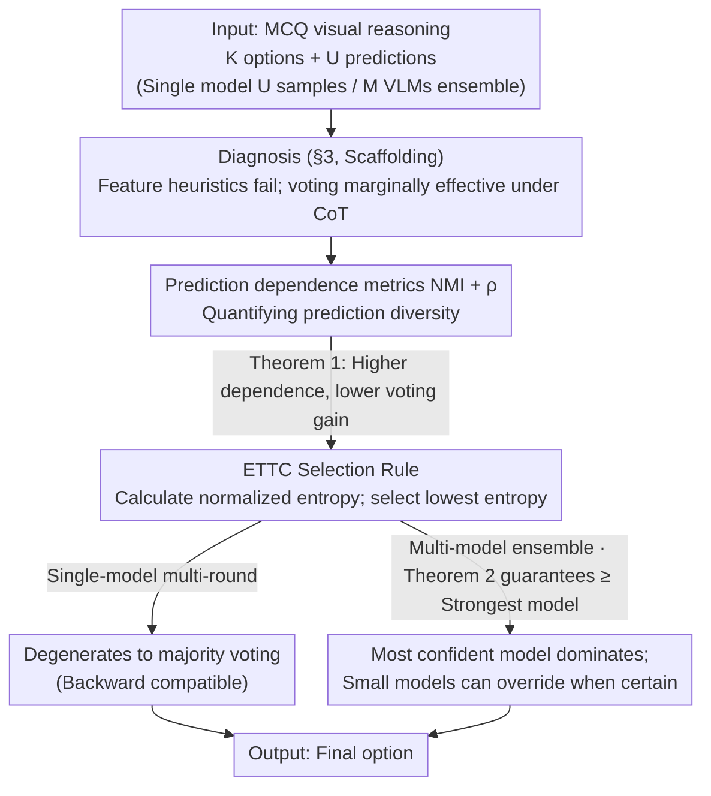

# Diversity Matters: Revisiting Test-Time Compute in Vision-Language Models

**Conference**: ICML2026  
**arXiv**: [2605.30713](https://arxiv.org/abs/2605.30713)  
**Code**: https://github.com/nanfang-wuyu/Diversity-Matters  
**Area**: LLM Inference / Multimodal VLM  
**Keywords**: Test-time compute, majority voting, entropy selection, VLM ensemble, prediction diversity

## TL;DR
This paper systematically investigates the effectiveness of test-time compute (TTC) strategies on Vision-Language Models (VLMs). It theoretically demonstrates that the gains of majority voting are limited by prediction diversity and proposes ETTC, which selects the most confident model based on prediction entropy. This approach allows smaller models to enhance larger ones, achieving an average improvement of +2.8% over 7 VLMs across 6 benchmarks, outperforming the strongest single models.

## Background & Motivation

**Background**: In LLMs, test-time compute (TTC) has been proven to significantly enhance reasoning quality without changing parameters. Mainstream approaches fall into two categories: feature-based Best-of-N (using heuristic scoring like pivot words, answer length, and lexical diversity) and confidence-based aggregation (self-consistency / majority voting). These methods are considered standard for "lightweight performance boosts," but their effectiveness on VLMs has rarely been systematically verified.

**Limitations of Prior Work**: Directly applying LLM TTC to VLMs faces three main risks: (1) Visual perception itself has high error rates and varies significantly between models; (2) Imperfect cross-modal alignment leads to subtle inconsistencies; (3) Textual cues used to judge reasoning quality in LLMs (e.g., pivot words like "alternatively" or "let me check", CoT length) do not reflect the correctness of visual understanding—if perception fails, even a perfect reasoning chain cannot save the result.

**Key Challenge**: The essence of voting is to amplify correct signals using "diversity + average accuracy > 1/K." However, VLM outputs tend to be highly similar during sampling, leading to insufficient diversity. Furthermore, while multi-model ensembles are naturally diverse, standard majority voting weights all models equally, meaning weak models can drag down strong ones, often performing worse than the best single model.

**Goal**: The problem is decomposed into three sub-questions: (i) When exactly is TTC effective for VLMs? (ii) What is the quantitative relationship between voting gains and prediction diversity? (iii) Can an aggregation strategy be designed for multi-model ensembles to "automatically trust the strongest expert," allowing small models to enhance large ones?

**Key Insight**: The authors start from a simple observation: "If the same model answers incorrectly 16 times in the same way, voting is useless; if different models fail in different ways, voting can help." This attributes voting effectiveness to the "statistical dependence between predictions," quantifiable via NMI and the correlation coefficient $\rho$. Furthermore, in multi-model scenarios, the observation that "the most confident model is most likely correct" allows the use of normalized prediction entropy as a selection signal.

**Core Idea**: Replace "counting votes" with "selecting the model with the lowest entropy." In single-model scenarios, this degrades to majority voting, while in multi-model scenarios, it allows strong models to dominate, while permitting small models to override larger ones when they are highly confident.

## Method

### Overall Architecture
The paper presents a complete chain of "Diagnosis → Theory → Improvement." Given a multiple-choice visual reasoning task with $K$ options and $U$ predictions (from $U$ samples of a single model or $M$ different VLMs sampled multiple times), the goal is to output the aggregated final option. The process involves three stages: (1) Systematically evaluating feature heuristics (Pivot Word / CoT Length / Feature-All) and majority voting across 7 VLMs and 6 benchmarks, confirming that feature-based methods fail and voting is only marginally effective with CoT (§3); (2) Using information-theoretic metrics NMI and correlation $\rho$ to characterize prediction dependence, proving that voting gain $\Delta A_{MV}(U)$ is monotonically decreasing with respect to $\rho$ and NMI (§4, Theorem 1); (3) Proposing ETTC, which selects the most confident model based on prediction entropy, theoretically proving it is strictly superior to voting under weak assumptions (§5, Theorem 2).

### Key Designs

**1. Prediction Dependence Metrics (NMI + \rho): Measuring Diversity Before Voting**

Voting often fails on VLMs because the $U$ sampled predictions are highly similar—errors occur in the same way, and more votes cannot fix them. The authors propose **model-agnostic, ground-truth-free** metrics to pre-determine effectiveness. Two metrics are used: at the answer level, the normalized mutual information $\mathrm{NMI}(X;X') = I(X;X') / \min\{H(X), H(X')\}$ is calculated for any pair of predictions and averaged over all $C(U,2)$ pairs. At the correctness level, binary indicators $Z_u = \mathbb{I}\{X_u = Y\}$ are used to calculate the average correlation coefficient $\rho(Z,Z') = (E[ZZ'] - p^2) / (p(1-p))$. Theorem 1 links these quantities to voting gain: if the dependence level of all pairs is consistent, the voting gain $\Delta A_{MV}(U)$ is **monotonically decreasing** with respect to $\rho$ and NMI. When $\rho=1$ (perfect correlation), gain is zero; when $\rho=0$ and average accuracy $p > 1/K$, as $U \to \infty$, voting accuracy approaches 1. This transforms the intuition of "when voting works" into a measurable criterion: if a large model has high $\rho$, do not waste compute on voting; if a small model has low $\rho$, voting is worthwhile.

**2. Entropy-based TTC (ETTC) Selection Rule: Voice by Confidence, Not by Count**

Standard voting treats all models as equal-weighted voters, which fails in multi-model ensembles—a group of weak but correlated models can outvote the correct answer from a strong model. ETTC adopts a "listen to the most confident" approach: for each model $u$, the normalized entropy is calculated from its prediction distribution $p_u(\cdot)$ over $K$ options as $\tilde{H}_u = -\frac{1}{\log K}\sum_k p_u(k)\log p_u(k) \in [0,1]$, along with the top-1 prediction $\hat{y}_u = \arg\max_k p_u(k)$. The final prediction is $\hat{y}_{u^*}$ where $u^* = \arg\min_u \tilde{H}_u$. This rule has two properties: for single-model multi-round sampling, taking the argmax of the averaged distribution **degenerates to majority voting**, allowing seamless replacement of existing self-consistency pipelines with zero regression risk. For multi-model setups, it switches to a "strongest expert" mode where the strong model rules when confident, but a weak model can override if it is truly certain. This holds because Assumption 1 (Entropy-Accuracy Monotonicity: lower entropy $\Rightarrow$ higher accuracy) is generally satisfied in practice.

**3. Theoretical Guarantee for ETTC (Theorem 2): Higher Correlation Leads to Larger ETTC Gains**

To answer why ETTC is superior to voting in VLM ensembles, the authors bridge the gap with a coupling model for error correlation: with probability $\lambda$, all non-optimal models collude to provide the same correlated incorrect prediction $W$ (with average accuracy $\bar{c}$); with probability $1-\lambda$, they are independent. Let $c^*$ be the accuracy of the strongest model. The voting accuracy is $A_{MV}(\lambda) = \lambda \bar{c} + (1-\lambda) A_{MV}(0)$, while ETTC accuracy satisfies $A_{\min H} \ge c^*$. The difference:
$$A_{\min H} - A_{MV}(\lambda) = \lambda(c^* - \bar{c}) + (1-\lambda)\big(A_{\min H} - A_{MV}(0)\big)$$
is strictly positive as long as $\lambda>0$ and $\bar{c} < c^*$. Crucially, since VLMs share pre-training data and architectures, errors are naturally correlated ($\lambda \neq 0$). This theorem addresses the "collective bias" loophole in voting; the stronger the correlation ($\lambda$), the more significant the advantage of ETTC over voting.

### Loss & Training
Ours is a pure inference-time method that requires no model training or reward models. All experiments use stochastic decoding (HuggingFace default sampling) + zero-shot single-stage prompting. Both CoT and Direct Answer templates are evaluated. In single-model settings, the number of samples is $U = 16$ (based on §4.2 showing NMI and $\rho$ converge around $U \approx 12$). Multi-model ensembles use 4 models with multiple samples each.

## Key Experimental Results

### Main Results

| Dataset | Metric | Strongest Vanilla Single | Majority Voting | ETTC | Gain (ETTC vs Voting) |
|---------|--------|--------------------------|-----------------|------|-----------------------|
| MathVista (cross-family) | Acc% | 72.08 (Qwen-7B) | 68.33 | **75.93** | +7.60 |
| MathVision (cross-family) | Acc% | 31.84 (Gemma) | 32.05 | **35.57** | +3.52 |
| TQA (cross-family) | Acc% | 78.86 (Gemma) | 83.65 | **83.90** | +0.25 |
| MMMU (cross-family) | Acc% | 52.49 (Gemma) | 53.66 | **58.63** | +4.97 |
| Average (cross-family, 6 datasets) | Acc% | 61.30 (Qwen-7B) | 63.75 | **66.56** | +2.81 |
| Average (same-family Qwen 3B/7B/32B/72B) | Acc% | 69.90 (Qwen-72B) | 68.84 | **71.68** | +2.84 |

Highlights: In the same-family Qwen series, voting (68.84) performed worse than the single Qwen-72B model (69.90), verifying the theoretical prediction that "voting dilutes strong models." Conversely, ETTC (71.68) outperformed the strongest single model by 1.78 points, indicating that Qwen-3B/7B/32B can occasionally surpass the 72B model when they are highly confident.

### Ablation Study

| Configuration / Observation | Key Metric | Description |
|-----------------------------|------------|-------------|
| Direct Answer + Majority Voting | <1% Gain | Without CoT, VLM outputs across 16 samples are nearly identical; zero diversity makes voting ineffective. |
| CoT + Pivot Word / Length / Feature-All | ≈ 0% Gain | Textual heuristics fail completely on VLMs as perception bottlenecks decouple text style from correctness. |
| CoT + Majority Voting | 2–4% Gain | Voting shows small consistent gains only under CoT, but is capped by prediction dependence. |
| ∆A_MV(16) vs NMI / ρ | Sig. Negative Corr (Fig. 3) | Theorem 1 verified across 7 models × 6 datasets: higher dependence yields lower voting gain. |
| NMI/ρ convergence for U=2…16 | Stable after U≈12 | Provides a practical upper bound for sampling at 16. |
| Model Scale vs. Diversity | High diversity in Qwen-3B/LLaMA | Large models (Qwen-72B/Pixtral) produce converged outputs with almost no voting gain. |

### Key Findings
- The fundamental reason majority voting is often "all show and no go" on VLMs is high correlation in sampled outputs. This conclusion provides a quantifiable, predictable criterion using NMI and $\rho$.
- ETTC not only beats voting but can outperform the strongest single model—implying small models are more confident than large ones on problems they "truly know." Picking these minority opinions is key to "smaller models enhancing larger ones."
- Textual heuristics (pivot words, length, diversity) fail on VLMs, suggesting that VLM reasoning quality is primarily determined by visual perception, which surface-level text features cannot detect.
- Entropy-Accuracy Monotonicity (Assumption 1) largely holds in measurements (§C.2), serving as the empirical foundation for ETTC's cross-architecture generalization.

## Highlights & Insights
- **Linking Voting Gain to Statistical Dependence**: While voting was previously treated as an engineering trick, this work provides a theoretical criterion and empirical fit (via NMI and $\rho$) to predict if voting will help. This acts as a model-agnostic "compute budgeter" for TTC.
- **The Elegance of ETTC's "Single-Model Degradation"**: In single-model scenarios, ETTC is mathematically equivalent to majority voting. It can replace existing self-consistency pipelines with zero risk of regression while enabling a "strongest expert" mode for ensembles.
- **Counter-intuitive "Small Models Enhancing Large Models"**: Traditional ensembles assume large models should dominate. Prove that Qwen-3B is occasionally more confident (and correct) than 72B, showing that "per-question expert selection" is more granular than "per-model selection."
- **Tight Coupling of Theory and Practice**: Theorem 1 explains "when voting fails" and Theorem 2 explains "when ETTC beats voting." Both map directly to experimental visualizations, offering a clean diagnostic paradigm for other inference-time methods like RAG or self-refinement.

## Limitations & Future Work
- Validated only in Multiple-Choice Question (MCQ) scenarios where entropy can be easily normalized to $[0,1]$. Defining "answer distribution entropy" for open-ended generation (free-form QA, code) is not trivial and may require clustering.
- Assumption 1 (low entropy $\Rightarrow$ high accuracy) holds on average but may fail for specific instances. Models that are "confidently wrong" (poorly calibrated VLMs) could mislead ETTC, requiring calibration correction.
- Ensemble costs are high—inference overhead for multi-model multi-sampling is orders of magnitude higher than a single model. There is no fair comparison against spending the same compute on training larger models.
- Integration with complex TTC methods like process reward models, self-refinement, or tree search was not explored. ETTC could serve as a unified entropy-based selection layer in those pipelines.

## Related Work & Insights
- **vs. Self-Consistency / Majority Voting (Wang et al., 2023)**: The standard TTC baseline. This work shows it yields only 2-4% gain on VLMs and heavily relies on CoT. ETTC is a natural superset that is strictly better in ensembles.
- **vs. Heuristic Best-of-N (Chang et al., 2025; Fu et al., 2023)**: These rely on text features to score reasoning. This work proves they fail on VLMs because visual perception bottlenecks make textual cues non-discriminative.
- **vs. Learned Reward Models / Verifiers**: These require training extra scorers. ETTC is training-free and model-agnostic with much lower deployment costs, though it may miss task-specific signals that a reward model could learn.
- **Insight**: The idea of "using prediction entropy as a model quality proxy" can be extended to RAG (selecting among multiple retrieved-augmented answers), agent trajectories, and speculative decoding. Any inference-time scenario with multiple candidate outputs could benefit from this formula.

## Rating
- Novelty: ⭐⭐⭐⭐ Transforms "voting diversity" from intuition to measurable theorems; proposes backward-compatible ETTC.
- Experimental Thoroughness: ⭐⭐⭐⭐ 7 VLMs × 6 benchmarks × 2 configurations. Strong theory-practice coupling, but lacks open-ended tasks.
- Writing Quality: ⭐⭐⭐⭐ "Why → When → How" narrative is smooth; theorems and charts effectively support the intuition.
- Value: ⭐⭐⭐⭐ The conclusion "don't just vote on large models, select by entropy in ensembles" is immediately actionable for VLM serving and low-cost model integration.

<!-- RELATED:START -->

## Related Papers

- [\[NeurIPS 2025\] Provable Scaling Laws for the Test-Time Compute of Large Language Models](../../NeurIPS2025/llm_reasoning/provable_scaling_laws_for_the_testtime_compute_of_large_lang.md)
- [\[ACL 2026\] Scaling Test-Time Compute to Achieve IOI Gold Medal with Open-Weight Models](../../ACL2026/llm_reasoning/scaling_test-time_compute_to_achieve_ioi_gold_medal_with_open-weight_models.md)
- [\[ICLR 2026\] Efficient Test-Time Scaling for Small Vision-Language Models](../../ICLR2026/llm_reasoning/efficient_test-time_scaling_for_small_vision-language_models.md)
- [\[ICML 2026\] Stabilizing Recurrent Dynamics for Test-Time Scalable Latent Reasoning in Looped Language Models](stabilizing_recurrent_dynamics_for_test-time_scalable_latent_reasoning_in_looped.md)
- [\[NeurIPS 2025\] Towards Thinking-Optimal Scaling of Test-Time Compute for LLM Reasoning](../../NeurIPS2025/llm_reasoning/towards_thinking-optimal_scaling_of_test-time_compute_for_llm_reasoning.md)

<!-- RELATED:END -->
