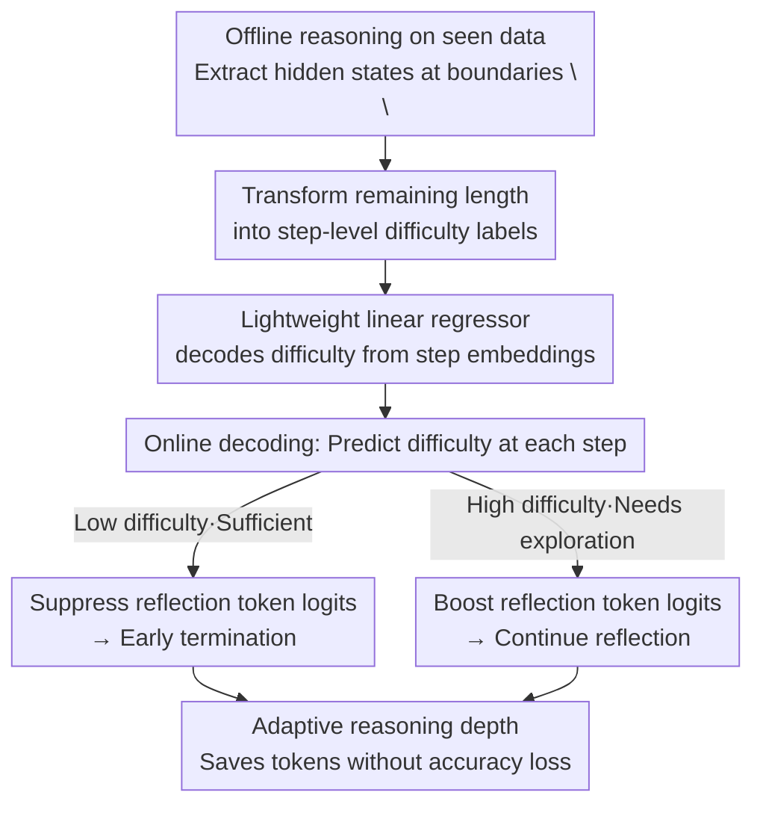

# DyCon: Dynamic Reasoning Control via Evolving Difficulty Modeling

**Conference**: ICML2026  
**arXiv**: [2606.07108](https://arxiv.org/abs/2606.07108)  
**Code**: https://github.com/yu-lin-li/DyCon  
**Area**: LLM Reasoning / Efficient Inference  
**Keywords**: Overthinking, Difficulty Modeling, Step-level Representation, Logit Intervention, Training-free

## TL;DR
DyCon discovers that "problem difficulty" evolves dynamically during the reasoning process and is linearly encoded in the step-level hidden representations of Large Reasoning Models (LRMs). It employs a lightweight linear regressor to estimate step-wise difficulty online and adjusts the logits of "reflection-related tokens" in real-time. This allows simple problems to converge early while difficult ones continue exploring, significantly compressing redundant reasoning tokens without sacrificing accuracy—all via a training-free process that does not modify model parameters.

## Background & Motivation
**Background**: Large Reasoning Models (LRMs, e.g., DeepSeek-R1, QwQ, Qwen3-Thinking) achieve high accuracy in complex tasks like mathematics and coding through long Chain-of-Thought (CoT) processes involving "repeated reflection-exploration-execution."

**Limitations of Prior Work**: These models lack precise control over "when to stop," leading to repeated reflection even on simple problems or tasks already solved correctly, generating massive redundant steps—a phenomenon known as "overthinking." This redundancy extends reasoning trajectories, increases deployment costs, and may introduce additional hallucinations.

**Key Challenge**: To address overthinking, one must "terminate timely when exploration is sufficient." However, prior judgments of "sufficiency" are **static**. One category (TrimR, FlashThink) relies on external models to evaluate reasoning, applying a uniform standard to all inputs and ignoring inherent difficulty variations. Another (DEER, etc.) uses manually designed deterministic metrics and empirical thresholds, which rely on human priors and generalize poorly across difficulties. A third category uses SFT/RL to train models for implicit difficulty judgment, but remains sensitive to data quantity/quality and prone to mode collapse. All these approaches treat "problem difficulty" as a fixed scalar determined before reasoning begins.

**Goal**: To **explicitly and fine-grainedly** model "evolving difficulty" to adaptively determine at each step whether to terminate or continue—saving computation for simple tasks while preserving thorough exploration for difficult ones.

**Key Insight**: The authors made two critical observations. First (Fig. 2a), for level-5 hard problems in MATH-500, prompting the model to self-assess difficulty at each step (1=nearly finished / 2=uncertain / 3=lacks key insight) shows that difficulty **gradually decreases** as reasoning progresses across four model families—indicating difficulty is dynamic rather than static. Second (Fig. 2b), using "remaining reasoning length" as a difficulty proxy to fit a linear regressor, the normalized difficulty can be predicted from step embeddings with a high $R^2$ on held-out sets—suggesting difficulty information is **linearly encoded** in the LRM's step-level hidden representations.

**Core Idea**: Since step-wise difficulty already resides in the model's own hidden representations, a lightweight linear probe can decode it. This decoded difficulty is then used to adjust the probabilities of "reflection tokens" in real-time, achieving training-free dynamic control of reasoning depth.

## Method

### Overall Architecture
DyCon decouples "reasoning length control" into offline and online stages. **Offline (Explicit Modeling of Evolving Difficulty)**: Reasoning is performed on a batch of seen data. At each step boundary (separated by `\n\n` between `<think>` and `</think>`), step embeddings are extracted, and the "remaining length" to the end of reasoning is recorded as the difficulty label. Logarithmic transformation and normalization are applied to the remaining length to create a bounded difficulty target for fitting a linear regressor. **Online (Difficulty-aware Dynamic Reasoning Control)**: During decoding, the regressor predicts difficulty from the current step embedding at each boundary. This prediction intervenes in the logits of "reflection-related tokens" (e.g., words like *wait*, *however*, *alternatively* that trigger re-thinking). If difficulty is low, their probabilities are suppressed to accelerate convergence; if high, they are raised to encourage continued exploration. This pipeline does not modify LRM parameters $\theta$, adding only a linear head.

### Key Designs

**1. Using "Remaining Length" to transform dynamic difficulty into measurable step-level labels**

The first barrier to modeling "step-wise difficulty" is the lack of existing annotations. The authors leverage the intuition that "harder problems require longer reasoning" but refine it into a **step-level proxy**. For the $s$-th step boundary, the difficulty proxy $r_s$ is defined as the remaining length $r_s := t_{\text{end}} - t_s$, where $t_s$ is the token index of the $s$-th step boundary (`\n\n`) and $t_{\text{end}}$ is the index of `</think>`. Intuitively, a larger $r_s$ implies significant reasoning remains, suggesting higher current difficulty. Correspondingly, the step embedding $\mathbf{e}^{(\ell)}_s$ at layer $\ell$ is defined as the hidden state $\mathbf{h}^{(\ell)}_{t_s}$ at the boundary. Due to the causal attention mask, this state naturally aggregates the context of all preceding steps. The brilliance lies in anchoring the abstract concept of "difficulty" to an objective metric (remaining length) that requires no manual labeling and can be backfilled after reasoning.

**2. Lightweight linear regressor to decode difficulty from hidden representations**

How is "difficulty knowledge" extracted from step embeddings? Since the second observation indicates an approximately linear correlation, DyCon avoids fine-tuning. Instead, it fits a **linear regressor** on a small seen set (600 samples from the MATH training set) using the log-transformed and normalized remaining length as the target. The linear approach offers three advantages: minimal samples are required for fitting, inference requires only a single matrix multiplication (near-zero overhead), and $\theta$ remains untouched, preserving the model's original capabilities. This contrasts with SFT/RL routes that are data-sensitive; DyCon acts as an interpretable linear probe "decoding existing latent knowledge."

**3. Difficulty-driven reflection token logit intervention**

How is the decoded difficulty translated into control? Overthinking manifests as the model repeatedly generating "reflection keywords." DyCon **directly intervenes in the logits of these reflection tokens** at每步边界: if predicted difficulty is low (sufficient reasoning), it suppresses the logits of reflection tokens to lower their probability and terminate reasoning faster; if difficulty is high, it boosts them to encourage deeper reflection. This is a **bidirectional, continuous** intervention based on difficulty, rather than a "hard cut-off." This distinguishes DyCon from aggressive pruning methods like Nothinking or ThinkPilot, which save tokens but cause accuracy to collapse on hard problems. DyCon achieves both token savings and accuracy preservation by allowing exploration first and then concluding decisively.

### Loss & Training
DyCon involves no training or fine-tuning of the LRM. The only "fitting" is for the linear difficulty regressor, aiming to minimize the regression error between predicted difficulty and the (log-normalized) remaining length labels. Intervention intensity is controlled by a few hyperparameters (reflection token set, logit adjustment magnitude). The overall system is training-free and plug-and-play.

## Key Experimental Results

Experiments covered four models (DeepSeek-R1-Distill-Qwen-7B, Qwen3-4B-Thinking-2507, QwQ-32B, etc.) across 12 benchmarks. Core finding: significantly reduced token consumption with minimal to no accuracy loss, sometimes even showing improvements.

### Main Results
The table below compares DyCon (Ours) vs. Baseline on DeepSeek-R1-Distill-Qwen-7B, showing Pass@1 / Average Tokens (#Tok).

| Benchmark | Baseline Pass@1 | Ours Pass@1 | ΔPass@1 | Δ#Tok |
|-----------|-----------------|-------------|---------|-------|
| MATH-500 | 92.0 | 92.0 | +0.0 | **−18.7%** |
| AIME24 | 50.0 | 53.3 | +3.3 | −16.2% |
| AIME25 | 36.7 | 36.7 | +0.0 | −18.6% |
| GSM8K | 90.6 | 91.1 | +0.5 | −27.5% |
| AMC23 | 87.5 | 90.0 | +2.5 | −38.6% |
| MMLU$_\text{algebra}$ | 90.0 | 91.0 | +1.0 | **−37.7%** |

Simpler tasks (GSM8K, AMC23, MMLU-algebra) show higher savings (−27% to −39%), aligning with the intuition that simple problems suffer most from overthinking. Hard problems (AIME) maintain or improve accuracy while achieving modest token savings.

### Ablation Study (Comparison with other efficient inference methods, DeepSeek-R1-Distill-Qwen-7B, AIME24)

| Method | Pass@1 ↑ | #Tok ↓ | Note |
|------|----------|--------|------|
| Baseline | 50.0 | 13008 | No control |
| Nothinking | 16.7 | 4222 | Aggressive pruning, accuracy collapses |
| ThinkPilot | 13.3 | 1229 | Extreme saving, accuracy collapses |
| DEER | 49.2 | 9839 | Manual metrics, slight accuracy drop |
| NoWait | 40.0 | 7281 | Suppressing wait words, significant drop |
| Manifold Steering | 53.3 | 8457 | Representation steering, stable accuracy |
| **Ours (DyCon)** | **53.3** | 10906 | Token savings with accuracy gain |

### Key Findings
- **Static/Aggressive pruning has a cost**: Nothinking and ThinkPilot slash tokens but cause AIME24 accuracy to plummet from 50.0 to 16.7/13.3—proving uniform pruning is disastrous for hard tasks. DyCon's bidirectional adjustment improves accuracy to 53.3, validating the necessity of a dynamic, case-by-case strategy.
- **Difficulty is indeed linearly decodable**: The high $R^2$ of the linear regressor validates the foundation of the method and allows for near-zero overhead.
- **Savings correlate negatively with problem difficulty**: Simple datasets (GSM8K/AMC23) save 27%–39%, while hard ones (AIME) save 16%–19%, indicating savings primarily come from removing redundancy in simple tasks.

## Highlights & Insights
- **Upgrading difficulty from a static scalar to a dynamic trajectory**: Unlike previous work judging difficulty once at the start, DyCon is the first to demonstrate and utilize the fact that "difficulty evolves during reasoning."
- **"Latent knowledge decoding" instead of "teaching"**: By reading existing difficulty info via linear probes, the method is training-free, preserves capabilities, and is interpretable. This paradigm could extend to controlling length, style, or confidence.
- **Precise intervention points**: Directly targeting reflection token logits hits the heart of the overthinking mechanism rather than vaguely shortening output.

## Limitations & Future Work
- **Dependency on "step boundary" and "reflection token" definitions**: The method relies on `\n\n` as boundaries and specific keywords as reflection triggers. This is clear in Math/Code CoT but less defined in open-ended writing or dialogue.
- **Circularity of remaining length as a difficulty proxy**: Using length to control length involves some self-reference. If a model is naturally verbose, the labels will be skewed.
- **Formula details**: The specific logit adjustment formulas and hyperparameters (magnitude, token sets) were not fully detailed in the shortened mechanism description; refer to the original paper for precise equations.

## Related Work & Insights
- **vs. DEER / FlashThink (Deterministic/External stopping)**: These rely on manual metrics or external models for "sufficiency" judgment using a fixed standard; DyCon uses internal representations for adaptive, self-contained estimation.
- **vs. Nothinking / ThinkPilot (Aggressive pruning)**: These uniformly suppress reflection, saving more tokens but breaking hard task accuracy; DyCon adjusts bidirectionally to protect hard tasks.
- **vs. Static Difficulty Estimation (Sheng/Zhao et al.)**: These provide a sample-level static score at the start; DyCon achieves both inter-sample and intra-reasoning dynamics.
- **vs. SFT/RL for termination**: Those are data-sensitive and prone to collapse; DyCon is a stabler, training-free alternative based on decoding latent knowledge.

## Rating
- Novelty: ⭐⭐⭐⭐⭐ The observation of "dynamic difficulty evolution + linear decodability" is insightful and cleanly translated into a method.
- Experimental Thoroughness: ⭐⭐⭐⭐ Extensive coverage with 4 models and 12 benchmarks; missing formula details in summary slightly affect reproducibility assessment.
- Writing Quality: ⭐⭐⭐⭐ Clear logic chain from observation to motivation to method.
- Value: ⭐⭐⭐⭐⭐ Practical for LRM deployment: training-free, plug-and-play, and significantly saves tokens without accuracy loss.

<!-- RELATED:START -->

## Related Papers

- [\[ICLR 2026\] EvolProver: Advancing Automated Theorem Proving by Evolving Formalized Problems via Symmetry and Difficulty](../../ICLR2026/llm_reasoning/evolprover_advancing_automated_theorem_proving_by_evolving_formalized_problems_v.md)
- [\[ICLR 2026\] Dynamic Early Exit in Reasoning Models](../../ICLR2026/llm_reasoning/dynamic_early_exit_in_reasoning_models.md)
- [\[ICML 2026\] Inference-Time Conformal Reasoning with Valid Factuality Control for Large Language Models](inference-time_conformal_reasoning_with_valid_factuality_control_for_large_langu.md)
- [\[ACL 2025\] Dynamic and Generalizable Process Reward Modeling (DG-PRM)](../../ACL2025/llm_reasoning/dgprm_dynamic_process_reward.md)
- [\[ICML 2026\] The Easy, the Hard, and the Learnable: Confidence and Difficulty-Adaptive Policy Optimization for LLM Reasoning](the_easy_the_hard_and_the_learnable_confidence_and_difficulty-adaptive_policy_op.md)

<!-- RELATED:END -->
