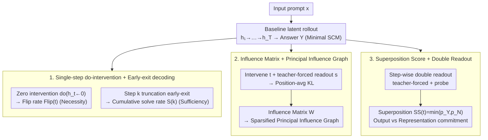

# Dynamics Within Latent Chain-of-Thought: An Empirical Study of Causal Structure

**Conference**: ICML 2026  
**arXiv**: [2602.08783](https://arxiv.org/abs/2602.08783)  
**Code**: https://github.com/J1mL1/causal-latent-cot  
**Area**: LLM Reasoning / Interpretability  
**Keywords**: Latent Chain-of-Thought, Causal Intervention, do-intervention, Structural Causal Model, Coconut, CODI

## TL;DR
The authors treat latent Chain-of-Thought (CoT) as an intervenable Structural Causal Model (SCM), performing step-wise `do`-interventions + early-exit decoding + teacher-forced readout for each continuous "thinking step." By systematically quantifying the step-level necessity, propagation structure, and trajectory superposition of Coconut/CODI in mathematical and commonsense reasoning, they find that latent steps are not a homogenized "deepening" but a structured interface characterized by high heterogeneity, non-local routing, and "output commitment" preceding "representation commitment."

## Background & Motivation
**Background**: While explicit CoT achieves significant results in reasoning tasks like GSM8K and CommonsenseQA, it incurs high decoding costs, produces verbose output, and may involve post-hoc rationalization rather than reflecting actual model computation. To alleviate these issues, methods like Coconut, CODI, and Sim-CoT replace "token-by-token thinking" with $T$ steps of implicit reasoning in the continuous representation space (latent CoT), using the final hidden state as the next input before decoding the answer.

**Limitations of Prior Work**: Intermediate computations in latent CoT are no longer discrete, readable, or editable tokens. Traditional interpretability tools for explicit CoT, such as deleting segments or shuffling rationales, are completely ineffective. Existing evaluations rely mostly on probing for correlation, but high probe activation might only indicate that information is "linearly separable" rather than being actively used by the model.

**Key Challenge**: Correlation-based methods can neither answer whether a step is causally necessary for the final answer nor characterize how information flows between $T$ steps. Furthermore, they cannot distinguish whether an early bias toward "Yes" in the output represents a collapse of the underlying representation. Essentially, a causal framework at the intervention level is missing.

**Goal**: Establish a step-resolved causal evaluation for latent CoT to address three questions: (RQ1) Which latent steps are causally necessary for correctness, and at which step does the answer become decodable; (RQ2) How does influence propagate between steps, and does it approximate a chain structure like explicit CoT; (RQ3) Does the intermediate trajectory retain multiple candidate answer patterns, and how large is the gap between output commitment and representation commitment.

**Key Insight**: Treat each latent state $h_t$ as a variable in an SCM. Overwrite it via $do(h_t \leftarrow \tilde h_t)$ and recompute downstream transitions, combined with teacher-forced readout to quantify effects. This is a natural extension of classical causal mediation analysis to continuous thinking trajectories.

**Core Idea**: Use a unified "intervention + readout" protocol to recast latent CoT from a "black-box depth" into a "manipulable causal system," placing step-level necessity, propagation structure, and superposition-commitment into a single reproducible experimental framework.

## Method

### Overall Architecture
The evaluation protocol, as shown in Figure 2, models a minimal SCM:

$$\text{(Hidden)}\; H_t = f_t(H_{<t}, x, \epsilon_t; \theta), \quad t=1,\dots,T; \qquad \text{(Output)}\; Y = g(H_{1:T}, x, \epsilon_y; \theta).$$

For a prompt $x$, the standard propagation provides a baseline trajectory $h_{1:T}$ and answer $y$. Three types of counterfactuals are constructed:

1.  **Early-exit decoding**: Truncate latent computation at step $k$ and decode directly from $h_k$ to detect the "earliest decodable step."
2.  **Single-step intervention**: $do(h_t \leftarrow \tilde h_t)$ (using zero intervention $\tilde h_t = \mathbf 0$), keeping downstream $f_{t'>t}$ unchanged to obtain $\tilde y^{(t)}$.
3.  **Intervention + Early readout**: Intervene at $t$ and use teacher-forced readout at $s > t$ to obtain distributions $p_{\text{base}}^{(s)}$ and $p_{\text{do}(t)}^{(s)}$. The KL divergence between them measures the influence intensity of $t \to s$.

The experiments focus on Coconut and CODI paradigms across GPT-2, Llama3-1B, and Qwen3-4B-Instruct. Datasets include GSM8K and CommonsenseQA, with StrategyQA used for the binary Yes/No analysis in RQ3.

### Key Designs

**1. Single-step `do`-intervention + Early-exit decoding: Measuring necessity and earliest decodable step**

This addresses the limitation where correlation metrics like probes cannot distinguish if a step is actively used. For each sample, a baseline trajectory is generated, followed by a counterfactual trajectory where the $t$-th latent state is zeroed ($do(h_t \leftarrow \mathbf 0)$). Downstream transitions and readout remain unchanged. The proportion of samples where the prediction flips, $\mathrm{Flip}(t)$, measures decision dependency. Early-exit defines the earliest correct step $k_i = \min\{k: \hat y_i^{(\le k)} = y_i^*\}$ and cumulative solve rate $S(k) = \frac{1}{N}\sum_i \mathbb{1}\{k_i \le k\}$. Zero intervention is chosen for stability across models. Necessity (flip rate) and sufficiency (early-exit decodability) are measured separately to distinguish between "answer is readable" and "subsequent steps are useless."

**2. Influence Matrix $W_{t,s}$ + Principal Influence Graph: Mapping influence propagation from $t$ to $s$**

To characterize information flow beyond single-point flip rates, the "intervention + teacher-forced readout" protocol defines a position-averaged KL divergence $\mathrm{KL}^{(i)}_{t\to s} = \frac{1}{|y_i^*|} \sum_u \mathrm{KL}(p_{\text{base}}^{(s)}(\cdot\mid y^*_{i,<u}) \| p_{\text{do}(t)}^{(s)}(\cdot \mid y^*_{i,<u}))$. The influence matrix $W_{t,s} = \mathbb E_i[\mathrm{KL}^{(i)}_{t\to s}]$ is sparsified using a threshold $\alpha = 0.1 \cdot \max(W)$ and top-1 outgoing edges to construct the Principal Influence Graph. Comparison is made with explicit CoT-SFT, where the rationale is segmented into $T=6$ parts. Indicators like locality, span, early-out, and late-in quantify the "wiring shape." Teacher-forcing is used to suppress temperature jitter, ensuring $W_{t,s}$ reflects propagation rather than noise.

**3. Superposition score + Double readout: Distinguishing output commitment from representational collapse**

Since different readout methods can yield conflicting conclusions, the authors study "dual-mode" prompts in StrategyQA where both Yes and No appear in random rollouts. At each step $t$, two readout methods estimate probabilities $p_Y(t)$ and $p_N(t)$: (i) teacher-forced template scoring, and (ii) a lightweight probe trained on frozen latents. The superposition score $\mathrm{SS}(t) = \min(p_Y(t), p_N(t))$ measures the degree of dual-mode representation. This separation allows the study of "output commitment" (bias in probability distribution) versus "representational commitment" (whether the alternative answer is still decodable from the hidden state).

### Loss & Training
This study does not involve training new models. It uses official CODI weights and a replication of Coconut across three base models; all analyses are inference-only. Probes are small linear classifiers trained on frozen latent states as an auxiliary readout for RQ3.

## Key Experimental Results

### Main Results: Step-level Necessity and Early-exit Decodability (RQ1)

| Setting | Phenomenon | Value/Direction |
|------|------|-----------|
| Zero intervention $\mathrm{Flip}(t)$ | Significant step-wise variance (non-flat) | Middle-step peaks in most GSM8K models |
| Dataset comparison | Math vs. Commonsense fluctuations | GSM8K $\mathrm{Flip}\sim 0.1$–$0.2$; CommonsenseQA $<0.1$ |
| Paradigm comparison | Coconut vs CODI (Same base) | Coconut shows higher flip rates, especially on GSM8K |
| Base model strength | Stronger models suppress flips | Qwen3-4B is significantly lower than GPT-2, step-dependent shape remains |
| Early-exit $S(k)$ | Dataset differences | CommonsenseQA saturates early; GSM8K climbs until $k=6$ |

### Ablation Study: Propagation Structure (RQ2, GSM8K)

| Configuration | locality | span | late-in | Interpretation |
|------|----------|------|---------|------|
| CoT-SFT (Explicit) | $\ge 0.6$ | Low | Low | Near-chain, adjacent propagation |
| Coconut (Latent) | Significantly lower | High | High | Dominated by long-range skip-connections |
| CODI (Latent) | Lower | High | Higher | Deviates from chain; early→final shortcuts less extreme than Coconut |

Principal Influence Graphs (Figure 5 vs Figure 6) visually confirm: CoT-SFT consists almost exclusively of adjacent edges, while Coconut/CODI are filled with long-distance edges that skip intermediate steps.

### Key Findings
- **Causal leverage is highly heterogeneous**: The $\mathrm{Flip}(t)$ curves vary significantly across steps, identifying "high-leverage" and "low-leverage" steps, contradicting the intuition that latent steps provide homogenized deepening.
- **Latent CoT does not inherit explicit CoT's chain topology**: Even though Coconut/CODI are distilled/compressed from explicit CoT, their internal "wiring" becomes skip-dominant, indicating latentization alters the mechanism rather than just the format.
- **Output commitment precedes representational commitment**: Teacher-forced readout shows early bias toward an answer, while probes reveal that the latent representation still supports alternative answers until the final steps. "Early decodability" does not equal "representation collapse."

## Highlights & Insights
- Shifts latent CoT interpretability from correlation-based probing to intervention-based causation. The framework is naturally applicable to other hidden-state reasoning paradigms like Sim-CoT.
- Clear "phenomenon–mechanism–nature" triadic logic: Heterogeneous leverage (Phenomenon) → Non-local routing (Mechanism) → Output vs Representation commitment (Nature).
- Engineering Insight: Latent budgets should not be treated as uniform depth. This suggests that future latent reasoning should allocate supervision or stopping rules based on functional roles rather than uniform CoT imitation loss.
- Honest "operator-conditioned" declaration regarding the influence matrix: The authors clarify that these are empirical structures under specific protocols, not identifiable "true" causal graphs, enhancing the credibility of the findings.

## Limitations & Future Work
- Intervention Limitation: All primary interventions use zeroing; more semantic interventions (e.g., swapping $h_t$ with a different sample) were only briefly tested in appendices.
- Readout Dependency: The influence graph relies heavily on teacher-forced readout; sampling-based decoding might yield different sparsity patterns.
- Scope of Findings: RQ3 focuses on binary StrategyQA; Open-ended numerical answers in GSM8K are harder to filter for dual-modes. Step budget was fixed at $T=6$; scaling effects on structure remain unknown.
- Future Directions: Incorporate "high-leverage step identification" into regularization; design commitment-aware stopping strategies; use continuous intervention families (linear interpolation) to quantify effect size beyond KL.

## Related Work & Insights
- **vs Coconut / CODI / Sim-CoT**: Provides the first step-resolved causal evaluation protocol instead of a new training algorithm. Quantitative evidence shows Coconut is more "early→final" while CODI is more distributed.
- **vs Explicit CoT Faithfulness (Turpin 2023, Pruthi 2020)**: Extends "segment deletion/permutation" logic to hidden layers, providing comparable faithfulness metrics for latent CoT.
- **vs Causal Mediation Analysis (Vig 2020, Meng 2022)**: Shares the `do`-intervention framework but targets the "step-wise structure of reasoning trajectories" rather than locating factual knowledge in specific layers.
- **Insights**: The probe-vs-teacher-forced readout comparison can be applied to "alignment collapse" in RLHF models; influence matrix rendering can compare "internal wiring" in mixture-of-depths or early-exit mechanisms.

## Rating
- Novelty: ⭐⭐⭐⭐ First systematic application of SCM and `do`-intervention to latent CoT.
- Experimental Thoroughness: ⭐⭐⭐⭐ 2 paradigms × 3 bases × 2 datasets Across 3 RQs, with extensive stability tests in appendices.
- Writing Quality: ⭐⭐⭐⭐⭐ Extremely clear structure and focused conclusions with specific design implications.
- Value: ⭐⭐⭐⭐ Provides actionable insights for latent budget allocation and stopping strategies.

<!-- RELATED:START -->

## Related Papers

- [\[ICML 2026\] Hidden Error Awareness in Chain-of-Thought Reasoning: The Signal Is Diagnostic, Not Causal](hidden_error_awareness_in_chain-of-thought_reasoning_the_signal_is_diagnostic_no.md)
- [\[ICML 2026\] A Formal Comparison Between Chain of Thought and Latent Thought](a_formal_comparison_between_chain_of_thought_and_latent_thought.md)
- [\[ICML 2026\] Stabilizing Recurrent Dynamics for Test-Time Scalable Latent Reasoning in Looped Language Models](stabilizing_recurrent_dynamics_for_test-time_scalable_latent_reasoning_in_looped.md)
- [\[ICML 2026\] How Far Ahead Do LLMs Plan? Uncovering the Latent Horizon in Chain-of-Thought Reasoning](how_far_ahead_do_llms_plan_uncovering_the_latent_horizon_in_chain-of-thought_rea.md)
- [\[ICML 2026\] Prioritize the Process, Not Just the Outcome: Rewarding Latent Thought Trajectories Improves Reasoning in Looped Language Models](prioritize_the_process_not_just_the_outcome_rewarding_latent_thought_trajectorie.md)

<!-- RELATED:END -->
