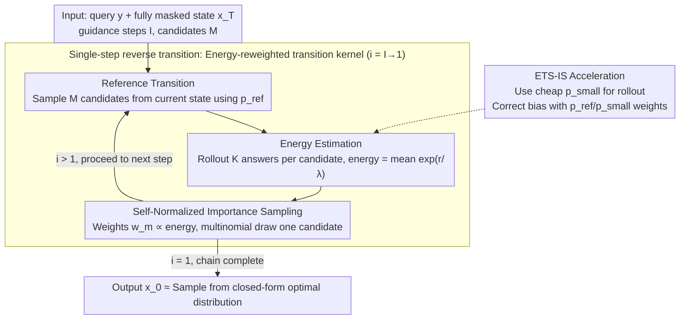

# ETS: Energy-Guided Test-Time Scaling for Training-Free RL Alignment

**Conference**: ICML 2026  
**arXiv**: [2601.21484](https://arxiv.org/abs/2601.21484)  
**Code**: https://github.com/sheriyuo/ETS (Available)  
**Area**: LLM Inference / Test-Time Scaling / Training-Free Alignment  
**Keywords**: KL-regularized RL closed-form solution, energy reweighting, Monte Carlo, importance sampling, ARM/DLM general purpose  

## TL;DR
ETS samples directly from the **closed-form optimal solution** of the KL-regularized RLHF objective, formulating it as "reference policy $\times$ conditional expectation of exponential reward (energy term)." By using Monte Carlo + Self-Normalized Importance Sampling to approximate this energy term at test time, it achieves or exceeds the performance of policies post-trained with RL **without any training**. It maintains practical latency through a lightweight proposal + Fast-dLLM.

## Background & Motivation

**Background**: RLHF, DPO, and GRPO have become standard for LLM post-training, aligning models to achieve "high reward while staying close to a reference policy $p_{\text{ref}}$." Theoretically, this KL-regularized objective has a closed-form solution $p(\boldsymbol{x}_0\mid\boldsymbol{y})\propto p_{\text{ref}}(\boldsymbol{x}_0\mid\boldsymbol{y})\exp(r/\lambda)$ as shown by Rafailov et al., yet existing RL pipelines still rely on iterative gradient methods to approximate it.

**Limitations of Prior Work**: Training-based RL requires expensive reward models and massive human preference data, suffering from training instability, hyperparameter sensitivity, and the need for retraining whenever the reward function changes. Meanwhile, MCMC-based methods like Power Sampling or Quest are training-free but remain slow due to their serial nature.

**Key Challenge**: A massive gap exists between "theoretically known closed-form optimal distribution" and "actual reliance on iterative training approximation." If one could **directly sample** that closed-form distribution at test time, all training-related issues would disappear.

**Goal**: (1) Provide a **reverse Markov transition kernel** representing the closed-form solution under a unified MLM framework (including ARM and Diffusion Language Models - DLM); (2) Design Monte Carlo estimation and accelerators to make it practical; (3) Provide theoretical guarantees for convergence rates and error accumulation.

**Key Insight**: The generation process is viewed as a reverse Markov chain from $\boldsymbol{x}_T\to\boldsymbol{x}_0$ (fixed left-to-right for ARM, dynamic unmasking for DLM). Deriving the optimal reverse transition kernel under this framework naturally decomposes into a "reference transition $\times$ energy term."

**Core Idea**: At each guidance step, the method implements "walking step-by-step toward the optimal distribution along the reverse chain" using candidate sampling, energy reweighting, and multinomial sampling, avoiding any parameter updates.

## Method

### Overall Architecture
ETS does not train any parameters; instead, it shifts alignment to inference time. It expresses the closed-form optimal solution of KL-regularized RLHF as a reverse Markov chain from $\boldsymbol{x}_T$ (fully masked) to $\boldsymbol{x}_0$ (final answer). Sampling proceeds along this chain, where "energy" reweights candidates toward higher-reward directions at every step. Given query $\boldsymbol{y}$, $I$ guidance steps, and $M$ candidates per step, the algorithm iterates from $i=I$ down to $i=1$: first, use $p_{\text{ref}}$ to sample $M$ candidates $\boldsymbol{x}_{t_{i-1}}(m)$ from the current state $\boldsymbol{x}_{t_i}$; then, estimate an energy value $\widehat{\mathcal E}$ for each candidate, normalize them into weights $w_m\propto\widehat{\mathcal E}$, and finally draw one candidate via multinomial distribution for the next step. Once the chain completes, $\boldsymbol{x}_0$ is approximately sampled from the optimal distribution $p(\boldsymbol{x}_0\mid\boldsymbol{y})$. Notably, when $I=1$ and $\lambda\to 0$, the process reduces to Best-of-N (BoN), meaning ETS strictly generalizes BoN while providing a finer "error-amortization" knob via $I$.

### Key Designs

**1. Energy-Reweighted Reverse Transition Kernel (Proposition 2): Reformulating closed-form solutions for step-wise sampling**

Although the closed-form solution $p(\boldsymbol{x}_0\mid\boldsymbol{y})\propto p_{\text{ref}}(\boldsymbol{x}_0\mid\boldsymbol{y})\exp(r/\lambda)$ is known, it cannot be directly sampled as it is defined over the entire sequence space, and the partition function requires summing over all possible answers. ETS solves this by converting it into step-wise transitions: for any $s<t$, $p(\boldsymbol{x}_s\mid\boldsymbol{x}_t,\boldsymbol{y})\propto p_{\text{ref}}(\boldsymbol{x}_s\mid\boldsymbol{x}_t,\boldsymbol{y})\cdot\mathbb E_{p_{\text{ref}}(\boldsymbol{x}_0\mid\boldsymbol{y},\boldsymbol{x}_s)}\!\big[\exp(r/\lambda)\big]$. The latter term is the "energy" $\mathcal{E}(\boldsymbol{y},\boldsymbol{x}_s)$, measuring the expected future reward from the partial state $\boldsymbol{x}_s$. This decomposes the intractable global distribution into a samplable reference transition and an estimable conditional expectation. This framework naturally unifies ARM (fixed generation) and DLM (dynamic unmasking).

**2. Monte Carlo Estimation + Self-Normalized Importance Sampling (Algorithm 1): Converting absolute probabilities to relative sampling**

Energy $\mathcal{E}$ has no analytical solution. ETS uses two layers of approximation: first, for each candidate $\boldsymbol{x}_{t_{i-1}}(m)$, it performs $K$ rollouts using $p_{\text{ref}}$ to estimate energy as $\widehat{\mathcal E}(\boldsymbol{y},\boldsymbol{x}_s)=\frac{1}{K}\sum_k\exp(r(\boldsymbol{y},\boldsymbol{x}_0(k))/\lambda)$. Second, it performs self-normalization across the $M$ candidates within the same step. Multinomial sampling according to these weights is equivalent to sampling from a restricted version of the optimal distribution. Proposition 3 provides an upper bound on the Total Variation distance $\widetilde{\mathcal O}(I/\sqrt M + I\epsilon)$, where $\epsilon$ is the energy estimation error—showing that the sampling distribution approaches the optimal one as $M$ increases, with error accumulating linearly with guidance steps $I$.

**3. Importance Sampling Acceleration ETS-IS (Algorithm 2): Using cheap proposal models while maintaining unbiasedness**

Design 2 faces a latency bottleneck: performing $M \times K$ rollouts with the large model $p_{\text{ref}}$ is extremely expensive. ETS-IS employs a cheaper proposal model $p_{\text{small}}$ for rollouts and corrects the bias using importance weights: $\mathcal E(\boldsymbol{y},\boldsymbol{x}_s)=\mathbb E_{p_{\text{small}}}\big[\tfrac{p_{\text{ref}}}{p_{\text{small}}}\exp(r/\lambda)\big]$. For ARM, a smaller model from the same family (e.g., Qwen3-1.7B) is used; for DLM, Fast-dLLM (KV cache + parallel decoding) serves as $p_{\text{small}}$. Theorem 1 proves that the IS version maintains the same $\widetilde{\mathcal O}(I/\sqrt M + I/\sqrt K)$ convergence rate. This optimization is crucial for making the method computationally viable.

### Loss & Training
**Completely training-free**. The only requirement is a "reward," which does not rely on a trained reward model but uses a self-consistency proxy: $K$ completions are sampled for each candidate, and a majority vote is taken. Reward is 1 if the answer matches the majority, else 0. Experiments show this proxy is more accurate than logits-based confidence or entropy measures.

## Key Experimental Results

### Main Results
Pass@1 results for MATH500, GSM8K, HumanEval, and GPQA-Diamond. ARM models used: Qwen3-1.7B/8B (non-thinking); DLM: LLaDA-8B-Instruct.

| Model | Dataset | Base | Best-of-N | Power Sampling | RL Trained | **ETS / ETS-IS** |
|---|---|---|---|---|---|---|
| Qwen3-8B (ARM) | MATH500 | baseline | Gain | Gain (Slow) | Strong | **Exceeds RL** |
| Qwen3-8B (ARM) | GPQA-Diamond | baseline | Medium | Medium | Strong | **Optimal** |
| LLaDA-8B (DLM) | HumanEval | baseline | Medium | Medium | LLaDA-1.5 | **Exceeds LLaDA-1.5** |
| Qwen3-1.7B (ARM) | GSM8K | baseline | Medium | Slow | Strong | **Optimal** (no IS) |

(General trend: ETS consistently outperforms test-time scaling baselines and often surpasses specialized RL post-trained models of the same scale.)

### Ablation Study

| Configuration | Key Effect | Description |
|---|---|---|
| Full ETS ($I>1$) | Optimal | Multi-step guidance amortizes error |
| $I=1, \lambda\to 0$ | Reduces to Best-of-N | Proves ETS strictly generalizes BoN |
| Without IS (pure $p_{\text{ref}}$) | Same accuracy, high latency | IS is the primary speedup |
| Reward as logits/entropy | Accuracy drop | Self-consistency reward is closest to oracle |
| Increasing $M$ | Acc↑, Latency↑ | Consistent with $1/\sqrt M$ convergence |

### Key Findings
- **Training-free alignment** reached parity with or outperformed RL post-training on major benchmarks, suggesting current RL training may be an inefficient way to approximate the samplable closed-form solution.
- $I=1$ is not always optimal or the worst—guidance steps and $\lambda$ jointly determine the performance point.
- Using a well-aligned small model as an IS proposal provides the best efficiency/accuracy trade-off.

## Highlights & Insights
- **Methodological Highlight**: Extends the "closed-form RLHF solution" into a samplable reverse Markov kernel for both ARM and DLM. This provides a blueprint for migrating score-based/diffusion guidance to discrete MLMs.
- **Theoretical Closure**: From Proposition 2 (Kernel) to Proposition 3 (Error) and Theorem 1 (IS convergence), the theoretical framework is sound and mirrors error accumulation results in diffusion models ($\propto I$).
- **Transferable Trick**: "Self-normalization + lightweight proposal IS" is a template that can be applied to other inference-time alignment tasks (preference, agent reward shaping, tool selection) and is naturally compatible with batching.

## Limitations & Future Work
- The self-consistency reward proxy assumes "majority = correct," which may fail in creative, open-ended, or multi-solution tasks.
- Error bounds assume a uniform error $\epsilon$ per step; a more refined state-dependent bound remains an open problem.
- DLM acceleration depends heavily on the Fast-dLLM implementation; the availability of small, well-aligned DLMs would further improve speed.
- Integration with speculative decoding and quantization has not been fully explored.

## Related Work & Insights
- **vs Power Sampling / Quest**: Both aim to sample from the optimal distribution, but MH algorithms are inherently serial. ETS uses batched MC + IS, allowing for massive parallelism.
- **vs Continuous Diffusion Guidance**: While others (e.g., Dang 2025) derive similar formulas for continuous diffusion, this work adapts it for discrete MLMs.
- **vs Best-of-N**: BoN is a special case ($I=1$). ETS provides a more general framework with theoretical guarantees.

## Rating
- **Novelty**: ⭐⭐⭐⭐⭐ (Successfully "sampling" the closed-form solution to beat RL without training is a paradigm shift)
- **Experimental Thoroughness**: ⭐⭐⭐⭐ (Covers ARM/DLM across 4 benchmarks and multiple ablation targets)
- **Writing Quality**: ⭐⭐⭐⭐ (Logical derivation from closed-form units to IS acceleration)
- **Value**: ⭐⭐⭐⭐⭐ (Provides a viable path for "test-time alignment," potentially bypassing entire RLHF pipelines)

<!-- RELATED:START -->

## Related Papers

- [\[ICML 2026\] Beyond Two-Stage Training: Cooperative SFT and RL for LLM Reasoning](beyond_two-stage_training_cooperative_sft_and_rl_for_llm_reasoning.md)
- [\[ICLR 2026\] Understanding the Role of Training Data in Test-Time Scaling](../../ICLR2026/llm_reasoning/understanding_the_role_of_training_data_in_test-time_scaling.md)
- [\[ICML 2026\] Prism: Efficient Test-Time Scaling via Hierarchical Search and Self-Verification for Discrete Diffusion Language Models](prism_efficient_test-time_scaling_via_hierarchical_search_and_self-verification_.md)
- [\[ICML 2026\] Less Diverse, Less Safe: The Indirect But Pervasive Risk of Test-Time Scaling in Large Language Models](less_diverse_less_safe_the_indirect_but_pervasive_risk_of_test-time_scaling_in_l.md)
- [\[ICML 2026\] Lookahead Sample Reward Guidance for Test-Time Scaling of Diffusion Models](lookahead_sample_reward_guidance_for_test-time_scaling_of_diffusion_models.md)

<!-- RELATED:END -->
