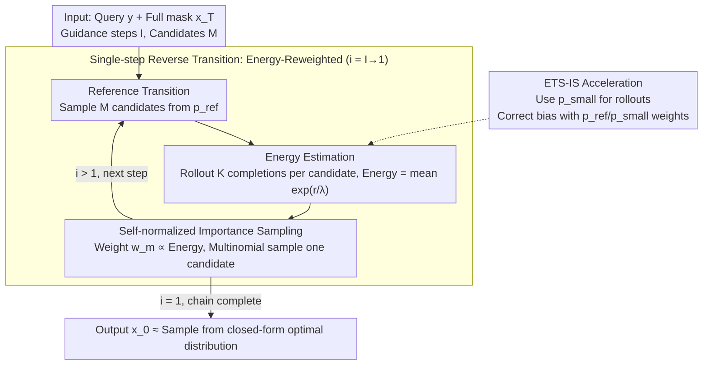

# ETS: Energy-Guided Test-Time Scaling for Training-Free RL Alignment

**Conference**: ICML 2026  
**arXiv**: [2601.21484](https://arxiv.org/abs/2601.21484)  
**Code**: https://github.com/sheriyuo/ETS (Available)  
**Area**: LLM Inference / Test-time Scaling / Training-free Alignment  
**Keywords**: KL-regularized RL Closed-form Solution, Energy Reweighting, Monte Carlo, Importance Sampling, Generic ARM/DLM

## TL;DR
ETS samples directly from the **closed-form optimal solution** of the KL-regularized RLHF objective, formulating it as "reference policy $\times$ conditional expectation of exponential reward (energy term)". By approximating this energy term at test-time using Monte Carlo and self-normalized importance sampling, it achieves or exceeds the performance of RL-trained policies **without training**, while maintaining acceptable latency via lightweight proposals and Fast-dLLM.

## Background & Motivation

**Background**: RLHF, DPO, and GRPO have become standard for LLM post-training to align models with "high reward + low divergence from reference policy $p_{\text{ref}}$". Theoretically, Rafailov et al. provided a closed-form solution for this KL-regularized objective: $p(\boldsymbol{x}_0\mid\boldsymbol{y})\propto p_{\text{ref}}(\boldsymbol{x}_0\mid\boldsymbol{y})\exp(r/\lambda)$. However, existing RL pipelines still rely on iterative gradient-based methods to approximate it.

**Limitations of Prior Work**: Training-based RL requires expensive reward models and massive human preferences, suffers from training instability and hyperparameter sensitivity, and necessitates retraining whenever rewards change. Additionally, training-free MH sampling methods like Power Sampling or Quest are inherently serial and slow.

**Key Challenge**: A significant gap exists between "the optimal distribution has a known closed-form solution" and "actual implementation still relies on iterative training". If one could **directly sample** from that closed-form distribution at test-time, training issues would be eliminated.

**Goal**: (1) Derive the **reverse Markov transition kernel** form of the closed-form solution under a unified MLM framework (including ARM and Diffusion Language Models (DLM)); (2) Design Monte Carlo estimation and accelerators for practical use; (3) Provide theoretical guarantees for convergence rates and error accumulation.

**Key Insight**: Treat the generation process as a reverse Markov chain from $\boldsymbol{x}_T\to\boldsymbol{x}_0$ (fixed left-to-right for ARM, dynamic unmasking for DLM). Within this framework, the optimal reverse transition kernel naturally decomposes into "reference transition $\times$ energy term".

**Core Idea**: For each guidance step, use candidate sampling + energy reweighting + multinomial sampling to "step towards the optimal distribution" along the reverse chain, avoiding any parameter updates.

## Method

### Overall Architecture
ETS does not train any parameters; instead, it shifts alignment to inference time. It reformulates the closed-form solution of KL-regularized RLHF as a reverse Markov chain from $\boldsymbol{x}_T$ (full mask) to $\boldsymbol{x}_0$ (complete answer). Generation proceeds step-by-step along this chain, using "energy" to reweight candidates toward higher rewards. Given a query $\boldsymbol{y}$, guidance steps $I$, and $M$ candidates per step, the algorithm iterates from $i=I$ to $i=1$: first, $M$ candidates $\boldsymbol{x}_{t_{i-1}}(m)$ are sampled from the current state $\boldsymbol{x}_{t_i}$ via the reference policy $p_{\text{ref}}$; then, an energy value $\widehat{\mathcal E}$ is estimated for each candidate and self-normalized into weights $w_m\propto\widehat{\mathcal E}$; finally, one candidate is sampled via multinomial distribution as the next state. Upon chain completion, $\boldsymbol{x}_0$ is approximately sampled from the optimal distribution $p(\boldsymbol{x}_0\mid\boldsymbol{y})$. Notably, when $I=1, \lambda\to 0$, the process degrades to Best-of-N (BoN), meaning ETS strictly generalizes BoN, while $I$ provides a finer knob to distribute alignment across multiple steps to amortize error.

### Key Designs

**1. Energy-Reweighted Reverse Transition Kernel (Proposition 2): Reformulating the closed-form solution for step-wise sampling**

Although the RLHF closed-form solution $p(\boldsymbol{x}_0\mid\boldsymbol{y})\propto p_{\text{ref}}(\boldsymbol{x}_0\mid\boldsymbol{y})\exp(r/\lambda)$ is known, it cannot be directly sampled as it is defined over the entire sequence space where the partition function is intractable. ETS breaks this by converting it into a step-wise transition on the chain: for any $s<t$, $p(\boldsymbol{x}_s\mid\boldsymbol{x}_t,\boldsymbol{y})\propto p_{\text{ref}}(\boldsymbol{x}_s\mid\boldsymbol{x}_t,\boldsymbol{y})\cdot\mathbb E_{p_{\text{ref}}(\boldsymbol{x}_0\mid\boldsymbol{y},\boldsymbol{x}_s)}\!\big[\exp(r/\lambda)\big]$. The latter term is the "energy" $\mathcal{E}(\boldsymbol{y},\boldsymbol{x}_s)$, which measures the expected future reward from the partial state $\boldsymbol{x}_s$. This splits the intractable global optimal distribution into two operable parts: a transition term directly sampleable from $p_{\text{ref}}$, and a conditional expectation term estimable via Monte Carlo. This decomposition naturally unifies ARM and DLM, as they only differ in their transition kernels $p_{\text{ref}}(\boldsymbol{x}_s\mid\boldsymbol{x}_t,\boldsymbol{y})$.

**2. Monte Carlo Energy Estimation + Self-Normalized Importance Sampling (Algorithm 1): Converting absolute probability to relative sampling**

Since energy $\mathcal{E}$ lacks an analytical solution and the partition function is intractable, ETS employs two approximations. First, for each candidate $\boldsymbol{x}_{t_{i-1}}(m)$, it generates $K$ full rollouts $\boldsymbol{x}_0(k)$ using $p_{\text{ref}}$ and estimates energy as $\widehat{\mathcal E}(\boldsymbol{y},\boldsymbol{x}_s)=\frac{1}{K}\sum_k\exp(r(\boldsymbol{y},\boldsymbol{x}_0(k))/\lambda)$. Second, it performs self-normalization across the $M$ candidates in the same step. The resulting weights represent the relative optimal probability; multinomial sampling then equates to sampling from a restricted version of the optimal distribution over these $M$ candidates. This bypasses absolute probabilities in favor of batch-relative probabilities—a stable trick inherited from energy-based models. Proposition 3 provides a Total Variation distance upper bound $\widetilde{\mathcal O}(I/\sqrt M + I\epsilon)$, where $\epsilon$ is the energy estimation error. Larger $M$ and better estimation lead to closer approximation of the true optimal distribution, with error accumulating linearly with guidance steps $I$.

**3. Importance Sampling Acceleration ETS-IS (Algorithm 2): Unbiased rollout with cheap models**

While Design 2 is functional, it suffers from high latency because $M \times K$ rollouts using the large model $p_{\text{ref}}$ are prohibitively expensive. ETS-IS utilizes a cheaper proposal model $p_{\text{small}}$ for rollouts and corrects bias using importance weights via the identity $\mathcal E(\boldsymbol{y},\boldsymbol{x}_s)=\mathbb E_{p_{\text{small}}}\big[\tfrac{p_{\text{ref}}}{p_{\text{small}}}\exp(r/\lambda)\big]$. For ARM, Qwen3 models with the same tokenizer are used as $p_{\text{small}}$. For DLM, which lacks aligned small models, Fast-dLLM (KV cache + parallel decoding) is used. Although variance increases, Theorem 1 proves that for sufficiently large $K$, the IS version maintains the same convergence order $\widetilde{\mathcal O}(I/\sqrt M + I/\sqrt K)$, successfully shifting the latency bottleneck from large-model rollouts to small-model rollouts.

### Loss & Training
**No training is involved**, so there is no loss function. Instead of training a reward model, a self-consistency proxy is used for the "reward": $K$ completions are sampled for each candidate, and a majority vote is taken. If a completion matches the majority, reward=1, otherwise 0. Experiments indicate that this proxy's reward distribution is closer to ground-truth than logits-based confidence or entropy measures.

## Key Experimental Results

### Main Results
Pass@1 evaluations were conducted on MATH500, GSM8K, HumanEval, and GPQA-Diamond. ARM used Qwen3-1.7B/8B (non-thinking), and DLM used LLaDA-8B-Instruct. Baselines included Base, Beam Search, Best-of-N, Power Sampling, and RL-trained versions (Verl or LLaDA-1.5).

| Model | Dataset | Base | Best-of-N | Power Sampling | RL (Trained) | **ETS / ETS-IS** |
|---|---|---|---|---|---|---|
| Qwen3-8B (ARM) | MATH500 | baseline | Gain | Gain (Slow) | Strong baseline | **Beat RL** |
| Qwen3-8B (ARM) | GPQA-Diamond | baseline | Moderate | Moderate | Strong | **Optimal** |
| LLaDA-8B (DLM) | HumanEval | baseline | Moderate | Moderate | LLaDA-1.5 | **Beat LLaDA-1.5** |
| Qwen3-1.7B (ARM) | GSM8K | baseline | Moderate | Slow | Strong | **Optimal** (No IS) |

(General trend: ETS consistently outperforms training-free baselines across all benchmarks and often beats specialized RL post-trained models of similar size.)

### Ablation Study

| Configuration | Key Effect | Description |
|---|---|---|
| Full ETS ($I>1$) | Optimal | Distributes error across multiple guidance steps |
| $I=1, \lambda\to 0$ | Degrades to BoN | Proves ETS strictly generalizes BoN |
| Remove IS (Pure $p_{\text{ref}}$) | Same accuracy, Latency ↑↑ | IS is critical for performance |
| Reward as Logits/Entropy | Accuracy drop | Self-consistency reward is closest to oracle |
| Increase $M$ | Accuracy ↑, Latency ↑ | Matches $1/\sqrt M$ convergence |

### Key Findings
- "Training-free alignment" performs **comparably or better than RL post-training** on mainstream reasoning benchmarks, suggesting current RL training might be inefficiently approximating what can be directly sampled.
- $I=1$ is not always the best or worst; error does not accumulate linearly, and the optimal working point is determined jointly by guidance steps and $\lambda$ (Remark 2).
- Using aligned Qwen3 small models as IS proposals yields the best balance between efficiency and accuracy; speculative decoding (EAGLE-3) is less effective due to batching incompatibilities.

## Highlights & Insights
- **Methodological Highlights**: Converts the known but ignored closed-form RLHF solution into a generic reverse chain transition kernel for ARM/DLM, complete with error analysis. It serves as a template for migrating score-based/diffusion guidance to discrete MLMs.
- **Theoretical Closure**: Proposition 2 (Transition) $\to$ Proposition 3 (Error) $\to$ Theorem 1 (IS Acceleration Error) provides a rigorous framework, mirroring error accumulation results ($\propto I$) found in diffusion models.
- **Transferable Trick**: The "Self-normalization + lightweight proposal IS" combination can be applied to other inference-time alignment tasks (dialogue preference, agent reward shaping), naturally supporting batch parallelism.

## Limitations & Future Work
- The self-consistency proxy reward requires "majority = correct", which fails in creative, open-ended, or multi-solution tasks.
- Error bounds assume consistent guidance error $\epsilon$, but actual errors vary significantly across $\boldsymbol{x}_t$; state-dependent bounds remain an open problem.
- DLM acceleration relies on Fast-dLLM; future availability of aligned small DLMs could further reduce latency.
- Integration with speculative decoding and quantization has yet to be fully explored.

## Related Work & Insights
- **vs. Power Sampling / Quest**: Both target the RL optimal distribution, but MH algorithms are inherently serial. ETS utilizes batched MC + IS, making it significantly faster through parallelism.
- **vs. Dang 2025 / Uehara 2024**: While they derive similar formulas for continuous-time diffusion, this work applies to discrete MLMs and unifies ARM/DLM.
- **vs. Best-of-N / Beam Search**: BoN is a special case ($I=1$); Beam Search is deterministic and may not match the optimal probability distribution. ETS offers both theoretical guarantees and empirical gains.

## Rating
- Novelty: ⭐⭐⭐⭐⭐ Direct sampling of closed-form RL solutions to rival RL training is a significant paradigm shift.
- Experimental Thoroughness: ⭐⭐⭐⭐ Covers ARM/DLM across 4 benchmarks with multiple acceleration ablations.
- Writing Quality: ⭐⭐⭐⭐ Rigorous derivations and logical flow; notation is heavy but readable.
- Value: ⭐⭐⭐⭐⭐ Provides a viable implementation of test-time alignment that could potentially replace complex RLHF pipelines.

<!-- RELATED:START -->

## Related Papers

- [\[ICLR 2026\] Understanding the Role of Training Data in Test-Time Scaling](../../ICLR2026/llm_reasoning/understanding_the_role_of_training_data_in_test-time_scaling.md)
- [\[ICML 2026\] Beyond Two-Stage Training: Cooperative SFT and RL for LLM Reasoning](beyond_two-stage_training_cooperative_sft_and_rl_for_llm_reasoning.md)
- [\[ICML 2026\] Prism: Efficient Test-Time Scaling via Hierarchical Search and Self-Verification for Discrete Diffusion Language Models](prism_efficient_test-time_scaling_via_hierarchical_search_and_self-verification_.md)
- [\[ICML 2026\] Less Diverse, Less Safe: The Indirect But Pervasive Risk of Test-Time Scaling in Large Language Models](less_diverse_less_safe_the_indirect_but_pervasive_risk_of_test-time_scaling_in_l.md)
- [\[ICML 2026\] Lookahead Sample Reward Guidance for Test-Time Scaling of Diffusion Models](lookahead_sample_reward_guidance_for_test-time_scaling_of_diffusion_models.md)

<!-- RELATED:END -->
