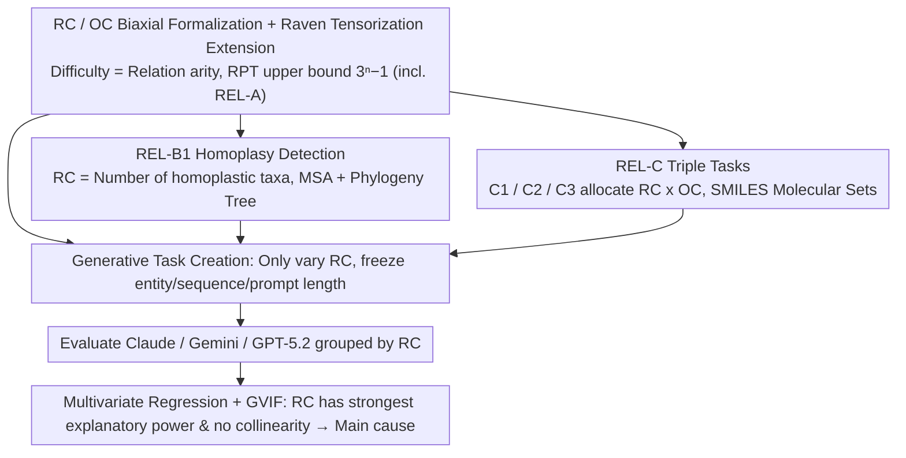

# Evaluating Relational Reasoning in LLMs with REL

**Conference**: ICML 2026  
**arXiv**: [2604.12176](https://arxiv.org/abs/2604.12176)  
**Code**: Yes (Project Page + GitHub + Hugging Face)  
**Area**: LLM Evaluation / Relational Reasoning / Science Reasoning Benchmark  
**Keywords**: Relational Complexity, Raven's Progressive Tensor, Homoplasy, Molecular Isomers, High Arity Binding

## TL;DR
The authors utilize "Relational Complexity" (RC) from cognitive science—the number of independent variables that must be simultaneously bound in a single reasoning step—as a unified axis for measuring task difficulty. They construct REL, a generative benchmark spanning Algebra, Biology, and Chemistry, and find that the accuracy of frontier LLMs (Claude Opus 4.5 / Gemini 3 Pro / GPT-5.2) declines monotonically as RC increases, a failure mode that cannot be mitigated by test-time compute, ICL, or external tools.

## Background & Motivation
**Background**: Current LLM evaluations often use input length, token count, entity count, or multi-hop counts as proxies for "difficulty." While graph-based relational reasoning benchmarks (multi-hop QA, Knowledge Graphs) exist, they often couple relational structures with specific representations.

**Limitations of Prior Work**: (1) "Difficulty" may stem from increased prompt length, complex representations, or the need for background knowledge rather than true relational reasoning bottlenecks; (2) existing evaluations fail to distinguish between "model inability" and "benchmark saturation," making scores difficult to interpret; (3) existing graph-based evaluations focus solely on graph structures and do not transfer to real-world scientific scenarios like algebra, chemistry, or biology.

**Key Challenge**: **The arity of relational binding (the number of independent slots held simultaneously)**, the true dimension of difficulty, is confounded by coarse proxies like entity count and prompt length. Models perform well on tasks that "look hard (many entities) but have low arity" but collapse on tasks with "few entities but high arity," leading to severely distorted benchmark scores.

**Goal**: Decomposition into three sub-problems—(i) formalize "relational difficulty" as a controllable, parameterizable quantity; (ii) observe LLM behavior by varying only RC while freezing other variables across scientific domains; (iii) verify whether RC is indeed the primary driver of performance, rather than a spurious correlation with variables like prompt length or entity count.

**Key Insight**: The authors adopt the concept of Relational Complexity (RC) used by cognitive scientists like Halford et al. in studying Raven's Progressive Matrices—the number of independent slots required for a reasoning step equals the arity of the relation. This quantity is naturally representation-agnostic and can be independently tuned across different domains (digital matrices, molecular sets, phylogenetic trees).

**Core Idea**: Use "number of independent variables simultaneously bound per reasoning step = relation arity" as the unified difficulty axis (RC), paired with "difficulty of identifying/representing a single slot" (OC, Operand Complexity) to isolate representation complexity. This allows constructing generative task sets across Algebra, Biology, and Chemistry where RC is adjustable while other confounding variables are controlled, isolating the LLM failure mode of "high-arity reasoning collapse" from noise.

## Method

### Overall Architecture
REL is not a fixed dataset but a **generative benchmark framework**: it first formalizes "relational reasoning difficulty" as a parameterizable number RC, then enables domain-specific task generators to vary only RC while freezing confounding variables like entity count, sequence length, or prompt length. Accuracy is compared by RC groupings. The framework spans three disciplines—**REL-A (Algebra)** based on Raven's Progressive Matrices and a new tensor-based extension RPT; **REL-B (Bio)** which requires identifying homoplasy (convergent evolution) in Multiple Sequence Alignment (MSA) + Phylogeny trees; and **REL-C (Chem)** featuring three tasks of varying RC/OC ratios around isomers, maximum common substructures, and missing isomer completion. All three share the same RC/OC definitions, allowing failures from different domains to be compared on a single difficulty axis.

### Key Designs

**1. RC / OC Biaxial Formalization + Raven Tensorization Extension: Deconstructing "Difficulty" into Separable Metrics**

The foundation of the benchmark is addressing where "difficulty" originates—a question long confounded by entity count and prompt length. The authors split it into two orthogonal dimensions: RC (Relational Complexity), defined as the "number of independent variables/operands requiring simultaneous binding to complete a reasoning step" (the arity of the relation); and OC (Operand Complexity), defined as the "difficulty of identifying and representing a single slot itself." In Raven's Progressive Matrices, RC can be counted mechanically—the authors provide 7 rules covering different arities, such as A1 (Constant) with $\text{RC}=1$, A2 (Progression) with $\text{RC}=2$, A3 (Permutation) where $n$ values are randomly permuted per row $\text{RC}=n$, and A4 (Row-Sum) where the last element is the signed sum of the preceding $n-1$ items $\text{RC}=n$. Since traditional RPMs have an RC cap of 4, which is too shallow for contemporary LLMs, the authors generalize 2D RPMs to $n$-dimensional Raven's Progressive Tensors (RPT), raising the theoretical upper bound to $\text{RC}_{n\text{-dim}} \le 3^{n}-1$. By adding a single dimension, RC can be pushed to 4–6 or higher on small inputs with nearly constant entity counts. This step is critical because RC is formalized as a pure number decoupled from specific representations, allowing the effect of RC to be cleanly isolated from prompt length and entity counts, providing the formal basis for subsequent regression attribution.

**2. REL-B1 Homoplasy Detection: Projecting Abstract Arity onto Real Biological Reasoning**

To prove the RC framework applies to realistic scientific scenarios, REL-B1 provides a phylogeny tree and corresponding MSA, requiring models to pass two steps: identifying if homoplasy exists (different lineages independently evolving the same motif) and accurately listing all involved taxa. The synthetic generator is controlled by four parameters: number of homoplastic taxa $N_{ht}$, number of leaves $N_{\text{leaves}}$, sequence length $L_{\text{seq}}$, and conserved motif length $L_{\text{motif}}$. Crucially, $\text{RC} = N_{ht}$ because the model must simultaneously hold the positions of all homoplastic taxa in the tree within working memory to verify them, making the number of bound slots equal to $N_{ht}$. The other three parameters are used as "non-RC confounding factors" for ablation across 2,600 generated problems. This design yields two benefits: by scanning $N_{ht}$ while freezing other parameters, multivariate regression + GVIF collinearity analysis can quantify RC's independent contribution relative to other difficulty proxies, moving from correlational to stronger causal evidence that RC is the primary performance driver. Furthermore, homoplasy—a problem of joint binding across multiple lineages—is a representative scientific problem, ensuring external validity and countering criticisms of the benchmark being "too synthetic."

**3. REL-C Triple Tasks: Separating RC and OC with Controlled Experiments within a Discipline**

To confirm that RC, rather than OC, dominates the performance drop, a controlled experiment within the same discipline is required. REL-C designs three tasks on molecular sets (SMILES representation), intentionally varying the RC to OC ratio: C1 Isomer Set Classification ($\text{RC}=2$, low OC), requiring sequential comparison of molecular formulas against a shared formula (sequential binary binding); C2 Maximum Common Substructure (MCS) ($\text{RC}=2$, medium OC), involving binary binding but requiring MCS computation between two molecules at each step, significantly raising OC; and C3 Missing Isomer Completion (high RC, high OC), which requires simultaneously holding the "complete isomer space" and the "observed subset," where space size $N_{\text{isomers}}$ averages 29, structurally blocking "pairwise binary update" shortcuts. C2 uses a bidirectional substructure matching metric, $\text{IsSubstructure} = \tfrac{1}{2}(S_{\text{pred}\subseteq\text{true}} + S_{\text{true}\subseteq\text{pred}})$, to capture both precision and completeness. These three form two comparison groups: C1 vs C2 varies only OC while keeping RC=2, verifying that OC alone can degrade performance; C1/C2 vs C3 increases both OC and RC, proving the performance drop from increased RC is much steeper than from OC, identifying RC as the primary driver—all while using SMILES, a standard representation for chemists, to maintain task realism.

### Evaluation Protocol
The paper assesses three frontier LLMs: Claude Opus 4.5, Gemini 3 Pro Preview, and GPT-5.2. REL-A uses 8 candidate answers (trivial accuracy 12.5%); REL-B1 requires simultaneous correctness on both existence and the taxa set; REL-C uses strict matching after SMILES canonicalization (C2 uses IsSubstructure; C3 uses recall/precision/F1). To rule out explanations like "the model didn't think long enough" or "lack of tools," the authors include three types of inference-time interventions: test-time compute (max-tokens 4096 / 8192 / 16384), one-shot in-context learning (10% samples in REL-C), and tool use (RDKit for REL-C3).

## Key Experimental Results

### Main Results

| Task | RC Range | Main Metric | Performance Change as RC Increases |
|------|---------|----------|-------------------|
| REL-A1/A2 | RC=1/2 | accuracy | Models reach 91% on $30 \times 30$ RPM |
| REL-A3 (Permutation) | RC=n | accuracy | Claude/Gemini drop to trivial 12%, GPT-5.2 drops ~40% at $30 \times 30$ |
| REL-A4 (Row-Sum) | RC=n | accuracy | Only GPT-5.2 gets 21% at $9 \times 9$; others fail entirely |
| REL-A7 (Neighborhood Sum) | RC=6 (fixed) | accuracy | All three models ~12% (≈ trivial) |
| REL-B1 (homoplasy) | RC=$N_{ht}$=4→25 | Strict Match | 35% → 1% (average across models) |
| REL-C1 → C3 | RC + OC rise | Task completion | 65.7% → 38.1% → 26.0% (total drop 39.7%) |

### Ablation Study

| Intervention | Setting | Key Findings |
|------|------|----------|
| Multivariate Regression (REL-B1) | RC vs motif ratio / seq len / distance / prompt len | Explanatory power: Claude 24% / Gemini 32% / GPT 44%; next strongest factor max 17% |
| GVIF Collinearity | Five variables | GVIF for RC, distance, motif ratio all < 1.3; no collinearity threat |
| Test-Time Compute | 4k / 8k / 16k tokens | REL-A4/A5 rose only 2-3%; REL-C avg only 0.4%; cannot bridge RC gap |
| In-Context Learning | REL-C one-shot 10% samples | C1 +6.6% / C2 +3.4% / C3 +6.0%; relative ranking remains unchanged |
| Tool Use (RDKit) | REL-C3 Full | Avg recall only 0.094; still declines with molecule count (0.109 → 0.079) |

### Key Findings
- **RC is the true bottleneck**: In REL-B1, multivariate regression shows RC's explanatory power is 2–6 times that of the next strongest factor, with almost no collinearity with entity count or prompt length—meaning RC is not a spurious correlation for "long prompts."
- **Persistent failure modes**: Test-time compute (+8x tokens), ICL, and external RDKit tools only yielded single-digit or stagnant improvements, suggesting high-arity binding is not a "not thinking long enough" problem but potentially an architectural bottleneck.
- **OC and RC are separable**: In REL-C1 vs C2 (both RC=2), increasing OC alone dropped completion from 65.7% to 38.1%; however, C2 → C3 (with significantly higher RC) dropped another 12%, indicating the effects are additive and the impact of RC is steeper.
- **Input size is unreliable**: On REL-A5/A6, models actually performed better as input size increased (more redundant signals), proving entity count is not a monotonic proxy for difficulty.

## Highlights & Insights
- **Bridging Cognitive Science and LLM Evaluation**: Directly transferring the RC concept used in 1990s RPM research proves that "seemingly outdated cognitive science metrics" are among the sharpest analytical tools for contemporary LLMs—an insightful "interdisciplinary" approach.
- **Generative + Parameterized**: REL is not a static test set but allows scanning RC as needed to generate new problems, making it naturally resistant to contamination—as soon as a model "solves" it, increasing RC by 5 will immediately differentiate performance.
- **$3^n-1$ RPT Upper Bound**: Just adding one dimension pushes RC to 26 or 80, avoiding the engineering nightmare of "linearly enlarging input to increase difficulty." Evaluating future difficulty could scale exponentially; this tensorization logic could benefit other grid-based benchmarks (e.g., ARC).
- **The failure of tool use is the most interesting negative result**: With RDKit, the average recall for C3 was only 0.094. This suggests the bottleneck for high-RC tasks is not "molecular parsing" but "simultaneously holding relational bindings for multiple isomers," puncturing the optimistic narrative that "tools fix everything" and reminding agent designers of the arity bottleneck.

## Limitations & Future Work
- The authors acknowledge: multiple-choice evaluation may hide finer failure details; context-length limits lead to some invalid responses; tasks remain somewhat synthetic.
- Self-identified: (1) Only evaluated three closed-source frontier models, leaving open whether the RC bottleneck is an architecture issue regardless of scale or something mitigated by scaling; (2) equating RC directly to $N_{ht}$ in REL-B1 is a simplification—topological distance of homoplastic taxa on the tree likely affects binding difficulty; (3) failure to use Reasoning Chains (CoT) to locate "which specific binding step failed"; (4) the RC definition assumes "simultaneous holding," but actual reasoning might be chunked/streamed.
- Improvement ideas: Add "topological RC" (distance of binding paths), use mechan-interp tools (attention patterns / activation patching) to find which heads fail at high RC, and design targeted fine-tuning.

## Related Work & Insights
- **vs Liu et al. (2025a) graph relational benchmark**: That work also uses generative relational reasoning but only varies the graph structure. REL elevates RC to a task-agnostic level and extends it to non-graph archetypes like molecules and phylogeny trees.
- **vs Camposampiero et al. (2025a/b) I-Raven-X**: The authors explicitly **do not introduce perceptual noise/confounders**, focusing on pure relational binding rather than perceptual robustness—a design trade-off allowing for clean attribution of RC effects.
- **vs ProteinGym / DNALongBench / TAPE / PEER**: These bio-benchmarks focus on single sequences or pair evaluations. REL-B1 is the first to formalize "joint reasoning across multiple sequences + phylogenetic constraints" as an RC-tunable task.
- **vs Multi-hop QA (HotpotQA / 2WikiMultihop / MuSiQue)**: Multi-hop chains RC=2 relations. REL pushes single-step RC to 6+, orthogonal to the "hops" dimension; combining "hop $\times$ arity" could form a 2D difficulty space in the future.

## Rating
- Novelty: ⭐⭐⭐⭐⭐ Formalizing and migrating RC/OC from cognitive science to LLM evaluation with RPT tensorization and triple-discipline generators is rare and conceptually deep.
- Experimental Thoroughness: ⭐⭐⭐⭐ Three domains + three frontier models + multivariate regression + GVIF + three inference-time interventions; only missing open-source/scaling experiments.
- Writing Quality: ⭐⭐⭐⭐ Clear definitions and intuitive charts (RC variance explanation, C1→C3 steps); RPT upper bound math is slightly dense.
- Value: ⭐⭐⭐⭐⭐ Provides the evaluation community with a parameterizable, contamination-resistant, and interpretable ruler, offering concrete answers to the "benchmark saturation" debate.

<!-- RELATED:START -->

## Related Papers

- [\[ACL 2025\] FineReason: Evaluating and Improving LLMs' Deliberate Reasoning through Reflective Puzzle Solving](../../ACL2025/llm_reasoning/finereason_evaluating_and_improving_llms_deliberate_reasoning_through_reflective.md)
- [\[ACL 2026\] Self-Reinforcing Controllable Synthesis of Rare Relational Data via Bayesian Calibration](../../ACL2026/llm_reasoning/self-reinforcing_controllable_synthesis_of_rare_relational_data_via_bayesian_cal.md)
- [\[ICML 2026\] FloorplanQA: A Benchmark for Spatial Reasoning in LLMs Using Structured Representations](floorplanqa_a_benchmark_for_spatial_reasoning_in_llms_using_structured_represent.md)
- [\[NeurIPS 2025\] Self-Evaluating LLMs for Multi-Step Tasks: Stepwise Confidence Estimation for Failure Detection](../../NeurIPS2025/llm_reasoning/self-evaluating_llms_for_multi-step_tasks_stepwise_confidence_estimation_for_fai.md)
- [\[ICML 2026\] Deliberate Evolution: Agentic Reasoning for Sample-Efficient Symbolic Regression with LLMs](deliberate_evolution_agentic_reasoning_for_sample-efficient_symbolic_regression_.md)

<!-- RELATED:END -->
