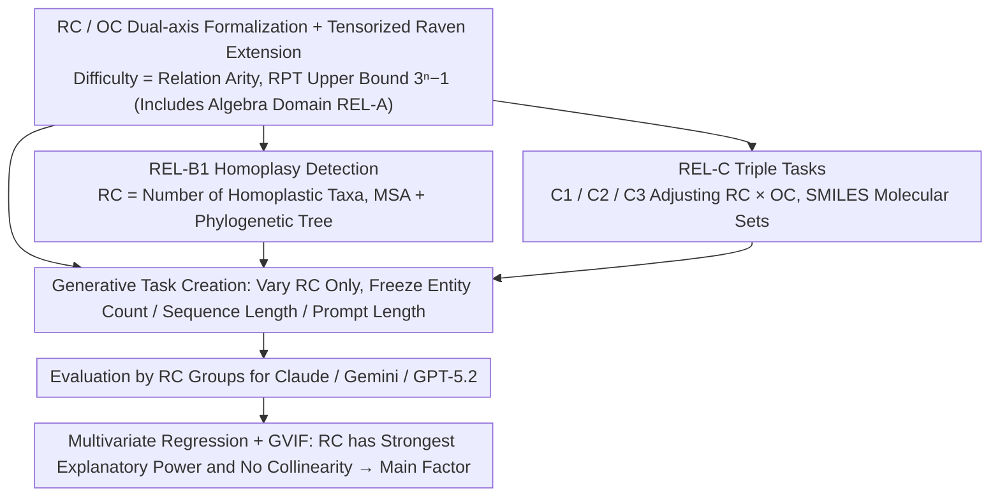

# Evaluating Relational Reasoning in LLMs with REL

**Conference**: ICML 2026  
**arXiv**: [2604.12176](https://arxiv.org/abs/2604.12176)  
**Code**: Yes (Project Page + GitHub + Hugging Face)  
**Area**: LLM Evaluation / Relational Reasoning / Science Reasoning Benchmark  
**Keywords**: Relational Complexity, Raven's Progressive Tensor, Homoplasy, Molecular Isomers, High-arity binding

## TL;DR
The authors adopt "Relational Complexity" (RC) from cognitive science — the number of independent variables that must be simultaneously bound in a single reasoning step — as a unified axis for measuring task difficulty. They construct REL, a generative benchmark spanning algebra, biology, and chemistry. Findings indicate that the accuracy of frontier LLMs (Claude Opus 4.5 / Gemini 3 Pro / GPT-5.2) monotonically decreases as RC increases, and this bottleneck cannot be resolved by test-time compute, ICL, or external tools.

## Background & Motivation
**Background**: Current LLM evaluations often use input length, token count, entity count, or multi-hop counts as proxies for "difficulty." While graph-based relational reasoning benchmarks (multi-hop QA, knowledge graphs) exist, they frequently couple relational structures with specific representations.

**Limitations of Prior Work**: (1) "Difficulty" may stem from longer prompts, complex representations, or required background knowledge rather than true relational reasoning bottlenecks; (2) existing evaluations fail to distinguish between "model inability" and "model saturation," making benchmark scores difficult to interpret; (3) current graph-based evaluations focus solely on graph structures and do not transfer to real-world scientific scenarios like algebra, chemistry, or biology.

**Key Challenge**: The **arity of relational binding (the number of independent slots that must be held simultaneously)**, the true dimension of difficulty, is confounded by coarse proxies like entity count and prompt length. Models may perform well on tasks that "look hard (many entities) but have low arity" yet collapse on tasks with "few entities but high arity," resulting in severely distorted benchmark reports.

**Goal**: To decompose the problem into three sub-questions: (i) formalizing "relational difficulty" into a controllable, parameterizable quantity; (ii) observing LLM behavior within multiple scientific domains by varying only RC while freezing other variables; (iii) verifying whether RC is the primary driver of performance rather than a spurious correlation mixed with variables like prompt length or entity count.

**Key Insight**: The authors borrow the concept of Relational Complexity used by cognitive scientists like Halford et al. when studying Raven's Progressive Matrices—the number of independent slots required for a reasoning step equals the arity of the relation. This quantity is naturally detached from representation and can be independently adjusted across different domains (numerical matrices, molecular sets, phylogenetic trees).

**Core Idea**: Use "number of independent variables bound simultaneously = relational arity" as the unified difficulty axis RC. This is paired with "Operand Complexity" (OC), the difficulty of identifying/representing a single slot, to isolate representational complexity. The authors construct generative task sets across algebra, biology, and chemistry where RC is adjustable while confounding variables are controlled, isolating the "high-arity reasoning collapse" failure mode from noise.

## Method

### Overall Architecture
REL is not a static problem set but a **generative benchmark framework**. It formalizes "relational reasoning difficulty" as a parameterizable number RC. Task generators for each discipline vary only RC while freezing confounding variables like entity count, sequence length, and prompt length. Accuracies are then compared across RC groups. The framework spans three disciplines: **REL-A (Algebra)** based on Raven's Progressive Matrices and a new tensorized extension RPT; **REL-B (Biology)** requiring models to identify homoplasy (convergent evolution) in Multiple Sequence Alignments (MSA) and phylogenetic trees; and **REL-C (Chemistry)** involving three tasks with varying RC/OC ratios centered on isomers, maximum common substructures, and missing isomer completion. All share the same RC/OC definitions, allowing failures from different domains to be compared on the same difficulty axis.

### Key Designs

**1. RC / OC Dual-axis Formalization + Raven Tensorized Extension: Decomposing "Difficulty" into Independently Scannable Numbers**
The foundation is to address where "difficulty" originates. It is split into two orthogonal dimensions: RC (Relational Complexity), defined as the "number of independent variables/operands that must be bound to complete one reasoning step" (the arity), and OC (Operand Complexity), defined as the "difficulty of identifying and representing a single slot itself." In Raven's Progressive Matrices, RC can be counted mechanically. The authors define 7 rules: A1 (Constant) where all rows are equal ($\text{RC}=1$), A2 (Progression) with adjacent recursion ($\text{RC}=2$), A3 (Permutation) where each row contains the same $n$ values randomly permuted ($\text{RC}=n$), and A4 (Row-Sum) where the last element is the signed sum of the preceding $n-1$ elements ($\text{RC}=n$). Since traditional RPMs have an RC cap of 4, the authors extend 2D RPMs to $n$-dimensional Raven's Progressive Tensors (RPT), raising the theoretical bound to $\text{RC}_{n\text{-dim}} \le 3^{n}-1$. This allows increasing RC to 4-6 or higher with minimal changes to entity count, enabling the isolation of RC effects from prompt length and entity density.

**2. REL-B1 Homoplasy Detection: Projecting Abstract Arity to Real Biological Reasoning**
To prove the RC framework applies to scientific scenarios, REL-B1 provides a phylogenetic tree and its corresponding MSA. Models must identify if homoplasy exists (independent evolution of the same motif in different lineages) and list all involved taxa. The generator is controlled by four parameters: number of homoplastic taxa $N_{ht}$, number of leaves $N_{\text{leaves}}$, sequence length $L_{\text{seq}}$, and conserved motif length $L_{\text{motif}}$. Crucially, $\text{RC} = N_{ht}$, as the model must simultaneously hold all homoplastic taxa positions in working memory to verify them. The other three parameters serve as "non-RC confounding factors" for ablation. This allows multivariate regression and GVIF collinearity analysis to quantify RC's independent contribution, providing causal evidence that RC is the primary performance driver in typical science problems.

**3. REL-C Triple Tasks: Decoupling RC and OC via Controlled Experiments**
To confirm that RC, rather than OC, dominates performance degradation, REL-C uses molecular sets (SMILES) for three tasks with different RC/OC ratios: C1 Isomer Set Classification ($\text{RC}=2$, Low OC), which requires sequential binary binding to compare molecular formulas; C2 Maximum Common Substructure (MCS) ($\text{RC}=2$, Medium OC), which uses binary binding but requires finding MCS between two molecules, raising OC; and C3 Missing Isomer Completion (High RC, High OC), where the model must hold the "complete isomer space" and "observed subset" simultaneously. The space size $N_{\text{isomers}}$ averages 29, preventing simple binary updates. C2 uses a bidirectional substructure matching metric: $\text{IsSubstructure} = \tfrac{1}{2}(S_{\text{pred}\subseteq\text{true}} + S_{\text{true}\subseteq\text{pred}})$. This setup proves that while raising OC lowers performance, the drop from raising RC is significantly steeper.

### Evaluation Protocol
Frontier LLMs (Claude Opus 4.5, Gemini 3 Pro Preview, GPT-5.2) are evaluated. REL-A provides 8 candidates (12.5% trivial accuracy). REL-B1 requires correct identification of both existence and the taxa set. REL-C uses strict matching for canonical SMILES. Three types of inference-time interventions are used: test-time compute (max-token 4k/8k/16k), one-shot in-context learning, and tool use (RDKit for REL-C3).

## Key Experimental Results

### Main Results

| Task | RC Range | Primary Metric | Performance Change with Increased RC |
|------|---------|----------|-------------------|
| REL-A1/A2 | RC=1/2 | accuracy | Models reach 91% on $30 \times 30$ RPM |
| REL-A3 (Permutation) | RC=n | accuracy | Claude/Gemini drop to trivial 12%; GPT-5.2 drops ~40% at $30 \times 30$ |
| REL-A4 (Row-Sum) | RC=n | accuracy | Only GPT-5.2 scores 21% at $9 \times 9$; others fail |
| REL-A7 (Neighborhood Sum) | RC=6 (Fixed) | accuracy | All models ~12% (≈ trivial) |
| REL-B1 (Homoplasy) | RC=$N_{ht}$=4→25 | Exact Match | 35% → 1% (Mean across models) |
| REL-C1 → C3 | RC ↑ + OC ↑ | Task Completion | 65.7% → 38.1% → 26.0% (Total drop 39.7%) |

### Ablation Study

| Intervention | Setting | Key Finding |
|------|------|----------|
| Multivariate Regression (REL-B1) | RC vs motif ratio / seq len / distance / prompt len | RC Explanation: Claude 24% / Gemini 32% / GPT 44%. Next strongest factor < 17% |
| GVIF Collinearity | Five variables | GVIF for RC, distance, and motif ratio all < 1.3 (no collinearity) |
| Test-Time Compute | 4k / 8k / 16k tokens | REL-A4/A5 rose 2-3%; REL-C averaged 0.4% Gain; cannot bridge RC gap |
| In-Context Learning | REL-C one-shot | C1 +6.6% / C2 +3.4% / C3 +6.0%; relative rankings unchanged |
| Tool Use (RDKit) | REL-C3 full set | Mean recall only 0.094; still decreases with molecule count (0.109 → 0.079) |

### Key Findings
- **RC is the genuine bottleneck**: Multivariate regression on REL-B1 shows RC's explanatory power is 2-6x that of the next factor, with zero collinearity with entity count or prompt length—proving RC is not a "long prompt" proxy.
- **Persistent failure modes**: Test-time compute (+8x tokens), ICL, and external RDKit tools provide only marginal or zero gains, suggesting high-arity binding is an architectural bottleneck rather than a lack of "thinking time" or examples.
- **OC and RC are separable**: Comparing REL-C1 vs C2 (both $\text{RC}=2$), increasing OC alone dropped completion from 65.7% to 38.1%. However, C2 → C3 (increased RC) dropped it a further 12%, showing RC has a steeper impact.
- **Input size is unreliable**: In REL-A5/A6, models sometimes improved with larger inputs (more redundant signals), confirming entity count is not a monotonic proxy for difficulty.

## Highlights & Insights
- **Applying CogSci RC to LLM Evaluation**: Directly borrowing concepts from 1990s RPM research proves that "seemingly outdated" cognitive difficulty measures are the sharpest tools for analyzing frontier LLMs.
- **Generative and Parameterized**: REL is not a static set; scanning RC and generating new problems makes it naturally resistant to contamination. If a model "solves" it, raising RC by 5 immediately creates a new gap.
- **RPT Upper Bound $3^n-1$**: Raising RC to 26 or 80 by simply adding a dimension avoids the engineering hurdle of linearly expanding inputs to increase difficulty. This tensorization approach is applicable to other grid-based benchmarks (e.g., ARC).
- **Tool Use Failure**: Giving RDKit during C3 resulted in a mean recall of only 0.094, indicating the bottleneck is "simultaneous binding of multiple isomers" rather than "molecular parsing." This challenges the narrative that "tools solve everything."

## Limitations & Future Work
- The authors acknowledge that multiple-choice evaluation may hide granular failures, and context-length limits lead to some invalid responses.
- Critical insights: (1) Only three closed-source models were tested; (2) REL-B1 simplifies RC by equating it to $N_{ht}$, ignoring the topological distance of taxa; (3) the lack of CoT localization prevents identifying exactly *which* step of binding failed; (4) the RC definition assumes "simultaneous holding," whereas real reasoning might use streaming/chunking.
- Future Work: Introducing "Topological RC" (binding path distance) and using mechanistic interpretability (attention patterns) to find which heads fail at high RC for targeted fine-tuning.

## Related Work & Insights
- **Vs. Liu et al. (2025a)**: While both use generative relational reasoning, REL elevates RC to a task-agnostic level and extends to non-graph scientific scenarios.
- **Vs. Camposampiero et al. (2025a/b)**: Unlike I-Raven-X, this work excludes perceptual noise to focus purely on relational binding.
- **Vs. Bio Benchmarks (ProteinGym, etc.)**: REL-B1 is the first to formalize "multi-sequence joint reasoning + phylogenetic constraints" as an RC-adjustable task.
- **Vs. Multi-hop QA**: Multi-hop links $\text{RC}=2$ relations; REL pushes single-step RC to $6+$. Future work could combine "hop × arity" into a 2D difficulty space.

## Rating
- Novelty: ⭐⭐⭐⭐⭐ Formalizing CogSci RC/OC for LLMs with RPT extensions and triple-domain generators is highly original.
- Experimental Thoroughness: ⭐⭐⭐⭐ Three domains, three frontier models, and extensive regression/ablation cover the ground, though restricted to closed-source models.
- Writing Quality: ⭐⭐⭐⭐ Clear definitions and intuitive visualizations (RC vs. variance) make the complex concepts accessible.
- Value: ⭐⭐⭐⭐⭐ Provides a parameterized, contamination-resistant, and interpretable ruler for the reasoning community.

<!-- RELATED:START -->

## Related Papers

- [\[ACL 2025\] FineReason: Evaluating and Improving LLMs' Deliberate Reasoning through Reflective Puzzle Solving](../../ACL2025/llm_reasoning/finereason_evaluating_and_improving_llms_deliberate_reasoning_through_reflective.md)
- [\[ACL 2026\] Self-Reinforcing Controllable Synthesis of Rare Relational Data via Bayesian Calibration](../../ACL2026/llm_reasoning/self-reinforcing_controllable_synthesis_of_rare_relational_data_via_bayesian_cal.md)
- [\[ICML 2026\] FloorplanQA: A Benchmark for Spatial Reasoning in LLMs Using Structured Representations](floorplanqa_a_benchmark_for_spatial_reasoning_in_llms_using_structured_represent.md)
- [\[NeurIPS 2025\] Self-Evaluating LLMs for Multi-Step Tasks: Stepwise Confidence Estimation for Failure Detection](../../NeurIPS2025/llm_reasoning/self-evaluating_llms_for_multi-step_tasks_stepwise_confidence_estimation_for_fai.md)
- [\[AAAI 2026\] Evaluating, Synthesizing, and Enhancing for Customer Support Conversation](../../AAAI2026/llm_reasoning/evaluating_synthesizing_and_enhancing_for_customer_support_conversation.md)

<!-- RELATED:END -->
