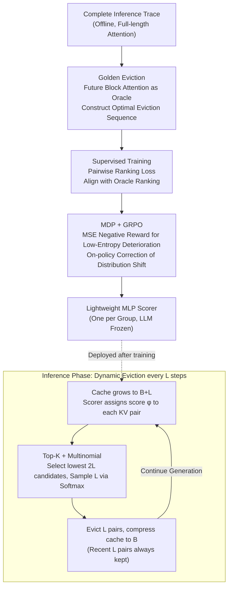

# ForesightKV: Optimizing KV Cache Eviction for Reasoning Models by Learning Long-Term Contribution

**Conference**: ICML 2026  
**arXiv**: [2602.03203](https://arxiv.org/abs/2602.03203)  
**Code**: https://github.com/RUCAIBox/ForesightKV  
**Area**: LLM Efficiency / KV Cache Compression / Long-term Reasoning  
**Keywords**: KV cache eviction, Reasoning models, Golden Eviction, GRPO, Long-term contribution prediction

## TL;DR
ForesightKV trains a lightweight scoring model to dynamically evict KV pairs based on "future attention contribution." It first distills an optimal eviction sequence from complete traces using the Golden Eviction algorithm to serve as supervisory signals. Then, it fine-tunes the strategy using GRPO reinforcement learning with a reward based on the "sum of squares of loss increments for low-entropy tokens." On AIME2024/2025, it outperforms SnapKV/H2O/R-KV with only half the KV budget; a 4K budget preserves 99% of the original model's performance.

## Background & Motivation
**Background**: Reasoning LLMs (DeepSeek-R1, Qwen3 series) achieve breakthroughs in mathematics and coding tasks by generating Chain-of-Thought (CoT) sequences of 8K–32K tokens. However, the KV cache grows linearly with every token generated—for instance, Qwen3-4B consumes 4.5 GB of BFloat16 VRAM for a single sample at a 32K length, severely limiting concurrent batch sizes. Since decoding is memory-bound, moving massive KV caches also slows down throughput. The mainstream solution is KV cache eviction: permanently discarding a portion of KV pairs every few steps based on an "importance score" to compress the cache back to a budget $B$. Representative methods include SnapKV (using recent window attention), H2O (using accumulated attention), and R-KV (designed for reasoning models).

**Limitations of Prior Work**: Training-free rule-based methods rely on heuristics (recent window attention, cumulative attention, position, etc.) to estimate KV importance, which fails to capture the complex attention patterns in reasoning data. The authors observed three types of heads in Qwen3-4B: global (vertical bars), position-dependent (local), and semantic-dependent (block-wise, dynamic switching). Using the attention of recent tokens as an observation window, as in SnapKV, causes KV pairs that are "semantically unrelated to the window but important for the future" to be discarded, leading to significant performance drops. Another line of research, such as training-based DMC, evaluates importance only once at the start of a sequence, failing to capture dynamic changes in importance across generation stages.

**Key Challenge**: KV importance is a **function of future attention scores**, yet all existing methods only see **historical** information, essentially "using the past to predict the future." Worse, eviction harms **low-entropy tokens** (the top 80% low-entropy detail/deterministic tokens) much more than high-entropy decision tokens. Table 1 shows that under the same budget, the loss for low-entropy tokens increases by 147% while high-entropy tokens only increase by 52%. Errors occur precisely on numbers, symbols, and entities—facts that appeared earlier—and a single error can derail the subsequent reasoning.

**Goal**: (1) Identify a "gold standard" eviction strategy that utilizes future information to provide training supervision; (2) Train a lightweight scoring model to distill "future awareness" into a strategy that considers only the current state; (3) Align the training objective with the loss of low-entropy tokens that truly impact reasoning quality.

**Key Insight**: Since offline traces provide complete future attention, an oracle can be used to construct an "optimal eviction sequence" that minimizes future damage. This sequence is used for supervised pairwise ranking to train an MLP scorer. The entire decoding process is then modeled as an MDP and fine-tuned using GRPO on group-relative advantage, specifically targeting "low-entropy and significantly deteriorated" tokens.

**Core Idea**: By combining two-stage training—distillation from oracle future attention and rewards based on low-entropy token loss—an MLP learns to "predict the long-term contribution of each KV pair," upgrading rule-based eviction to data-driven strategy learning.

## Method

### Overall Architecture
The core problem ForesightKV addresses is that KV importance is inherently a function of future attention, yet rule-based methods are limited to history. The solution is to train a lightweight MLP scorer as a "future contribution predictor." The pipeline is split into inference and training. During inference, for every $L$ new tokens generated ($L=256$), the KV cache grows to $B+L$. For each layer and attention group (GQA shared KV), the scoring model $\pi_\theta$ takes features $\mathbf{x}_n = \text{Concat}(\mathbf{k}_n, \mathbf{v}_n, \mathbf{a}_n)$ (where $\mathbf{a}_n$ represents fixed-length statistical features of attention scores) and outputs importance $\phi_n$. The most recent $L$ pairs are kept, and $L$ pairs are evicted from the remainder to compress the cache back to $B$. The LLM remains frozen; only a few MLP scorers are trained, resulting in minimal overhead. The training side consists of two stages: Golden Eviction distills the optimal eviction sequence from offline traces, followed by an on-policy refinement where eviction is modeled as an MDP and fine-tuned via GRPO, using "large deterioration of low-entropy tokens" as a negative reward.

### Key Designs

**1. Golden Eviction: Using Future Attention as an Oracle for Supervisory Labels**

Rule-based methods (SnapKV/H2O/R-KV) estimate future importance using historical attention, inevitably missing the block-wise, dynamically switching patterns of semantic-dependent heads. ForesightKV breaks this by using the complete future attention hidden in offline traces as the ground truth. Specifically, the full attention matrix $\mathbf{A}^h \in \mathbb{R}^{T\times T}$ is calculated once. Along the query dimension, it is segmented into blocks of size $L$, and average pooling is applied across heads within each GQA group to obtain block scores $\tilde{\mathbf{a}}_t^{h'}$. For an eviction decision at step $t$, each KV pair $i$ is assigned a "future score" $\alpha_{i,t}^{h'} = \max_{t\le j\le M}(\tilde{\mathbf{a}}_{i,j}^{h'})$ based on the maximum block score across **all future blocks**. Pairs with the highest $\alpha$ are retained, and the lowest $B-L$ are discarded. Appendix A proves that this "evict lowest future attention" strategy has the minimal impact on output upper bounds. With this oracle trajectory, the scorer uses Pairwise Ranking Loss $\mathcal{L}_{\text{supervised}} = \sum_t \sum_{\alpha_i < \alpha_j} \max(0, m-(\phi_i - \phi_j))$ to align with the oracle's future score ranking. The strength of this signal is evident: the loss ratio for the Golden Eviction trajectory in Table 2 is only 1.07, compared to 1.41+ for R-KV/SnapKV, providing a robust foundation for distillation.

**2. MDP + GRPO: Correcting Distribution Shift with Real Reasoning Rewards**

Supervised training faces a risk: the scorer learns the oracle trajectory, but during inference, it selects its own KV pairs, potentially entering state distributions not seen during training. Furthermore, "imitating the oracle" does not necessarily equate to "improving reasoning quality." ForesightKV models the decoding process as an MDP where the state $s_t$ is the current KV cache, the action $a_t$ is selecting $B$ pairs from $B+L$ to keep, and the policy is the per-group scorer $\pi_{\theta_{h,l}}$. The reward focuses on the critical observation from §2.2 (low-entropy tokens are the bottleneck): it first filters for tokens $E=\{w_t \mid w_t \in \mathbf{w}_\text{low},\ \Delta\mathcal{L}(w_t)>\eta\}$ where the original entropy is in the bottom 80% (low-entropy) and the loss increment after eviction exceeds threshold $\eta$. The reward is the negative MSE of the loss increment on this subset: $R_t = -\sum_{t\in E}[\Delta\mathcal{L}(w_t)]^2$, using the square to heavily penalize catastrophic deterioration. Optimization uses GRPO: $G$ different eviction trajectories are sampled for the same sequence, advantages $\hat A_t = (R_t - \text{Mean})/\text{Std}$ are calculated via group-relative normalization, and the advantage is broadcast to all eviction steps in the sequence to jointly optimize all scorers (with PPO clipping and KL regularization). Table 4 justifies this design: minimizing total loss blindly drops performance to 50.6 (base 51.7), and targeting high-entropy tokens is even worse (49.6), while the "low-entropy + large deterioration" MSE reward $\mathcal{L}_\text{ours}$ pushes AIME24 from 51.7 to 54.5.

**3. Top-K + Multinomial: Stable yet Exploratory Discrete Action Parametrization**

Determining which KV pairs to evict based on scores $\Phi$ is a discrete selection problem. Pure greedy (top-$K$) selection is deterministic and sensitive to local ranking errors while offering no exploration for RL. Pure multinomial sampling is too noisy, and once a KV pair is wrongly evicted, it cannot be recovered. ForesightKV uses a compromise: $\mathcal{D}_t = \text{Multinomial}_L(\text{Softmax}(\text{Top}_{2L}(-\Phi)))$. It first identifies the $2L$ lowest-scoring pairs as high-confidence eviction candidates, then samples the $L$ actual pairs to evict from this pool using softmax on the negative scores. This "prune-then-controlled-sampling" approach maintains stability through pruning while providing trajectory diversity for GRPO through sampling. Table 5 shows this hybrid outperforms both pure top-K and pure multinomial on AIME24.

### Loss & Training
The supervised phase uses Pairwise Ranking Loss with hyperparameter margin $m$. The RL phase uses the GRPO objective:
$$\mathcal{J}(\theta) = \mathbb{E}_{o\sim\pi_{\theta_\text{old}}}\sum_t \min(r_t(\theta)\hat A_t, \text{clip}(r_t(\theta),1-\epsilon,1+\epsilon)\hat A_t) - \beta\cdot \text{KL}[\pi_\theta\|\pi_\text{ref}]$$
where $r_t(\theta) = \pi_\theta(a_t|s_t)/\pi_{\theta_\text{old}}(a_t|s_t)$. Each attention group is assigned an independent MLP scorer (16 hidden units), and the LLM is frozen. The training budget is $B\le 2K$, selecting the top 512 candidates and sampling 256 for eviction.

## Key Experimental Results

### Main Results
Models: DeepSeek-R1-Distill-Qwen-7B, Qwen3-4B, Qwen3-1.7B; Benchmarks: AIME2024 / AIME2025; Metric: Average pass@1 over 32 trials.

| Setting (Qwen3-4B, AIME24) | Budget | pass@1 | Comparison |
|------------------------|------|--------|------|
| Full KV | 32K | 55.6 | Baseline Upper Bound |
| R-KV | 2K | 44.8 | Previous SOTA |
| **ForesightKV** | **1K** | **54.5** | Outperforms R-KV by 9.7 pts with half budget |
| **ForesightKV** | **4K** | ≈Full | Retains ~99% performance |
| **ForesightKV** | 2K | — | Retains ~92% performance |

Efficiency (Qwen3-4B, A800, 32K Generation):

| Method | Budget | Max Batch Size | Throughput | Acceleration |
|------|------|--------------|------|------|
| Full | — | 11 | 37.73 | 1.00× |
| ForesightKV | 4K | 48 | 193.95 | 5.14× |
| ForesightKV | 2K | 70 | 268.36 | 7.11× |
| ForesightKV | 1K | 96 | 369.43 | **9.79×** |

### Ablation Study

| Ablation Dimension | Setting | AIME24 | Description |
|----------|------|--------|------|
| Reward Function | Base (SL only) | 51.7 | Pre-RL |
| | $-\mathcal{L}_\text{all}$ | 50.6 | Total loss fails |
| | $-\mathcal{L}_\text{low}$ | 53.5 | Low-entropy only |
| | $-\mathcal{L}_\text{high}$ | 49.6 | High-entropy backfires |
| | $-\mathcal{L}_\text{low,large}$ | 53.8 | Target deterioration points |
| | $-\mathcal{L}_\text{ours}$ (MSE) | **54.5** | MSE best for penalizing disasters |
| Input Features | Attn-only | ↓ | Inaccurate without KV |
| Sampling | Pure Top-K | ↓ | No exploration |
| | Pure Multinomial | ↓ | Too noisy |
| | Top-K+MN | **best** | Balance of stability & exploration |

Golden Eviction Comparison (Qwen3-4B, lower loss ratio is better):

| Method | (1024,256) | (2048,256) |
|------|-----------|-----------|
| **Golden** | **1.0711** | **1.0166** |
| R-KV | 1.4101 | 1.1606 |
| SnapKV | 1.4091 | 1.1281 |
| H2O | 1.2730 | 1.0948 |

### Key Findings
- **Reward design is the key to RL success**: Optimizing total loss blindly leads to drops. Targeting the MSE of "low-entropy and significantly deteriorated" tokens is essential, confirming the observation that low-entropy tokens dominate reasoning quality. This contrasts with the intuition in R1-style work that high-entropy tokens are "decision points"—while decision points affect a branch, errors in facts/numbers contaminate all subsequent reasoning.
- **Strong Generalization**: Despite being trained with $B\le 2K$, the model retains 99% performance at a 4K budget, suggesting the scorer learns "intrinsic importance" rather than overfitting to a specific budget.
- **Extreme Compression Yields Massive Gains**: A 1K budget achieves a 9.79× throughput increase on 32K generation. Since decoding is memory-bound, smaller KV caches allow larger batches and fewer HBM transfers. The MLP scorer overhead is negligible compared to the saved attention computation.

## Highlights & Insights
- **The "Oracle Distillation + On-policy RL" two-stage approach elegantly applies data-driven control to KV eviction**: The supervision phase uses future info to create learnable targets (solving "future ignorance"), while the RL phase uses real rewards to correct distribution shifts (solving "oracle $\neq$ self-policy").
- **Externalizable Insights from Reward Engineering**: By segmenting loss into a four-quadrant matrix (low vs. high entropy × deterioration magnitude), the authors found only "low-entropy/large-deterioration" is worth optimizing. This philosophy of "optimizing catastrophic outliers rather than sample averages" is reusable in LLM alignment, cache strategies, and temperature scheduling.
- **Top-K + Multinomial "Prune-then-Sample" is a practical discrete action parametrization**: It is applicable to any discrete control problem with many "must-discard" candidates and few "boundary" candidates (e.g., pruning, sparse activation routing, video frame selection).
- **Minimalist Scorer Design**: The MLP hidden layer is only 16, making the cost almost zero. Since the input features $\mathbf{k},\mathbf{v},\mathbf{a}$ already encode rich semantics, the model only needs to learn a ranking—reaffirming that "feature engineering + small models" remains highly cost-effective for system-side scenarios.

## Limitations & Future Work
- **Dependency on complete offline traces for Golden Eviction**: Data collection is expensive (requiring full long-inference runs and storing $T\times T$ attention), and preparing data for ultra-long context (>32K) is memory-intensive.
- **Scope Limit**: Verified only on mathematical reasoning with Qwen3/DeepSeek-R1. The "low-entropy dominance" hypothesis needs validation on coding, agents, and long-document QA. Appendix notes that the low-entropy loss ratio increase in coding is 75% (vs. 147% in math).
- **Per-group Scorer**: Parameters grow with layer × group. For ultra-large models, deployment costs might need further compression via cross-layer/head sharing or LoRA-style parametrization.
- **Irreversibility**: Eviction remains irreversible. While Top-K+MN mitigates this, it does not fundamentally solve it; future work could combine this with KV offloading/tiered storage or retrieval-based recall.
- **Manual Hyperparameters**: Budget and eviction interval $L$ are currently manual. Adaptive budgets based on sentence difficulty are a natural next step.

## Related Work & Insights
- **vs. SnapKV / H2O**: These training-free rule-based methods use recent windows or cumulative attention as proxies. ForesightKV trains a scorer via oracle future attention, effectively upgrading "estimating future from history" to "learning the mapping to the future," showing its greatest strength on semantic-dependent heads.
- **vs. R-KV**: Also designed for reasoning models with periodic eviction but remains rule-based. ForesightKV surpasses it by 9 points with half the budget, proving data-driven > rule-based under the same observations.
- **vs. DMC / Lancucki et al.**: Those training methods use a one-time evaluation, missing dynamic evolution. ForesightKV's re-scoring every $L$ steps matches its dynamic switching observations.
- **vs. Token Merging / KV Quantization**: These lines reduce per-pair storage cost and are orthogonal to ForesightKV's reduction of pair quantity; they can be used together.
- **Transferability**: The "oracle trace distillation + on-policy RL refinement" paradigm has high potential for sparse attention mask learning, draft selection in speculative decoding, and agent memory compression.

## Rating
- Novelty: ⭐⭐⭐⭐ The combination of Golden Eviction and low-entropy MSE rewards is new in KV eviction literature, though the SL+RL framework itself is a standard paradigm.
- Experimental Thoroughness: ⭐⭐⭐⭐ Three models across two benchmarks and multiple budgets, plus comprehensive reward/input/sampling ablations and throughput tests; lacks end-to-end multi-task validation.
- Writing Quality: ⭐⭐⭐⭐ Clear motivation (three KV patterns + low-entropy loss spikes), well-supported formulas and diagrams, and strong proofs in the appendix.
- Value: ⭐⭐⭐⭐⭐ 9.79× throughput and outperforming SOTA with half budget while maintaining performance; the lightweight scorer is ready for production.

<!-- RELATED:START -->

## Related Papers

- [\[ACL 2026\] Revisiting Entropy in Reinforcement Learning for Large Reasoning Models](../../ACL2026/llm_reasoning/revisiting_entropy_in_reinforcement_learning_for_large_reasoning_models.md)
- [\[ICLR 2026\] Segment-Level Attribution for Selective Learning of Long Reasoning Traces](../../ICLR2026/llm_reasoning/segment-level_attribution_for_selective_learning_of_long_reasoning_traces.md)
- [\[ICML 2026\] MOSAIC: Learning When to Act or Refuse — Guarding Agentic Reasoning Models for Safe Multi-step Tool Use](learning_when_to_act_or_refuse_guarding_agentic_reasoning_models_for_safe_multi-.md)
- [\[ACL 2026\] Evo-Attacker: Memory-Augmented Reinforcement Learning for Long-Horizon Tool Attacks on LLM-MAS](../../ACL2026/llm_reasoning/evo-attacker_memory-augmented_reinforcement_learning_for_long-horizon_tool_attac.md)
- [\[ICML 2026\] ResRL: Boosting LLM Reasoning via Negative Sample Projection Residual Reinforcement Learning](resrl_boosting_llm_reasoning_via_negative_sample_projection_residual_reinforceme.md)

<!-- RELATED:END -->
