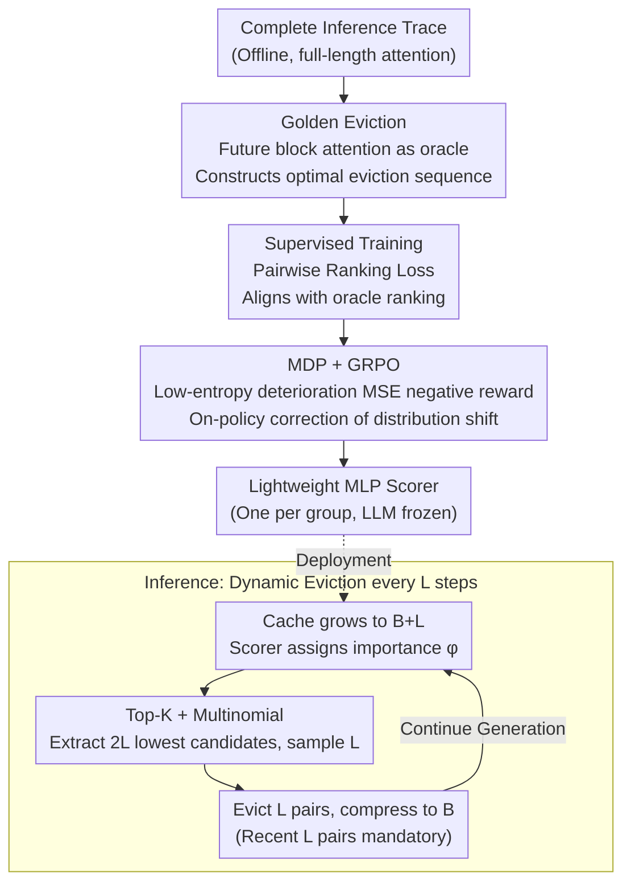

# ForesightKV: Optimizing KV Cache Eviction for Reasoning Models by Learning Long-Term Contribution

**Conference**: ICML 2026  
**arXiv**: [2602.03203](https://arxiv.org/abs/2602.03203)  
**Code**: https://github.com/RUCAIBox/ForesightKV  
**Area**: LLM Efficiency / KV Cache Compression / Long-term Reasoning  
**Keywords**: KV cache eviction, reasoning models, Golden Eviction, GRPO, long-term contribution prediction

## TL;DR
ForesightKV trains a lightweight scoring model to dynamically evict KV pairs based on "future attention contribution." It utilizes a "Golden Eviction" algorithm to distill optimal eviction sequences from complete traces as supervision signals, followed by GRPO reinforcement learning fine-tuning with a reward based on the "sum of squared loss increments of low-entropy tokens." On AIME2024/2025, it outperforms SnapKV/H2O/R-KV with half the KV budget; a 4K budget preserves 99% of the original model performance.

## Background & Motivation
**Background**: Reasoning LLMs (e.g., DeepSeek-R1, Qwen3 series) have achieved breakthroughs in math and code tasks by generating Chain-of-Thought (CoT) sequences of 8K–32K tokens. However, the KV cache grows linearly with each generated token—a Qwen3-4B model at a 32K length consumes 4.5 GB of BFloat16 VRAM for a single sample, severely limiting concurrent batch sizes. Since decoding is memory-bound, moving the massive KV cache also slows down throughput. The mainstream solution is KV cache eviction: permanently discarding a portion of KV pairs every few steps based on an "importance score" to compress the cache back to a budget $B$. Representative methods include SnapKV (using recent window attention), H2O (accumulative attention), and R-KV (designed for reasoning models).

**Limitations of Prior Work**: Training-free rule-based methods use heuristics (recent window attention, cumulative attention, position, etc.) to estimate KV importance, which fails to capture complex attention patterns in reasoning data. The authors observed three types of heads in Qwen3-4B: global (vertical stripes), position-dependent (local), and semantic-dependent (block-like, dynamically switched). SnapKV uses recent tokens as an observation window, often discarding KV pairs that are "semantically unrelated to the window but crucial for the future," leading to significant performance degradation. Another line of research, such as DMC, evaluates importance only once at the start of a sequence, failing to capture dynamic changes in importance across generation stages.

**Key Challenge**: KV importance is a **function of future attention scores**, yet all existing methods only see **historical** information, essentially "using the past to predict the future." More critically, eviction harms **low-entropy tokens** (top-80% low-entropy details/deterministic tokens) significantly more than high-entropy decision tokens. Table 1 shows that under the same budget, the loss of low-entropy tokens increases by 147% while high-entropy tokens only increase by 52%. Errors occur precisely in facts, numbers, and symbols from the preceding text, where a single mistake can derail the entire subsequent reasoning process.

**Goal**: (1) Identify a "golden standard" eviction strategy that utilizes future information to provide training supervision; (2) Train a lightweight scoring model to distill "future-awareness" into a policy based only on the current state; (3) Align the training objective with the loss of low-entropy tokens that truly impacts reasoning quality.

**Key Insight**: Since offline traces contain complete future attention, an oracle can be used to construct an optimal eviction sequence that minimizes "damage to the future." This sequence can be used for supervised pairwise ranking to train an MLP scorer. The entire decoding process is then modeled as an MDP, fine-tuned using GRPO on group-relative advantages, specifically targeting tokens that are "low-entropy and significantly deteriorated."

**Core Idea**: A two-stage training approach involving oracle future attention distillation and low-entropy token loss rewards allows an MLP to learn to "predict the long-term contribution of each KV pair," upgrading rule-based eviction to data-driven policy learning.

## Method

### Overall Architecture
The core problem ForesightKV addresses is that KV importance is inherently a function of future attention, while rule-based methods only view history. It trains a lightweight MLP scorer as a "future contribution predictor." The pipeline is divided into inference and training. During inference, for every $L$ new tokens generated ($L=256$), the KV cache grows to $B+L$. For each attention group (GQA shared KV) in every layer, the scoring model $\pi_\theta$ takes KV pair features $\mathbf{x}_n = \text{Concat}(\mathbf{k}_n, \mathbf{v}_n, \mathbf{a}_n)$ ($\mathbf{a}_n$ represents fixed-length statistical features of attention scores) and outputs importance $\phi_n$. It retains the most recent $L$ pairs and evicts $L$ pairs from the remainder to compress the cache back to $B$. The LLM remains frozen, while only a few MLP scorers are trained with minimal overhead. The training side has two stages: first, Golden Eviction distills the optimal sequences from complete offline traces; second, eviction is modeled as an MDP and fine-tuned on-policy via GRPO with rewards targeting "significant deterioration of low-entropy tokens."

### Key Designs

**1. Golden Eviction: Using Future Attention as an Oracle for Supervision**

Rule-based methods (SnapKV/H2O/R-KV) essentially "estimate future importance using historical attention," which misses block-like, dynamically switched attention patterns in semantic-dependent heads. ForesightKV's breakthrough lies in utilizing the complete future attention hidden in offline traces as ground truth. Specifically, the full-length attention matrix $\mathbf{A}^h \in \mathbb{R}^{T\times T}$ is calculated once. It is sliced into blocks of step size $L$ along the query dimension, and average pooling is applied across blocks and heads within GQA groups to obtain the block score $\tilde{\mathbf{a}}_t^{h'}$. For an eviction decision at step $t$, each KV pair $i$ takes the maximum block score across **all future blocks** as its "future score" $\alpha_{i,t}^{h'} = \max_{t\le j\le M}(\tilde{\mathbf{a}}_{i,j}^{h'})$. Pairs with the largest $\alpha$ are retained. Appendix A proves that this strategy of "discarding those with the lowest future attention" has the minimal impact on the output upper bound. With this oracle trajectory, the scorer uses Pairwise Ranking Loss $\mathcal{L}_{\text{supervised}} = \sum_t \sum_{\alpha_i < \alpha_j} \max(0, m-(\phi_i - \phi_j))$ to align with the oracle's future score ranking. This supervision signal is highly effective: Table 2 shows the Golden Eviction loss ratio is only 1.07, compared to 1.41+ for R-KV/SnapKV.

**2. MDP + GRPO: Correcting Distribution Shift with Real Reasoning Rewards**

Supervised training has a drawback: the scorer learns the oracle trajectory, but during inference, it selects KVs itself, potentially entering state distributions not seen during training. ForesightKV models decoding as an MDP where the state $s_t$ is the current KV cache, the action $a_t$ is selecting $B$ pairs from $B+L$, and the policy is the per-group scorer $\pi_{\theta_{h,l}}$. The reward focuses on the observation that low-entropy tokens are the bottleneck: it filters for tokens whose original entropy is in the bottom 80% and whose loss increment after eviction exceeds a threshold $\eta$: $E=\{w_t \mid w_t \in \mathbf{w}_\text{low},\ \Delta\mathcal{L}(w_t)>\eta\}$. The reward $R_t$ is the negative MSE of the loss increment on this subset: $R_t = -\sum_{t\in E}[\Delta\mathcal{L}(w_t)]^2$. Optimization uses GRPO: $G$ different eviction trajectories are sampled for the same sequence, advantages $\hat A_t$ are calculated via group-relative normalization, and all scorers are jointly optimized. Table 4 shows that optimizing total loss actually degrades performance (50.6 vs base 51.7), while the "low-entropy + significant deterioration" MSE reward $\mathcal{L}_\text{ours}$ pushes AIME24 from 51.7 to 54.5.

**3. Top-K + Multinomial: Discrete Action Parameterization for Stability and Exploration**

Deciding which KV pairs to discard based on scores $\Phi$ is a discrete selection problem. Pure top-$K$ is deterministic and sensitive to local ranking errors, leaving no room for RL exploration. Pure multinomial sampling is too noisy, and errors are irreversible. ForesightKV uses $\mathcal{D}_t = \text{Multinomial}_L(\text{Softmax}(\text{Top}_{2L}(-\Phi)))$ as a compromise: it first selects the $2L$ lowest-scoring pairs as high-confidence eviction candidates, then samples $L$ pairs within this pool according to softmax(negative scores). This "pruning followed by controlled sampling" ensures stability through pruning while providing trajectory diversity for GRPO through sampling.

### Loss & Training
The supervision stage uses Pairwise Ranking Loss (Eq. 6) with hyperparameter margin $m$. The RL stage uses the GRPO objective:
$$\mathcal{J}(\theta) = \mathbb{E}_{o\sim\pi_{\theta_\text{old}}}\sum_t \min(r_t(\theta)\hat A_t, \text{clip}(r_t(\theta),1-\epsilon,1+\epsilon)\hat A_t) - \beta\cdot \text{KL}[\pi_\theta\|\pi_\text{ref}]$$
where $r_t(\theta) = \pi_\theta(a_t|s_t)/\pi_{\theta_\text{old}}(a_t|s_t)$. Each attention group has an independent MLP scorer (hidden size 16); the LLM is frozen. The training budget is $B\le 2K$.

## Key Experimental Results

### Main Results
Models: DeepSeek-R1-Distill-Qwen-7B, Qwen3-4B, Qwen3-1.7B; Benchmarks: AIME2024 / AIME2025; Metric: pass@1 averaged over 32 trials.

| Setting (Qwen3-4B, AIME24) | Budget | pass@1 | Comparison |
|------------------------|------|--------|------|
| Full KV | 32K | 55.6 | Baseline Upper Bound |
| R-KV | 2K | 44.8 | Previous SOTA |
| **ForesightKV** | **1K** | **54.5** | Outperforms R-KV by 9.7 with half budget |
| **ForesightKV** | **4K** | ≈Full | Retains ~99% performance |
| **ForesightKV** | 2K | — | Retains ~92% performance |

Efficiency (Qwen3-4B, A800, 32K Generation):

| Method | Budget | Max Batch Size | Throughput | Acceleration |
|------|------|--------------|------|------|
| Full | — | 11 | 37.73 | 1.00× |
| ForesightKV | 4K | 48 | 193.95 | 5.14× |
| ForesightKV | 2K | 70 | 268.36 | 7.11× |
| ForesightKV | 1K | 96 | 369.43 | **9.79×** |

### Ablation Study

| Ablation Dimension | Setting | AIME24 | Notes |
|----------|------|--------|------|
| Reward Function | base (SL only) | 51.7 | Pre-RL |
| | $-\mathcal{L}_\text{all}$ | 50.6 | Total loss degrades |
| | $-\mathcal{L}_\text{low}$ | 53.5 | Low-entropy only slightly better |
| | $-\mathcal{L}_\text{high}$ | 49.6 | High-entropy backfires |
| | $-\mathcal{L}_\text{low,large}$ | 53.8 | Target deterioration points |
| | $-\mathcal{L}_\text{ours}$ (MSE) | **54.5** | MSE best at punishing catastrophe |

### Key Findings
- **Reward design is the key to RL success**: Blindly optimizing total loss leads to performance drops. Focusing on the MSE of "low-entropy and significantly deteriorated" tokens is essential, validating the observation that low-entropy tokens dominate reasoning quality. This contradicts the intuition that high-entropy tokens are the primary decision points; while high-entropy errors impact a branch, fact/number errors pollute the entire subsequent reasoning chain.
- **Strong Generalization**: Although trained with $B\le 2K$, the performance remains at 99% under a 4K budget, suggesting the scorer learns "intrinsic importance" rather than overfitting to a specific budget.
- **Aggressive Budget Compression Yields Higher Acceleration**: A 1K budget on 32K generation improves throughput by 9.79×. As decoding is memory-bound, smaller KV caches allow larger batch sizes and reduced HBM movement; the MLP scorer overhead is negligible.

## Highlights & Insights
- **The "Oracle Distillation + On-policy RL" paradigm elegantly applies data-driven control to KV eviction**: Distillation solves "future unknowability," while RL corrects "oracle vs. self-policy" distribution shifts.
- **Reward engineering insights are transferable**: Decomposing loss into a "low-entropy vs. high-entropy × magnitude of deterioration" quadrant reveals that only the "low-entropy large deterioration" segment is worth optimizing. This philosophy of optimizing "catastrophic minorities" rather than sample averages is applicable to LLM alignment and memory management.
- **Practical Discrete Parameterization**: The Top-K + Multinomial approach is a versatile discrete control strategy for tasks involving many "must-discard" candidates and few "boundary" candidates requiring exploration.

## Limitations & Future Work
- **Dependency on Offline Traces**: Calculating Golden Eviction is expensive, requiring full long-context inference and storage of $T\times T$ attention matrices.
- **Domain Focus**: Primarily validated on mathematical reasoning. The "low-entropy token dominance" hypothesis requires further validation in code or long-document QA.
- **Per-group Scorer Scaling**: Parameters grow with the number of layers and groups. Cross-layer/head sharing or LoRA-style parameterization could optimize deployment for ultra-large models.
- **Irreversible Eviction**: Once a KV pair is discarded, it cannot be recalled. 
- **Manual Hyperparameters**: Budget and eviction interval $L$ remain manual; adaptive budgets based on sentence difficulty are a natural next step.

## Related Work & Insights
- **Comparison with SnapKV / H2O**: These are training-free rule-based methods. ForesightKV upgrades "using history to estimate the future" to "learning the mapping from history to the future" using oracle data.
- **Comparison with R-KV**: ForesightKV outperforms R-KV by 9 points at half the budget, proving data-driven strategies significantly outperform human-defined rules under complex reasoning patterns.

## Rating
- **Novelty**: ⭐⭐⭐⭐ The combination of Golden Eviction and low-entropy MSE rewards is novel in KV eviction literature.
- **Experimental Thoroughness**: ⭐⭐⭐⭐ Conducted across three models and multiple benchmarks with thorough reward and sampling ablations.
- **Writing Quality**: ⭐⭐⭐⭐ Strong motivation based on KV patterns and loss spikes; clear formulas and diagrams.
- **Value**: ⭐⭐⭐⭐⭐ The ~10x throughput gain and near-lossless performance at high compression ratios make this highly practical for long-reasoning LLM deployment.

<!-- RELATED:START -->

## Related Papers

- [\[ICLR 2026\] Bottlenecked Transformers: Periodic KV Cache Consolidation for Generalised Reasoning](../../ICLR2026/llm_reasoning/bottlenecked_transformers_periodic_kv_cache_consolidation_for_generalised_reason.md)
- [\[ICML 2026\] MOSAIC: Learning When to Act or Refuse — Guarding Agentic Reasoning Models for Safe Multi-step Tool Use](learning_when_to_act_or_refuse_guarding_agentic_reasoning_models_for_safe_multi-.md)
- [\[ACL 2026\] Revisiting Entropy in Reinforcement Learning for Large Reasoning Models](../../ACL2026/llm_reasoning/revisiting_entropy_in_reinforcement_learning_for_large_reasoning_models.md)
- [\[ICML 2026\] Verifying Meta-Awareness via Predictive Rewards in Reasoning Models](verifying_meta-awareness_via_predictive_rewards_in_reasoning_models.md)
- [\[ICML 2026\] ResRL: Boosting LLM Reasoning via Negative Sample Projection Residual Reinforcement Learning](resrl_boosting_llm_reasoning_via_negative_sample_projection_residual_reinforceme.md)

<!-- RELATED:END -->
