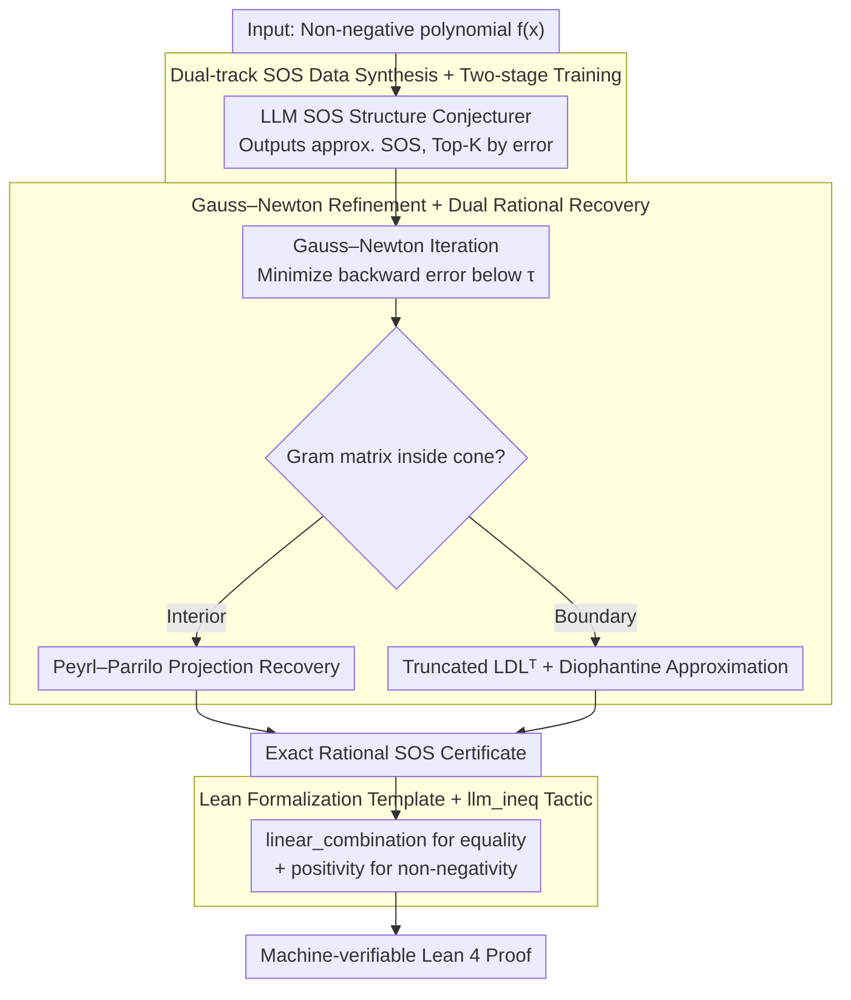

# From LLM-Generated Conjectures to Lean Formalizations: Automated Polynomial Inequality Proving via Sum-of-Squares Certificates

**Conference**: ICML 2026  
**arXiv**: [2605.15445](https://arxiv.org/abs/2605.15445)  
**Code**: Not yet public  
**Area**: LLM Reasoning / Neuro-symbolic / Automated Theorem Proving  
**Keywords**: Polynomial inequality, SOS decomposition, Lean formalization, Neuro-symbolic, GRPO

## TL;DR
NSPI enables LLMs to propose approximate Sum-of-Squares (SOS) structure conjectures, which are then refined into rigorous rational SOS decompositions via Gauss–Newton iteration and rational recovery. These are automatically verified by Lean using `linear_combination` and `positivity` tactics, scaling inequality proving up to 10 variables.

## Background & Motivation

**Background**: Polynomial inequalities are fundamental tools in optimization, control, and combinatorics. Proving $f(x) \ge 0$ primarily follows two routes: pure symbolic methods (Maple, Z3, SOS+SDP) and emerging LLM formalization methods (DeepSeek-Prover-V2, Goedel-Prover, Kimina-Prover) that directly generate Lean/Isabelle tactics.

**Limitations of Prior Work**: Pure symbolic methods perform adequately in low dimensions (3-4 variables) but face combinatorial explosion as dimensions increase—the SDP matrix dimension grows as $\binom{n+d}{d}$, with Maple solving only 1.7% of 10-variable problems. LLM-based methods rely on formal training corpora, but Lean data for high-dimensional inequalities is nearly non-existent; DS-Prover-v2 drops to 0% beyond 5 variables.

**Key Challenge**: Symbolic methods are **precise but unscalable**; LLMs are **scalable but cannot prove**—SDP outputs numerical matrices with floating-point errors unaccepted by Lean, and LLM-written tactics struggle to execute in high dimensions. Neuro-symbolic works like AlphaGeometry/AIPS treat LLMs only as search heuristics rather than generators of symbolic objects.

**Goal**: To elevate the LLM to a **symbolic conjecture generator** that outputs approximate SOS structures, which the symbolic engine then refines into exact certificates verifiable by Lean.

**Key Insight**: The "structure" of an SOS certificate (which monomials belong to each squared term) is easier to guess than the "coefficients," and coefficient refinement is theoretically guaranteed by the rational recovery theorem (Peyrl–Parrilo 2008). Thus, the task is decomposed into "LLM structure guessing + Symbolic coefficient refinement + Lean verification."

**Core Idea**: LLM generates approximate SOS structures $\rightarrow$ Gauss–Newton iteration + rational recovery yield exact rational Gram matrices $\rightarrow$ Lean `linear_combination + positivity` provides end-to-end verification from heuristic discovery to machine-checked proof.

## Method

### Overall Architecture
NSPI proves $f(x) \ge 0$ through a three-stage relay: neuro-structure guessing, symbolic refinement, and Lean verification. First, the LLM observes a non-negative polynomial $f(x)$ and outputs **approximate** SOS representations $\hat f(x) = \sum_i \hat f_i(x)^2$ (sorted by numerical error). Second, Top-K conjectures undergo Gauss–Newton numerical refinement and rational recovery to obtain **exact** rational Gram matrices. Finally, a Lean template assembles the certificate into a complete proof, using `linear_combination` for equality and `positivity` for non-negativity.

### Key Designs

**1. Dual-track SOS Data Synthesis + Two-stage Training: Learning reasonable SOS skeletons**
To train the structure conjecturer, millions of $(f, \text{SOS})$ pairs are required. Direct sampling and squaring leads to coefficient explosion. The authors use an inverse approach starting from PSD Gram matrices $\widetilde G$. **Computation-driven track**: Perturbs random symmetric integer matrices to ensure PSDness (e.g., spectral shift or $L^\top D L$). **Structure-driven track**: Uses diagonally dominant (dd) or scaled-dd matrices (naturally PSD per Gershgorin circle theorem) parameterized as $\widetilde G = \sum_i \eta_i u_i u_i^\top$ with sparse $u_i$. Training involves SFT on 1M synthetic pairs followed by GRPO reinforcement learning on hard samples, focusing on "skeletal" structure rather than exact coefficients.

**2. Gauss–Newton Refinement + Dual Rational Recovery: Converting floating-point SOS to exact certificates**
Lean recognizes only exact rational numbers. NSPI extracts a monomial basis $\mathbf v(x)$ and an initial Gram matrix $\mathbf G$ from the LLM output $\hat f(x)$. It applies Gauss–Newton iteration on coefficients $c_{i,\alpha}$ to suppress the backward error $\theta = \|\hat f(\mathbf x) - \mathbf v(x)^\top \mathbf G \mathbf v(x)\|$ below a threshold $\tau$. For **interior points** (Gram matrix strictly inside the PSD cone), Peyrl–Parrilo projection is used. For **boundary cases** (numerical rank deficiency), truncated $LDL^\top$ decomposition combined with simultaneous Diophantine approximation is used to recover rational vectors while preserving the rank structure.

**3. Lean Formalization Template + `llm_ineq` Tactic: One-click compilation of proof certificates**
A general tactic `llm_ineq` is implemented. Given a target polynomial and a rational SOS certificate, it splits the proof into two obligations: (a) verifying the polynomial identity $p = \sum_i k_i q_i^2$ via `linear_combination` to check the expanded normal form; (b) verifying non-negativity via `positivity`, which recursively applies rules like `sq_nonneg` and `add_nonneg`. This bypasses the need for LLMs to write complex tactics, moving the reliability bottleneck to the SOS structure guessing.

### Loss & Training
The SFT stage uses standard next-token prediction. The GRPO stage uses a reward function $R = R_{\text{Accuracy}} + R_{\text{Format}} - R_{\text{Struct-Penalty}}$. $R_{\text{Accuracy}}$ measures numerical alignment. $R_{\text{Struct-Penalty}}$ is the core, encouraging the non-zero monomial set of the approximate SOS to match the original polynomial using soft penalties (symmetric difference) and hard penalties (for higher-order terms not seen in training).

## Key Experimental Results

### Main Results
Pass rates within a 1-hour budget on PolyIneqBench (522 inequalities, $n=3$ to $n=10$):

| Variables | Maple | Z3 | DS-Prover-v2 | Goedel-v2 | Kimina | Gemini-3-Pro | **NSPI (Ours)** |
|-----------|-------|----|--------------|-----------|--------|--------------|-----------------|
| n=3 | 97.6% | 97.6% | 42.9% | 20.2% | 36.9% | 22.6% | [Top Tier] |
| n=4 | 39.0% | 32.5% | 2.6% | 5.2% | 5.2% | 24.7% | — |
| n=5 | 26.7% | 23.3% | 0% | 0% | 0% | 36.7% | — |
| n=7 | 6.7% | 1.7% | 0% | 0% | 1.7% | 15.0% | — |
| n=10 | 1.7% | 0% | 0% | 0% | 0% | 6.7% | — |

**Key Trends**: Pure symbolic methods fall from near-perfect at $n=3$ to near-zero at $n=10$. Pure LLM provers (DS/Goedel/Kimina) vanish at $n \ge 5$. Generic models like Gemini-3-Pro remain relatively stable, suggesting heuristics are effective in higher dimensions. NSPI maintains high performance into the 10-variable range.

### Ablation Study
| Configuration | Impact | Description |
|---------------|--------|-------------|
| SFT only (no GRPO) | Severe degradation at $n \ge 6$ | Model fails to generalize to hard samples outside the training distribution. |
| No structure penalty | Monomial mismatch rate ↑ | LLM predicts SOS terms with illegal monomials, causing GN failure. |
| No Gauss–Newton refinement | Precision↓ in boundary cases | Numerical error exceeds thresholds for rational recovery. |

### Key Findings
- If the SOS structure is incorrect, symbolic refinement cannot save it; if correct, refinement and recovery almost always succeed.
- Dual-system rational recovery is essential; high-dimensional polynomials often lie on the boundary of the PSD cone (low rank), where simple projection fails.
- Shifting the LLM's role from writing Lean tactics to proposing symbolic conjectures is the key to scaling.

## Highlights & Insights
- **Elevating LLMs to "Symbolic Object Generators"**: Unlike AlphaGeometry, which uses neural networks for search guidance, NSPI allows the LLM to output the symbolic intermediate representation (SOS structure) directly.
- **Inverse Synthesis via Gram Matrices**: Building datasets by expanding structured PSD matrices allows for precise control over monomial sets and coefficient ranges, a paradigm applicable to other constrained generation tasks.
- **Shifting the Provability Bottleneck**: Reliability is transferred from "Can the LLM write Lean?" to "Is the guessed structure correct?" and "Is rational recovery within theoretical bounds?"

## Limitations & Future Work
- The framework currently covers only **unconstrained** polynomial inequalities.
- Training requires specialized data synthesis and GRPO for every new class of problem.
- It is limited to the SOS-provable subset of non-negative polynomials (excluding those like the Motzkin polynomial).
- Scaling beyond $n=10$ variables or including transcendental functions remains an open challenge.

## Related Work & Insights
- **vs AIPS / AlphaGeometry**: NSPI has the LLM generate the symbolic certificate structure rather than just guiding a search, achieving higher scalability in the inequality domain.
- **vs DeepSeek-Prover-V2**: NSPI bypasses the Lean data scarcity problem for high-dimensional math by using a template-based symbolic bridge.
- **vs Classic SOS-SDP**: NSPI essentially uses neural priors to prune the combinatorial search space that bottlenecks traditional SDP solvers.

## Rating
- **Novelty**: ⭐⭐⭐⭐ High; uses LLMs for symbolic structure generation with dual-regime rational recovery.
- **Experimental Thoroughness**: ⭐⭐⭐⭐ Strong coverage across dimensions, though limited to unconstrained cases.
- **Writing Quality**: ⭐⭐⭐⭐ Clear layering of neural, symbolic, and formal components.
- **Value**: ⭐⭐⭐⭐ Provides a scalable engineering path for automated high-dimensional inequality proving.

<!-- RELATED:START -->

## Related Papers

- [\[ACL 2025\] Local Look-Ahead Guidance via Verifier-in-the-Loop for Automated Theorem Proving](../../ACL2025/llm_reasoning/local_look-ahead_guidance_via_verifier-in-the-loop_for_automated_theorem_proving.md)
- [\[ICML 2026\] ResRL: Boosting LLM Reasoning via Negative Sample Projection Residual Reinforcement Learning](resrl_boosting_llm_reasoning_via_negative_sample_projection_residual_reinforceme.md)
- [\[ICML 2026\] TRACE: 用 Toulmin 论证模型评 LLM CoT 推理过程质量](trace_toulmin-based_reasoning_assessment_through_constructive_elements_for_llm_c.md)
- [\[ICML 2026\] Beyond Two-Stage Training: Cooperative SFT and RL for LLM Reasoning](beyond_two-stage_training_cooperative_sft_and_rl_for_llm_reasoning.md)
- [\[ICML 2026\] R2-Router: A New Paradigm for LLM Routing with Reasoning](r2-router_a_new_paradigm_for_llm_routing_with_reasoning.md)

<!-- RELATED:END -->
