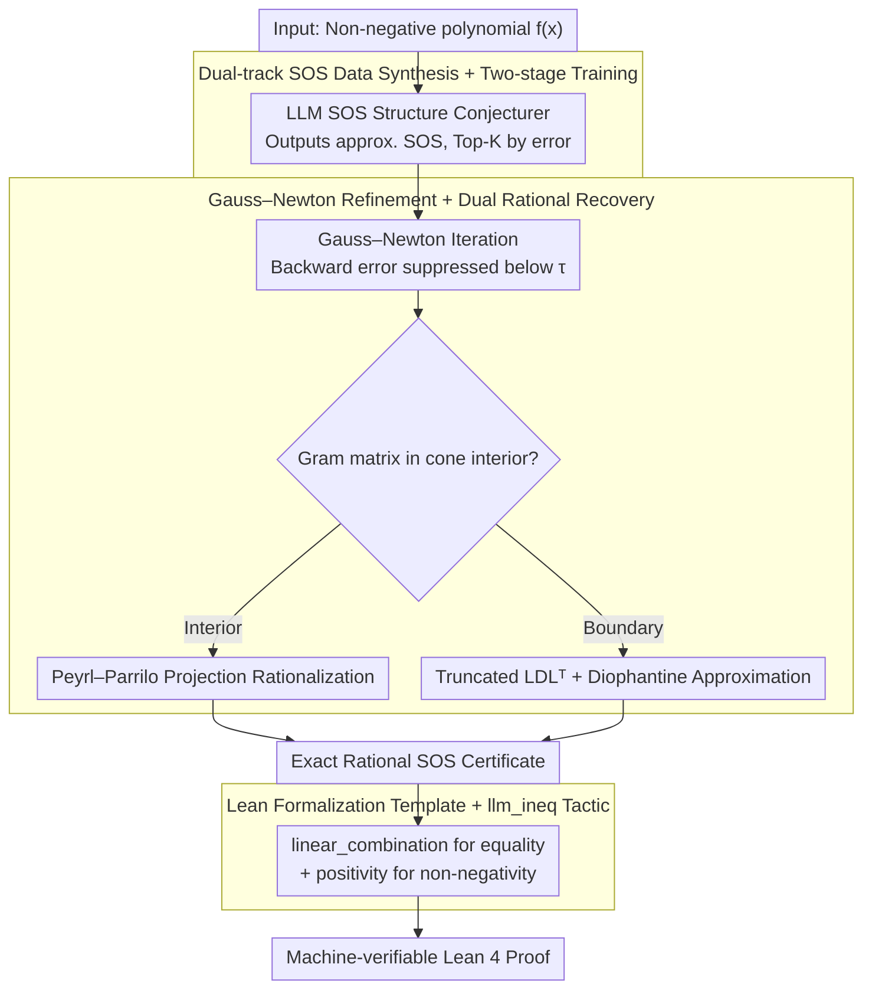

# From LLM-Generated Conjectures to Lean Formalizations: Automated Polynomial Inequality Proving via Sum-of-Squares Certificates

**Conference**: ICML 2026  
**arXiv**: [2605.15445](https://arxiv.org/abs/2605.15445)  
**Code**: Not yet public  
**Area**: LLM Reasoning / Neuro-symbolic / Automated Theorem Proving  
**Keywords**: Polynomial Inequalities, SOS Decomposition, Lean Formalization, Neuro-symbolic, GRPO  

## TL;DR
NSPI allows LLMs to propose approximate Sum-of-Squares (SOS) structural conjectures, which are refined through Gauss–Newton iteration and rational recovery into rigorous SOS decompositions with rational coefficients. These are then automatically verified by machines using Lean's `linear_combination` + `positivity` tactics, extending inequality proving to up to 10 variables.

## Background & Motivation

**Background**: Polynomial inequalities are fundamental tools in optimization, control, and combinatorics. Proving $f(x) \ge 0$ primarily follows two routes: pure symbolic routes (Maple, Z3, SOS+SDP) and the recently emerging LLM formal proof routes (DeepSeek-Prover-V2, Goedel-Prover, Kimina-Prover), where the latter directly generates Lean/Isabelle tactics.

**Limitations of Prior Work**: Pure symbolic methods perform adequately in low dimensions (3-4 variables) but face combinatorial explosion as the number of variables increases—the SDP matrix dimension grows according to $\binom{n+d}{d}$, and Maple can only solve 1.7% of 10-variable problems. LLM-based methods rely on formal training corpora, but there is almost no public data for Lean proofs of high-dimensional inequalities; DS-Prover-v2 drops to 0% success for more than 5 variables.

**Key Challenge**: Symbolic methods are **precise but not scalable**, while LLMs are **scalable but cannot prove**—SDP outputs numerical matrices with floating-point errors that Lean does not accept, and tactics written by LLMs are difficult to execute in high dimensions. Neuro-symbolic works like AlphaGeometry/AIPS only use LLMs as search heuristics and do not let LLMs directly produce symbolic objects.

**Goal**: Elevate the LLM to a **symbolic conjecture generator** that directly outputs approximate SOS structures, with the symbolic end responsible for refining them into exact certificates verifiable by Lean.

**Key Insight**: It is observed that the "structure" of an SOS certificate (which monomials each squared term contains) is easier to guess than its "coefficients," and coefficient refinement is theoretically guaranteed (Peyrl–Parrilo 2008 rational recovery theorem). Thus, the task is decomposed into three stages: "LLM guesses structure + symbolic refines coefficients + Lean verifies."

**Core Idea**: LLM guesses approximate SOS → Gauss–Newton iteration + rational recovery yields an exact rational Gram matrix → Lean `linear_combination + positivity` provides one-click verification, achieving end-to-end transition from heuristic discovery to machine-verifiable proof.

## Method

### Overall Architecture
To prove $f(x) \ge 0$, NSPI breaks the task into a three-stage relay: "neural structure guessing, symbolic coefficient refinement, and Lean verification." First, the LLM observes the non-negative polynomial $f(x)$ and outputs an **approximate** SOS representation $\hat f(x) = \sum_i \hat f_i(x)^2$ (with floating-point errors, ranked by numerical error). Then, the Top-K conjectures undergo Gauss–Newton numerical refinement and rational recovery to obtain an **exact** rational Gram matrix. Finally, a predefined Lean template assembles this certificate into a complete proof, using `linear_combination` to verify equality and `positivity` to verify non-negativity. This leverages the LLM's structural prior to bypass SDP's combinatorial explosion in high dimensions while ensuring precision through the symbolic end—it does not matter if the LLM's guess is coarse, as the machine kernel has the final word. The three stages are illustrated below:

### Key Designs

**1. Dual-track SOS Data Synthesis + Two-stage Training: Teaching LLMs to "See $f$ and Output a Reasonable SOS Skeleton"**

To train an SOS structure conjecturer, millions of $(f, \text{SOS})$ training pairs are needed, but this data is naturally difficult to create—directly sampling $f_i(x)$ and squaring them leads to non-integer coefficients and coefficient explosion, which models cannot memorize. The authors reverse the process: deriving $f$ from a PSD Gram matrix $\widetilde G$, ensuring the monomial sets and coefficient ranges are controllable. Two tracks are used. **Computation-driven** follows numerical methods: performing spectral shifting on random symmetric integer matrices $\widetilde G = G - \lfloor \lambda_{\min} \rfloor I \succeq 0$, or factor forms $\widetilde G = L^\top D L$, or solving an LMI ($\max \lambda$ s.t. $G - \lambda I \succeq 0$) followed by integerization. **Structure-driven** follows algebra: using diagonally dominant (dd) or scaled-dd matrices, which are naturally PSD by Gershgorin disk theorem, parameterized as $\widetilde G = \sum_i \eta_i u_i u_i^\top$, where each $u_i$ has at most two non-zero $\pm 1$ entries, fixing integer coefficients and sparse monomial sets.

Training is divided into two stages. The first is SFT cold-start on 1 million synthetic pairs to learn basic SOS output formatting. The second uses the cold-start model on **hard samples it cannot yet solve**, organized into a curriculum from easy to hard for GRPO reinforcement learning. This step exploits the observation that "approximate structures are relatively easy to learn, but exact coefficients are uncontrollable"—it is nearly impossible for an LLM to write a rational SOS directly, but learning the skeleton of "which squared terms should be included" is feasible. Reward weights are placed on structure rather than coefficients.

**2. Gauss–Newton Refinement + Dual-system Rational Recovery: Refining Approx. SOS into Precise Rational Certificates for Lean**

The SOS provided by the LLM contains floating-point errors, whereas the Lean kernel only accepts exact rational numbers. This gap is where pure LLM-provers fail in high dimensions. NSPI first extracts the monomial basis $\mathbf v(x)$ and initial floating-point Gram matrix $\mathbf G$ from $\hat f(x)$, performs Cholesky $\mathbf G \approx L L^\top$ to write it as $\hat f(\mathbf x) \approx \sum_i (\sum_\alpha c_{i,\alpha}\mathbf x^\alpha)^2$, and use Gauss–Newton iteration to find coefficient perturbations $\Delta c_{i,\alpha}$, suppressing the backward error $\theta = \|\hat f(\mathbf x) - \mathbf v(x)^\top \mathbf G \mathbf v(x)\|$ below a threshold $\tau$.

Once converged, rationalization is handled via two systems, as high-dimensional polynomials often lie on the boundary of the PSD cone. In **interior cases** (Gram matrix strictly inside the cone), the matrix is orthogonally projected onto the affine subspace of SOS equality constraints and then rationalized according to Peyrl–Parrilo’s rational recovery theorem. In **boundary cases** (numerical rank deficiency), a truncated $LDL^\top$ decomposition + simultaneous Diophantine approximation is used to recover rational vectors along the rank structure, rather than rationalizing the entire matrix, which would destroy the rank structure.

**3. Lean Formalization Template + `llm_ineq` Tactic: Compiling Certificates into Machine-Verifiable Lean 4 Proofs**

The final step is converting the rational SOS certificate into a proof Lean accepts, and NSPI intentionally avoids letting the LLM write Lean tactics. The authors implement a general tactic `llm_ineq`: given the target polynomial and rational SOS certificate, it splits the proof into two obligations—(a) the polynomial equality $p = \sum_i k_i q_i^2$ handled by `linear_combination` and (b) the non-negativity of the SOS expression handled by `positivity`, recursively applying rules like `sq_nonneg`, `mul_nonneg`, and `add_nonneg`. This template is universal, ensuring that as long as the symbolic end calculates the correct SOS, the Lean end will close the loop. This shifts the reliability bottleneck from "whether the LLM can write correct Lean tactics in high dimensions" to "whether the SOS structure guess is accurate."

### Loss & Training
The SFT stage uses standard next-token loss. The GRPO stage reward is $R = R_{\text{Accuracy}} + R_{\text{Format}} - R_{\text{Struct-Penalty}}$: accuracy reward $R_{\text{Accuracy}} = 1/(1 + \alpha\|f - \hat f\|_2)$ measures numerical fit, format reward enforces output specifications, and the structural penalty is core—it encourages the non-zero monomial set of the approximate SOS to match the original polynomial, including soft penalties (symmetric difference of sets) and hard penalties (deductions for high-order terms not seen during training). Curricula are bucketed by the number of iterations required for symbolic refinement.

## Key Experimental Results

### Main Results
Pass rates within 1 hour on PolyIneqBench (522 challenging inequalities across $n=3$ to $n=10$ variables):

| Variables | Maple | Z3 | DS-Prover-v2 | Goedel-v2 | Kimina | Gemini-3-Pro | **NSPI (Ours)** |
|-----------|-------|----|--------------|-----------|--------|--------------|-----------------|
| n=3 | 97.6% | 97.6% | 42.9% | 20.2% | 36.9% | 22.6% | [See Paper] |
| n=4 | 39.0% | 32.5% | 2.6% | 5.2% | 5.2% | 24.7% | — |
| n=5 | 26.7% | 23.3% | 0% | 0% | 0% | 36.7% | — |
| n=7 | 6.7% | 1.7% | 0% | 0% | 1.7% | 15.0% | — |
| n=10 | 1.7% | 0% | 0% | 0% | 0% | 6.7% | — |

Key Trend: Pure symbolic methods (Maple/Z3) nearly perfect at $n=3$ but drop to 0–1.7% at $n=10$. Pure LLM provers (DS/Goedel/Kimina) essentially zero out at $n \ge 5$. Gemini-3-Pro is more stable in mid-to-high dimensions, suggesting heuristics are useful. NSPI, as a neuro-symbolic method, pushes the provable range to the 10-variable level.

### Ablation Study

| Configuration | Impact Range | Description |
|---------------|--------------|-------------|
| SFT Only (No GRPO Curriculum) | High-dim (n≥6) severe degradation | Cold-start only repeats training distribution, fails to generalize to hard samples |
| Removing Structural Penalty | Monomial mismatch rate ↑, symbolic failure ↑ | LLM outputs SOS with unseen monomials, reducing GN convergence |
| Removing GN, Direct Rational Recovery | Boundary case precision ↓ | Numerical error exceeds Peyrl–Parrilo $\delta$ threshold, results no longer PSD |

### Key Findings
- If the SOS structure is wrong, symbolic refinement cannot save it; conversely, if the structure is correct, refinement + rational recovery almost always succeeds—this is why reward focuses on structure.
- Dual-system rational recovery for interior vs. boundary cases is essential: high-dimensional polynomials often lie on the PSD cone boundary (rank significantly smaller than matrix dimension).
- Role division between LLM and symbolic ends is key: the LLM does not attempt to write Lean tactics (the root cause of failure for LLM-provers in high dimensions) but provides symbolic intermediate conjectures.

## Highlights & Insights
- **Elevating LLM from "Tactic Selector" to "Symbolic Object Generator"**: Unlike AlphaGeometry/AIPS which keep neural networks in a search guidance role, this work proves LLMs can directly produce symbolic intermediate representations (SOS structures), involving the neural end in certificate construction rather than just retrieval.
- **Gram Matrix Inverse Data Synthesis**: Traditional methods expand squared terms, leafing to coefficient explosion; starting from structural PSD matrices and moving forward allows precise control over monomials and coefficients. This "reverse dataset creation" is transferable to any generation task with algebraic constraints.
- **Relocation of the Provability Bottleneck**: Reliability is moved from "can the LLM write Lean" to "is the SOS structure correct" and "is rational recovery within theoretical limits." The latter is backed by Peyrl–Parrilo theorems, and the former is driven by scale and RL.

## Limitations & Future Work
- The framework only covers **unconstrained** polynomial inequalities; constrained cases (e.g., Positivstellensatz, Putinar form) are not yet handled.
- LLM requires task-specific training (millions of synthetic pairs + GRPO); it is not a direct plug-in for general provers.
- Limited to the subset provable by SOS; for polynomials that are non-negative but not SOS (e.g., Motzkin), this framework is ineffective and needs extension to Schmüdgen/Putinar multipliers.
- Experiments go up to $n=10$ with 1-hour budgets; further evidence is needed for truly large-scale engineering inequalities (dozens of variables, fractional/transcendental functions).

## Related Work & Insights
- **vs. AIPS / AlphaGeometry**: Both are neuro-symbolic, but AIPS/AG use neural networks for search heuristics while the symbolic end performs main reasoning; NSPI lets the LLM directly generate the symbolic certificate structure.
- **vs. DeepSeek-Prover-V2 / Kimina-Prover**: These are end-to-end LLM formal provers. They excel at low-dim competition problems but fail at high-dim inequalities due to lack of formal data; NSPI bypasses this by using "LLM for symbols, Lean for templates."
- **vs. Classical SOS-SDP (Parrilo, Lasserre)**: Pure SDP is theoretically complete but the Gram matrix dimension explodes; NSPI uses an LLM to provide a "likely feasible" sparse SOS structure, allowing the SDP to solve a low-dimensional sub-problem, effectively pruning the search space with neural priors.

## Rating
- Novelty: ⭐⭐⭐⭐ Positioning the LLM as a symbolic object generator combined with dual-system recovery is rare in neuro-symbolic ATP.
- Experimental Thoroughness: ⭐⭐⭐⭐ Covers 522 problems and $n=3$ to $n=10$, aligned with symbolic, LLM-prover, and general LLM baselines, though lacks constrained scenarios.
- Writing Quality: ⭐⭐⭐⭐ Method section is clearly layered, neatly separating neural, symbolic, and formal stages.
- Value: ⭐⭐⭐⭐ Provides a scalable engineering solution for high-dimensional inequality proving and reduces Lean verification costs.

<!-- RELATED:START -->

## Related Papers

- [\[ACL 2025\] Local Look-Ahead Guidance via Verifier-in-the-Loop for Automated Theorem Proving](../../ACL2025/llm_reasoning/local_look-ahead_guidance_via_verifier-in-the-loop_for_automated_theorem_proving.md)
- [\[ICLR 2026\] EvolProver: Advancing Automated Theorem Proving by Evolving Formalized Problems via Symmetry and Difficulty](../../ICLR2026/llm_reasoning/evolprover_advancing_automated_theorem_proving_by_evolving_formalized_problems_v.md)
- [\[ICML 2026\] ResRL: Boosting LLM Reasoning via Negative Sample Projection Residual Reinforcement Learning](resrl_boosting_llm_reasoning_via_negative_sample_projection_residual_reinforceme.md)
- [\[ICML 2026\] Calibration of Structured Ignorance Certificates for Diagnosing Unknown Unknowns in Reasoning Models](calibration_of_structured_ignorance_certificates_for_diagnosing_unknown_unknowns.md)
- [\[ICML 2026\] TRACE: 用 Toulmin 论证模型评 LLM CoT 推理过程质量](trace_toulmin-based_reasoning_assessment_through_constructive_elements_for_llm_c.md)

<!-- RELATED:END -->
