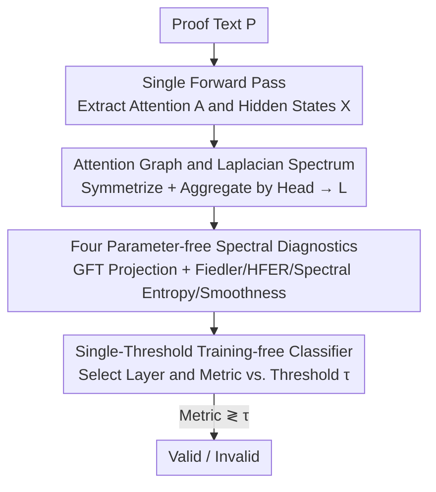

# Geometry of Reason: Spectral Signatures of Valid Mathematical Reasoning

**Conference**: ICML2026  
**arXiv**: [2601.00791](https://arxiv.org/abs/2601.00791)  
**Code**: https://github.com/vcnoel/geometry-of-reason  
**Area**: LLM Reasoning / Mechanistic Interpretability  
**Keywords**: Spectral Graph Theory, Attention Graphs, Reasoning Verification, Training-free Probes, Induction Heads

## TL;DR
The authors treat each Transformer attention matrix as a token-weighted graph and extract four parameter-free spectral diagnostics: Fiedler value, HFER, spectral entropy, and smoothness. They discover that "valid mathematical reasoning" leaves measurable fingerprints on the attention spectrum (Cohen’s $d$ up to 3.30), allowing the model to distinguish between true reasoning and pattern matching with 85–96% accuracy **without any training**.

## Background & Motivation

**Background**: Currently, two primary methods exist to determine if an LLM-generated proof constitutes "true reasoning." The first is **output-based formal verification**, which involves passing generated proofs to assistants like Lean, Coq, or Isabelle for compilation. The second is **learned verification**, where a classifier (Process Reward Model, truth probe, hallucination probe, etc.) is trained on internal representations or output features to predict correctness.

**Limitations of Prior Work**: Compilation-based verification conflates "logical validity" with "syntactic acceptability"—a logically sound proof may be rejected by Lean due to timeouts, missing imports, version mismatches, or formatting issues. Conversely, proofs with subtle semantic errors might bypass type-checking. Learned verification requires **massive amounts of labeled data**, generalizes poorly across architectures, and often learns spurious correlations rather than the essence of "valid reasoning."

**Key Challenge**: The goal is a signal that reflects **logical coherence itself**, independent of compilers, without requiring labels, and remains universal across architectures—a goal that current methods fail to achieve as they measure either compiler behavior or dataset-specific shortcuts.

**Key Insight**: Drawing from spectral graph theory and neural manifold geometry, the authors hypothesize that self-attention induces a **dynamic weighted graph** on tokens (where edges are attention scores). The spectral properties (eigenvalues/eigenvectors of the Laplacian) encode the global structure of how information is routed. Since valid reasoning requires coherent organization of premises, intermediate steps, and conclusions, it should result in smoother attention graphs with better connectivity, whereas invalid reasoning exhibits spectral irregularities.

**Core Idea**: Use the "spectral geometry of attention graphs" instead of a "trained probe" to judge reasoning validity—zero parameters, zero training, zero sampling, relying solely on the structural properties of the attention matrices.

## Method

### Overall Architecture

The method is a **parameter-free forward pipeline**: Given a proof text, a Transformer performs a single forward pass while extracting attention matrices $\bm{A}^{(\ell,h)}$ and hidden states $\bm{X}^{(\ell)}$ for each layer and head. Attention matrices are symmetrized and aggregated into one graph per layer using attention quality weights to construct the graph Laplacian $\bm{L}^{(\ell)}$. The Graph Fourier Transform (GFT) is used to project hidden states onto the Laplacian eigenbasis. Four spectral diagnostics are calculated per layer. Finally, a diagnostic from a specific layer is selected to determine validity via a **single threshold**. The entire pipeline has no trainable parameters; the only "parameter" is the threshold $\tau$.

### Key Designs

**1. Treating the attention matrix as a token-weighted graph and extracting its Laplacian spectrum**

To address the limitation that previous methods measure compiler behavior or learned shortcuts, the authors first assign a **structured geometric object** to attention. For the post-softmax attention matrix $\bm{A}^{(\ell,h)}$ (row-normalized) of the $h$-th head in layer $\ell$, an undirected weight matrix is derived as $\bm{W}^{(\ell,h)}=\frac{1}{2}(\bm{A}^{(\ell,h)}+(\bm{A}^{(\ell,h)})^\top)$. Heads are aggregated into a single graph $\bar{\bm{W}}^{(\ell)}$ using "attention quality" weights $\alpha_h^{(\ell)}$. The combinatorial Laplacian is then computed:

$$\bm{L}^{(\ell)}=\bar{\bm{D}}^{(\ell)}-\bar{\bm{W}}^{(\ell)},\qquad \bm{L}^{(\ell)}=\bm{U}^{(\ell)}\bm{\Lambda}^{(\ell)}(\bm{U}^{(\ell)})^\top$$

where $\bar{\bm{D}}^{(\ell)}$ is the degree matrix and eigenvalues satisfy $0=\lambda_1\le\lambda_2\le\cdots\le\lambda_N$. The Laplacian is positive semi-definite, and its eigenvectors provide a "graph frequency basis"—low frequencies correspond to slowly varying patterns, while high frequencies represent sharp transitions between adjacent tokens. This translates the way attention routes information into a geometric quantity with a spectral decomposition.

**2. Four parameter-free spectral diagnostics: Reading reasoning quality from graph-signal interaction**

With the Laplacian, hidden states $\bm{X}^{(\ell)}$ are treated as "signals defined on graph nodes" and projected via GFT: $\hat{\bm{X}}^{(\ell)}=(\bm{U}^{(\ell)})^\top\bm{X}^{(\ell)}$. Four complementary diagnostics are extracted: **HFER (High-Frequency Energy Ratio)** measures the proportion of signal energy in high-frequency modes, $\mathrm{HFER}^{(\ell)}(K)=\frac{\sum_{m=K+1}^{N}\|\hat{\bm{X}}_{m,\cdot}\|_2^2}{\sum_{m=1}^{N}\|\hat{\bm{X}}_{m,\cdot}\|_2^2}$ (where $K$ is the median eigenvalue index); lower HFER indicates energy concentration in smooth low-frequency modes. **Spectral Entropy** $\mathrm{SE}=-\sum_m p_m\log p_m$ (where $p_m$ is normalized energy) describes energy distribution across modes. The **Fiedler value** $\lambda_2$ (algebraic connectivity) measures graph connectivity; higher values indicate efficient information flow. **Smoothness** $\text{Smooth}^{(\ell)}=1-\mathcal{E}^{(\ell)}/\mathcal{E}_{\max}^{(\ell)}$ is derived from normalized Dirichlet energy $\mathcal{E}^{(\ell)}=\mathrm{Tr}((\bm{X}^{(\ell)})^\top\bm{L}^{(\ell)}\bm{X}^{(\ell)})$; values near 1 indicate similar representations for strongly connected tokens. Intuitively, valid proofs show smooth spectral characteristics (high smoothness, low HFER, high connectivity), while invalid reasoning appears "rougher."

**3. Single-threshold, training-free classifier (with minimal calibration)**

To solve the lack of generalization in learned probes, the classifier is simplified: a specific diagnostic at a selected layer $\ell^*$ is compared to a threshold: $\hat{y}=\mathbf{1}[\text{Metric}^{(\ell^*)}\lessgtr\tau]$. The classifier has **only one parameter**, $\tau$. Decisions regarding the specific metric, layer, and threshold are calibrated on a tiny hold-out set (~50 samples). To eliminate selection bias, nested cross-validation is used. The gap between calibration accuracy (89–95%) and nested CV accuracy (82.8–85.9%) reflects **calibration cost** rather than overfitting, supporting the "training-free" claim.

### Loss & Training

Ours **has no training objective and no learnable parameters**. The only calibration required on a small hold-out set is for the threshold $\tau$ (and the discrete selection of the diagnostic/layer). This distinguishes it fundamentally from PRMs or truth probes: zero gradients, zero sampling, and zero label-intensive training.

## Key Experimental Results

### Main Results

Evaluated on MiniF2F (488 formal math problems in Lean) using 7 instruction-tuned models across 4 families, ranging $16\times$ in parameter size. Original 454 theorem-proof pairs were label-corrected to ~187–205 valid / ~249–267 invalid (~43%/57%). The majority class baseline accuracy is ~57%.

| Model | Family | Best Diagnostic | Cohen's $d$ | Accuracy |
|------|------|-----------|------|--------|
| Llama-3.2-1B | Meta | Fiedler (L0) | 3.02 | 93.4% |
| Llama-3.2-3B | Meta | HFER (L11) | 2.97 | 94.9% |
| Llama-3.1-8B | Meta | HFER (L30) | 3.00 | 94.1% |
| Qwen2.5-0.5B | Alibaba | Spectral Entropy (L0) | 2.93 | 93.2% |
| Qwen2.5-7B | Alibaba | HFER (L26) | 2.43 | 89.9% |
| Phi-3.5-mini | Microsoft | Smoothness (L25) | 3.30 | 93.4% |
| Mistral-7B† | Mistral | Smoothness (L26) | 2.09 | 85.9% |

All 7 models achieved $p_{\text{MW}}<10^{-47}$ and $p_t<10^{-75}$ (Qwen-0.5B reached $p_t=1.43\times10^{-116}$), with effect sizes 3–4 times higher than typical ML classification tasks. †Mistral-7B uses Sliding Window Attention (SWA), causing the discriminative feature to shift from HFER to Smoothness ($d=2.09$), showing that **attention design determines which spectral channel carries reasoning quality**.

### Ablation Study

| Configuration | Key Metric | Description |
|------|---------|------|
| Majority Baseline | ~57% | Always predict "Invalid" |
| Single-Threshold Spectral Classifier | Max 95.6% | +39 percentage points above random |
| Threshold ±10% Perturbation | Acc Change <2.5% | Insensitive to threshold |
| Threshold ±20% Perturbation | Decrease <5% | Robust |
| Stratified by Difficulty | IMO/Putnam 100% (n=12), AMC/AIME 93% | Signals become clearer as difficulty increases |
| Stratified by Proof Length | All quintiles 87–100% | Length is not used as a shortcut |

### Key Findings
- **Platonic Validity**: Spectral signals track **logical coherence** rather than compiler acceptance. Proofs rejected by Lean due to technicalities (timeouts, etc.) but logically sound are correctly classified as "valid" by spectral methods. Manual audit ($\kappa=0.82$, $n=51$) confirmed this. 
- **Architectural Determinism**: Discriminative features shift with attention mechanisms—HFER dominates in global attention, while Smoothness dominates in SWA. 
- **Generalization to Natural Language**: Signals on informal Chain-of-Thought (MATH dataset) are attenuated but still significant ($d=0.78, p<10^{-3}$), shifting from HFER to Fiedler values, suggesting NL validity relies more on global connectivity.
- **Causal Ablation** confirms the spectral fingerprints trace back to induction-head circuits.

### Downstream Application: Proof Search Reranking

Using HFER as a zero-shot reranker for Best-of-16 proof search (Llama-3.1-8B, MiniF2F):

| Reranker | Pass@1 | AUC-ROC |
|--------|--------|---------|
| Random | 22.4% | – |
| Token Entropy | 30.4% | 0.971 |
| Log-Prob | 29.8% | 0.979 |
| HFER (Ours) | 34.2% | 0.962 |
| Ensemble ($Z_{\text{LP}}-Z_{\text{HFER}}$) | 37.1% | 0.988 |

While HFER's AUC is slightly lower than log-prob, its Pass@1 is higher because log-prob is blind to "confident hallucinations" (fluent but incoherent proofs), which HFER penalizes. 

## Highlights & Insights
- **Reasoning as a Spectral Problem**: The most ingenious aspect is the ability to achieve $d>3$ discriminative power by reading the spectral shape of attention graphs without training probes or running compilers.
- **Platonic Validity as a Second Opinion**: When formal systems reject logic due to technical issues, spectral methods provide a valuable second opinion for automated theorem proving.
- **Transferable Architecture-Feature Mapping**: The correspondence (HFER ↔ Global Attention, Smoothness ↔ SWA) suggests that when moving to a new model, one only needs to know the attention type to identify the relevant spectral channel.

## Limitations & Future Work
- **Non-transferable Thresholds**: Diagnostic scales vary across models; transferring a raw threshold results in accuracy dropping to ~50%. While the phenomenon is universal, each model requires ~50 samples for recalibration.
- **Signal Decay in Natural Language**: Accuracy drops significantly in informal CoT ($d=0.78$, accuracy ~68% on balanced data), limiting its current utility for open-ended CoT.
- **Dependency on White-box Access**: Requires access to internal attention and hidden states, making it inapplicable to closed-source APIs. $O(N^3)$ complexity for eigendecomposition can become an overhead for extremely long proofs ($N>1000$).

## Related Work & Insights
- **vs. Formal Verification**: Compilers measure syntactic acceptability; Ours measures logical coherence and identifies "true valid" proofs rejected by compilers.
- **vs. Learned Probes**: Probes require massive data and often learn dataset shortcuts; Ours is zero-training, zero-sampling, and relies on a single threshold with higher effect sizes.
- **vs. Mechanistic Interpretability**: While existing work focuses on specific circuits (induction heads), Ours analyzes **global spectral geometry** and links it directly to reasoning validity.

## Rating
- Novelty: ⭐⭐⭐⭐⭐ Bringing spectral graph theory to reasoning verification is a highly novel perspective.
- Experimental Thoroughness: ⭐⭐⭐⭐⭐ Robust evaluation across 7 models, nested CV, difficulty/length stratification, and causal ablation.
- Writing Quality: ⭐⭐⭐⭐ Clear concepts, but the spectral diagnostics are dense and may have a high barrier for readers without a graph theory background.
- Value: ⭐⭐⭐⭐ High practical value for proof search reranking and theorem proving loops, though limited by white-box requirements.

<!-- RELATED:START -->

## Related Papers

- [\[ICML 2026\] Inference-Time Conformal Reasoning with Valid Factuality Control for Large Language Models](inference-time_conformal_reasoning_with_valid_factuality_control_for_large_langu.md)
- [\[ACL 2026\] LLM Reasoning as Trajectories: Step-Specific Representation Geometry and Correctness Signals](../../ACL2026/llm_reasoning/llm_reasoning_as_trajectories_step-specific_representation_geometry_and_correctn.md)
- [\[ICLR 2026\] Native Reasoning Models: Training Language Models to Reason on Unverifiable Data](../../ICLR2026/llm_reasoning/native_reasoning_models_training_language_models_to_reason_on_unverifiable_data.md)
- [\[ACL 2026\] Which Reasoning Trajectories Teach Students to Reason Better? A Simple Metric of Informative Alignment](../../ACL2026/llm_reasoning/which_reasoning_trajectories_teach_students_to_reason_better_a_simple_metric_of_.md)
- [\[ICLR 2026\] Achieving Olympia-Level Geometry Large Language Model Agent via Complexity Boosting Reinforcement Learning](../../ICLR2026/llm_reasoning/achieving_olympia-level_geometry_large_language_model_agent_via_complexity_boost.md)

<!-- RELATED:END -->
