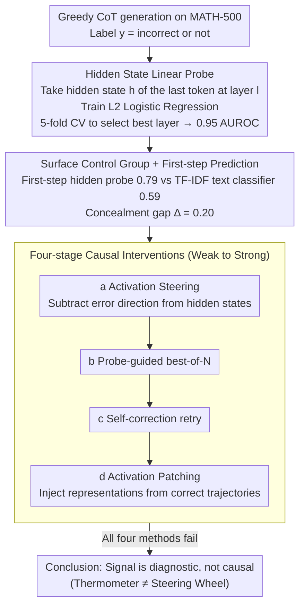

# Hidden Error Awareness in Chain-of-Thought Reasoning: The Signal Is Diagnostic, Not Causal

**Conference**: ICML 2026  
**arXiv**: [2605.09502](https://arxiv.org/abs/2605.09502)  
**Code**: Key code snippets provided in the paper appendix  
**Area**: LLM Reasoning / Mechanistic Interpretability / CoT Faithfulness  
**Keywords**: Chain-of-Thought, Hidden State Probing, Error Detection, Activation Steering, Causal Intervention

## TL;DR
Using a simple logistic regression probe on the hidden states of an LLM during Chain-of-Thought (CoT) generation can predict whether the entire reasoning process will fail with an AUROC of 0.95 (0.79 starting from the very first step). In contrast, a classifier trained on the surface text only achieves 0.59. However, four types of interventions (activation steering, probe-guided best-of-N, self-correction, and activation patching) all failed—indicating that this error signal is "diagnostic" rather than "causal."

## Background & Motivation

**Background**: The implicit contract of CoT prompting is that "the reasoning written by the model = its internal computational process." Previous studies (Turpin et al., Lanham et al.) have questioned this contract through behavioral interventions (e.g., biasing the CoT while the answer remains unchanged), but these remained at the textual surface. Meanwhile, the field of mechanistic interpretability (Meng et al. ROME, Li et al. ITI) has successfully localized and edited factual knowledge representations. It is natural to ask: can we similarly localize and correct reasoning errors?

**Limitations of Prior Work**: (1) Verbalized confidence is unreliable—models report 4.55/5 for incorrect trajectories and 4.87/5 for correct ones, making them nearly indistinguishable; (2) There are no observable error signals on the textual surface (hedging words and length differences are not statistically significant); (3) Existing self-correction methods have limited effectiveness and lack a mechanistic explanation for their failure.

**Key Challenge**: Whether a model "knows it is wrong" is distinct from whether it "can correct the error." The former belongs to the representation level (extractable by a probe), while the latter belongs to the causal mechanism (controllability). If these two are decoupled, the "diagnosis-editing" paradigm of mechanistic interpretability will fail in reasoning tasks.

**Goal**: (1) Quantify the predictive power of hidden states regarding CoT correctness and strictly compare it with surface textual signals; (2) Distinguish between "diagnostic" vs. "causal" signals through four progressively stronger intervention experiments; (3) Generalize this distinction across different model scales, families, and training paradigms (e.g., RL distilled).

**Key Insight**: Train a linear probe $p(\text{error} \mid h) = \sigma(w^\top h + b)$ using 100 MATH-500 problems as the training set, selecting the optimal layer via 5-fold CV. Simultaneously, train a TF-IDF + LR text classifier as a "surface-level control group." The AUROC gap between the two quantifies the degree of concealment between "hidden vs. surface" information.

**Core Idea**: Use the AUROC gap between "hidden vs. surface" to quantify the model's "hidden error awareness," and then test whether this awareness can conversely correct errors using a suite of four interventions: activation steering, best-of-N, self-correction, and activation patching.

## Method

### Overall Architecture
The paper is structured as a "three-act play": first, a linear probe is trained to read whether a CoT will be incorrect from the hidden states; second, the hidden states of the first step are extracted for early detection and paired with a text classifier as a "surface control" to quantify the concealment gap where "the model knows internally but hides it on the surface"; finally, the "error direction" identified by the probe is used for four causal interventions of increasing strength to verify if this signal can actually correct the errors. The elegance of the design lies in the step-by-step progression through probing, control, and intervention to cleanly decouple "diagnosis" from "causality."

### Key Designs

**1. Hidden State Linear Probe: Where to read the diagnostic signal**

Does the model "know" it will fail before writing an incorrect reasoning step? This step aims to extract that hidden judgment. The approach intentionally uses the weakest form: greedy generation of a full CoT, taking the hidden state $h_T^{(l)}$ of the last token of each sample at layer $l$ as features, with label $y=1$ representing an eventual error. An L2-regularized logistic regression ($C=0.1$, max 2000 iterations) is trained using standard regularized cross-entropy loss $\mathcal{L} = -\frac{1}{N}\sum [y_i \log \hat p_i + (1-y_i)\log(1-\hat p_i)] + \frac{1}{2C}\|w\|^2$. Training on 100 MATH-500 problems and evaluating on 200, the best layer is selected between 70-85% depth via 5-fold CV. The use of a simple linear model is critical: if a straight line can achieve 0.95 AUROC, it suggests that the "impending error" information is linearly separable in the hidden states, requiring no non-linear explanation. In fact, MLP (0.944) and Random Forest (0.893) perform worse than the linear probe (0.955), supporting this premise. Moreover, data efficiency is remarkably high, reaching 0.956 AUROC with only 20 samples.

**2. Surface Control Group + First-step Prediction: Quantifying "concealment" into a number**

Proving that hidden states contain the signal is insufficient; one must determine if this information is truly hidden from the text. A control group is established using the same 200 problems: a TF-IDF + Logistic Regression model yield a surface score $s_{text}$ based on the text of the first step, while a probe on the first-step hidden states yields $s_{hidden}$. The concealment gap is defined as $\Delta_{conceal} = s_{hidden} - s_{text}$. On Qwen2.5-3B, $s_{hidden} = 0.787$ and $s_{text} = 0.590$, resulting in a gap of $0.197$. The first-step AUROC of 0.787 is the paper's "smoking gun"—it demonstrates that the model "knows" it is going astray from the very first sentence, while the textual surface remains perfectly composed: length differences ($p=0.211$), numerical density ($p=0.726$), and hedging words (rate < 1%) show no statistically significant clues. Most strikingly, 65% of incorrect trajectories fall into an "unfaithful region" where the model reports self-confidence $\ge 4$ while the probe error score is $> 0.5$, providing hard evidence for the "hidden error awareness" concept.

**3. Four-stage Causal Interventions: A spectrum of intensity from "reading" to "editing"**

Does reading the direction equate to being able to fix the error? This is tested via four progressively stronger interventions. (a) Activation Steering: subtracting the normalized error direction $h' = h - \alpha (h \cdot \hat w) \hat w$. Accuracy improved by at most 4%, and a strong intervention ($\alpha = 8$) caused a 6% drop for the 3B model. (b) Probe-guided best-of-N: generating $N$ trajectories and selecting the one with the lowest probe score. This unexpectedly performed worse than simple majority voting, despite an oracle upper bound of 88-91%, indicating that the probe cannot effectively distinguish the correct candidates. (c) Self-correction: prompting the model to try again when the probe detects suspicion resulted in a 3% drop; even oracle-triggered retries only yielded a 1% gain. (d) Activation Patching is the most stringent test, mixing hidden states of correct trajectories into incorrect ones via $h'_{wrong} = (1 - \alpha) h_{wrong} + \alpha h_{correct}$. At $\alpha = 0.5$, the 3B model's accuracy collapsed to 0% as the patching completely shattered output coherence. These four methods cover the intensity spectrum from "reading a direction" to "implanting a correct representation." Their collective failure allows the rigorous assertion that this signal is "merely a thermometer, not a steering wheel." The collapse under activation patching is particularly decisive: while the same "read + edit" paradigm works for factual knowledge in ROME, it fail completely for reasoning quality, proving that reasoning is distributed and emergent across layers, whereas factual associations are locally editable.

## Key Experimental Results

### Main Results

| Model | Type | Accuracy | Best Layer | CV AUROC | Eval AUROC |
|------|------|--------|--------|----------|------------|
| Qwen2.5-1.5B | std | 0.35 | 27 | 0.918 | 0.724 |
| Qwen2.5-3B | std | 0.53 | 27 | 0.953 | **0.956** |
| Qwen2.5-7B | std | 0.62 | 16 | 0.669 | 0.737 |
| Qwen2.5-32B | std | 0.53 | 32 | **0.956** | — |
| Qwen2.5-72B | std | 0.41 | 64 | **0.977** | — |
| Llama-3.1-8B | std | 0.46 | 16 | 0.703 | 0.811 |
| Phi-3.5-mini | std | 0.39 | 8 | 0.936 | — |
| DeepSeek-R1-7B | RL distilled | 0.76 | 12 | 0.884 | 0.852 |

| Detection Method | AUROC | Cost |
|----------|-------|------|
| **Hidden State Probe (Ours)** | **0.953** | 1 Forward |
| Self-Consistency ($N = 5$) | 0.823 | 5× Gen |
| CCS (Burns et al.) | 0.718 | 1 Forward |
| $P(\text{True})$ | 0.721 | 1 Query |
| Verbalized Confidence | 0.674 | 1 Query |
| Sequence Log-prob | 0.676 | Free |

### Intervention Results (Ablation Study)

| Intervention Type | 3B Accuracy Change | 7B Accuracy Change |
|----------|---------------|---------------|
| Activation Steering (Best $\alpha$) | +3% | +4% |
| Activation Steering ($\alpha = 8$, Strong) | -6% | +4% |
| Best-of-N Probe Selection ($N = 12$) | 0.62 (oracle 0.88) | 0.70 (oracle 0.91) |
| Majority Voting (Control) | 0.75 | 0.75 |
| Self-correction (Always Retry) | -3% | -3% |
| Activation Patching (Mixed, $\alpha = 0.5$) | **0%** | **7%** |

### Key Findings
- **Predictable from the first step**: Qwen2.5-3B achieves a first-step AUROC of 0.787, already 98% of the full-trajectory performance—meaning the model internally "knows" it will fail before committing error to text.
- **Two types of temporal dynamics**: The 3B model is "preemptive" (largest gap of 0.41 at step 1, committing early to an error track), whereas the 7B model is "cumulative" (gap increases from 0.11 to 0.38), suggesting different error encoding mechanisms across scales.
- **Weak cross-domain transfer**: A probe trained on MATH drops to 0.54-0.55 AUROC when tested on ARC-Challenge. However, native ARC probes achieve 0.63-0.69, indicating "error directions" are domain-specific rather than a single universal direction.
- **Non-monotonic scaling curve**: 1.5B (0.918) → 7B (0.669) → 72B (0.977). The dip in intermediate scales suggests their errors are more scattered and harder to separate linearly, whereas large models re-regularize error representations.
- **Activation patching collapse as decisive evidence**: The ability to edit facts but inability to edit reasoning quality demonstrates that reasoning is a distributed emergent property, not a locally editable feature, providing a fundamental contrast to fact-editing works like ROME.

## Highlights & Insights
- **"Diagnostic vs. Causal" Dichotomy**: The authors use the thermometer analogy to clearly distinguish between "reading" and "steering." This distinction is highly valuable for mechanistic interpretability, as it defines the boundaries of methods like ROME for non-factual tasks.
- **Representation-level Evidence for CoT Faithfulness**: While previous discussions on CoT faithfulness were behavioral, this paper provides a rigorous quantification through the "hidden vs. surface AUROC gap = 0.20," establishing the new concept of "hidden error awareness."
- **Honest but Pessimistic**: The failure of all four interventions is a compelling negative result. The authors do not hide these failed experiments but use them as pivotal evidence for the main conclusion, exhibiting a commendable research style.
- **Implications for Process Reward Models (PRMs)**: The diagnostic signal found might be the same one PRMs are trained to detect. This implies that PRMs primarily serve for "selection" rather than "real-time process correction during training," as they may lack a causal lever.

## Limitations & Future Work
- The study did not test fine-tuning or RL (e.g., RLPF) on the probe signal, which might be a training-time solution to bridge the "diagnostic-causal" gap—an acknowledged open question.
- Experiments were primarily conducted on MATH-500. While cross-domain tests were done on ARC, other reasoning benchmarks (HumanEval, TheoremQA, MMLU-Pro) were not covered.
- All four interventions are post-training. The study did not attempt joint training with a probe loss during pre-training, which might be the true solution.
- The "difficulty control" effect was weaker on DeepSeek-R1 ($p = 0.447$, $d = -0.30$), likely due to insufficient statistical power with only $n=14$ incorrect trajectories at 76% accuracy.

## Related Work & Insights
- **vs. Turpin et al. 2023 / Lanham et al. 2023**: Previous works used behavioral interventions to question CoT faithfulness; this paper quantifies "concealment" at the representation level via AUROC gaps, providing a complementary methodology.
- **vs. ROME (Meng et al., 2022)**: ROME successfully edits factual associations, whereas this work proves that the same "read + edit" paradigm fails for reasoning errors, thus defining the limits of mechanistic interpretability.
- **vs. Zhang et al., 2025** (Concurrent Work): They also probe hidden states for self-verification for best-of-N selection; this paper demonstrates that probes cannot improve the reasoning itself, yielding opposite but complementary conclusions.
- **vs. CCS (Burns et al., 2023)**: CCS uses unsupervised methods to find "truth directions." This paper uses supervised probing for error detection, where the 0.953 AUROC significantly outperforms CCS's 0.718, showing a clear advantage for supervision in such tasks.

## Rating
- Novelty: ⭐⭐⭐⭐ The "diagnostic vs. causal" dichotomy is a clear conceptual innovation, and the hidden vs. surface quantification offers a new perspective, though probing itself is a standard tool.
- Experimental Thoroughness: ⭐⭐⭐⭐⭐ 9 models from 1.5B to 72B covering Qwen/Llama/Phi + RL distilled, with 4 interventions + cross-domain + difficulty controls + layer analysis.
- Writing Quality: ⭐⭐⭐⭐⭐ The "three-act play" structure is engaging; the thermometer analogy makes complex concepts intuitive; negative results are presented clearly.
- Value: ⭐⭐⭐⭐⭐ Serves as a significant warning siren for LLM safety monitoring (unreliable CoT auditing), mechanistic interpretability (limits), and PRM training.

<!-- RELATED:START -->

## Related Papers

- [\[ICML 2026\] Dynamics Within Latent Chain-of-Thought: An Empirical Study of Causal Structure](dynamics_within_latent_chain-of-thought_an_empirical_study_of_causal_structure.md)
- [\[ICML 2026\] Chain-of-Thought Reasoning in the Wild Is Not Always Faithful](chain-of-thought_reasoning_in_the_wild_is_not_always_faithful.md)
- [\[AAAI 2026\] Deep Hidden Cognition Facilitates Reliable Chain-of-Thought Reasoning](../../AAAI2026/llm_reasoning/deep_hidden_cognition_facilitates_reliable_chain-of-thought_.md)
- [\[ICML 2026\] Verifying Meta-Awareness via Predictive Rewards in Reasoning Models](verifying_meta-awareness_via_predictive_rewards_in_reasoning_models.md)
- [\[ACL 2026\] Do Not Step Into the Same River Twice: Learning to Reason from Trial and Error](../../ACL2026/llm_reasoning/do_not_step_into_the_same_river_twice_learning_to_reason_from_trial_and_error.md)

<!-- RELATED:END -->
