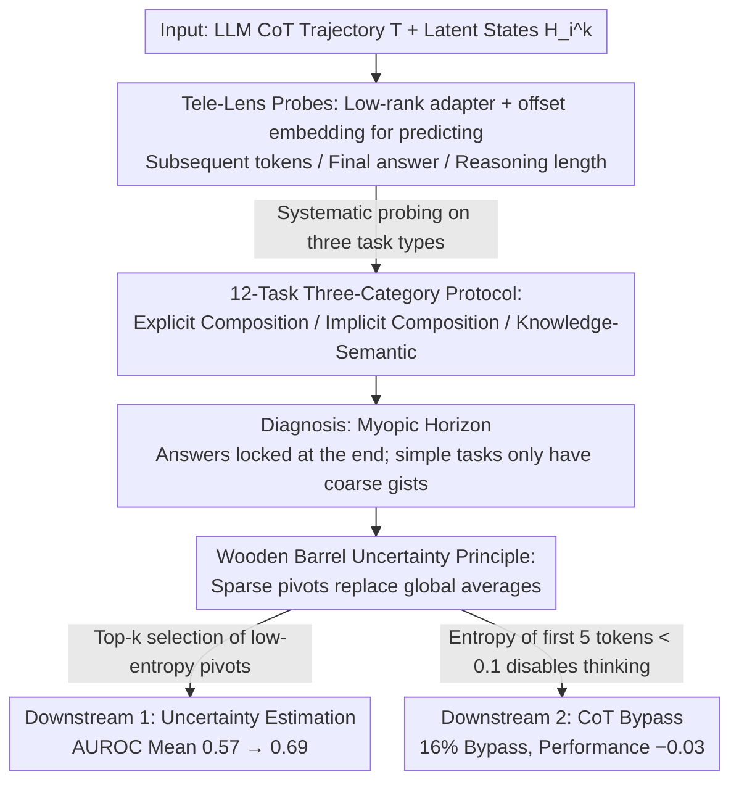

# How Far Ahead Do LLMs Plan? Uncovering the Latent Horizon in Chain-of-Thought Reasoning

**Conference**: ICML 2026  
**arXiv**: [2602.02103](https://arxiv.org/abs/2602.02103)  
**Code**: https://github.com/lxucs/tele-lens (Available)  
**Area**: LLM Reasoning / CoT Interpretability  
**Keywords**: Chain-of-Thought, Latent State Probes, Planning Horizon, Uncertainty Estimation, CoT Bypass

## TL;DR
This paper systematically measures the predictive power of LLM latent states regarding "future reasoning" across 12 cross-domain tasks using a low-rank adapter probe called Tele-Lens. The study reveals that internal LLM planning is **myopic**—it precisely locks onto answers only at the end of the CoT. Based on this, the "Wooden Barrel Principle" is proposed, using uncertainty at sparse pivot positions to represent the entire CoT, significantly improving uncertainty calibration and enabling a 16% CoT bypass.

## Background & Motivation

**Background**: CoT has become a standard paradigm for eliciting multi-step reasoning in LLMs, with models like DeepSeek-R1 further amplifying "long-chain thinking" via RL.

**Limitations of Prior Work**: Research regarding "whether CoT is essential" has yielded conflicting evidence. One side (Pal et al. 2023, Azaria & Mitchell 2023) found that **early latent states already encode subsequent reasoning and final answers**, suggesting CoT merely replays pre-calculated trajectories. The other side, based on Transformer expressivity theory (Merrill & Sabharwal 2023, Abbe et al. 2024), proves that only explicit intermediate steps can solve compositional reasoning and length generalization; thus, "knowing the answer in advance" should be impossible for structured tasks.

**Key Challenge**: Existing evidence often comes from single domains or single probe dimensions, leading to conflicting conclusions without alignment on a common scale. Does an LLM have a "global blueprint" before starting a CoT, or is it a "local greedy" step-by-step process? This question concerns both interpretability and the design premises for adaptive thinking and early-exit mechanisms in next-generation models like GPT-5 and Claude.

**Goal**: Decomposition into two sub-questions—Q1: To what extent do latent states encode a global reasoning blueprint rather than just supporting local incremental transitions? Q2: How does the planning horizon affect the estimation of CoT uncertainty and necessity?

**Key Insight**: The authors argue that prior contradictions arose from **focusing on only one dimension (usually "early prediction of final answers") within one task type**. By systematically probing across multiple dimensions (Final Answer / Subsequent Tokens / Total Length) × multiple task types (Explicit Composition / Implicit Composition / Knowledge-Semantic), the contradictions can be reconciled.

**Core Idea**: Train "Tele-Lens"—a probe using low-rank adapters to project latent states from each layer to an LM head to predict three types of "teleological" signals: subsequent tokens, final answers, and reasoning length. Subsequently, the "Wooden Barrel Uncertainty" principle is extracted and applied to two downstream problems: CoT calibration and necessity estimation.

## Method

### Overall Architecture
The study follows a dual-stage structure: Section 2 uses probes for diagnosis (Q1), and Section 3 applies those conclusions to downstream tasks (Q2). For diagnosis, the full CoT trajectory $T=\{t_1,\dots,t_n\}$ and latent states $H_i^k\in\mathbb{R}^d$ from 12 tasks are fed into the system. The output consists of accuracy/correlation curves for the three probe types across positions and layers. The "myopic horizon" phenomenon is identified through these curves. For application, the insight that "true signals are concentrated in a few pivot positions" is applied to AUROC uncertainty estimation and CoT bypass. Experiments are conducted on two backbones: the off-the-shelf Qwen3-32B and an In-Domain LLM trained on Qwen2.5-7B-Instruct via GRPO as a "theoretical upper bound" with cleaner reasoning.

### Key Designs

**1. Tele-Lens Probes: Peeking into three types of "futures" with one low-rank adapter**

Tele-Lens aims to cover three semantically different "teleological" dimensions within a unified framework. For any position $i$ and layer $k$ of latent state $H_i^k$, it predicts the next $m$ tokens, the final answer, and the remaining reasoning length. It follows the Logit Lens tradition of connecting intermediate layers to a frozen LM head $L$, but inserts a bottleneck adapter to resist overfitting: $\widetilde{H}_i^k = \operatorname{GeLU}\big((H_i^k + \operatorname{Emb}^k(\delta))A^k\big)B^k$, where $A^k\in\mathbb{R}^{d\times r}$ and $B^k\in\mathbb{R}^{r\times d}$ are low-rank matrices with rank $r=256$, outputting $\mathcal{P}_i^k=\operatorname{Softmax}(\widetilde{H}_i^k L)$. The **offset embedding** $\operatorname{Emb}^k(\delta)$ is crucial; by setting $\delta=1,2,\dots,m$, it specifies whether to predict the "next token" or the "8th token ahead," allowing multi-step prediction within the same adapter.

**2. 12-Task Three-Category Protocol: Putting "Composition vs. Knowledge" in one comparison**

Tasks are categorized into: **Explicit Composition** (Parity / Cycle / Subsum), **Implicit Composition** (GSM8K / MATH / AIME / MuSR / Zebra), and **Knowledge-Semantic** (CSQA / MMLU / QuALITY / GPQA). To ensure final-answer probes only predict on 20 fixed label tokens, all tasks were converted into multiple-choice questions with a fixed answer space using GPT-4o. This allows the unified explanation of "myopic horizon + coarse gists in simple tasks" to emerge.

**3. Wooden Barrel Uncertainty Principle: Replacing global averages with sparse pivots**

The diagnosis found that most tokens in a CoT are high-confidence "syntactic fillers," while only a few "logic leap points" determine correctness. The Wooden Barrel Principle translates "finding the shortest plank" to CoT: top-$k$ pivot positions are selected from a path based on extreme values (lowest entropy for Tele-Lens final-answer probes; highest uncertainty for perplexity/entropy/Self-Certainty). Only these $k$ positions are averaged as the path's uncertainty. Self-Certainty is defined as $\operatorname{SC}(X)=-\frac{1}{N|\mathcal{V}|}\sum_{i}\sum_{w\in\mathcal{V}}\log(|\mathcal{V}|\cdot P(w|x_{<i}))$. For CoT bypass, if the normalized entropy $\bar{\mathrm{H}}(\mathbf{p})=-\sum_{i=1}^{C}p_i\log p_i / \log C$ of any of the first 5 tokens is below 0.1, thinking mode is disabled.

### Loss & Training
Each probe dimension and each layer is trained using an independent adapter for approximately 5K steps with early stopping on the dev set and a fixed rank $r=256$. The In-Domain LLM used as an upper bound was trained via GRPO on Qwen2.5-7B-Instruct, producing cleaner CoTs (~1K characters compared to Qwen3’s 10K+).

## Key Experimental Results

### Main Results: Tele-Lens Probes Reveal Myopic Planning

**Evolution of final-answer probe across CoT positions** (In-Domain LLM, Parity task, Random guess 0.5):

| CoT Position (Distance from tail) | -4 | -3 | -2 | -1 | 0 (Tail) |
|---|---|---|---|---|---|
| In-Domain LLM | 0.49 | 0.51 | 0.51 | 0.97 | 0.99 |
| Off-the-Shelf Qwen3 | 0.50 | 0.52 | 0.51 | 0.94 | 0.97 |

The result clearly shows: until the penultimate step, the answer probability stays near the random baseline, suddenly jumping to $\geq 94\%$ at the last step—a classic "myopic tail mutation."

### Uncertainty Estimation AUROC (Higher is better)

Using Tele-Lens signals on the In-Domain LLM with the Wooden Barrel Principle:

| Method | GSM8K | Zebra | MMLU | GPQA | Mean |
|---|---|---|---|---|---|
| Perplexity (Global Avg) | 0.70 | 0.58 | 0.53 | 0.50 | 0.57 |
| Entropy (Global Avg) | 0.72 | 0.60 | 0.52 | 0.50 | 0.58 |
| Self-Certainty | 0.76 | 0.67 | 0.53 | 0.51 | 0.60 |
| **Tele-Lens Top-5** | **0.87** | **0.77** | **0.73** | **0.56** | **0.69** |

### CoT Bypass (Qwen3-32B, Threshold 0.1)

| Task | Parity | CSQA | MMLU | GPQA | Mean Bypass | Accuracy Change |
|---|---|---|---|---|---|---|
| Bypass Ratio | 0% | 16.2% | 12.4% | 1.2% | 2.8% | **-0.03** |

Notably, the bypass mechanism correctly preserved tasks like Parity that require CoT (0% bypass) while achieving double-digit bypass rates on CSQA/MMLU with minimal accuracy loss.

### Key Findings
- **5 pivots are sufficient**: Top-5 is the optimal $k$ for Tele-Lens; Top-50 is 5 points lower, as excessive pivots dilute the signal.
- **Middle layers are strongest**: The best probes are at layer 21 (out of 28) for the In-Domain LLM and layer 48 (out of 64) for Qwen3, consistent with findings that middle layers are semantically richest.
- **Shortcut warnings**: Predictability of "reasoning length" in Parity and Subsum was confounded by "input length." The Cycle task (where reasoning length depends on the path, not the total input) debunked the appearance of global planning as surface heuristics.

## Highlights & Insights
- **Reconciling contradictions**: The paper elegantly bridges the gap between "latent states encode answers early" and "Transformers need intermediate steps" via a two-layer narrative—the former corresponds to the sudden tail mutation, and the latter to early pattern matching.
- **Diagnosis-to-Application closed loop**: The Wooden Barrel Principle is derived directly from the diagnostic observation that final-answer entropy spikes only at a few positions.
- **Transferability of CoT bypass**: Using a 5-token probe entropy as a toggle for long-thinking achieves a 16% bypass rate with zero cost, suggesting that adaptive thinking routers can use a simple probe rather than a separate classifier.

## Limitations & Future Work
- **Dependency on fixed answer spaces**: The CoT bypass relies on entropy from a label set of 20 tokens, which may not apply to open-generation tasks (coding, long writing).
- **In-Domain LLM scale**: The 7B model may not represent the ceiling of 30B+ reasoning models that might possess stronger global planning.
- **Tele-Lens training cost**: Compared to pure Logit Lens, adapters must be trained for each layer and dimension.

## Related Work & Insights
- **vs. Logit Lens / Tuned Lens**: Tele-Lens extends the family toward "foresight prediction" by adding offset embeddings $\operatorname{Emb}^k(\delta)$.
- **vs. Early Answer Probing**: While others found "early prediction," this study shows this only holds for Knowledge/Semantic tasks and fails for strictly compositional tasks, revealing it as shallow pattern matching rather than global planning.
- **vs. CoT Early-Exit**: Unlike exiting during reasoning, this bypass decides "whether to think" before the thinking process starts.

## Rating
- Novelty: ⭐⭐⭐⭐ 
- Experimental Thoroughness: ⭐⭐⭐⭐⭐ 
- Writing Quality: ⭐⭐⭐⭐ 
- Value: ⭐⭐⭐⭐ 

<!-- RELATED:START -->

## Related Papers

- [\[ICML 2026\] When to Re-Plan: Subgoal Persistence in Hierarchical Latent Reasoning](when_to_re-plan_subgoal_persistence_in_hierarchical_latent_reasoning.md)
- [\[ICML 2026\] A Formal Comparison Between Chain of Thought and Latent Thought](a_formal_comparison_between_chain_of_thought_and_latent_thought.md)
- [\[ACL 2026\] How Chain-of-Thought Works? Tracing Information Flow from Decoding, Projection, and Activation](../../ACL2026/llm_reasoning/how_chain-of-thought_works_tracing_information_flow_from_decoding_projection_and.md)
- [\[ICML 2026\] Dynamics Within Latent Chain-of-Thought: An Empirical Study of Causal Structure](dynamics_within_latent_chain-of-thought_an_empirical_study_of_causal_structure.md)
- [\[NeurIPS 2025\] Latent Chain-of-Thought for Visual Reasoning](../../NeurIPS2025/llm_reasoning/latent_chain-of-thought_for_visual_reasoning.md)

<!-- RELATED:END -->
