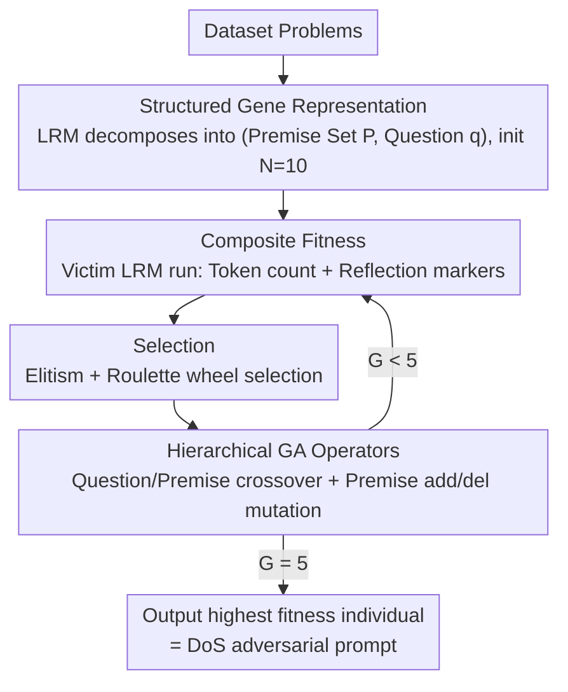

# Inducing Overthink: Hierarchical Genetic Algorithm-based DoS Attack on Black-Box Large Language Reasoning Models

**Conference**: ICML 2026  
**arXiv**: [2605.13338](https://arxiv.org/abs/2605.13338)  
**Code**: None  
**Area**: LLM Reasoning / AI Security / Adversarial Attacks  
**Keywords**: Overthinking, DoS Attack, Genetic Algorithm, Reasoning Models, Black-box Attack

## TL;DR
This paper targets the vulnerability of Large Reasoning Models (LRMs) to "logically incomplete inputs" that trigger overthinking. It proposes a Hierarchical Genetic Algorithm (HGA) that treats structured problem decompositions as genes under pure black-box conditions. Through sentence-level/question-level crossover and addition/deletion mutations, it searches for adversarial samples with logical fractures. This method amplifies response lengths by up to 26.1x on the MATH benchmark, enabling low-cost DoS attacks.

## Background & Motivation

**Background**: Reasoning models like DeepSeek-R1, GPT-o3, and Qwen3-Thinking have been widely deployed. Token counts directly determine reasoning latency and energy costs (Gao et al. 2024). Simultaneously, the community has observed an "overthinking" phenomenon: when faced with inputs missing premises or containing logical fractures, reasoning models repeatedly self-reflect and generate excessively long CoTs (Chen 2024, Fan 2025).

**Limitations of Prior Work**: (i) Existing DoS / energy-latency attacks (GCG, Engorgio) mostly rely on white-box gradients, making them unavailable for commercial closed-source APIs; (ii) Black-box AutoDoS methods rely on increasing prompt length to stack tokens, underutilizing the "thinking" mechanism of reasoning models; (iii) The Missing-Premise (MIP) dataset by Fan et al. relies on manual construction and lacks automation or adversarial optimization; (iv) OverThink attacks rely on hand-designed decoy tasks with narrow coverage.

**Key Challenge**: Methods capable of utilizing the specific characteristics of reasoning chains are manual, while automated methods fail to exploit the reasoning chain—no existing method simultaneously satisfies the requirements of being black-box, reasoning-aware, and automatable.

**Goal**: (i) Design an attack that automatically amplifies LRM reasoning tokens under pure black-box text interfaces; (ii) The attack signal should directly target "overthinking" behavior rather than just "longer output"; (iii) Adversarial samples must be transferable across models, shifting search costs from expensive commercial APIs to open-source surrogate models.

**Key Insight**: Treat the problem as a structured genome of a "premise set + final question" rather than an indivisible string. This allows for crossover and mutation at the "premise-question" pairing level to generate semantically readable but logically fractured adversarial problems, specifically triggering the LRM's tendency to reflect repeatedly when faced with incomplete or inconsistent premises.

**Core Idea**: Use a Hierarchical Genetic Algorithm to search the (premise set, question) space, combined with a composite fitness function of "length + reflection markers," to automatically evolve problems that induce overthinking.

## Method

### Overall Architecture
The attack aims to automatically find problems that cause reasoning models to generate excessively long CoTs under pure black-box conditions where only text APIs are accessible. Each problem is treated as an evolvable "gene." First, an LRM decomposes the problem into a structured $(\mathbf{P}, q)$ (list of premises + final question) to initialize a population of $N=10$ individuals. In each generation, the target model processes the inputs, and fitness is calculated based on the output token count and the frequency of reflection markers. Using elitism and roulette wheel selection, offspring are generated via four operations: question-level crossover, premise-level crossover, premise deletion, and premise addition. After $G=5$ generations, the individual with the highest fitness is output as the adversarial sample.

### Key Designs

**1. Structured Gene Representation: Decomposing the prompt into logical blocks**

Prior white-box attacks like GCG add suffix perturbations at the character or token level, which often destroys readability and fails to target reasoning logic. This paper adopts a different granularity: each problem is represented as an individual $x = (\mathbf{P}, q)$, where $\mathbf{P} = [p_1, \ldots, p_n]$ is a set of premises and $q$ is the final question. The search space is $\mathcal{X} = \{(\mathbf{P}, q)\mid \mathbf{P}\subseteq\mathcal{S}, q\in\mathcal{S}\}$. The initial population is generated by Qwen3-Thinking decomposing dataset problems. By using "logical blocks," genetic operators can perform crossover and mutation at the structural level. The resulting samples remain semantically readable, but the causal chain is broken—precisely triggering the LRM's recursive self-reflection.

**2. Composite Fitness: Length plus Reflection Markers**

Optimizing only for output length often leads to local optima where the model simply "pads" its response without truly overthinking. This paper adds a second objective to the fitness function: while $\text{score}_1(x) = |R(x)|$ quantifies the CoT length, $\text{score}_2(x) = \sum_{w\in\mathcal{V}}\text{Count}(w, R(x))$ counts reflection markers like "Wait/But/However/Hmm." The latter serves as an observable black-box proxy for how much the model is "struggling." Both scores are normalized via intra-generation z-score and linearly combined:

$$f(x) = \alpha \cdot \hat{\text{score}}_1 + (1-\alpha)\cdot\hat{\text{score}}_2$$

Experiments show that $\alpha=0.5\sim 0.7$ significantly outperforms pure length ($\alpha=1$) or pure reflection ($\alpha=0$). Reflection markers act as a compass, guiding the search toward problems that trap the model in self-doubt loops, ensuring more stable cross-model transfer.

**3. Hierarchical Genetic Operators: Fracturing logic at two granularities**

The operators operate at two levels. Crossover is triggered with probability $p_c$: question-level crossover swaps the $q$ between two parents, misaligning premises and questions; premise-level crossover swaps a single premise. Mutation is triggered with probability $p_m$: deleting a premise leaves the reasoning chain incomplete, while adding a premise from another individual injects irrelevant conditions. The question-level operator targets "premise-question" mismatch, while the premise-level operator creates internal contradictions, covering both types of logical fractures. The lack of semantic naturalness here is an advantage: the more confusing the problem, the more the LRM attempts to reason repeatedly.

### Loss & Training
The method involves no trainable parameters and follows a gradient-free black-box search: population size $N=10$, evolution $G=5$ generations, $p_c=0.8$, $p_m=0.2$. Each individual in each generation requires one API call to evaluate fitness. The total budget per model is approximately 60 queries.

## Key Experimental Results

### Main Results

| Dataset | Model | BASE Avg-len | MIP Avg-len | HGA Avg-len | Max-len Gain |
|--------|------|--------------|-------------|-------------|--------------|
| SVAMP | Qwen3-Thinking | 634 | 2231 | 5447 | 7906 (6.9×) |
| SVAMP | GPT-o3 | 239 | 620 | 3346 | 6562 (8.5×) |
| GSM8K | DeepSeek-R1 | 343 | 3093 | 4121 | 9068 (18.1×) |
| MATH | Qwen3-Thinking | 3618 | 7184 | 13007 | 22303 (2.5×) |
| MATH | Gemini-2.5-Flash | 2889 | 8043 | 12147 | 18011 (2.7×) |

HGA significantly outperforms BASE and MIP across all benchmarks; the maximum amplification on MATH reaches 26.1x.

### Ablation Study

| Setting | Key Metric | Description |
|------|---------|------|
| $\alpha=1.0$ (Length only) | MATH Max-len 14132 / Avg 6258 | Degenerates into simple padding |
| $\alpha=0.5$ (Balanced) | MATH Max-len 32019 / Avg 16826 | Optimal dual-objective synergy |
| $\alpha=0.7$ | MATH Max-len 26576 / Avg 18315 | Higher reflection weight, higher average |
| Transfer $\alpha=0.7$→DeepSeek-R1 | Max 31998 / Avg 10893 | Composite fitness superior for transfer |
| Qwen3-14B Proxy → GPT-o3 | Avg Gain 7.1× | Prompts evolved on small models hit commercial APIs |

### Key Findings
- **Intermediate $\alpha$ is Optimal**: Pure length targets get stuck in "local verbosity." Including reflection markers as a compass guides the search to samples that induce genuine self-doubt loops. This holds true when transferring to DeepSeek-R1.
- **High Efficiency**: On MATH, HGA uses only 99 input tokens to push DeepSeek-R1 to its 32,768 output limit, whereas AutoDoS requires 2,652 input tokens to reach 16,009. This proves the attack stems from logical perturbation, not token stacking.
- **Strong Transferability**: Using the open-source Qwen3-14B as a fitness proxy, the evolved prompts amplify GPT-o3 by 7.1x and Qwen3-Thinking by 8.1x on average, indicating that overthinking is a common weakness across LRM architectures.
- **Diminishing Returns on Budget**: Gains from increasing population size and generations from 5 to 30 saturate quickly, allowing strong adversarial samples to be found with minimal budget.

## Highlights & Insights
- **"Logical Incompleteness" as a Black-box Signal**: Lifting perturbations from the token level to the logical level shifts the search space to "composable sub-clauses," improving readability, scalability, and transferability.
- **Reflection Markers as Proxy Rewards**: Using "Wait/But/Hmm" counts as an observable proxy for "reasoning intensity" bypasses the difficulty of estimating internal computation in black-box settings.
- **Surrogate Model Transfer Attacks**: Offloading fitness evaluation to an open-source 14B model reduces search costs by orders of magnitude, enabling "cold-start" attacks on commercial APIs.
- **Linking Overthinking to DoS**: Redefines an "efficiency issue" as a "security vulnerability," opening a new research direction.

## Limitations & Future Work
- The attack still requires repeated queries to the victim model; 60 evaluations per problem may be identified by rate-limiting or frequency detection mechanisms on APIs.
- The reflection marker list is hand-picked and may fail for models thinking in other languages or code.
- Verified only on math benchmarks (GSM8K/SVAMP/MATH); transfer to code generation or multi-turn agents remains untested.
- Minimal discussion on defense; generic suggestions like "behavioral monitoring" lack concrete baselines.
- The attack lengthens the reasoning chain but does not guarantee an incorrect answer; early-stop mechanisms or answer caching could mitigate the impact.

## Related Work & Insights
- **vs GCG (Zou 2023)**: GCG is white-box and optimizes token suffixes; this work is black-box and perturbs logical structures.
- **vs AutoDoS / Crabs (Zhang 2025b)**: AutoDoS constructs "DoS Attack Trees" to lengthen prompts; HGA uses 20x fewer input tokens to achieve similar or greater output amplification through logical fracturing.
- **vs OverThink (Kumar 2025)**: OverThink relies on manually inserted decoy tasks; HGA uses GA for automated evolution, offering superior scalability.
- **vs Deadlock (Zhang 2025a)**: Deadlock forces "Wait/But" loops via forced tokens; HGA uses logical flaws to make the model spontaneously loop, making it harder to filter with heuristics.

## Rating
- Novelty: ⭐⭐⭐⭐ Combining logical gene structures with reflection marker fitness is a fresh perspective with impactful transfer findings.
- Experimental Thoroughness: ⭐⭐⭐⭐ Multiple LRMs, benchmarks, and baselines covered, with extensive ablations on hyperparameters and transferability.
- Writing Quality: ⭐⭐⭐⭐ Clear positioning and motivation; clearly delineated methodology.
- Value: ⭐⭐⭐⭐ Exposes a universal and exploitable weakness in LRMs, providing direct implications for rate-limiting and cost-cap designs.

<!-- RELATED:START -->

## Related Papers

- [\[ICML 2026\] DecepChain: Inducing Deceptive Reasoning in Large Language Models](decepchain_inducing_deceptive_reasoning_in_large_language_models.md)
- [\[ACL 2026\] Merlin's Whisper: Enabling Efficient Reasoning in Large Language Models via Black-box Persuasive Prompting](../../ACL2026/llm_reasoning/merlin39s_whisper_enabling_efficient_reasoning_in_large_language_models_via_blac.md)
- [\[ICML 2026\] Diagnosing Multi-step Reasoning Failures in Black-box LLMs via Stepwise Confidence Attribution](diagnosing_multi-step_reasoning_failures_in_black-box_llms_via_stepwise_confiden.md)
- [\[ICML 2026\] Modeling Hierarchical Thinking in Large Reasoning Models](modeling_hierarchical_thinking_in_large_reasoning_models.md)
- [\[ICML 2026\] Internalizing Safety Understanding in Large Reasoning Models via Verification](internalizing_safety_understanding_in_large_reasoning_models_via_verification.md)

<!-- RELATED:END -->
