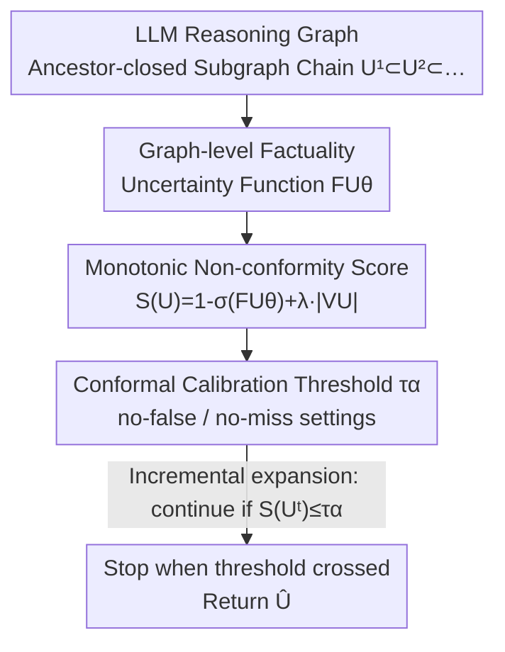

# Inference-Time Conformal Reasoning with Valid Factuality Control for Large Language Models

**Conference**: ICML2026  
**arXiv**: [2606.08831](https://arxiv.org/abs/2606.08831)  
**Code**: https://github.com/tinattw/ITCR  
**Area**: LLM Reasoning / Uncertainty Quantization / Conformal Prediction  
**Keywords**: Conformal Prediction, Reasoning Graph, Factuality Control, Inference-time Intervention, Coverage Guarantee

## TL;DR
ITCR transforms conformal prediction from a post-hoc "generate-then-prune" approach into an inference-time mechanism. It learns a graph-level factuality uncertainty function on the LLM reasoning graph and constructs a non-conformity score that increases monotonically with subgraph expansion. By stopping expansion immediately once a calibrated threshold is crossed, it provides valid $1-\alpha$ coverage guarantees for "no-false steps" or "no-missed correct steps," improving downstream reasoning accuracy by an average of 18.77%.

## Background & Motivation
**Background**: When LLMs perform multi-step reasoning, dependencies between intermediate conclusions form an implicit Directed Acyclic Graph (DAG): each node represents a claim, and edges represent "downstream conclusions depending on upstream ones." The correctness of a node is not self-contained but conditionally dependent on its ancestors—if an upstream step is incorrect, all downstream claims are contaminated.

**Limitations of Prior Work**: To provide factuality "insurance" for such reasoning, recent work (rubin2025conformal) introduced conformal prediction to guarantee that "retained claims are jointly consistent with ground truth" at a user-specified confidence level $1-\alpha$. However, these methods are **post-hoc**: they require the model to generate the entire multi-step answer first, then perform conformal filtering on candidate subgraphs and enforce "ancestor closure" constraints (removing nodes whose ancestors were pruned). Calibration is defined only on "pre-generated content," and CP cannot intervene in the generation process itself.

**Key Challenge**: Factuality uncertainty is inherently **structural**—it is defined over the reasoning structure, reflecting "which cluster of claims is unreliable" rather than a simple summation of node errors. Since reasoning is generated incrementally under ancestor dependencies, "node-level / post-hoc" uncertainty estimation is structurally misaligned with the "valid factuality of the final graph." Reliable control requires uncertainty quantification at the **reasoning structure level during inference**.

**Goal**: To design an **inference-time** conformal factuality control that decides whether to "continue expansion or stop" during generation while maintaining coverage guarantees.

**Key Insight**: The authors note that standard conformal prediction can be characterized by a family of "nested prediction sets," where calibration involves selecting the smallest index to achieve valid coverage. If reasoning graph generation can be structured as a "chain of incrementally nested ancestor-closed subgraphs" and the non-conformity score increases monotonically along this chain, the "threshold crossing" becomes irreversible. Thus, the stopping criterion aligns with conformal calibration.

**Core Idea**: Learn a graph-level factuality uncertainty function and combine it with a "model term + subgraph size penalty" to construct a **guaranteed monotonic (nested)** non-conformity score. This turns the conformal threshold into an inference-time stopping signal—replacing post-hoc pruning with inference-time termination.

## Method

### Overall Architecture
ITCR addresses the problem of determining when to stop during the incremental generation of an LLM reasoning graph to maintain factuality without being overly concise. The pipeline consists of two stages: **Offline**, a graph-level factuality uncertainty function $\mathrm{FU}_\theta$ is learned on a hold-out set, a non-conformity score $S(U)$ is defined, and the threshold $\tau_\alpha$ is calibrated based on the target coverage type. **Online**, starting from the root subgraph, the current ancestor-closed subgraph $U^t$ is expanded incrementally. At each step, $S(U^t)$ is calculated; if $S(U^t)\le\tau_\alpha$, the expansion continues. Once the threshold is crossed, expansion stops immediately, and the last accepted subgraph $\widehat U$ is returned. Due to score monotonicity, crossing is irreversible, eliminating the need for **backtracking or post-hoc pruning**.

There are two complementary factuality objectives: **no-false** (precision-oriented, no incorrect nodes allowed), requiring $\mathbb{P}(V_{\widehat U}\subseteq\mathcal{T})\ge 1-\alpha$ by taking the **maximal** ancestor-closed subgraph meeting the condition; and **no-miss** (recall-oriented, all correct nodes must be included), requiring $\mathbb{P}(\mathcal{T}\subseteq V_{\widehat U})\ge 1-\alpha$ by taking the **minimal** ancestor-closed subgraph meeting the condition ($\mathcal{T}$ is the set of factual nodes). Both share the same generation mechanism and differ only in threshold selection.

### Key Designs

**1. Learning Graph-level Factuality Uncertainty: Mapping "Reliability of Clusters" to Calibratable Scalars**
Reasoning factuality is naturally a graph-level property—the correctness of a claim depends on the presence and correctness of its ancestors, meaning valid outputs must be ancestor-closed. This renders node-level estimation ineffective alone, necessitating post-hoc pruning. However, no general principle exists to "aggregate" node-level uncertainty into a structurally consistent graph-level metric for conformal calibration. ITCR directly **learns** such a function $\mathrm{FU}_\theta:(U,\{\mathrm{fu}(v)\}_{v\in V_U})\mapsto\mathbb{R}_+$. It takes the current subgraph $U$ and its node-level factuality signals $\mathrm{fu}(v)\in[0,1]$ as input and outputs a scalar representing the risk of "factual violation." Supervision is constructed at the subgraph level: since graph-level factuality is binary (consistent or inconsistent with reference knowledge), learning $\mathrm{FU}_\theta$ becomes a binary classification task, where continuous outputs are interpreted as uncertainty scores for ranking. $\mathrm{FU}_\theta$ can be instantiated with any model invariant to set/graph permutations (linear, tree-based, or neural).

Crucially, the **validity** of the coverage guarantee is **independent** of $\mathrm{FU}_\theta$ performance—CP treats the learned score as a black box. Learning quality only affects **efficiency** (retaining larger subgraphs / stopping later).

**2. Monotonic (Nested) Non-conformity Score: Ensuring Irreversible Threshold Crossing**
Adapting conformal prediction's "nested set" perspective to sequential generation requires the non-conformity score to be monotonic under subgraph inclusion, i.e., $S(U^1)\le S(U^2)\le\cdots$ for $U^1\subset U^2\subset\cdots\subset U^{T_G}$ (Definition 3.1). Otherwise, $S(U^t)>\tau$ followed by $S(U^{t+1})<\tau$ would occur, making stopping criteria and calibration invalid. Since the learned $\mathrm{FU}_\theta$ (after sigmoid) is unconstrained, it does not guarantee monotonicity. ITCR explicitly constructs the score as:

$$S(U)=1-\sigma\big(\mathrm{FU}_\theta(U,\{\mathrm{fu}(v)\}_{v\in V_U})\big)+\lambda|V_U|,$$

where the first term $B(U)=1-\sigma(\mathrm{FU}_\theta(\cdot))$ is the model-provided factuality uncertainty, and the second term $\lambda|V_U|$ ($\lambda\in(0,1)$) is a **subgraph size penalty**. This penalty enforces monotonicity, reflecting the intuition that "cumulative uncertainty increases as the subgraph expands." Coverage holds for any fixed $\lambda$, which acts as an efficiency hyperparameter. A sufficient condition for $\lambda$ to ensure monotonicity is provided (Proposition 3.3): defining the worst-case non-monotonic fluctuation per added node as

$$\kappa(X):=\sup_{U\subset U'\subseteq G_X}\frac{\big(B(U)-B(U')\big)^+}{|V_{U'}|-|V_U|},\quad \kappa:=\sup_{X\sim P_X}\kappa(X),$$

the size penalty offsets the learning term's fluctuations if $\lambda\ge\kappa$, making $S(U)$ increasing under any ancestor-closed expansion. While global $\kappa$ is incalculable, the empirical distribution of per-instance $\kappa(X)$ along calibration trajectories is used to initialize $\lambda$ and balance "efficiency vs. robustness."

**3. Dual-target Conformal Calibration: Thresholding for no-false and no-miss**
With a monotonic score, calibration reduces to a standard 1D quantile problem, but with different calibration subsets. For **no-false** (Theorem 3.5), which controls the false positive rate on "subgraphs containing errors," calibration uses the **minimal** ancestor-closed subgraph $U_i^{\text{nf}}$ containing an error for each calibration input $X_i$. The threshold $\tau_\alpha^{\text{nf}}$ is the empirical $\alpha$-quantile of $\{S(U_i^{\text{nf}})\}$. Due to monotonicity, accepting any later "bad" subgraph implies accepting this first "bad" subgraph. For **no-miss** (Theorem 3.7), the calibration uses the **minimal** ancestor-closed subgraph $U^{\text{nm}}$ that contains all correct nodes, setting $\tau_{1-\alpha}^{\text{nm}}$ as the $(1-\alpha)$-quantile of $\{S(U^{\text{nm}})\}$. The no-miss design addresses the over-conservatism of no-false, which often leads to "total abstention" in complex graphs; no-miss allows a few uncertain nodes to preserve more complete reasoning. Both guarantees are model-agnostic and distribution-free.

## Key Experimental Results

### Main Results
Evaluated on MATH, GSM8K, and world-knowledge QA (FELM) benchmarks using LLaMA models. Metrics include **empirical coverage** (target $1-\alpha$) and **efficiency** (for no-false, Eff is the proportion of nodes retained; for no-miss, Eff is the proportion of nodes removed). ✓ indicate coverage within 0.01 tolerance. Results represent mean±std across 100 runs. Table excerpt for $\alpha=0.05$:

| Dataset | Method | no-miss Coverage | no-miss Eff(%) | no-false Coverage | no-false Eff(%) |
|---------|--------|------------------|----------------|-------------------|-----------------|
| MATH    | CPL    | ✗ 0.144          | 63.72          | ✗ 0.548           | 37.04           |
| MATH    | **ITCR**| ✓ 0.947          | 3.44           | ✓ 0.943           | 21.66           |
| GSM8K   | CPL    | ✗ 0.169          | 80.35          | ✗ 0.853           | 18.40           |
| GSM8K   | **ITCR**| ✓ 0.945          | 2.15           | ✓ 0.953           | 18.06           |
| QA      | CPL    | ✗ 0.383          | 92.72          | ✓ 0.947           | 7.73            |
| QA      | **ITCR**| ✓ 0.957          | 6.25           | ✓ 0.948           | 13.90           |

ITCR **consistently achieves valid coverage** across all datasets and targets, whereas the post-hoc baseline CPL fails significantly (no-miss coverage as low as 0.14-0.38). In downstream reasoning tasks, the subgraphs calibrated during inference result in an **average accuracy increase of 18.77%** compared to post-hoc pruning.

### Ablation Study
The learned $\mathrm{FU}_\theta$ was replaced with heuristic aggregation rules (ITCR-MAX / ITCR-SUM / ITCR-AVG) to isolate the contribution of graph-level learning ($\alpha=0.05$):

| Configuration | Aggregation Method | GSM8K no-miss Coverage / Eff | Note |
|---------------|--------------------|-----------------------------|------|
| ITCR          | Learned $\mathrm{FU}_\theta$ | ✓ 0.945 / 2.15 | Target met; optimal efficiency |
| ITCR-MAX      | Max node score     | ✗ 0.938 / 6.50 | Monotonic but misses coverage occasionally |
| ITCR-SUM      | Sum node score     | ✗ 0.931 / 5.24 | Often over-conservative in no-false (Eff≈1.0) |
| ITCR-AVG      | Average node score | ✗ 0.917 / 7.10 | Frequent coverage failure |

### Key Findings
- **Coverage must be viewed with efficiency**: Heuristic variants (especially SUM) can reach 1.000 coverage in no-false but collapse in efficiency (~0% retained), essentially "abstaining completely." Only the learned $\mathrm{FU}_\theta$ maintains high efficiency while meeting targets.
- **The value of learning is efficiency, not validity**: Theory proves coverage holds regardless of $\mathrm{FU}_\theta$ accuracy; experiments confirm that the learned version's advantage lies in more precise subgraph retention/removal.
- **no-miss mitigates abstention**: Previous post-hoc methods often yield 0% retention (total abstention) in QA datasets. no-miss significantly alleviates this by allowing a controlled number of uncertain nodes to keep the reasoning flow intact.

## Highlights & Insights
- **Reformulating Pruning as Inference-time Stopping**: The core insight is recognizing that "incremental reasoning graph generation = a nested subgraph chain," allowing the application of nested conformal set theory to provide statistical guarantees directly during generation.
- **Enforcing Monotonicity via Size Penalty**: The $+\lambda|V_U|$ term effectively transforms unconstrained neural network scores into monotonic stopping signals, grounded theoretically by the $\lambda\ge\kappa$ condition.
- **Decoupling Validity from Model Quality**: Since validity depends only on calibration and score monotonicity, $\mathrm{FU}_\theta$ can be implemented with various architectures (linear, trees, NNs), lowering the deployment threshold.
- **Generalizability**: This "nested score + inference-time stop" paradigm is applicable beyond factuality to any scenario requiring step-by-step generation with a managed risk threshold and statistical guarantees.

## Limitations & Future Work
- **Dependence on Exchangeability**: Calibration and test graphs must be i.i.d. / exchangeable; guarantees may degrade under distribution shift (different domains or models).
- **Reliance on Fine-grained Signals**: Requires claim-level correctness labels to supervise $\mathrm{FU}_\theta$ and determine $\mathcal{T}$, which is costly and potentially noisy.
- **Heuristic $\lambda$ Tuning**: Global $\kappa$ is unknown, requiring empirical $\kappa(X)$ distributions to initialize $\lambda$. Large $\lambda$ ensures monotonicity but increases conservatism; small $\lambda$ improves efficiency but risks violating monotonicity.
- **Graph Extraction Requirements**: The method assumes reasoning outputs can be well-defined as ancestor-closed DAGs. Robustly extracting such structures from unstructured free-text remains a precursor challenge.

## Related Work & Insights
- **vs. CPL (mohri2024language)**: CPL estimates risk at the single claim level during inference. ITCR learns **graph-level** uncertainty. CPL's coverage failures suggest node-level estimation is structurally mismatched with graph-level reliability objectives.
- **vs. Post-hoc Conformal Pruning (rubin2025conformal)**: Prior work generates the full answer before filtering. ITCR moves control to the generation phase as a "stopping problem," saving computational waste and improving downstream accuracy (+18.77%).
- **vs. Nested Conformal Prediction (gupta2022nested)**: ITCR maps the standard "nested set" idea to sequential expansion chains, where "attaining coverage at the minimal index" translates to "stopping at the earliest threshold crossing."

## Rating
- Novelty: ⭐⭐⭐⭐⭐ Successfully adapts CP from post-hoc to inference-time stopping with sound theoretical grounding.
- Experimental Thoroughness: ⭐⭐⭐⭐ Strong multi-dataset evaluation; heuristic ablations are informative.
- Writing Quality: ⭐⭐⭐⭐ Clear motivation and algorithmic mapping, though mathematical notations are dense.
- Value: ⭐⭐⭐⭐⭐ Provides a practical inference-time paradigm for factuality control with statistical guarantees.

<!-- RELATED:START -->

## Related Papers

- [\[ICML 2026\] Conformal Thinking: Risk Control for Reasoning on a Compute Budget](conformal_thinking_risk_control_for_reasoning_on_a_compute_budget.md)
- [\[ICML 2026\] Inference Time Optimization with Confidence Dynamics](inference_time_optimization_with_confidence_dynamics.md)
- [\[ICML 2026\] Reasoning Structure of Large Language Models](reasoning_structure_of_large_language_models.md)
- [\[ICML 2026\] Beyond Test-Time Memory: State-Space Optimal Control for LLM Reasoning](beyond_test-time_memory_state-space_optimal_control_for_llm_reasoning.md)
- [\[ICLR 2026\] ATTS: Asynchronous Test-Time Scaling via Conformal Prediction](../../ICLR2026/llm_reasoning/atts_asynchronous_test-time_scaling_via_conformal_prediction.md)

<!-- RELATED:END -->
