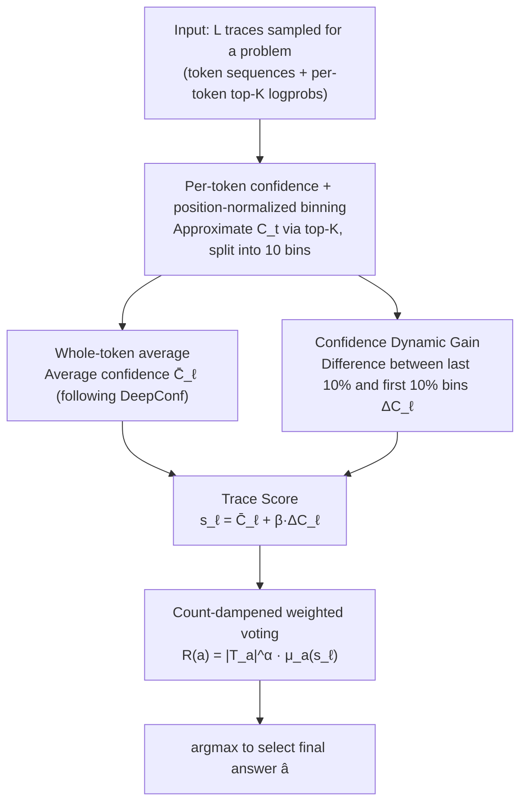

# Inference Time Optimization with Confidence Dynamics

**Conference**: ICML2026  
**arXiv**: [2605.25244](https://arxiv.org/abs/2605.25244)  
**Code**: https://github.com/Accenture/CDG.git  
**Area**: LLM Inference  
**Keywords**: Confidence Dynamics, Best-of-N, Voting Aggregation, GRPO, Inference-time Scaling

## TL;DR
The authors discover that during LLM multi-sample inference, the confidence of correct trajectories systematically rises along the reasoning chain while incorrect ones decay or stagnate. Based on this, they propose CDG (Confidence Dynamic Gain) voting—incorporating the "tail confidence − head confidence" as an additional discriminative signal into Best-of-N weighted voting. Across four open-source reasoning models and four math Olympiad benchmarks, it achieves an average improvement of 5.4% over majority voting and 1.7–4.8% over DeepConf.

## Background & Motivation

**Background**: The current mainstream route for improving LLM reasoning accuracy is Best-of-N sampling—sampling $L$ reasoning traces for the same problem and using an aggregation function to select the final answer. The simplest form, Self-Consistency, performs majority voting. Recent works like DeepConf and Self-Certainty use model confidence (sequence-level perplexity, average top-K log-prob) as voting weights to further extract sample utility.

**Limitations of Prior Work**: Existing confidence-based methods compress the confidence of a trace into a **single scalar**—either an average across all tokens (DeepConf-Mean) or just the fixed tail of 2048 tokens (DeepConf-Tail). This static aggregation loses the dimension of "how confidence evolves during the generation process." A trace that is highly confident in the last few tokens but remains uncertain throughout the middle is treat as equivalent to a trace that steadily climbs in confidence under static metrics.

**Key Challenge**: A reasoning trace is a time series, but existing voting methods treat it as an i.i.d. bag of tokens. Positional or dynamic information (the impact of which has been verified by work on attention sinks, lost-in-the-middle, etc.) is almost entirely unused in inference-time scaling.

**Goal**: (1) Characterize and quantify whether the evolution of confidence along a reasoning trajectory distinguishes "correct" from "incorrect" samples; (2) embed this dynamic signal into Best-of-N voting; (3) provide a mechanistic explanation for why models trained with GRPO exhibit this phenomenon.

**Key Insight**: The authors conducted a simple experiment using 4 open-source reasoning LLMs (DeepSeek-R1-8B / gpt-oss-20B / Gemma-3-27B / QwQ-32B) on AIME 2025. They normalized each trace by position into 10 bins and plotted the average confidence curve for correct vs. incorrect groups. They found that in the **correct group, the curve tail is significantly higher than the head, whereas in the incorrect group, it is either flat or tilted downwards**, with statistical significance (Appendix Table 5).

**Core Idea**: Define the "tail confidence − head confidence" as Confidence Dynamic Gain $\Delta C_\ell$. This is used as an additional scoring term for the trace, linearly combined with the original average confidence, and fed into a count-dampened weighted vote.

## Method

### Overall Architecture
CDG addresses the problem of "how to select the correct answer from $L$ reasoning traces" in Best-of-N voting. Its input consists of $L$ traces sampled for a problem, where each trace includes a token sequence $y_{\ell,1:T}$ and per-token top-K log-probs. The output is the selected final answer $\hat{a}$. The pipeline first normalizes and splits each trace's per-token confidence into 10 bins. One path computes the average confidence $\bar{C}_\ell$ across all tokens, while another calculates the scalar $\Delta C_\ell$ representing "how much more confident the tail is compared to the head." These are linearly combined into a trace score $s_\ell$. Finally, a weighted vote with frequency dampening aggregates the scores to select the answer with the maximum value. The method is entirely training-free; the only extra overhead is retaining token log-probs from the inference stack.

### Key Designs

**1. Per-token confidence + position-normalized binning: Aligning variable-length traces to fixed-dimensional curves**

Reasoning traces vary significantly in length—from hundreds to tens of thousands of tokens. Cutting windows based on absolute positions fails to align them, making it impossible to compare heads and tails at a population level. CDG follows DeepConf's top-K approximation for per-token confidence $C_t = -\frac{1}{K}\sum_{j\in\mathcal{K}_t}\log p(y_t=j)$ (with $K=20$, essentially the KL between top-K log-probs and a uniform distribution). It then divides $T$ tokens into $N=10$ equal bins $\mathcal{B}_{\ell,n}$. Taking the average within each bin $\bar{C}_\ell^{(n)}$ maps every trace to the same 10-dimensional vector $(\bar{C}_\ell^{(1)},\ldots,\bar{C}_\ell^{(N)})$. This positional normalization allows the authors to stack hundreds of traces of different lengths to reveal the statistical pattern where "correct groups rise at the tail, and incorrect groups drop" (Figure 2).

**2. Confidence Dynamic Gain $\Delta C_\ell$: Compressing "rising vs. falling confidence" into a discriminative signal**

DeepConf-Tail has already verified that "tail confidence" is useful, but focusing solely on the tail can confuse two distinct types of traces: "simple problems where the model is certain from the start" and "difficult problems where the model gains certainty through reasoning." CDG's key action is subtraction: taking the set of bins for the head $P\%$ and tail $P\%$, it defines $\Delta C_\ell = \frac{1}{|T_{\text{tail},P}|}\sum_{n\in T_{\text{tail},P}}\bar{C}_\ell^{(n)} - \frac{1}{|T_{\text{head},P}|}\sum_{n\in T_{\text{head},P}}\bar{C}_\ell^{(n)}$ (default $P=10$). A positive value indicates increasing confidence, while a negative value suggests the model started with a "bluff" but lost ground. Subtracting the head confidence serves as a baseline calibration for each trace, rewarding those that "gain insight during reasoning" and penalizing those that lose momentum. This differential signal is linearly combined into the trace score $s_\ell = \bar{C}_\ell + \beta\cdot\Delta C_\ell$, where $\beta$ is calibrated per model: $\beta\in[0.5 r_b, 1.5 r_b]$, with $r_b = \mu_C / \Delta_\mu$ estimated from calibration problems. In ablations, using only the tail without subtracting the head ("No Start") led to a 4.4 point drop on average and a 13.3 point drop on HMMT, proving that confidence "climb" is the effective signal, not just the tail's absolute value.

**3. Count-dampened weighted voting: Suppressing frequency terms to allow confidence signals to lead**

Once trace scores are available, they must be aggregated to the answer level. Naive majority voting allows the frequency count to overwhelm the subtle differences in confidence means. CDG aggregates using $R(a) = |\mathcal{T}_a|^\alpha \cdot \mu_a(s_\ell)$, where $\mathcal{T}_a$ is the set of traces yielding answer $a$, and $\mu_a(s_\ell)$ is the mean $s_\ell$ within that set. The exponent $\alpha\in[0,1]$ (default 0.5) is specifically used to down-weight the frequency term. Confidence means only influence the decision when $\alpha < 1$. In ablations, setting $\alpha=1$ (no dampening) caused the confidence signal to be ignored, leading to a 1.7 point drop. This formula also generalizes existing methods—$\alpha=1, \beta=0$ reduces to DeepConf, and $\alpha=1, \mu_a(s_\ell)=1$ reduces to majority voting.

### Loss & Training
**Training-free**. CDG operates entirely during the inference phase of pre-trained models. Hyperparameters $\alpha=0.5$ and $P=10\%$ are fixed throughout. $\beta$ is calibrated per model (10 for DeepSeek-R1-8B and gpt-oss-20B; 3 for Gemma-3-27B and QwQ-32B) using one benchmark for calibration and testing on the other three via cross-benchmark calibration.

## Key Experimental Results

### Main Results
Four open-source reasoning LLMs × four math Olympiad benchmarks (AIME 2024 / AIME 2025 / BRUMO 2025 / HMMT 2025), with $L=512$ traces sampled per problem.

| Model | Pass@1 | Majority | DC-Mean | DC-Tail | CDG (Ours) | vs Majority |
| :--- | :--- | :--- | :--- | :--- | :--- | :--- |
| DeepSeek-R1-8B | 75.8 | 84.2 | 84.2 | 88.3 | **90.8** | +6.6 |
| Gemma-3-27B | 25.7 | 35.0 | 35.0 | 40.0 | **41.7** | +6.7 |
| gpt-oss-20B | 66.5 | 82.5 | 84.2 | 85.0 | **85.8** | +3.3 |
| QwQ-32B | 69.7 | 75.0 | 75.9 | 78.3 | **80.0** | +5.0 |
| **Total Avg** | 59.4 | 69.2 | 69.8 | 72.9 | **74.6** | **+5.4** |

CDG achieved the highest average score across all models, improving by 4.8 points over DeepConf-Mean and 1.7 points over DeepConf-Tail. The improvement was most pronounced on the harder AIME 2025 (DeepSeek-R1-8B rose from 83.3 → 93.3, +10).

### Ablation Study

| Configuration | Total Avg (%) | Description |
| :--- | :--- | :--- |
| Full CDG | 74.6 | $\alpha=0.5, \beta\in\{3,10\}$, full head-tail difference |
| D-CDG ($\beta=0$) | 70.0 | Removes dynamic signal, count dampening only (equiv. to DeepConf-Mean) |
| D-CDG ($\alpha=1$) | 72.9 | Removes count dampening, frequency term dominates |
| "No Start" | 70.2 | No head subtraction, uses tail confidence only (-4.4) |

### Key Findings
- **Head-tail difference ($\Delta C_\ell$) is essential**: Removing the head baseline led to a 6.6 point drop for DeepSeek-R1 and a 13.3 point drop on HMMT, much larger than the gap from changing tail length—proving that the "climb" in confidence is the key signal.
- **Count dampening is essential**: At $\alpha=1$, frequency terms drown out the confidence signal, losing 1.7 points. Both levers, $\alpha$ and $\beta$, are necessary.
- **\boxed{} tokens are not the cause**: A control experiment re-calculating CDG without \boxed{} answer tokens showed 99% consistency in answer selection, proving the signal comes from reasoning dynamics, not the format tokens.
- **Superior in low-budget settings**: Across $L \in \{8, 16, \dots, 256\}$, CDG curves consistently outperform majority and DeepConf. The steeper improvement at small $L$ makes it more suitable for budget-sensitive scenarios.
- **Statistical Verification of Mechanism**: In most (model, dataset) combinations, $\Delta C_\ell > 0$ holds for the majority of correct traces, while $\Delta C_\ell < 0$ holds for the majority of incorrect ones (Figure 4d).

## Highlights & Insights
- **"Dynamics > Statics" is an underrated dimension**: Reasoning traces have inherent temporal structures, yet inference-time scaling literature mostly revolves around "mean/tail" aggregations. This work achieves a 5-point gain with a simple "subtraction," suggesting trajectory dynamics is a promising direction (e.g., entropy gain, perplexity slope).
- **Inference patterns from GRPO training dynamics**: The authors use GRPO's group-normalized advantage and the assumption that correct answers concentrate at the tail while reasoning paths disperse at the head to derive that correct traces have higher tail-to-head logit gains. This links empirical phenomena to training algorithms via a causal chain.
- **Elegant generalization of existing methods**: The formula $R(a) = |\mathcal{T}_a|^\alpha \cdot \mu_a(\bar{C}_\ell + \beta\Delta C_\ell)$ unifies majority voting, DeepConf-Mean, and CDG through different $(\alpha, \beta)$ settings.
- **Reusable tricks**: Position-normalized bins are applicable to any downstream task involving statistics along a generation process, such as early stopping, verifier signals for speculative decoding, or reward shaping.

## Limitations & Future Work
- **Dependency on token-level top-K logprob**: Closed-source APIs do not always provide full distributions, limiting deployment to commercially restricted models.
- **Model-dependent $\beta$**: While a scaling rule is provided, it still requires a small calibration set.
- **Strong theoretical assumptions**: The explanation relies on correct traces converging to a ground truth and incorrect ones remaining less concentrated at the tail. This might not hold for open-ended generation (code, creative writing).
- **Narrow benchmark scope**: Results focus primarily on math Olympiads. Generative tasks (MMLU-Pro, BBH, LiveCodeBench) are left for future work.
- **Best-of-N cost**: The overhead for $L=512$ is significant. Future work could integrate CDG with on-the-fly pruning for an "early-exit + dynamic signal" hybrid.

## Related Work & Insights
- **vs. DeepConf-Mean / DeepConf-Tail (Fu et al. 2025)**: Both compress confidence into a scalar. CDG snacks it as a time series. CDG improves over DC-Tail by 1.7 points and shows better performance at small sample sizes.
- **vs. Self-Certainty (Kang et al. 2025b)**: Uses KL(U‖p) as a voting weight, which is essentially a static confidence signal. CDG’s differential signal is orthogonal to this.
- **vs. Majority Voting (Wang et al. 2022)**: CDG maintains the interpretability of majority voting while introducing dampening and dynamic gain, outperforming it by 5.4 points.
- **vs. Process Reward Models (PRM)**: PRMs require training an external verifier. CDG utilizes the model's own logit sequence. The "climbing confidence" can be seen as a "poor man's PRM."

## Rating
- Novelty: ⭐⭐⭐⭐ Systematic reporting of the "confidence gain" phenomenon is a first; the additive term is clever and precise.
- Experimental Thoroughness: ⭐⭐⭐⭐ 4 models × 4 datasets × extensive ablations, though focused primarily on math.
- Writing Quality: ⭐⭐⭐⭐ Clear narrative (Observation → Method → Theory → Experiment) with distinct logic.
- Value: ⭐⭐⭐⭐ Training-free and compatible with reasoning LLMs, though logprob dependency is a slight hurdle.

<!-- RELATED:START -->

## Related Papers

- [\[ICLR 2026\] Fixing the Broken Compass: Diagnosing and Improving Inference-Time Reward Modeling](../../ICLR2026/llm_reasoning/fixing_the_broken_compass_diagnosing_and_improving_inference-time_reward_modelin.md)
- [\[ICML 2026\] Stabilizing Recurrent Dynamics for Test-Time Scalable Latent Reasoning in Looped Language Models](stabilizing_recurrent_dynamics_for_test-time_scalable_latent_reasoning_in_looped.md)
- [\[NeurIPS 2025\] Inference-Time Chain-of-Thought Pruning with Latent Informativeness Signals](../../NeurIPS2025/llm_reasoning/inference-time_chain-of-thought_pruning_with_latent_informativeness_signals.md)
- [\[ACL 2025\] Enhancing Retrieval Systems with Inference-Time Logical Reasoning](../../ACL2025/llm_reasoning/enhancing_retrieval_systems_with_inference-time_logical_reasoning.md)
- [\[ICML 2026\] Diagnosing Multi-step Reasoning Failures in Black-box LLMs via Stepwise Confidence Attribution](diagnosing_multi-step_reasoning_failures_in_black-box_llms_via_stepwise_confiden.md)

<!-- RELATED:END -->
