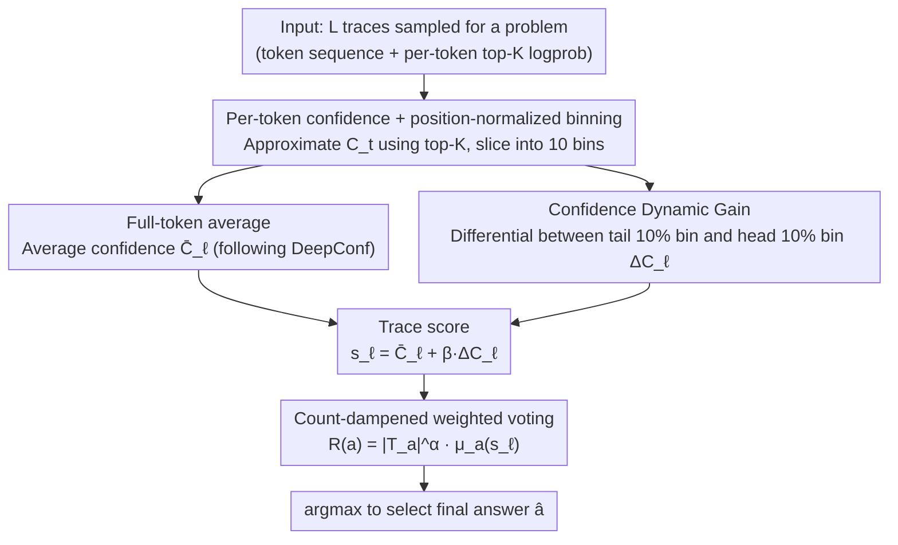

# Inference Time Optimization with Confidence Dynamics

**Conference**: ICML2026  
**arXiv**: [2605.25244](https://arxiv.org/abs/2605.25244)  
**Code**: https://github.com/Accenture/CDG.git  
**Area**: LLM Inference  
**Keywords**: Confidence Dynamics, Best-of-N, Voting Aggregation, GRPO, Inference-time Scaling

## TL;DR
The authors observe that during LLM multi-sample inference, the confidence of correct trajectories systematically increases along the reasoning chain, while incorrect trajectories decay or decrease. Based on this, they propose CDG (Confidence Dynamic Gain) voting—using "tail confidence − head confidence" as an additional discriminative signal embedded in Best-of-N weighted voting. Across four open-source reasoning models and four mathematical olympiad benchmarks, CDG achieves an average improvement of 5.4% over majority voting and 1.7–4.8% over DeepConf.

## Background & Motivation

**Background**: The current mainstream roadmap for improving LLM reasoning accuracy is Best-of-N sampling—sampling $L$ reasoning traces for the same problem and selecting the final answer using an aggregation function. The simplest form, Self-Consistency, performs majority voting. Recent works like DeepConf and Self-Certainty use model confidence (sequence-level perplexity, average top-K log-prob) as voting weights to further improve sample efficiency.

**Limitations of Prior Work**: Existing confidence-based methods compress the confidence of a trace into a **single scalar**—either the average of all tokens (DeepConf-Mean) or only the fixed last 2048 tokens (DeepConf-Tail). This static aggregation loses the dimension of "how confidence evolves along the generation process." A trace that has high confidence in the last few tokens but struggles in the middle is treated as equivalent to a trace that climbs steadily throughout, under static metrics.

**Key Challenge**: A reasoning trace is a time series, whereas existing voting treats it as an i.i.d. bag of tokens. Positional/dynamic information (whose impact has been verified in other works like attention sinks and lost-in-the-middle) is almost unused in inference-time scaling.

**Goal**: (1) Describe and quantify whether the evolution of confidence along a reasoning trajectory is discriminative between "correct" and "incorrect" cases; (2) Embed this dynamic signal into Best-of-N voting; (3) Provide a mechanistic explanation of why models trained with GRPO exhibit this phenomenon.

**Key Insight**: The authors conducted a simple experiment on 4 open-source reasoning LLMs (DeepSeek-R1-8B / gpt-oss-20B / Gemma-3-27B / QwQ-32B) using AIME 2025. They normalized each trace by position into 10 bins and plotted the average confidence curve for correct vs. incorrect groups. They found that **the correct group's curve is significantly higher at the tail than the head, while the incorrect group is either flat or tilted downwards**, with statistical significance (Appendix Table 5).

**Core Idea**: Define "tail confidence − head confidence" as Confidence Dynamic Gain $\Delta C_\ell$. This serves as an additional scoring term for the trace, which is linearly combined with the original average confidence and then fed into a count-dampened weighted vote.

## Method

### Overall Architecture
CDG addresses the problem of "how to select the correct answer from $L$ reasoning traces" in Best-of-N voting. Its input consists of $L$ traces sampled for a problem, with each trace containing a token sequence $y_{\ell,1:T}$ and per-token top-K log-probs. The output is the selected final answer $\hat{a}$. The pipeline first slices the per-token confidence of each trace into 10 bins via position normalization. One path calculates the full-token average confidence $\bar{C}_\ell$, while the other measures $\Delta C_\ell$ (how much more confident the tail is than the head). These are linearly combined into a trace score $s_\ell$. Finally, a weighted vote with frequency dampening aggregates the scores to select the answer via argmax. The method is entirely training-free, with the only extra overhead being the retention of token log-probs from the inference stack.

### Key Designs

**1. Per-token confidence + Position-normalized binning: Aligning variable-length traces into fixed-dimensional curves**

Reasoning traces vary greatly in length—from hundreds to tens of thousands of tokens. Slicing windows by absolute position fails to align them, making it impossible to compare heads and tails across the population. CDG follows DeepConf by using a top-K approximation for per-token confidence $C_t = -\frac{1}{K}\sum_{j\in\mathcal{K}_t}\log p(y_t=j)$ (with $K=20$, essentially the KL between top-K log-probs and a uniform distribution). Then, $T$ tokens are split into $N=10$ equal bins $\mathcal{B}_{\ell,n}$. The average within each bin gives $\bar{C}_\ell^{(n)}$, mapping every trace to the same 10-dimensional vector $(\bar{C}_\ell^{(1)},\ldots,\bar{C}_\ell^{(N)})$. This normalization allows the authors to stack hundreds of traces of different lengths to identify statistical patterns like the "tail uplift" in correct groups (Figure 2).

**2. Confidence Dynamic Gain $\Delta C_\ell$: Compressing "increasing vs. decreasing confidence" into a discriminative signal**

While DeepConf-Tail verified that "tail confidence" is useful, focusing only on the tail confuses two distinct trace types—easy problems the model is certain of from the start, and hard problems where certainty is gained through reasoning. CDG's key innovation is subtraction: taking the set of bins for the head $P\%$ and tail $P\%$, it defines $\Delta C_\ell = \frac{1}{|T_{\text{tail},P}|}\sum_{n\in T_{\text{tail},P}}\bar{C}_\ell^{(n)} - \frac{1}{|T_{\text{head},P}|}\sum_{n\in T_{\text{head},P}}\bar{C}_\ell^{(n)}$ (default $P=10$). A positive value indicates increasing confidence, while a negative value indicates a confident start that loses ground. Subtracting the head confidence acts as a baseline calibration for each trace, rewarding those that "gain insight" and punishing "anticlimactic" ones. This differential signal is linearly combined into the trace score $s_\ell = \bar{C}_\ell + \beta\cdot\Delta C_\ell$. The weight $\beta$ is calibrated per model: $\beta\in[0.5 r_b, 1.5 r_b]$, where $r_b = \mu_C / \Delta_\mu$ is estimated from calibration problems. Ablations show that using the tail without subtracting the head ("No Start") drops performance by an average of 4.4 points (and 13.3 on HMMT), proving that "confidence climb magnitude" is the effective signal.

**3. Count-dampened weighted voting: Suppressing frequency terms to allow confidence to influence decisions**

Simply using majority voting causes the confidence signal to be drowned out by raw counts. CDG uses $R(a) = |\mathcal{T}_a|^\alpha \cdot \mu_a(s_\ell)$ for aggregation, where $|\mathcal{T}_a|$ is the number of traces yielding answer $a$, and $\mu_a(s_\ell)$ is the mean score of those traces. The exponent $\alpha\in[0,1]$ (default 0.5) dampens the frequency term. Decisions are only influenced by confidence means when $\alpha<1$; in ablations, $\alpha=1$ (no dampening) causes performance to drop by 1.7 points as frequency dominates. This formula also generalizes existing methods—$\alpha=1,\beta=0$ reduces to DeepConf, and $\alpha=1,\mu_a(s_\ell)=1$ reduces to majority voting.

### Loss & Training
**None**. CDG operates entirely during the inference phase of pre-trained models. It only requires saving top-K log-probs during inference. Hyperparameters $\alpha=0.5$ and $P=10\%$ are fixed; $\beta$ is calibrated per model (10 for DeepSeek-R1-8B and gpt-oss-20B; 3 for Gemma-3-27B and QwQ-32B) using cross-benchmark calibration.

## Key Experimental Results

### Main Results
Evaluation across four open-source reasoning LLMs and four math benchmarks (AIME 2024 / AIME 2025 / BRUMO 2025 / HMMT 2025), with $L=512$ traces per problem.

| Model | Pass@1 | Majority | DC-Mean | DC-Tail | CDG (Ours) | vs Majority |
|------|--------|----------|---------|---------|------------|-------------|
| DeepSeek-R1-8B | 75.8 | 84.2 | 84.2 | 88.3 | **90.8** | +6.6 |
| Gemma-3-27B | 25.7 | 35.0 | 35.0 | 40.0 | **41.7** | +6.7 |
| gpt-oss-20B | 66.5 | 82.5 | 84.2 | 85.0 | **85.8** | +3.3 |
| QwQ-32B | 69.7 | 75.0 | 75.9 | 78.3 | **80.0** | +5.0 |
| **Overall Avg** | 59.4 | 69.2 | 69.8 | 72.9 | **74.6** | **+5.4** |

CDG achieved the highest average scores across all models, outperforming DeepConf-Mean by 4.8 points and DeepConf-Tail by 1.7 points. The gain was most significant on the difficult AIME 2025 (DeepSeek-R1-8B: 83.3 → 93.3, +10).

### Ablation Study

| Configuration | Overall Avg (%) | Description |
|------|-------------|------|
| Full CDG | 74.6 | $\alpha=0.5, \beta\in\{3,10\}$, full head-tail differential |
| D-CDG ($\beta=0$) | 70.0 | No dynamic signal, count-damped only (approx. DC-Mean) |
| D-CDG ($\alpha=1$) | 72.9 | No count dampening, frequency dominates confidence |
| "No Start" | 70.2 | No head subtraction, only tail confidence (−4.4) |

### Key Findings
- **$\Delta C_\ell$ is indispensable**: Removing the head baseline caused DeepSeek-R1 to drop 6.6 points (and 13.3 on HMMT), proof that the climb magnitude matters more than the absolute tail value.
- **Count dampening is indispensable**: When $\alpha=1$, frequency outweighs the confidence signal, losing 1.7 points. Both $\alpha$ and $\beta$ are necessary levers.
- **\boxed{} tokens are not the source**: Experiments recalculating CDG after removing \boxed{} answer tokens showed 99% consistency in answer selection, proving the signal comes from reasoning dynamics, not formatting tokens.
- **Superior at small samples**: CDG curves consistently outperformed majority and DeepConf across $L \in \{8, 16, \dots, 256\}$, with steeper gains at small $L$, making it budget-friendly.
- **Theoretic validation**: In most (model, dataset) pairs, $\Delta C_\ell > 0$ for correct traces and $\Delta C_\ell < 0$ for incorrect ones (Figure 4d), aligning with the theory.

## Highlights & Insights
- **"Dynamics > Statics" is an undervalued dimension**: Reasoning traces have inherent temporal structure, but literature often focuses on mean/tail aggregations. This work's simple "subtraction" yields 5 points, suggesting trajectory dynamics (e.g., entropy gain, perplexity slope) is a promising area.
- **Deducing inference patterns from GRPO training dynamics**: The authors used GRPO's group-normalized advantage and the assumption that correct answers concentrate at the tail while reasoning paths disperse at the head. They derived $\mathbb{E}[\Delta C_\ell|\text{correct}] - \mathbb{E}[\Delta C_\ell|\text{incorrect}] > 0$, linking empirical phenomena to training algorithms.
- **Elegant generalization of existing methods**: The formula $R(a) = |\mathcal{T}_a|^\alpha \cdot \mu_a(\bar{C}_\ell + \beta\Delta C_\ell)$ unifies majority voting, DeepConf, and CDG through different $(\alpha, \beta)$ settings.
- **Reusable trick**: Position-normalized bins are useful for any task performing statistics along the generation process, such as early exit, speculative decoding verifiers, or RL reward shaping.

## Limitations & Future Work
- **Dependency on token-level top-K logprobs**: Closed-source APIs (like some OpenAI or Anthropic models) may not provide full top-K distributions, limiting deployment.
- **Model-dependent $\beta$**: While scaling rules are provided, $\beta$ requires a few calibration samples and is not perfectly "plug-and-play" for new models.
- **Strong theoretical assumptions**: The explanation relies on (A1) tail convergence, (A2) diverse reasoning paths, and (A3) lower tail concentration for incorrect traces. Validity in open-ended generation (code, long writing) is unverified.
- **Narrow benchmark scope**: Results are focused on math olympiads. General reasoning (MMLU-Pro) and code (LiveCodeBench) are left for future work.
- **Cost of Best-of-N**: The overhead of $L=512$ is high. Future work could combine CDG with on-the-fly pruning for hybrid "early judging + dynamic signal" schemes.

## Related Work & Insights
- **vs DeepConf-Mean / DeepConf-Tail (Fu et al. 2025)**: Both compress confidence into scalars. CDG treats it as a time series using head-tail differences. CDG generalizes them via the $R(a)$ formula and shows higher gains at small $L$.
- **vs Self-Certainty (Kang et al. 2025b)**: Self-Certainty uses full-trace KL as weights—essentially another form of static confidence. CDG's differential signal is orthogonal and potentially additive.
- **vs Majority Voting / Self-Consistency (Wang et al. 2022)**: CDG maintains the interpretability of majority voting while introducing dampening and dynamic gain, outperforming it by 5.4 points on average.
- **vs Process Reward Models (PRM)**: PRMs require training an external verifier. CDG uses the model's own logit sequences without extra data or labeling. It can be seen as a "poor man's PRM."
- **Inspiration**: The "head-tail differential" signal can be migrated to (1) verifiers for self-speculative decoding, (2) reward shaping in RLHF, or (3) early-stopping signals in agent loops.

## Rating
- Novelty: ⭐⭐⭐⭐ Systematic reporting of confidence gain as a discriminator is novel; the method is a precise improvement over DeepConf.
- Experimental Thoroughness: ⭐⭐⭐⭐ Diverse models and extensive ablations, though limited to math tasks.
- Writing Quality: ⭐⭐⭐⭐ Clear narrative (observation → method → theory → experiment) with well-separated derivations.
- Value: ⭐⭐⭐⭐ Training-free and reusable for reasoning LLMs, though $\beta$ calibration adds a small hurdle.

<!-- RELATED:START -->

## Related Papers

- [\[ICML 2026\] Stabilizing Recurrent Dynamics for Test-Time Scalable Latent Reasoning in Looped Language Models](stabilizing_recurrent_dynamics_for_test-time_scalable_latent_reasoning_in_looped.md)
- [\[ICML 2026\] The Easy, the Hard, and the Learnable: Confidence and Difficulty-Adaptive Policy Optimization for LLM Reasoning](the_easy_the_hard_and_the_learnable_confidence_and_difficulty-adaptive_policy_op.md)
- [\[NeurIPS 2025\] Inference-Time Chain-of-Thought Pruning with Latent Informativeness Signals](../../NeurIPS2025/llm_reasoning/inference-time_chain-of-thought_pruning_with_latent_informativeness_signals.md)
- [\[ICLR 2026\] Fixing the Broken Compass: Diagnosing and Improving Inference-Time Reward Modeling](../../ICLR2026/llm_reasoning/fixing_the_broken_compass_diagnosing_and_improving_inference-time_reward_modelin.md)
- [\[ICML 2026\] Inference-Time Conformal Reasoning with Valid Factuality Control for Large Language Models](inference-time_conformal_reasoning_with_valid_factuality_control_for_large_langu.md)

<!-- RELATED:END -->
