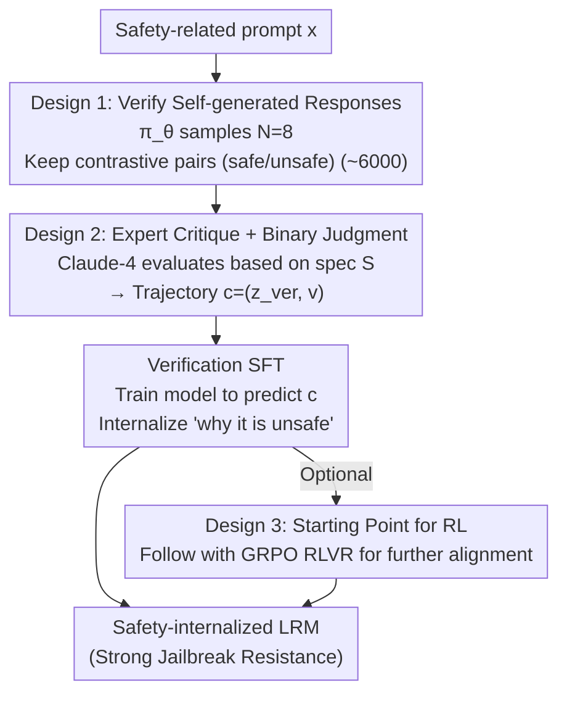

# Internalizing Safety Understanding in Large Reasoning Models via Verification

**Conference**: ICML 2026  
**arXiv**: [2605.08930](https://arxiv.org/abs/2605.08930)  
**Code**: https://github.com/AlphaLab-USTC/SInternal (Available)  
**Area**: LLM Reasoning / Safety Alignment  
**Keywords**: Safety Alignment, Reasoning Models, Self-Verification, Jailbreak Defense, SFT Initialization

## TL;DR
This paper demonstrates that "being able to generate safe answers" $\neq$ "understanding safety" and proposes the SInternal framework: training large reasoning models (LRMs) solely to verify the safety of their own generated answers. This approach fosters an emergent internal safety understanding that significantly suppresses jailbreak attacks (reducing StrongREJECT ASR from 41% to 0.6%) and serves as a superior starting point for subsequent RL.

## Background & Motivation

**Background**: The explicit Chain-of-Thought (CoT) in Large Reasoning Models (LRMs, e.g., DeepSeek-R1) can make final answers more dangerous. Current mainstream alignment paradigms are answer-centric: either performing SFT on expert-curated "safe trajectories" or using RL where a safety verifier scores the final answer.

**Limitations of Prior Work**: The authors conducted a simple experiment—asking an aligned LRM to judge "whether this candidate answer is safe for this prompt." The results were unsettling: DeepSeek-R1-Distill-Qwen-7B after SFT + RLVR performed worse than random guessing (F1 score) on this binary classification task (see Figure 2). In other words, the model learned to "output something that looks like a safe answer" without truly understanding why it is safe.

**Key Challenge**: Current alignment decouples "execution" from "judgment"—offloading judgment responsibility to external guardrails like Llama Guard, while the generator only learns to mimic surface patterns. This leads to extreme vulnerability to unseen jailbreaks: if an attacker hijacks the CoT with a compliant prefix, they can trick the model into believing "this prompt is safe," resulting in harmful outputs.

**Goal**: Enable the model to internalize the judgment of "why this answer is unsafe," rather than just learning "how to refuse."

**Key Insight**: "The ability to judge" is a stronger prerequisite for "the ability to execute"—if a model can truly verify whether an answer violates safety specs, it naturally knows what kind of answer should be produced. Thus, the training objective is flipped from "generating safe answers" to "verifying whether self-generated answers are safe."

**Core Idea**: Training LRMs solely with verification SFT to evaluate their own generation results allows internal safety understanding to emerge. This not only suppresses jailbreaks but also provides a more stable foundation for subsequent RL.

## Method

### Overall Architecture
The core of SInternal is flipping the training objective from "generating safe answers" to "verifying the safety of self-generated answers." The process consists of two steps: first, data construction—for each safety-related prompt $\mathbf{x}$, the initial policy $\pi_\theta$ samples $N=8$ responses $(\mathbf{z}_k, \mathbf{y}_k)$. Claude-4-Sonnet is used as an expert to evaluate each $\mathbf{y}_k$ based on safety specs $\mathcal{S}$, producing a verification trajectory $\mathbf{c}_k = (\mathbf{z}_{{\rm ver},k}, \mathbf{v}_k)$ containing critical reasoning and a binary judgment. Second, SFT optimization—given $(\mathcal{S}, \mathbf{x}, \mathbf{y})$, the model is trained to predict $\mathbf{c}$. Optionally, a stage of GRPO RLVR is applied after SInternal SFT to further align internalized judgment with actual generation behavior.

### Key Designs

**1. Verifying self-generated rather than external answers: Aligning safety boundaries with the model's own distribution**

The aforementioned pain point is that the answer-centric paradigm makes models mimic others' safety patterns without judgment regarding their own frequent errors. SInternal conversely uses the model's own sampled responses (including potentially unsafe ones) as verification targets: for each harmful prompt, $N=8$ responses are sampled. Only prompts containing both safe and unsafe outputs are retained, and a contrastive pair is selected. For benign prompts, one response is kept, resulting in approximately 6,000 training samples. The key is distribution alignment—training on other models' answers teaches "what mistakes others make," causing a mismatch with the model's own output distribution. Verifying its own frequent errors precisely calibrates the safety boundary to its own behavior. Ablations of Self-Exp (using own trajectories) vs. Other-Exp (using trajectories sampled by DS-8B) confirm that self-generated data is consistently superior across all benchmarks.

**2. Dual-component trajectories of expert critique + binary judgment: Forcing explicit reasoning via "Analysis + Judgment"**

Providing only a safe/unsafe binary label carries too little information; the model would only learn surface patterns without internalizing "why." Thus, each verification trajectory produced by the expert Claude-4-Sonnet has two parts: first, a critique reasoning $\mathbf{z}_{\rm ver}$ detailing potential violations in the candidate answer, followed by a binary judgment $\mathbf{v}$ (safe/unsafe). These two components serve distinct, indispensable roles—ablations show that critique is primarily responsible for generalizing to unseen jailbreaks (ASR on Fortress jumps from 19.2% to 46.8% without critique), while judgment stabilizes in-domain performance (StrongREJECT ASR increases from 0.6% to 7.3% without judgment). Explicit critique provides reasoning supervision on "why a spec is violated," forcing the model to learn underlying safety concepts rather than memorizing refusal templates, which is the root of its OOD attack transferability.

**3. SInternal as initialization for subsequent RL: Providing GRPO with a truly "knowledgeable" starting point**

Standard SFT only pushes the model to "look safe," but during the RL stage, the model may fail to consistently understand reward signals. SInternal equips the model with an inherent understanding of "why," making RL fine-tuning more convergent. Specifically, GRPO RLVR is run after SInternal SFT: the reward function uses $r = \mathcal{V}_{\rm safe}$ for harmful prompts and $r = \mathcal{V}_{\rm safe}(1 - \mathcal{V}_{\rm refuse})$ for benign prompts to suppress over-refusal, with Qwen3-Guard as the verifier. Advantages are normalized as $\hat{A}_i = (r_i - \bar{r}) / (\sigma_r + \epsilon)$. Effectively, SInternal-initialized RL is the only configuration capable of defending against HCoT (the strongest LRM-specific CoT-hijack jailbreak), while other RL baselines fail.

### Loss & Training
Stage 1 is standard SFT cross-entropy $\mathcal{L}_{\rm SInternal} = -\mathbb{E}_{(\mathbf{x}, \mathbf{y}, \mathbf{c}) \sim \mathcal{D}_{\rm ver}} \log \pi_\theta (\mathbf{c} | \mathcal{S}, \mathbf{x}, \mathbf{y})$ with ~6,000 training samples, using LoRA (rank=16, $\alpha=32$) for 2 epochs at a learning rate of $2 \times 10^{-4}$. Stage 2 is GRPO with a rollout batch of 64 prompts $\times n=8$, actor learning rate $10^{-6}$, KL coefficient disabled, and mixed with 3k DAPO math problems to preserve reasoning capabilities.

## Key Experimental Results

### Main Results
Evaluated on 3 LRMs (DS-Qwen-7B / DS-Llama-8B / DS-Qwen-14B) across 9 benchmarks (3 safety, 1 over-refusal, 2 reasoning). Baselines include SafeChain and STAR-1.

| Configuration | StrongREJECT (ASR↓) | Fortress (ASR↓) | WildJailbreak (ASR↓) | HCoT (ASR↓) | XSTest (CR↑) | AIME (↑) |
| :--- | :--- | :--- | :--- | :--- | :--- | :--- |
| DS-14B Base | 41.2 | 52.6 | 44.4 | 100.0 | 95.6 | 86.7 |
| DS-14B + SafeChain SFT | 24.9 | 48.2 | 45.2 | 100.0 | 99.6 | 83.3 |
| DS-14B + STAR-1 SFT | 0.6 | 28.2 | 18.4 | 100.0 | 94.0 | 83.3 |
| **DS-14B + SInternal SFT** | **0.6** | **19.2** | **6.8** | 90.0 | 98.0 | 86.7 |
| DS-14B + STAR-1 + GRPO | 0.0 | 7.8 | 3.6 | 98.0 | 96.0 | 80.0 |
| **DS-14B + SInternal + GRPO** | **0.0** | **5.2** | **0.4** | **62.0** | **99.2** | 80.0 |

### Ablation Study

| Configuration | StrongREJECT | Fortress | WildJailbreak | Description |
| :--- | :--- | :--- | :--- | :--- |
| Full SInternal | 0.6 | 19.2 | 6.8 | Full version |
| w/o critique | 2.9 | 46.8 | 22.4 | Binary judgment only, no reasoning |
| w/o judgment | 7.3 | 18.8 | 7.6 | Critique only, no binary judgment |
| Self-Exp (DS-7B) | 7.0 | 22.6 | 21.6 | Verifying self-sampled trajectories |
| Other-Exp (DS-7B) | 9.6 | 27.4 | 27.6 | Using trajectories sampled by DS-8B |

### Key Findings
- **Verification-to-Generation Transfer**: SFT solely on verification tasks yields a massive drop in generation ASR—indicating that "learning to verify" implicitly contains the ability to "learn to generate safe answers."
- **Generalization to Unseen Jailbreaks**: SInternal is not always first on in-domain StrongREJECT (0.6 vs. STAR-1 0.6 tie), but consistently leads on OOD Fortress and LRM-specific HCoT/Trotter, suggesting it learns concepts rather than patterns.
- **Emergence of Proactive Verification**: Using GPT-4o to detect spontaneous safety verification in CoT, SInternal has a trigger rate of 50.4% vs. Base 16.0% / STAR-1 28.4%, with a 99.2% conditional safety rate after triggering.
- **High Data Efficiency**: With only 50% of the data used by SFT baselines, SInternal achieves or exceeds the performance of full-data baselines.
- **Preservation of Reasoning**: SInternal shows no drop in performance on MATH/AIME, proving safety alignment does not sacrifice reasoning.

## Highlights & Insights
- The conceptual shift that "verification is a necessary prerequisite for generation" is a significant contribution to the alignment community and could be extended to other dimensions like helpfulness and honesty.
- Generating contrastive pairs from the model's own responses (one safe, one unsafe) offers an automated way to create DPO-style preference data, eliminating manual labeling.
- The functional split where critique drives generalization and judgment drives in-domain performance is insightful—it suggests future safety datasets should include both "reasoning + label" components.
- HCoT and similar CoT-hijack attacks are only successfully defended by SInternal+GRPO, proving that "a model truly understanding the consequences of final behavior" is key to resisting CoT manipulation.

## Limitations & Future Work
- Current verification is performed post-generation and has not been extended to "dynamic self-verification during generation"—a clear open direction.
- Verification ability still trails generation: models sometimes produce safe answers but fail to verify them correctly; the gap is not fully closed.
- Reliance on Claude-4-Sonnet as the expert for critique generation; if the expert is biased, distillation may amplify that bias.
- Experiments were focused on the DeepSeek-R1-Distill series; verification on closed-source LRMs like o1 or Claude Thinking is still needed.
- HCoT still retains a 62% ASR against 14B+GRPO, meaning full defense is still far off.

## Related Work & Insights
- **vs. SafeChain (Jiang et al. 2025)**: SafeChain distills long CoT safety reasoning but remains answer-centric; this paper proves that training only for verification generalizes better (Fortress ASR 19.2 vs. 48.2).
- **vs. STAR-1 (Wang et al. 2025)**: STAR-1 also uses deliberate reasoning over safety specs but targets direct safe answer generation; this paper flips the objective to verification for more stable performance.
- **vs. Llama Guard / Qwen3-Guard external guardrails**: External guardrails outsource the judgment responsibility, leaving the model to learn surface mimicry; this paper proves that internalizing judgment is the fundamental cure.

## Rating
- Novelty: ⭐⭐⭐⭐⭐ Flipping the training objective from "generation" to "verification" is a conceptual breakthrough, strongly supported by experiments.
- Experimental Thoroughness: ⭐⭐⭐⭐⭐ 3 models × 9 benchmarks + self/other sampling ablations + critique/judgment split + spec substitution + data efficiency; very comprehensive coverage.
- Writing Quality: ⭐⭐⭐⭐ Clear narrative progression, though some formula formatting is slightly dense.
- Value: ⭐⭐⭐⭐⭐ Provides a new paradigm for LRM safety alignment; open-sourced code allows direct reuse by the alignment community.

<!-- RELATED:START -->

## Related Papers

- [\[ICLR 2026\] When Reasoning Meets Compression: Understanding the Effects of LLMs Compression on Large Reasoning Models](../../ICLR2026/llm_reasoning/when_reasoning_meets_compression_understanding_the_effects_of_pruning_and_quant.md)
- [\[ICML 2026\] Are Large Reasoning Models Interruptible?](are_large_reasoning_models_interruptible.md)
- [\[ICML 2026\] Inducing Overthink: Hierarchical Genetic Algorithm-based DoS Attack on Black-Box Large Language Reasoning Models](inducing_overthink_hierarchical_genetic_algorithm-based_dos_attack_on_black-box_.md)
- [\[ICML 2026\] Prism: Efficient Test-Time Scaling via Hierarchical Search and Self-Verification for Discrete Diffusion Language Models](prism_efficient_test-time_scaling_via_hierarchical_search_and_self-verification_.md)
- [\[ICML 2026\] DecepChain: Inducing Deceptive Reasoning in Large Language Models](decepchain_inducing_deceptive_reasoning_in_large_language_models.md)

<!-- RELATED:END -->
