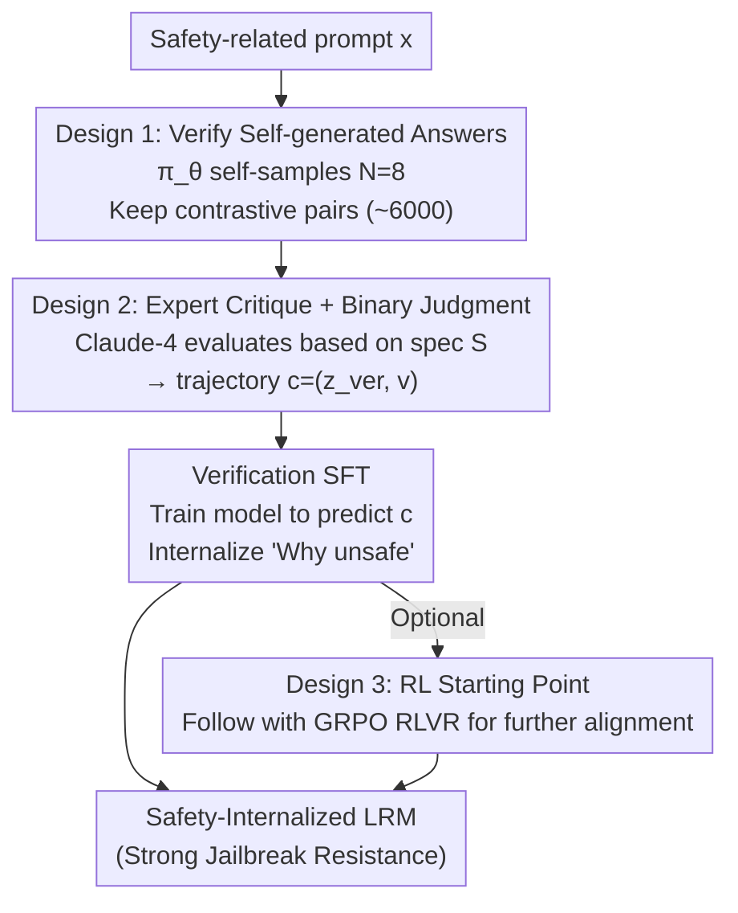

# Internalizing Safety Understanding in Large Reasoning Models via Verification

**Conference**: ICML 2026  
**arXiv**: [2605.08930](https://arxiv.org/abs/2605.08930)  
**Code**: https://github.com/AlphaLab-USTC/SInternal (Available)  
**Area**: LLM Reasoning / Safety Alignment  
**Keywords**: Safety alignment, reasoning models, self-verification, jailbreak defense, SFT initialization  

## TL;DR
This paper demonstrates that "generating safe answers" $\neq$ "understanding safety" and proposes the SInternal framework: training large reasoning models (LRMs) solely to verify the safety of their own generated answers. The resulting emergent internal safety understanding significantly suppresses jailbreak attacks (StrongREJECT ASR drops from 41% to 0.6%) and provides a superior starting point for subsequent RL.

## Background & Motivation

**Background**: The explicit Chain-of-Thought (CoT) in LRMs (e.g., DeepSeek-R1) can make final answers more dangerous. Current mainstream alignment paradigms are answer-centric: either performing SFT on expert-curated "safe trajectories" or using RL with safety verifiers to score the final answer.

**Limitations of Prior Work**: The authors conducted a simple experiment—asking aligned LRMs to judge whether a candidate response to a prompt is safe. The results were concerning: DeepSeek-R1-Distill-Qwen-7B, after SFT + RLVR, performed worse than random guessing in this binary classification task (as shown in Figure 2). This indicates that the model has learned to "output something that looks like a safe answer" without truly understanding why it is safe.

**Key Challenge**: Current alignment decouples "execution" from "judgment"—outsourcing judgment entirely to external guardrails like Llama Guard, while the generator only learns to mimic surface-level patterns. This renders models extremely vulnerable to unseen jailbreaks: as long as an attacker hijacks the CoT with a compliant prefix, they can trick the model into believing "this prompt is safe," leading to harmful outputs.

**Goal**: To internalize the model's ability to judge "why this answer is unsafe," rather than just learning "how to refuse."

**Key Insight**: Being able to judge is a stronger prerequisite for being able to execute—if a model can truly verify whether an answer violates safety specs, it naturally knows what kind of answer should be produced. Thus, the training objective is flipped from "generating safe answers" to "verifying the safety of self-generated answers."

**Core Idea**: By using only verification SFT to train the LRM to evaluate its own generation results, emergent internal safety understanding suppresses jailbreaks and serves as a stable foundation for subsequent RL.

## Method

### Overall Architecture
The core of SInternal is flipping the training objective from "generating safe answers" to "verifying whether self-generated answers are safe." The process consists of two steps: first, data construction—for each safety-related prompt $\mathbf{x}$, the initial policy $\pi_\theta$ samples $N=8$ responses $(\mathbf{z}_k,\mathbf{y}_k)$, and Claude-4-Sonnet acts as an expert to evaluate each $\mathbf{y}_k$ based on safety spec $\mathcal{S}$, producing a verification trajectory $\mathbf{c}_k=(\mathbf{z}_{{\rm ver},k},\mathbf{v}_k)$ containing critical reasoning and a binary judgment; second, SFT optimization—given $(\mathcal{S},\mathbf{x},\mathbf{y})$, the model is trained to predict $\mathbf{c}$. Optionally, a stage of GRPO RLVR is added after SInternal SFT to further align the internalized judgment with actual generation behavior.

### Key Designs

**1. Verifying self-generated rather than external answers: Calibrating safety boundaries to the model's own distribution**

The aforementioned pain point is that the answer-centric paradigm only teaches the model to mimic others' safety patterns, leaving it unable to judge its own typical errors. SInternal conversely uses the model's own sampled responses (including potentially unsafe ones) as verification targets: for each harmful prompt, $N=8$ responses are sampled, retaining only those prompts that yield both safe and unsafe outputs. A pair of contrastive samples is selected for these, while benign prompts retain one sample, totaling ~6000 training instances. The key lies in distribution alignment—training on other models' responses teaches the model about others' mistakes, creating a mismatch with its own distribution; verifying its own frequent errors precisely calibrates the safety boundary to its own behavior. Ablations of Self-Exp (using own trajectories) vs. Other-Exp (using trajectories from DS-8B) confirm that self-generated data consistently performs better across all benchmarks.

**2. Expert critique + Binary judgment dual-component trajectory: Forcing explicit reasoning via "Analysis + Judgment"**

Providing only a binary safe/unsafe label carries too little information, causing the model to learn surface patterns without remembering "why it is unsafe." Thus, each verification trajectory produced by Claude-4-Sonnet consists of two parts: a critique $\mathbf{z}_{\rm ver}$ that analyzes potential violations in the candidate response, followed by a binary judgment $\mathbf{v}$ (safe/unsafe). These components serve distinct, indispensable roles—ablations show that critique is primarily responsible for generalizing to unseen jailbreaks (ASR on Fortress jumps from 19.2% to 46.8% without it), while judgment stabilizes in-domain performance (StrongREJECT ASR rises from 0.6% to 7.3% without it). Explicit critique provides reasoning supervision on "why the spec was violated," forcing the model to learn underlying safety concepts rather than rote refusal templates, which is the root of its OOD generalization.

**3. SInternal as Initialization for Subsequent RL: Giving GRPO a truly "understanding" starting point**

Standard SFT only makes the model "look safe," but during RL, the model may fail to consistently understand reward signals. SInternal equips the model with an inherent understanding of "why," making RL fine-tuning more convergent. Specifically, GRPO RLVR is run after SInternal SFT: the reward function uses $r=\mathcal{V}_{\rm safe}$ for harmful prompts and $r=\mathcal{V}_{\rm safe}(1-\mathcal{V}_{\rm refuse})$ for benign prompts to suppress over-refusal, with Qwen3-Guard as the verifier. Advantages are normalized as $\hat{A}_i=(r_i-\bar{r})/(\sigma_r+\epsilon)$. In terms of effect, RL initialized with SInternal is the only configuration capable of defending against HCoT (the strongest LRM-specific CoT-hijack jailbreak), whereas other RL baselines fail.

### Loss & Training
Stage 1 is standard SFT cross-entropy: $\mathcal{L}_{\rm SInternal}=-\mathbb{E}_{(\mathbf{x},\mathbf{y},\mathbf{c})\sim\mathcal{D}_{\rm ver}}\log\pi_\theta(\mathbf{c}|\mathcal{S},\mathbf{x},\mathbf{y})$. Using ~6000 training samples, the model is trained with LoRA (rank=16, $\alpha=32$) for 2 epochs at a learning rate of $2\times10^{-4}$. Stage 2 is GRPO with a rollout batch of 64 prompts × $n=8$. The actor learning rate is $10^{-6}$, KL is disabled, and 3k DAPO math problems are mixed in to preserve reasoning capabilities.

## Key Experimental Results

### Main Results
Evaluated on 3 LRMs (DS-Qwen-7B / DS-Llama-8B / DS-Qwen-14B) across 9 benchmarks (3 safety-related, 1 over-refusal, 2 reasoning). Baselines include SafeChain and STAR-1.

| Configuration | StrongREJECT (ASR↓) | Fortress (ASR↓) | WildJailbreak (ASR↓) | HCoT (ASR↓) | XSTest (CR↑) | AIME (↑) |
|--------|------|------|------|------|------|------|
| DS-14B Base | 41.2 | 52.6 | 44.4 | 100.0 | 95.6 | 86.7 |
| DS-14B + SafeChain SFT | 24.9 | 48.2 | 45.2 | 100.0 | 99.6 | 83.3 |
| DS-14B + STAR-1 SFT | 0.6 | 28.2 | 18.4 | 100.0 | 94.0 | 83.3 |
| **DS-14B + SInternal SFT** | **0.6** | **19.2** | **6.8** | 90.0 | 98.0 | 86.7 |
| DS-14B + STAR-1 + GRPO | 0.0 | 7.8 | 3.6 | 98.0 | 96.0 | 80.0 |
| **DS-14B + SInternal + GRPO** | **0.0** | **5.2** | **0.4** | **62.0** | 99.2 | 80.0 |

### Ablation Study

| Configuration | StrongREJECT | Fortress | WildJailbreak | Description |
|------|------|------|------|------|
| Full SInternal | 0.6 | 19.2 | 6.8 | Full version |
| w/o critique | 2.9 | 46.8 | 22.4 | Binary judgment only |
| w/o judgment | 7.3 | 18.8 | 7.6 | Critique only |
| Self-Exp (DS-7B) | 7.0 | 22.6 | 21.6 | Verifying self-sampled trajectories |
| Other-Exp (DS-7B) | 9.6 | 27.4 | 27.6 | Verifying DS-8B sampled trajectories |

### Key Findings
- **Verification training transfers to generation**: SFT only on verification tasks surprisingly leads to a major drop in generation ASR—indicating that "learning to verify" implicitly encompasses the ability to "generate safe answers."
- **Generalization to unseen jailbreaks**: While SInternal is not always first on in-domain StrongREJECT (tying with STAR-1 at 0.6), it consistently leads on OOD Fortress and LRM-specific HCoT/Trotter, proving it learns concepts rather than patterns.
- **Emergence of proactive verification**: Using GPT-4o to detect spontaneous safety verification in CoT, SInternal shows a 50.4% trigger rate (vs. 16.0% for Base and 28.4% for STAR-1), with a conditional safe rate of 99.2% when triggered.
- **High data efficiency**: SInternal matches or exceeds full-set baseline performance using only 50% of the SFT baseline data.
- **Preservation of reasoning capability**: SInternal shows no performance drop on MATH/AIME, proving safety alignment did not sacrifice reasoning.

## Highlights & Insights
- The conceptual shift that "verification is a necessary prerequisite for generation" is worth serious consideration by the alignment community and could be extended to other dimensions like helpfulness and honesty.
- Constructing contrastive pairs from the model's own responses (one safe, one unsafe) automates preference data generation, eliminating the need for human labeling.
- The division of labor—critique for generalization and judgment for in-domain stability—is insightful and could inspire future safety datasets to include both components.
- HCoT and other CoT-hijack attacks are only defensible via SInternal+GRPO, proving that "truly understanding the consequences of final behavior" is key to resisting CoT manipulation.

## Limitations & Future Work
- Current verification is only performed post-generation and has not been extended to "dynamic self-verification during generation"—a clear direction for future work.
- Verification ability still lags behind generation: the model sometimes produces safe answers but provides the wrong judgment during verification; the gap is not yet closed.
- Reliance on Claude-4-Sonnet as an expert for critique generation means that distillation could amplify any biases held by the expert.
- Experiments were conducted on the DeepSeek-R1-Distill series; verification on closed-source LRMs like o1 or Claude Thinking is pending.
- HCoT still maintains a 62% ASR against 14B+GRPO, indicating that full defense is still far off.

## Related Work & Insights
- **vs. SafeChain (Jiang et al. 2025)**: SafeChain distills long CoT safety reasoning but remains answer-centric; Ours proves that training on verification alone yields better generalization (Fortress ASR 19.2 vs. 48.2).
- **vs. STAR-1 (Wang et al. 2025)**: STAR-1 also uses deliberate reasoning over safety specs but aims to directly generate safe answers; Ours flips this to a verification objective, resulting in more stable performance.
- **vs. Llama Guard / Qwen3-Guard external guardrails**: External guardrails outsource judgment, meaning models only learn surface-level mimicry; Ours proves that internalizing judgment is the only way to address the root cause.

## Rating
- Novelty: ⭐⭐⭐⭐⭐ Flipping the training objective from "generation" to "verification" is a true conceptual shift with strong empirical support.
- Experimental Thoroughness: ⭐⭐⭐⭐⭐ 3 models × 9 benchmarks + self/other sampling ablation + critique/judgment split + spec replacement + data efficiency; very comprehensive coverage.
- Writing Quality: ⭐⭐⭐⭐ Clear narrative progression, though some formula formatting is cluttered.
- Value: ⭐⭐⭐⭐⭐ Provides a new paradigm for LRM safety alignment with open-source code for immediate community reuse.

<!-- RELATED:START -->

## Related Papers

- [\[ICML 2026\] Are Large Reasoning Models Interruptible?](are_large_reasoning_models_interruptible.md)
- [\[ICLR 2026\] When Reasoning Meets Compression: Understanding the Effects of LLMs Compression on Large Reasoning Models](../../ICLR2026/llm_reasoning/when_reasoning_meets_compression_understanding_the_effects_of_pruning_and_quant.md)
- [\[ICML 2026\] Inducing Overthink: Hierarchical Genetic Algorithm-based DoS Attack on Black-Box Large Language Reasoning Models](inducing_overthink_hierarchical_genetic_algorithm-based_dos_attack_on_black-box_.md)
- [\[ICML 2026\] Prism: Efficient Test-Time Scaling via Hierarchical Search and Self-Verification for Discrete Diffusion Language Models](prism_efficient_test-time_scaling_via_hierarchical_search_and_self-verification_.md)
- [\[NeurIPS 2025\] Topology of Reasoning: Understanding Large Reasoning Models through Reasoning Graph Properties](../../NeurIPS2025/llm_reasoning/topology_of_reasoning_understanding_large_reasoning_models_through_reasoning_gra.md)

<!-- RELATED:END -->
